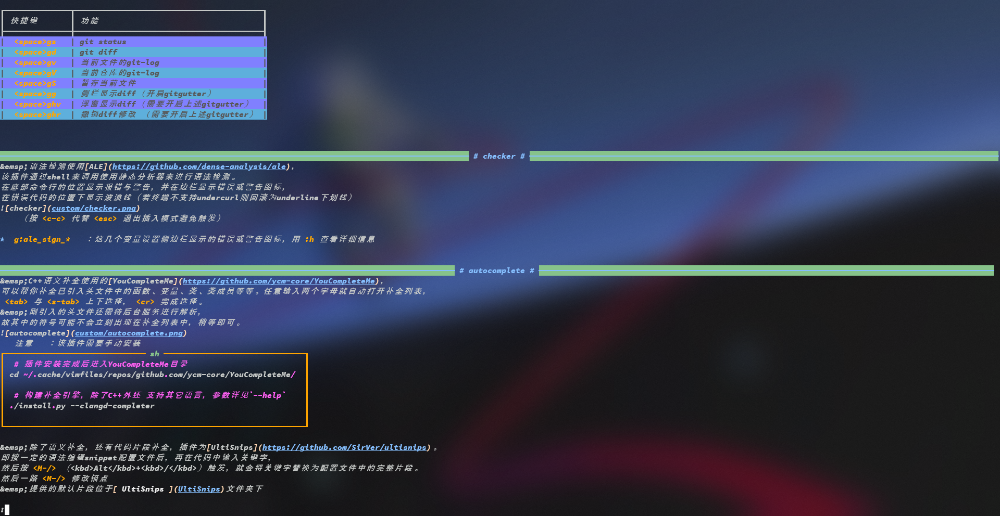

# 目录
<!-- vim-markdown-toc GFM -->

- [安装](#安装)
- [编程语言](#编程语言)
  - [C++](#c)
  - [Golang](#golang)
  - [Python](#python)
- [编程之道](#编程之道)
- [Linux](#linux)
- [数据库](#数据库)
- [网络](#网络)
- [底层](#底层)
- [其它](#其它)

<!-- vim-markdown-toc -->
# 安装
***本仓库中提供了一支C++程序`see`用于快速查看笔记：***  
它会搜索`~/.cheat/*.md`中的entry，查找匹配的entry并打印；
每个entry以`<!-- entry begin: .* -->`的形式开头，并以`<!-- entry end -->`结尾；
其中`.*`表示关键字，see便会搜索其中的关键子决定是否匹配；
详情请使用`see -h`查看。



**安装步骤：**
```sh
git clone --depth=1 https://github.com/mrbeardad/SeeCheatSheets ~/.cheat
# 国内访问github不太友好的话，可以将URL中的github.com改为gitee.com
mkdir ~/.cheat/build
cd ~/.cheat/build
cmake -D CMAKE_BUILD_TYPE=Release ..
cmake --build . -t see
cmake --install .
```

**注**：部分笔记插入了Tex公式，~~介于鄙人的懒惰~~ 介于GFM不支持Tex，诸位就自己下个浏览器插件吧。
[github-mathjax](https://chrome.google.com/webstore/detail/mathjax-3-plugin-for-gith/peoghobgdhejhcmgoppjpjcidngdfkod/related?hl=en "如果从Web Store安装失败则尝试手动下载并安装其github源码")  
另外，各篇文章中的图片几乎都来自网络，来源繁多复杂且大多未表明出处。。。侵删啊，乖乖。

# 编程语言
* [思想碰撞](langdiff.md):star:
    > 不同的语言有各自不同的特点以及背后的思想
* [基础组件](langman.md)
    > 掌握一门语言的必要条件是熟悉它的基础标准库

## C++
* [C++语法特性](cpp.md):star:
    > 一份C++语法清单，适合有基础的同学
* [C++编程向导](cppguide.md):star:
    > 优雅的编写C++代码
* [C++编码风格](cppstyle.md)
    > 规范代码风格，拒绝选择困难症
* [C++程序库](cppman.md)
    > 应该掌握的基础C++库
* [CMake构建系统](cmake.md)
    > 依赖管理与项目构建

## Golang
* [Go语言基础](go.md):star:
    > Go语言基础
* [Go编程向导](goguide.md):star:
    > Go编程向导
* [Go程序库](goman.md)
    > Go程序库

## Python
* [Python语言基础](python.md):star:
    > 基础语法与内置类型操作

# 编程之道
* [设计模式](dspt.md):star:
    > 应用框架系统的设计套路
* [编码经验](coding.md):star:
    > 解题技巧与编码经验
* [数据结构与算法](dsaa.md)
    > 基础数据结构与算法
* [正则表达式](regex.md)
    > 目前包含的正则语法版本有egrep、Vim、C++

# Linux
* [Linux知识体系](linux.md):star:
    > Linux的开机流程，以及整个系统知识体系
* [Linux系统接口](apue.md):star:
    > 大部分都符合POSIX、XSI或USU规范
* [Shell脚本](bash.md)
    > bash语法、内置命令以及一些unix环境基础命令
* [开发者工具](devtool.md)
    > 包含gcc、gdb、openssh、openssl、tmux、zsh、git、pacman等工具使用
* [Vim使用手册](vim.md)
    > 此为[mrbeardad/SpaceVim](https://github.com/mrbeardad/SpaceVim)的使用手册
* [Docker容器](docker.md)
    > 用于组建微服务架构

# 数据库
* [SQL语句](sql.md):star:
    > 关系型数据库查询语句
* [数据库原理](innodb.md)
    > MySQL的设计架构，包括索引与事务原理

# 网络
* [计算机网络](network.md)
    > 自顶向下展示互联网架构
* [差错校验与加密技术](security.md)
    > 这些技术在网络中有重要应用
* [比特币系统](bitcoin.md)
    > 理解大名顶顶的比特币

# 底层
* [信息编码](code.md)
    > 整数之无符码与补码，浮点数之IEEE 754标准，字符之Unicode与UTF-8
* [汇编语言](asm.md)
    > x86-64汇编语言
* [处理器设计](cpu.md)
    > 逻辑电路与处理器设计，以及CPU高速缓存机制
* [计算机组成](bus.md)
    > 主要是总线接口与存储技术，还有显卡与显示屏工作原理
* [操作系统](os.md)
    > 链接、异常控制流、虚拟内存

# 其它
* [Markdown](markdown.md)
* [English](english.md)

