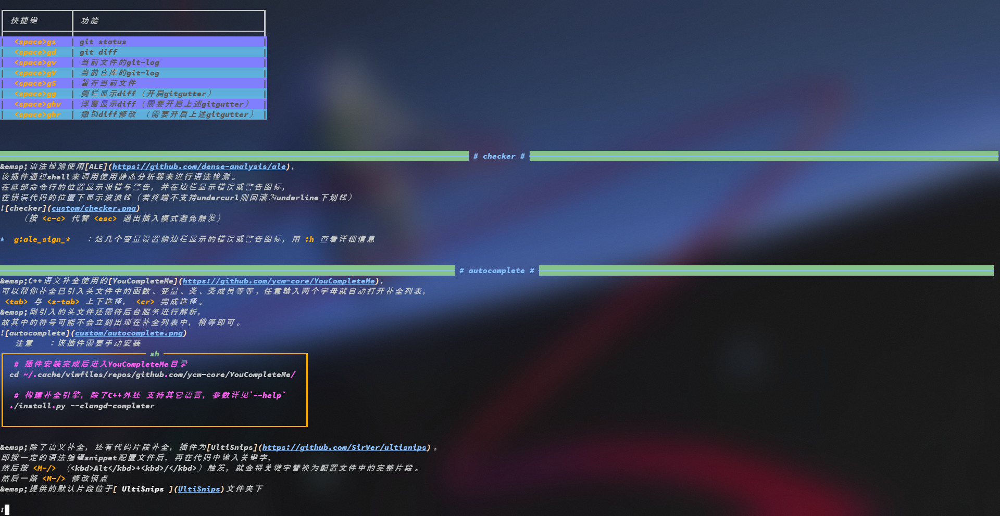

# See Cheat Sheets

- [See Cheat Sheets](#see-cheat-sheets)
  - [安装](#安装)
  - [编程之道](#编程之道)
  - [编程语言](#编程语言)
  - [Web](#web)
  - [Server](#server)
  - [Linux](#linux)
  - [底层原理](#底层原理)
  - [其他](#其他)

## 安装

```sh
# 国内访问github不太友好的话，可以将URL中的github.com改为gitee.com
git clone --depth=1 https://github.com/mrbeardad/SeeCheatSheets ~/.cheat
mkdir ~/.cheat/build
cd ~/.cheat/build
cmake -D CMAKE_BUILD_TYPE=Release ..
cmake --build . -t see
cmake --install .
```

本仓库中提供了命令行工具`see`用于快速查看笔记：
它会搜索`~/.cheat/*.md`中匹配的笔记条目并进行语法高亮后打印到终端。
每个条目以`<!-- entry begin: .* -->`的形式开头，并以`<!-- entry end -->`结尾；
其中`.*`表示关键字，see 便会搜索其中的关键子决定是否匹配；
详情请使用`see -h`查看。



**注**：部分笔记插入了 Tex 公式，~~介于鄙人的懒惰~~ 介于 GFM 不支持 Tex，诸位就自己下个浏览器插件吧。
[github-mathjax](https://chrome.google.com/webstore/detail/mathjax-3-plugin-for-gith/peoghobgdhejhcmgoppjpjcidngdfkod/related?hl=en "如果从Web Store安装失败则尝试手动下载并安装其github源码")
另外，各篇文章中的图片几乎都来自网络，来源繁多复杂且大多未表明出处。。。侵删啊，乖乖。

## 编程之道

- [编码逻辑](coding.md):star:：分支、逻辑、循环、递归、下标
- [设计模式](dspt.md):star:：依赖倒置、接口隔离、单一职责、里氏替换、开放关闭

## 编程语言

- [编程语言总结](langsum.md):star:

  - C++
    - [C++语法特性](cpp.md)
    - [C++程序库](cppman.md)
    - [CMake 构建系统](cmake.md)
  - Go
    - [Go 语言基础](go.md)
    - [Go 程序库](goman.md)
  - Python
    - [Python 语言基础](python.md)

## Web

- [HTTP](http.md)：超文本传输协议
- [HTML](html.md)：超文本标记语言
- [CSS](css.md)：层叠样式表
- [JaveScript](js.md)：前端编程语言
- [React](react.md)：前端 UI 框架

## Server

- K8S：用于动态编排容器集群
- [Docker](docker.md)：提供进程隔离的运行环境
- [Nginx](nginx.md)：用于路由与负载均衡
- [MySQL](sql.md)：关系型数据库
- [Redis](redis.md)：数据结构化内存存储
- Kafka：消息队列

## Linux

- [Linux 系统总结](linuxsum.md):star:：Linux 系统必备知识与技能

  - [Linux 知识体系](linux.md)
  - [Linux 系统接口](apue.md)
  - [Shell 命令行](bash.md)
  - [开发者工具](devtool.md)

## 底层原理

- [计科八股总结](interview.md):star:：计算机基本面试知识点

  - [数据结构与算法](dsaa.md)
  - [处理器设计](cpu.md)
  - [信息编码](code.md)
  - [汇编语言](asm.md)
  - [计算机组成](bus.md)
  - [操作系统](os.md)
  - [计算机网络](network.md)
  - [数据库存储](innodb.md)

## 其他

- [Markdown 语法](markdown.md)
- [多种正则语法](regex.md)
- [比特币系统](bitcoin.md)
- [英文读音](english.md)
- [色彩理论](color.md)
