# 目录
<!-- vim-markdown-toc GFM -->

- [寄存器](#寄存器)
- [运行时栈](#运行时栈)
- [基础指令](#基础指令)
- [浮点代码](#浮点代码)
- [过程控制](#过程控制)
- [结构对齐](#结构对齐)
- [缓冲区溢出攻击](#缓冲区溢出攻击)

<!-- vim-markdown-toc -->

本文中图片大部分来自《CSAPP》

# 寄存器
* 程序计数器(PC)`%rip`：存储下一条指令的地址
* 条件码寄存器：保存上一条算数或逻辑运算的状态
    * CF：进位标识。最近的操作使最高位产生了进位
    * ZF：零标识。最近的操作得出结果为0
    * SF：符号标识。最近的操作得到的结果为负数
    * OF：溢出标识。最近的操作导致一个补码溢出——正溢出或负溢出
* 整数寄存器：可以存储整数与地址
    > 对于生成1或2字节数字的指令会保持寄存器中剩下字节不变，生成4字节数字的指令将高4字节置零

    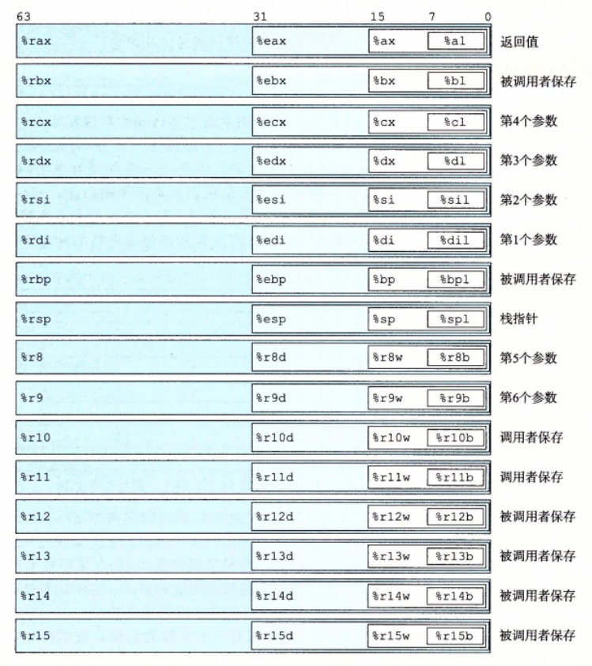</img>
    
* 向量寄存器：可以存储一个或多个整数或浮点数
    </img>

# 运行时栈
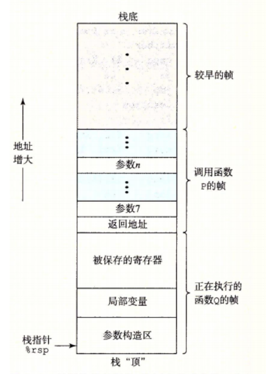</img>
&emsp;有一组标准的编程规范控制着如何使用寄存器来管理栈、传递函数参数、从函数的返回值，以及存储局部和临时数据。

栈中，局部变量的使用：
* 数组与异质结构
* 对变量取地址
* 寄存器不够用
<br> <br> <br> <br> <br> <br> <br> <br> <br> <br>


# 基础指令
**操作数**
> 汇编语言中，操作数相当于C语言中的变量。
> 当操作数作源(S)时，只需要该操作数的数值；
> 当操作数作目的(D)时，需要该操作数的值以及它的“存储空间”（类似左值）。
> 注意有些指令限制了操作数的类型。  
> 适当位置的标签(Label)会在汇编或链接的时候转换为立即数

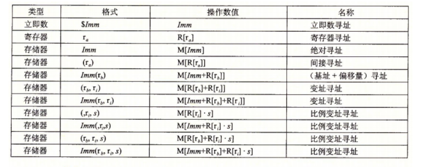

**指令分类**

> x86-64限制传送指令的两个操作数不能都指向内存

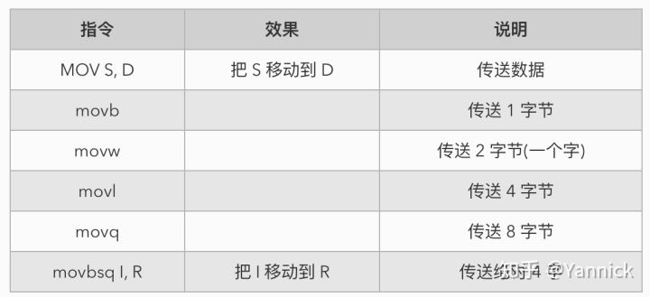

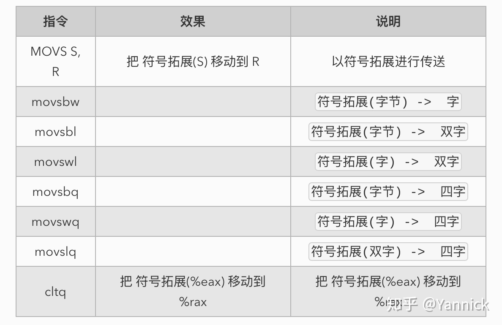

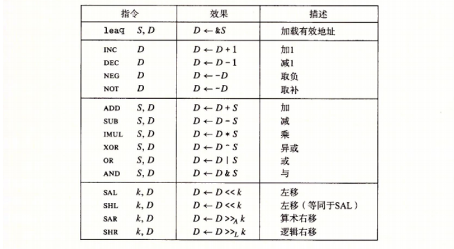
> %rdx存储高8字节，%rax存储低8字节

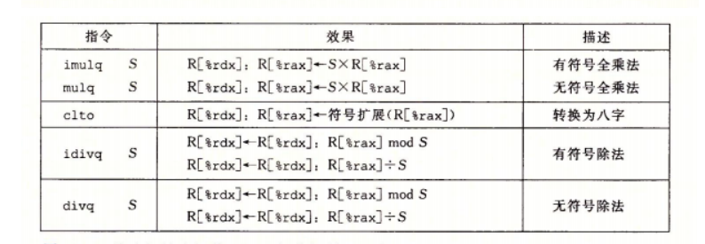

> leaq指令不更改条件码寄存器  
> test指令一般这样使用`test %rax,%rax`来测试其是否为0

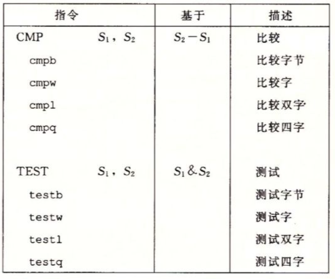</img>

> set指令的目的操作数是低位单字节寄存器之一，或是一个字节的内存位置

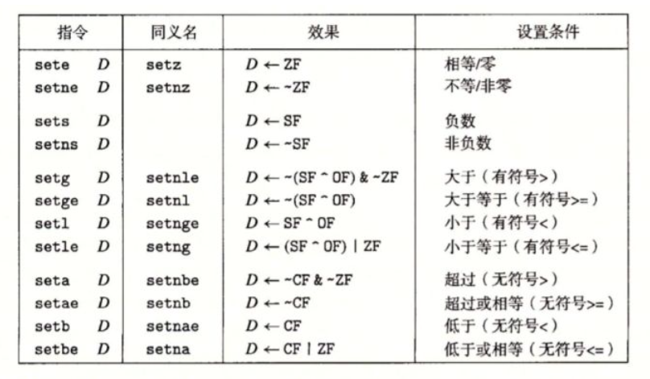

> jmp指令通常编码为间接跳转，有点有二：
> * 占用空间一般可为1、2、4字节
> * 与代码段的地址无关(`jmp *0x4c(%rip)`这样获取运行时绝对地址也能实现地址无关)

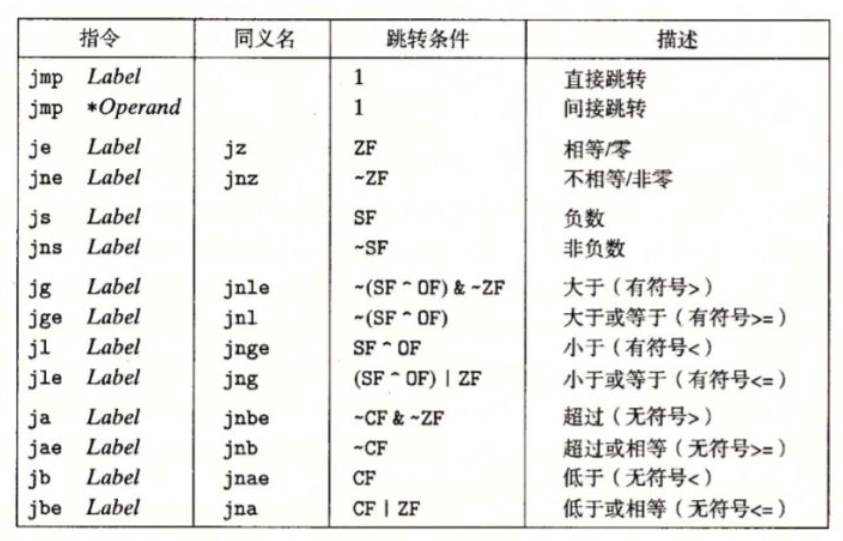

> 一般是将两个值一并计算后，将第一个置于一个寄存器，然后对第二个值使用CMOV条件传送到那个寄存器。
> COMV指令可避免分支预测错误处罚。C语言中利用条件运算符`? :`可能使用该指令。  
> CMOV指令不支持单字节传送，字节长度由目的操作数寄存器类型确定。

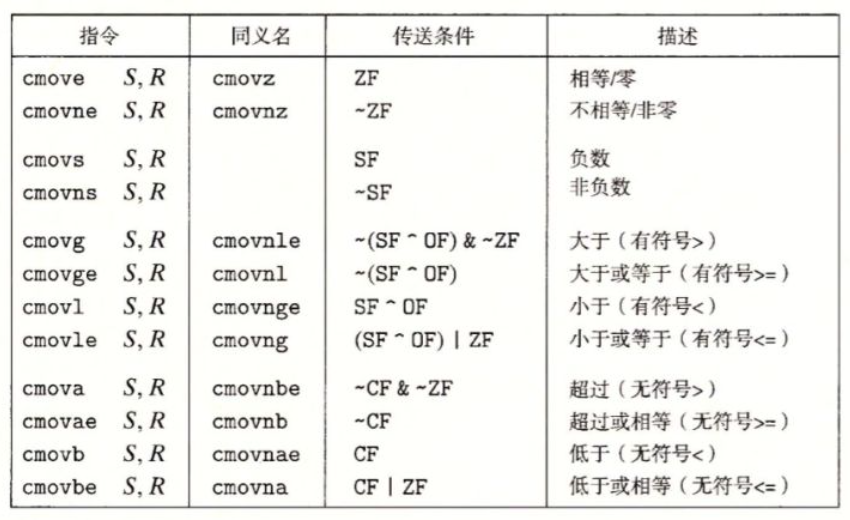

> AMD给编译器开发者的指导意见书中提到，当ret指令通过跳转指令到达时，
> 处理器不能正确预测到ret指令的目的。在ret前加一条rep或repz指令可使代码运行得更快。

| 指令          | 效果                                                       | 描述           |
|---------------|------------------------------------------------------------|----------------|
| pushq S       | $R[\%rsp] \leftarrow R[\%rsp] -8; M[R[\%rsp]]\leftarrow S$ | 将四字压入栈   |
| popq  D       | $D\leftarrow M[R[\%rsp]];R[\%rsp]\leftarrow R[\%rsp]+8$    | 将四字弹出栈   |
| call Label    |                                                            | 过程调用       |
| call *Operand |                                                            | 过程调用       |
| ret           |                                                            | 从过程调用返回 |
| leave         | 相当于`movq %rbp, %rsp`并`popq %rbp`                       |                |

# 浮点代码
**历史回顾**
* 1997年Intel与AMD都引入了媒体指令MMX，允许多个操作并行执行，称为单指令多数据(SIMD)
* 更新为SSE
* 再到AVX，AVX2

> vmovaps与vmovabd一般用于在寄存器之间传送浮点数，且必须对齐（寄存器当然时对齐的）

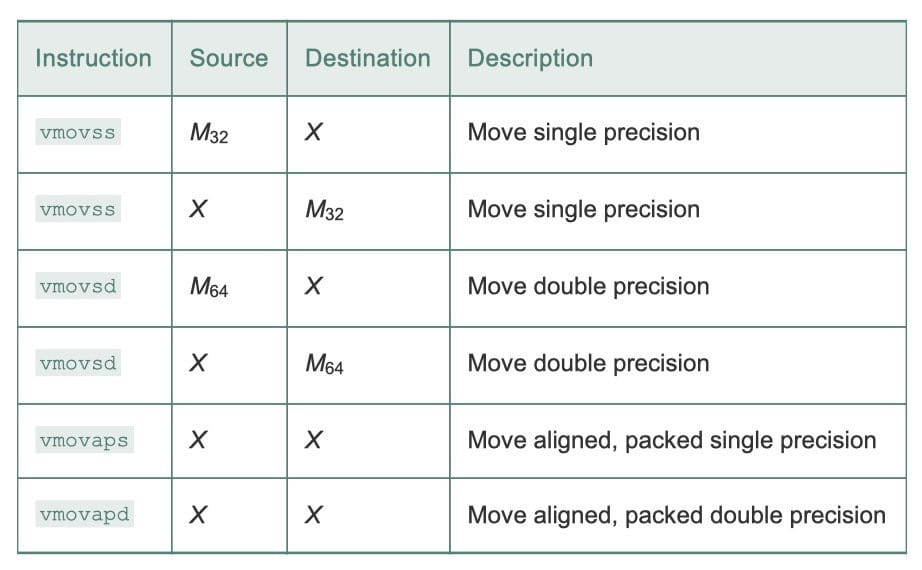
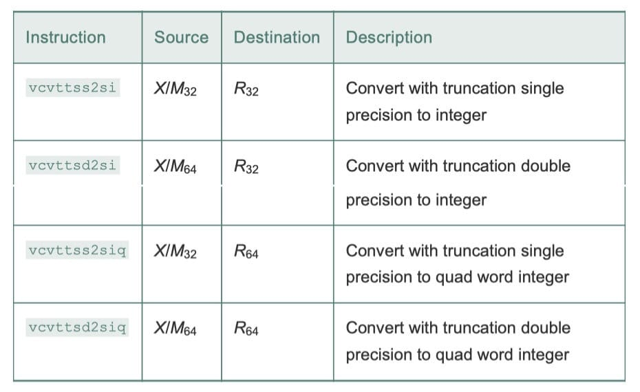
> 第二个源操作数对目的的低位字节无影响

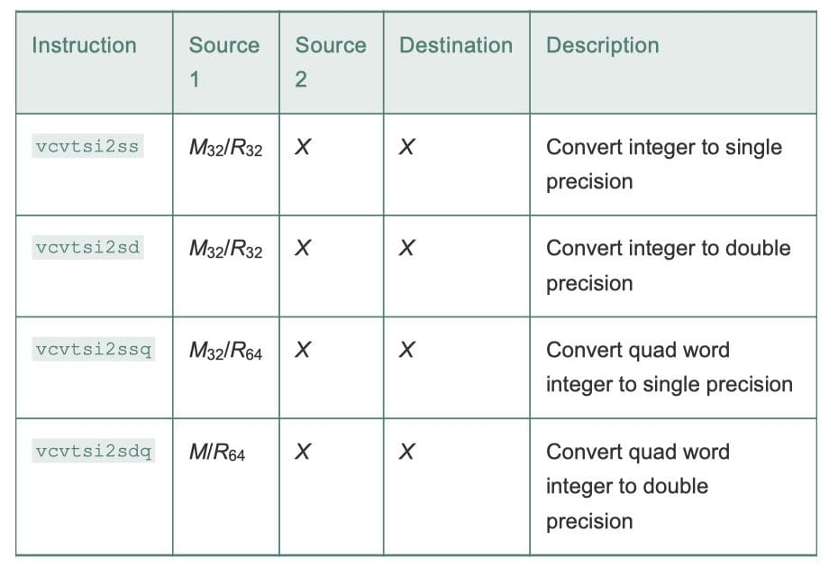

| 指令       | 源1 | 源2 | 目的 | 描述                                                       |
|------------|-----|-----|------|------------------------------------------------------------|
| vcvtss2sd  | X   | X   | X    | 把单精度数转换成双精度数                                   |
| vunpcklps  | X   | X   | X    | [s13,s12,s11,s10] + [s23,s22,s21,s20] -> [s11,s21,s10,s20] |
| vcvtps2pd  | X   |     | X    | [x3,x2,x1,x0] -> [dx1,dx0]                                 |
| vcvtsd2ss  | X   | X   | X    | 把双精度数转换成单精度数                                   |
| vmovddup   | X   |     | X    | [dx1,dx0] -> [dx0,dx0]                                     |
| vcvtpd2psx | x   |     | X    | [dx1,dx0] -> [0.0,0.0,x1,x0]                               |

> AVX浮点指令不能以立即数作操作数

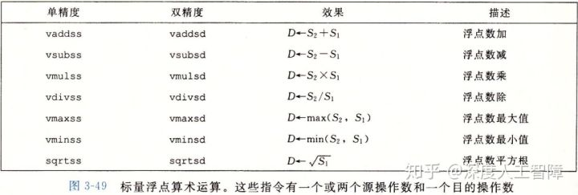
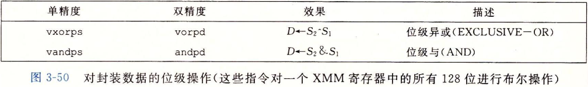
> 浮点数的测试指令使用无符码的指令，如`ja`、`jb`。  
> 特殊的，当任一操作数为`NAN`时会出现无序情况，奇偶标识位可发现该情况，可用`jp`指令进行测试

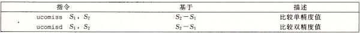
# 过程控制
if-else分支语句
```asm
    条件jmp .else
    then-statetment
.else:
    else-statement
```

switch多分支语句
> 当开关情况数量较多（如4个以上），并且值的范围跨度比较小时，就会使用跳转表。
> 将跳转表的使用想象成——我们将代码地址存储在哈希表中，case标签值就是键(key)，而值(value)默认都是default标签地址
```asm
switch_eg:
    subq    $100, %rsi          ; 减去起始偏移量100
    cmpq    $6, %rsi            ; 超出跳转表则直接跳转到default
    ja      .L6                 ; .L6对应的标签就是default
    jmp     *.JmpList(,%rsi,8)  ; %rsi为switch变量值，以它作跳转表下标获取表中的地址
.L1:
    ; 第一个case标签的代码
    jmp     .L2                 ; break

.L3:
    ; 同理，case标签分支的代码
.L4:
    ; 同理，case标签分支的代码
.L5:
    ; 同理，case标签分支的代码
.L6:
    ; default标签分支
.L2:
    ; done

    .section    .rodata
    .align 8
; 跳转表中每个元素存储各个case标签分支的代码的起始地址
; 每个分支代码的地址在跳转表中的下标由C语句中case标签值决定
; 空缺的跳转表元素设置为default分支代码的起始地址
.JmpList
    .quad   .LN ; case 100
    .quad   .LN ; case 101
    .quad   .LN ; case 102
    .quad   .LN ; case 103
    .quad   .LN ; case 104
    .quad   .LN ; case 105
```

loop循环语句
```asm
.loop:
    body-statement
.test:
    test-statement
    条件jmp .loop
```
jump-to-middle循环语句
```asm
    jmp .test       ; 强行打断CPU流水线且无法预测
.loop:
    body-statement
.test:
    test-statement
    条件jmp .loop
```
guarded-do循环语句
```asm
    条件jmp .done
.loop:
    body-statement
    条件jump .loop
.done:
```

# 结构对齐
&emsp;对齐原则是，任何K字节的基本对象的地址必须是K的倍数，如此可减少处理器对内存的访问而达到加速的目的。

&emsp;注意，在结构体内部的成员也需要对齐，而整个结构体的对齐基准与其成员中基准最大的一样。
所以，创建结构体时，字节长的数据类型放前面，如此可减少空洞而节约空间

&emsp;对于x86-64的强制对齐，必须保证分配用来保存可能会被SSE寄存器读或写的数据结构的内存都必须满足16字节对齐。
这个要求有两个后果：
> AVX指令并未强制要求对齐
* 任何内存分配函数(alloca、malloc、calloc、realloc)生成的块的起始地址都必须是16的倍数
* 大多数函数的栈帧的边界都必须是16字节的倍数。

# 缓冲区溢出攻击
蠕虫与病毒：
蠕虫(worm)可以自己运行，并且能够将自己等效副本传播到其它机器。
病毒(virus)能将自己添加到包括操作系统在内的其它程序中，但它不能自己独立的运行。

缓冲区溢出攻击方式：利用缓冲区溢出，覆盖函数返回地址，引导控制流到“攻击代码”

对抗手段：
* 地址空间布局随机化(ASLR)。随机化包括代码段、堆、栈等，随机化范围大约$2^{32}$
    > 利用nop指令做“空操作雪橇”可以暴力破解，当然，命中的概率很低。
* 栈破坏检测。在栈帧中，返回地址与局部缓冲区之间存储金丝雀值(canary)（也叫哨兵值(guard value)）。
例如`movq %fs:40 %rax`获取随机值

* 限制内存页的读、写、执权限。于是没法执行缓冲区插入的攻击代码了

<!--
寄存器与汇编指令
进程内存布局（特别是运行时栈的使用）
C控制语句编译
结构对齐
-->
