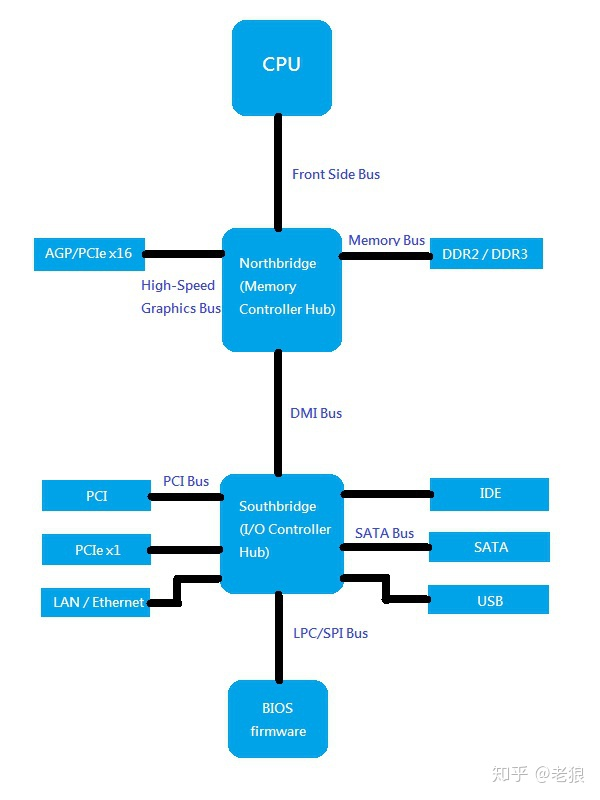
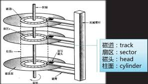
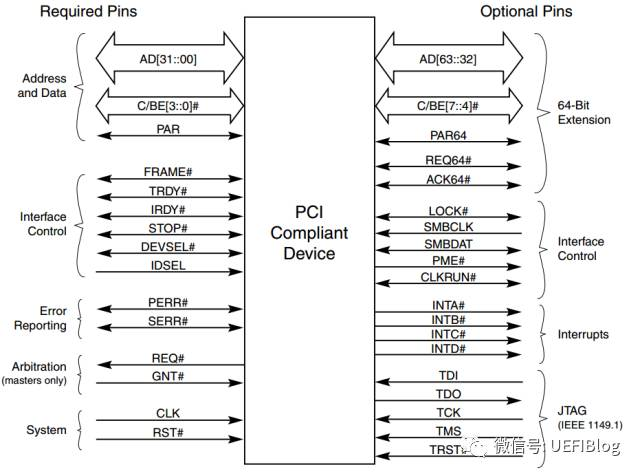
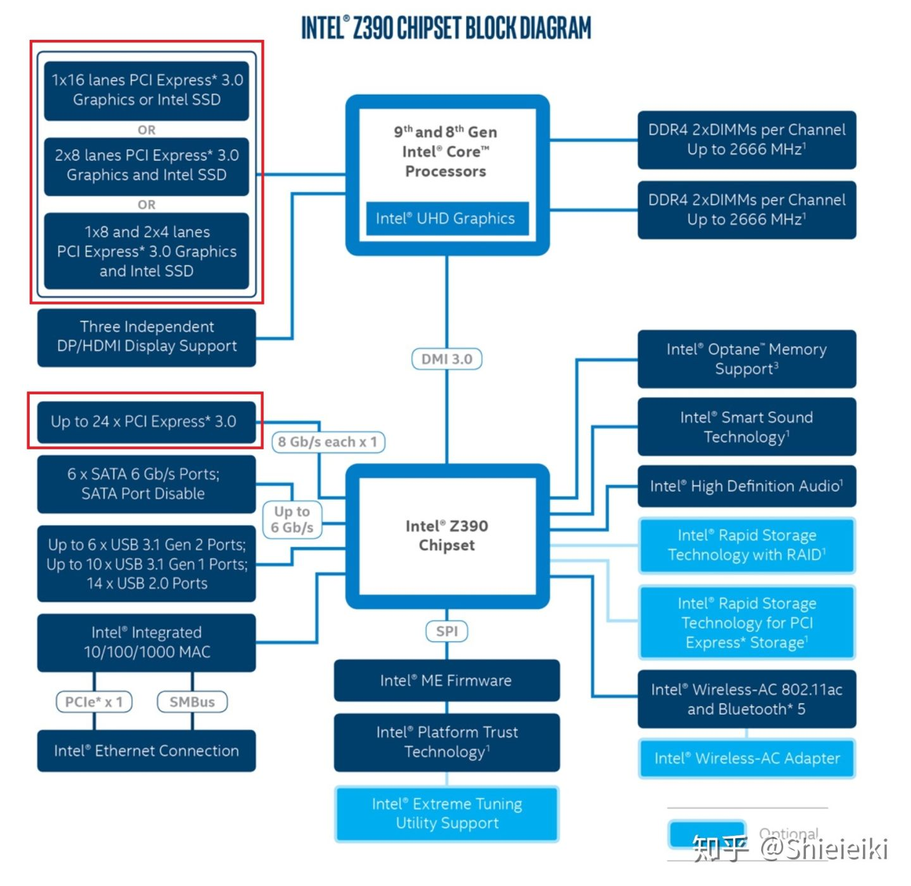
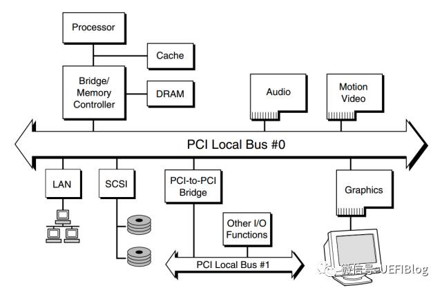

# 目录
<!-- vim-markdown-toc GFM -->

- [传统结构](#传统结构)
- [图形处理器](#图形处理器)
- [存储器](#存储器)
- [总线](#总线)

<!-- vim-markdown-toc -->

# 传统结构

# 图形处理器
&emsp;GPU跟CPU不一样，GPU是跟显卡板绑定在一起的，而CPU在主板上是可拆卸的。
CPU的单核性能碾压GPU，而GPU的重点是强调并行性。

&emsp;屏幕上展示的眼花缭乱的各种图像，就是显示器接收像素数据并将它们冲刷到屏幕而形成。
而每一位像素都是要占用存储空间的，现在一般用3字节来表示一个像素，
3个字节分别表示红(R)、绿(G)、蓝(B)三原色的强度，由此组合成肉眼可见的各种颜色。
而这些像素的计算便是显卡的专项技能。

&emsp;接下来说说“帧”的概念，所谓动画其实就是一张张静态的图片连续放映，
由于人眼的视觉上的错觉，加上视觉暂留，大脑就以为看见了连续的画面。
而“帧”就是这一张张静止的画面，显示器会从缓存中不断读取显卡送来的图形并用来刷新屏幕，
而这每秒读取的次数就是显示器的刷新频率。
60Hz的显示器每秒刷新60张画面，144Hz的就是每秒144张画面。
显示器刷新率是固定的。

&emsp;不要将我们游戏中说到的帧率搞混了，游戏中的帧率是显卡每秒运算出多少张图形，
然后送给显示器。注意显卡运算的帧率是波动的（打团降帧），而显示器可不管显卡每秒产生多少帧，60Hz的显示器自顾自地每1/60秒读取一次缓存。
二者不同步的话，画面就肯定不协调，所以显示器一般有多个缓存，
当显示器正在读取其中一个缓存时，显卡在写入另一个缓存。

&emsp;但加了几个缓存也是治标不治本。
当显卡运算过快时，它将本该写的帧写完后，又去写显示器正在读的缓存，若在显示器读取完成前覆盖上去，
由于屏幕是逐行扫描或隔行扫描进行绘制的，结果导致屏幕上半部分的画面与屏幕下半部分的画面是不协调的，
因为上下两部分来自两张画面。显卡过慢同理。这种现象叫做“错帧”，俗称“**画面撕裂**”。

&emsp;“垂直同步”就是强行同步显卡与显示器，显卡过快时让显卡等待显示器绘制完成再写入，
所以开启后我们会觉得画面比较流畅，但这会增大画面延迟。

&emsp;于是又发展了新技术：显示器刷新变频技术。让显示器的刷新率随显卡波动。

# 存储器
**随机访问存储器**

* SRAM（静态随机访问存储器）：具有双稳态性，即只要有电就会永远保持它的值，即使有干扰（如电子噪声），
当干扰消除时，电路就会恢复到稳定值。一般用于高速缓存。

* DRAM（动态随机访问存储器）：将每个位存储为对一个电容充电，对干扰非常敏感，需要不断刷新。
一般用于内存。

&emsp;SRAM相比DRAM需要更多晶体管，因而密集度低，而且贵，功耗大。

&emsp;CPU中整合了I/O桥来控制访问内存，通过内存总线连接内存。
CPU引脚输出地址，并从I/O桥接收/发送数据，以实现内存访问。

&emsp;如今最流行的DRAM便是DDR RAM家族。

**非易失性存储器**

&emsp;如果断电，DRAM与SRAM会丢失信息。而非易失性存储器在断电后仍然能保存信息，由于历史原因，
它们整体上仍然称为ROM(只读存储器)

* PROM（可编程ROM）：每个存储器单元有一种熔断丝，只能用高电流熔断一次，也就只能被编程一次。

* PEROM（可擦除可编程ROM）：有一个透明石英窗口，允许光到达存储单元。
紫外线光照射过窗口可将单元清除为0。编程时需要独立的物理设备。

* EEPROM（电子可擦除ROM）：无需独立设备，可直接在印刷电路卡上编程。

* flash（闪存）：基于EEPROM，如今已成为重要的存储技术。

&emsp;存储在ROM设备中的程序通常被称为固件(firmware)。
当一个计算机通电之后，会运行存储在ROM中的固件。一些系统在固件中提供了少量基本的输入和输出函数
——如PC的BOIS或UEFI例程。复杂的设备，像图形卡和磁盘驱动控制器，也依赖固件翻译来自CPU的I/O请求。

**磁盘**

**固态硬盘**

&emsp;固态硬盘(SSD)基于闪存技术，旨在取代读写慢、易损坏、能耗高的旋转磁盘。
一个闪存由B个块的序列组成，每个块有P页组成，通常页的大小为512B到4KB，而块由32到128页组成(16KB到512KB)。
数据以页为单位读写，只有在一页所属的块整个被擦除后，才能写这一页。
所以修改数据时，会导致目标所在的块中的其它页先转移到其它块中。
因为这层机制，所以固态硬盘需要一个闪存翻译层来翻译CPU请求的地址。

# 总线
> 摘录自百度百科：
>
> &emsp;如果说主板（Mother Board）是一座城市，那么总线就像是城市里的公共汽车（bus），
> 能按照固定行车路线，传输来回不停运作的比特（bit）。
> 这些线路在同一时间内都仅能负责传输一个比特。
> 因此，必须同时采用多条线路才能传送更多数据，而总线可同时传输的数据数就称为宽度（width），
> 以比特为单位，总线宽度愈大，传输性能就愈佳。
> 总线的带宽（即单位时间内可以传输的总数据数）为：总线带宽 = 频率 x 宽度（bps）。
> **当总线空闲（其他器件都以高阻态形式连接在总线上）且一个器件要与目的器件通信时，发起通信的器件驱动总线，发出地址和数据。其他以高阻态形式连接在总线上的器件如果收到（或能够收到）与自己相符的地址信息后，即接收总线上的数据。发送器件完成通信，将总线让出（输出变为高阻态）。**
>
> &emsp;总线是一种共享型的数据传送设备。虽然总线上可联接多个设备，但任一时刻通常只能有一对设备参与数据传输。按信息传输的形式，总线可分为并行总线和串行总线两种。并行总线对n位二进制信息用n条传输线同时传送，其特点是传输速度快，但系统结构较复杂，它用于计算机系统内的各部件之间的连接；串行总线对多位二进制信息共用一条传输线，多位二进制信息按时间先后顺序通过总线，它的特点是结构简单，但其传输速度较慢。总线必须有明确的规范： 总线定时协议，即在总线上传送信息时必须遵守一定的定时规则，例如同步总线定时，异步总线定时，半同步总线定时等。总线的物理特性，包括信号、电源、地址的电气特性，以及连线、接插件的机械特性。总线带宽，它是总线所能达到的最高传输率，其单位是MB/S。

&emsp;特别地，设备可以自己执行读或写总线事务而不需要CPU干涉的过程，称为**DMA(直接内存访问)**，
这种数据传送称为DMA传送。在DMA传送完成后，磁盘控制器通过CPU发送一个中断信号给CPU一个外部引脚上来通知CPU数据准备就绪。
这回导致CPU暂停它当前正在做的工作，跳转到操作系统的异常处理例程。

&emsp;PCI总线结构是现代计算机上使用的总线结构，CPU通过系统总线和存储器连接，同时系统总线上连接了一个PCI桥，通过PCI桥可以连接PCI总线，PCI总线下也可以连接符合PCI接口的IO设备，同时PCI总线下又可以连接PCI桥，PCI桥下再连接PCI总线，就可以一直向下扩展形成设备树，不过也是有一些数量限制的。

&emsp;在使用内存映射I/O的系统中，地址空间中有一块地址是为与I/O设备通信保留的。
每个这样的地址称为一个I/O端口。当一个设备连接到总线时，它与一个或多个端口相关联。
每个I/O外设通过主板上的控制器或适配器与I/O总线相连。
控制器与适配器的区别在于封装方式的不同，控制器是主板上的芯片组，而适配器是一块插在主板插槽上的卡。

<!--
位宽、频率、带宽
南桥、总线、接口
存储技术
画面撕裂
-->
