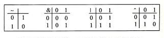
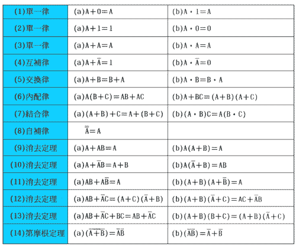
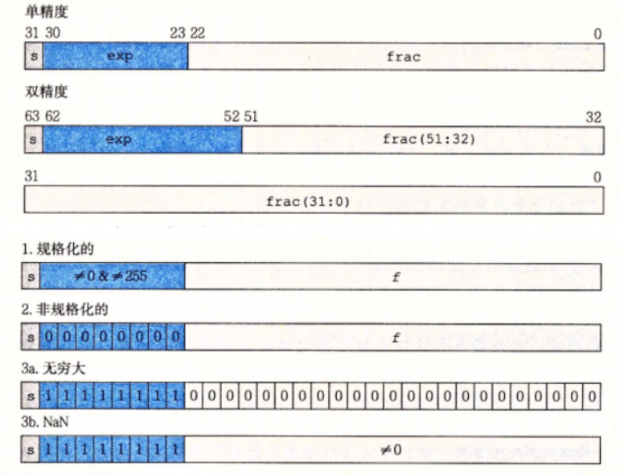
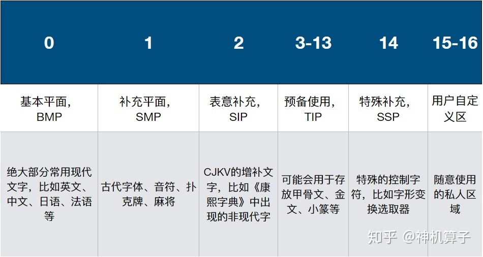
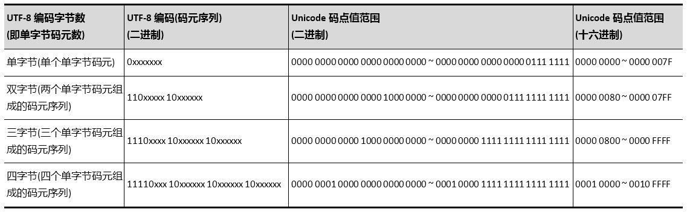
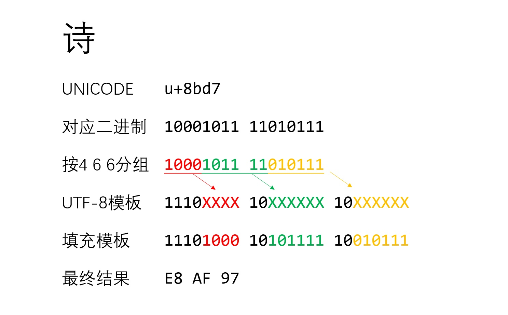

# 目录
<!-- vim-markdown-toc GFM -->

- [信息编码](#信息编码)
- [信息存储](#信息存储)
- [整数](#整数)
  - [转换操作](#转换操作)
  - [运算操作](#运算操作)
- [浮点数](#浮点数)
  - [转换](#转换)
  - [运算](#运算)
- [整数与浮点数](#整数与浮点数)
- [字符编码](#字符编码)

<!-- vim-markdown-toc -->

# 信息编码
&emsp;编码的本质是指存储、传递、解释信息的方式。

&emsp;对于有10根手指的人类来说，使用十进制表示法是很自然的事情。
大家熟悉并使用了1000多年的十进制数字系统，阿拉伯数字，起源与印度，被阿拉伯数学家带入欧洲。
而在此之前，欧洲人使用的是罗马数字。

&emsp;阿拉伯数字的创新性在于：
1. 没有专门表示“10”的符号
2. 有个专门表示“0”的符号——数学史上最重要的发明之一，它支持位置计数法简化了计算

&emsp;在计算机领域，编码的对象特指二进制位。

&emsp;从伏羲八卦的“阴爻”与“阳爻”，
到布莱叶盲文的“凸点”与“平点”，
再到莫尔斯码(Morse's Code)的“点”与“划”，
然后到现代的整数与浮点数的二进制表示等等，
无不昭示着一个重要事实——两个不同事物只要经过适当的组合就可以表示所有类型的信息！

&emsp;二进制值能够很容易地被表示、存储和传输。
将位(bit)组合在一起，我们能够表示任何*有限集合*的元素。
理论上，n位可以表示的最大的不同元素有2ⁿ个。

&emsp;为了简洁方便，一般使用八进制或十六进制表示二进制位

| 二进制 | 八进制 | 二进制 | 十六进制 |
|--------|--------|--------|----------|
| 0b000  | 00     | 0b0000 | 0x0      |
| 0b001  | 01     | 0b0001 | 0x1      |
| 0b010  | 02     | 0b0010 | 0x2      |
| 0b011  | 03     | 0b0100 | 0x4      |
| 0b100  | 04     | 0b1000 | 0x8      |
| 0b101  | 05     | 0b1010 | 0xA      |
| 0b110  | 06     | 0b1100 | 0xC      |
| 0b111  | 07     | 0b1111 | 0xF      |

# 信息存储
&emsp;大多数计算机使用8位的**字节**(byte)作为最小的可寻址的内存单位，而非访问单独的位。

&emsp;每台计算机都有一个**字长**(word size)，指明指针数据的标称大小，其决定了系统中虚拟地址空间的最大大小。
同时在不同字长的机器上，C语言的基础类型的长度一般也不同。

&emsp;对于跨越多个字节的程序对象，还要注意**字节顺序**的问题。
在逻辑上属于一个单元的数据(如4字节的int变量)，物理存储时会被分为多个单元(4个字节)，
而物理单元的顺序在不同的机器上可能不同。
于是使用指令读取这段内存时，对于不同的字节顺序会读出不同的值。  
&emsp;若最低有效字节在最前面则称为小端法(little endian)，若最高有效字节在最前面则为大端法(big endian)。
而这两个词出自《格利佛游记》，描述了两国因为无法就从大端还是小端打开鸡蛋达成一致而开战。
就像鸡蛋问题，选择何种字节顺序没有技术上的理由，对此的争论沦为关乎信仰的冲突。

# 整数
无符型整数：无符型编码 **U**  
$向量\overrightarrow{x}=[x_{w-1},\space x_{w-2},\space ...,\space x_0]$
$$
B2U_w(\overrightarrow{x})\doteq\sum^{w-1}_{i=0}x_i2^i
$$

有符型整数：补码编码 **T**  
$向量\overrightarrow{x}=[x_{w-1},\space x_{w-2},\space ...,\space x_0]$
$$B2T_w(\overrightarrow{x})\doteq-x_{w-1}2^{w-1}+\sum^{w-2}_{i=0}x_i2^i$$

## 转换操作
**扩展**：扩展并不会改变原来的数值大小
* 对**T**来说应该**符号扩展**
$$
[x_{w-1},\space x_{w-2},\space ...,\space x_0]
\to
[x_{w-1},...,x_{w-1},x_{w-1},\space x_{w-2},\space ...,\space x_0]
$$
* 对**U**来说应该**零扩展**
$$
[x_{w-1},\space x_{w-2},\space ...,\space x_0]
\to
[0,...,0,x_{w-1},\space x_{w-2},\space ...,\space x_0]
$$

**截断**：截断后值域改变从而导致数值可能变化，截断**T**甚至可能改变数值的正负
$$
[x_{w-1},\space x_{w-2},\space ...,\space x_0]
\to
[x_{k-1},\space x_{k-2},\space ...,\space x_0]
$$

**转换**：保持底层位模式不变。若长度不同，则先扩展或截断
* T转换为U：  
$$
T2U_w(u)=
\left\lbrace
\begin{array}{l}
x+2^w,&x\lt0\\
\newline
x,&x\ge0
\end{array}
\right.
$$

* U转换为T：  
$$
U2T_w(u)=
\left\lbrace
\begin{array}{l}
u,&u\le Tmax_w \\
\newline
u-2^w,&u\gt Tmax_w
\end{array}
\right.
$$

## 运算操作
**逆元运算**
* **T**求逆元
$$
-^t_w x=
\left\lbrace
\begin{array}{l}
Tmin_w,&x=Tmin_w\\
\newline
-x,&x\gt Tmin_w
\end{array}
\right.
$$

* **U**求逆元
$$
-^u_w x=
\left\lbrace
\begin{array}{l}
x,&x=0\\
\newline
2^w-x,&x\gt0
\end{array}
\right.
$$

**加法运算**：完全相同的位级运算
* **U**加法：溢出值回环到`0`直到`Umax - 1`
$$
x+^u_wy=
\left\lbrace
\begin{array}{l}
x+y,&x+y<2^w&正常\\
\newline
x+y-2^w,&2^w\le x+y&溢出
\end{array}
\right.
$$
* **T**加法：负溢出值回环到`Tmax`直到`0`，正溢出值回环到`Tmin`直到`-2`
$$
x+^t_wy=
\left\lbrace
\begin{array}{l}
x+y+2^w,&x+y\lt-2^{w-1}&负溢出\\
\newline
x+y,&-2^{w-1}\le x+y\le2^{w-1}-1&正常\\
\newline
x+y-2^w,&2^{w-1}-1\lt x+y&正溢出
\end{array}
\right.
$$

**乘法运算**：不完全相同的位级运算，但是截断后的结果相同
* **U**乘法
$$
x\times^u_w y=(x\cdot y)mod\space 2^w
$$
* **T**乘法
$$
x\times^t_w y=U2T_w((x\cdot y)mod\space 2^w)
$$

**除法运算**：
* `int(x / y)`向零舍入
* `int(float(x) / y + 0.5)`四舍五入
    > 整数的除法会舍弃小数部分，必要时应转换为浮点数计算

**模运算** ：
* `x % y == -(-x % y) == x % -y`
* 作用：
    * 限制大小
    * 数值回环
    * 截断数位

**移位运算** 
* 左移：
    * 实现T与U的常数乘法
    * 集合表示
* 算数/逻辑右移：
    * 实现T与U的常数除法(向下舍入)
    * 集合表示

**位运算**
> 位运算与逻辑运算均源于布尔代数
* 位反`~`：取反，取补
    > `-x == ~x + 1`
* 位与`&`：0归零，1不变，1取值
    > `S & ~M` `S & M`
* 位或`|`：0不变，1存值
    > `S | M`
* 位异或`^`：0不变，1取反，同归零
    > `S ^ M` `A ^ B`

  

# 浮点数
IEEE 754 浮点标准

$浮点数=(-1)^{符号位}\times尾数\times 2^{阶码}$

**阶码**
> 阶码使用偏置值目的是：
> 1. 由规格化数平滑过渡到非规格化数
> 2. 可以用整数比较的硬件来比较浮点数
* 规格化数  ：$exp - (2^{k-1} - 1)$
* 非规格化数：$1 - (2^{k-1} - 1)$

**尾数**
* 规格化数  ：$frac$ 为小数部分，整数部分为$1$
* 非规格化数：$frac$ 为小数部分，整数部分为$0$

## 转换
**舍入**：
* 向上舍入
    > `ceil(f)`向上舍入为整数
* 向下舍入
    > `floor(f)`向下舍入为整数
* 向零舍入
    > `int(x + y)或trunc(f)`向零舍入为整数
* 四舍五入
    > `round(f)`四舍五入为整数
* 向偶舍入
    > 底层浮点运算与`std::setprecision(n)`调整精度  
    > 向偶舍入可以降低统计偏差

**整数转换**：
> 不可移植
* 若转换为整数T(U)时正溢出，则为Tmax(Umax)
* 若转换为整数T(U)时负溢出，则为Tmin(0)

## 运算
**无穷与NAN**：
* 浮点数运算`f / 0`可得`+∞`或`-∞`，而整数除零会导致“故障”
* NAN与任何浮点数运算都得NAN，且在C中任何作用于NAN的关系运算符结果都为false

**精度**：
* 浮点数的精度随着阶码变大而变粗，当单精度浮点数大于$2^{23+1}$或双精度浮点数大于$2^{52+1}$时，
精度值就大于1了，意味着此时浮点数无法精确表示整数了

* 当输入十进制数并转为二进制浮点数表示时，会因为存储位有限而截断准确数值，导致精度丢失；
当浮点数运算时，运算结果也可能被截断而丢失精度。

* 单精度浮点数的有效位数有$\frac{23}{log_{2}10}\approx6.92$，双精度有效位数$\frac{52}{log_{2}10}\approx15.65$。
意思是单精度浮点数由二进制转换为十进制表示时，只有前6位十进制数字是可靠准确的，
而第七位数字会因为二进制存储本身的精度丢失(见上)而受影响。双精度同理。

# 整数与浮点数
**阿贝尔群**
* 整数加与乘运算具备结合律与交换律，故也具备分配律。且整数运算因为数值回环而不具备单调性
* 浮点数加与乘运算不具备结合律而具备交换律，故不具备分配律。且浮点运算因为溢出为无穷而具备单调性

**整数易错点**：
* 注意所有整数的**转换**和**运算**的溢出情况。
特别地，在“U与负数同时参与的运算”中注意U没有负数而可能造成的溢出回环
* 特别地，注意`-Tmin == Tmin`
* 溢出检测
    * **T**：
        * 正负符号错误
    * **U**：
        * 加(减)法：结果比两个操作数都要小(大)
        * 乘法：`!x || z / x == y`为`false`则`z = x * y`溢出

**浮点数易错点**：
* 注意浮点数精度丢失问题，以及浮点运算不具备结合律
* 注意溢出无穷
* 浮点数比较`x - y < precision`

# 字符编码
&emsp;当你最初学习C语言的时候，你是否想过，ACSII就只有那127个字符，中文是怎么表示的呢？

&emsp;先说结果，ACSII编码一般只用在`char`类型的变量中，
当然C标准并未规定`char`必须使用ASCII字符编码，
而只是规定了表示数字、大写字母、小写字母的字符编码分别是连续的。

&emsp;想要表示中文以及世界上成千上万中符号，ASCII(美国信息交换标准码)当然无法胜任。
随着网络的发展，为适应信息在不同的计算机间传递，Unicode应运而生。

&emsp;首先需要搞懂的是“字符集”与“字符编码”的区别。

&emsp;字符集是一个字符的集合，该集合里收录了各个国家、地区常用的字符。
比如ASCII字符集中收录了127个字符，再比如Unicode字符集里面如今已收录了超过14万个字符（2020年3月）。
**字符集的功能便是将一个个抽象的“字符”映射为一个个数字**。
注意，这里说的是“数字”，而不是“编码”，字符集并未规定一个字符该如何存储在计算机中。
**而将一个个字符映射为一个个二进制编码是字符编码的功能**。
我们常见的ASCII或许就是疑惑的根源，因为它既是字符集，也是字符编码。
即ASCII字符集中每个字符映射的数字（对应的二进制码）就是这个字符存储在计算机上的编码。

&emsp;除此之外，还有个于此相关的话题——字体。
字符集只是规定了概念上的字符（含义），至于视觉上的渲染效果由各种软件来定义。
即同一个字符，它的意义相同，编码相同，但在不同的软件上它可能看上去不同。
而字符的视觉效果（字形）是以字体文件的形式存储在计算机上，而我们可以将字体想象成小的图片，
软件利用字体引擎来将字体渲染成图形并置于屏幕上合适的位置。

&emsp;Unicode作为一个全球通用的**字符集**，收录了形形色色的字符，其中还包括emoji表情符。
Unicode将收录的字符进行分类整理，划分为多个平面，每个平面容量为65536($2^{16}$)。
而零号平面被称为**基本多文种平面**(BMP)

&emsp;其中每个字符锁映射的数字被称为码点，在表示一个Unicode的字符时，
通常会用“U+”然后紧接着一组十六进制的数字来表示这一个字符。
在零号平面里的所有字符，要用四个数字（即2字节，共16位，例如U+4AE0，共支持六万多个字符）；
在零号平面以外的字符则需要使用五或六个数字。

&emsp;而基于Unicode的字符编码主要由3种：UTF-8、UTF-16、UTF-32

&emsp;先说UTF-8，现代计算机一般都使用这种编码。这是一种多字节编码，即它可以用不同长度的字节（如1、2、3、4字节）来编码不同的字符。
编码规则见下图

&emsp;看懂后你会发现，单字节编码的最高位的二进制位为0，而其他3种编码方式的每个字节的最高位均为1。
这是为了兼容ASCII，因为ASCII字符编码的最高位都是0。
当你编写一个字符匹配的程序时，你只考虑ASCII的字符编码，并试图在一串UTF-8字符中匹配`'a'`。
因为UTF-8中只有ASCII兼容部分的编码的最高位为0，则你不会因为只考虑ASCII而导致匹配到错误的字节。
每个最高位为1的字节都是一个完整字符的一部分。

&emsp;UTF-16与UTF-8类似，都是多字节编码，字符编码可以是2字节或4字节。
而UTF-32则是宽字节编码，将所有字符都编码为4字节。
多字节编码的好处就是存储占用低，但是在程序内部处理时应该转换为宽字节方便随机访问处理。
但是注意，程序输出时，需要将字符编码转换为系统设置的字符编码方式。

&emsp;了解以上知识后，再将这些概念带入C语言代码。
* 操作系统的字符配置的意义是指，程序从系统读取字符信息时，以及向系统中写入字符信息时，应该使用何种编码
* 中文字符一般需要3字节，所以`'熊'`是错误的写法，应该改为`"熊"`
* 从标准输入或文件中读取的字符一般都是UTF-8，程序内部处理时先转换为UTF-32，输出前再转换回UTF-8
* 在Windows中，`wchar_t`定义为2字节，且文件名的字符编码为UTF-16

<!--
整数    ：溢出、U负、-Tmin、布尔
浮点数  ：精度(结合律、关系比较、有效位)、无穷、NAN
-->
