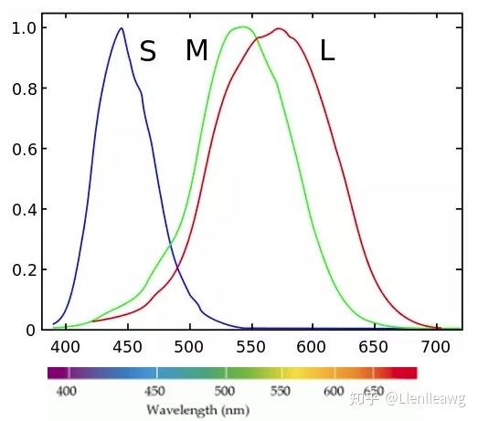

# 色彩理论

**首先，色彩理论是一种心理学或者说是生理学理论，而非物理理论！**

**什么是色彩？**
色彩即是光照射到视网膜上，被锥形细胞接收后转换为人体的一种生理或心理反应。
人眼有三种锥形细胞(S,M,L)，分别对 420nm, 530nm, 560nm 的光最敏感，大脑根据每种细胞被光刺激后激活程度的比例来呈现色彩。
我们需要研究的是光的客观的物理属(波长与强度)性到人的主观的色彩感受的普遍规律。

**什么是 RGB？**
一种色彩模型。通过光的三原色——红(Red)、绿(Green)、蓝(Blue)——按一定比列的亮度混合，我们可以模拟各波长与强度的光的视觉效果。国际照明委员会(CIE)规定了三原色的波长，并定义配出白光时的 RGB 配比为 1:1:1。一般用于自发光源，如屏幕。

**什么是 CMYK？**
另一种色彩模型。通过混合青(Cyan)、品红(Magenta)、黄(Yellow)和黑墨(Balck Ink)来实现确定色彩。一般用于需要额外光源照射来观看的物体，如印刷。

**什么是 HSL？**
也是一种色彩模型：

- 色相(Hue)：指定色彩在可见光谱上的大致范围
- 饱和度(Saturation)：指参杂的灰色比例，完全饱和是纯色相，完全不饱和是纯灰色
- 亮度(Lightness)：是接近黑色还是接近白色

> - [上海交通大学-物体色度值的测量](https://pec.sjtu.edu.cn/ols/DocumentLib/recent/072011506/072011506_slides.pdf)
> - [StackExchange: What do Hue, Chroma, Saturation, Value, Tones, Tints, Shade, etc. mean?](https://photo.stackexchange.com/questions/14820/what-do-hue-chroma-saturation-value-tones-tints-shade-etc-mean/98909#98909)
> - [The fundamentals of understanding color theory](https://99designs.hk/blog/tips/the-7-step-guide-to-understanding-color-theory/)

# 配色方案

[Material Design Color System](https://m3.material.io/styles/color/overview)

- Accent Colors
  - Primary: 用于跨 UI 的关键组件，如 FAB、AppBar 等
  - Secondary: 用于 UI 中不太突出的组件，如 Chips 等
  - Tertiary: 用于平衡主色辅色，或提高元素关注度
  - Tertiary-Container: 同上，但相对不太需要强调
  - On-Tertiay: 用于在 Tertiay 上显示的内容
  - On-Tertiary-Container: 用于在 Tertiay-Container 上显示的内容
- Error: 用于警告或报错
- Neutral Colors
  - Surface: 用于主要区域的背景色
  - Surface Container: 用于区分相邻或嵌套区域的对比色
  - On-Surface: 用于显示内容的前景色
  - On-Surface-Variant: 同上，但相对不太需要强调
  - Outline: 用于创建边界和重点以提高可用性
  - Outline-Variant: 用于创建装饰性的边界
