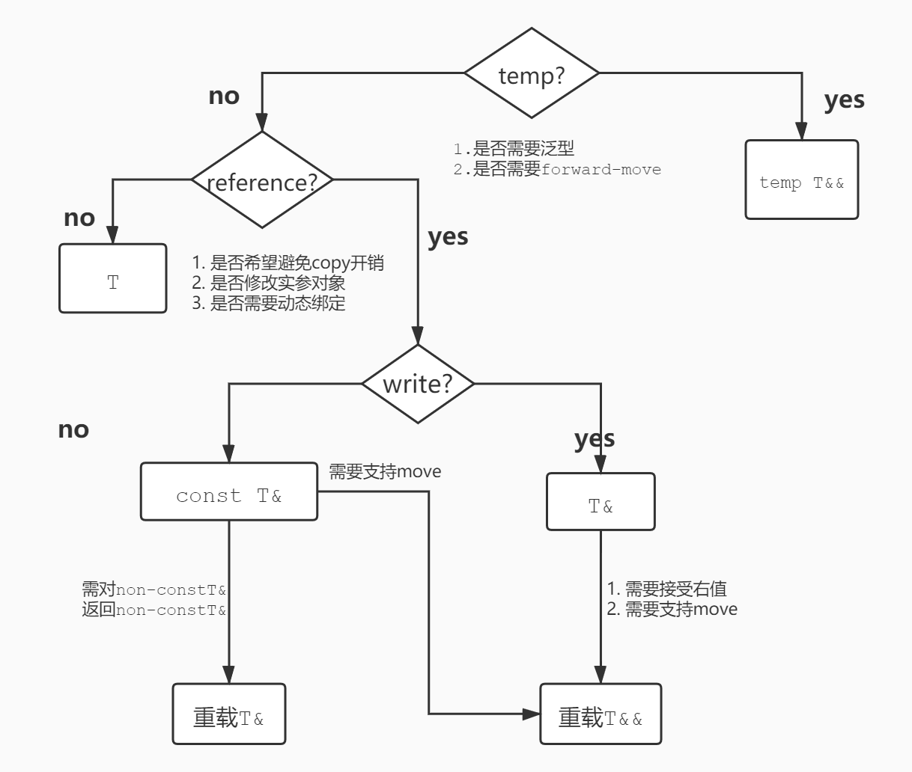

# 目录
<!-- vim-markdown-toc GFM -->

- [目录](#目录)
- [初始化](#初始化)
  - [auto初始化](#auto初始化)
  - [列表初始化](#列表初始化)
  - [默认初始化](#默认初始化)
- [reference-return](#reference-return)
- [指针与引用](#指针与引用)
- [static变量](#static变量)
- [泛型编程](#泛型编程)
- [STL](#stl)
- [性能优化](#性能优化)
- [函数参数](#函数参数)
- [面向对象](#面向对象)
- [异常](#异常)
- [并发](#并发)
- [效率优化](#效率优化)
- [底层const优点](#底层const优点)
- [类的封装](#类的封装)
- [异常安全](#异常安全)
- [内存引用优化](#内存引用优化)
- [set_new_handle](#set_new_handle)
- [莫滥用inline函数](#莫滥用inline函数)
- [标签分派](#标签分派)
- [模板类型限制](#模板类型限制)
- [const函数重载技巧](#const函数重载技巧)

<!-- vim-markdown-toc -->

# 初始化
* 尽可能延后对象的声明直到使用的前一刻，并一律马上初始化

* 循环中使用的对象，一般在循环体中定义而非在循环外，因为
前者执行n次构造+n次析构，后者执行1次构造+1次析构+n次赋值。
所以**除非1次赋值比1次构造+1次析构更高效，否则定义再循环内**
> 一般来讲，长string、容器与流这类构造开销大的类都应该定义在循环外

* 注意多个翻译单元(TU)中，non-local static对象的初始化顺序是未定义的，此时需要使用[reference-return技术](#reference-return)
    该技术优点如下：
    * 解决多TU中static对象的初始化顺序问题
    * 在调用`get_a()`之前，不会有构造`a`的开销

## auto初始化
* 优点
    * 书写更加简洁
    * 防止人工判断类型出错
    * 推断出编译器才知晓的类型，如lambda
    * 易于重构
* 缺点
    * 初始化器为代理类时，可能会出错
    * `auto init = {1, 2}`，auto为`initializer_list<int>`

## 列表初始化
* 优点
    * 用`initializer_list`实现类聚合式初始化
    * 调用构造函数
    * 隐式类型转换
    * 防止窄化
* 缺点
    * 上述优点1，同时也是缺点。因为编译器会优先调用initializer_list形参的构造函数，
        即使需要类型转换；同时因为防止窄化，从而导致这种情况`vector<bool> v{10, true};`，
        这段代码会报错，因为它调用了构造函数`vector(initializer_list<bool>)`，同时10转为bool被视作窄化。
        而其实我们本意是构造***含10个元素，且均为true的`vector<bool>`***

## 默认初始化
* 默认初始化与值初始化
    * 对于内置类型与聚合类，`int a[5];`叫默认初始化，`int a[5]{}`叫值初始化，
        * 默认初始化静态变量为全零，初始化动态变量为未定义；
        * 而值初始化会将对象初始化为全零

    * 对于其它类类型，`string s;`与`string s{};`都叫默认初始化，行为都一样，即调用其默认构造函数，
        类类型的默认初始化应该显式的使用后者

* 构造函数的初始化列表
    * 在进入函数体前会初始化所有non-static数据成员
    * 对未出现在初始化列表中的成员执行默认初始化；若成员为内置类型且该类非聚合类，则值初始化该成员

    * 注意成员的构造顺序与声明顺序一致，且基类本身先构造；对于多重继承的基类构造顺序，则是从左到右、从上到下 <a href=## title="从左到右即是在派生说明中的顺序，从上到下即是从更深的基类到派生类">[注]</a>

# reference-return
&emsp;当在`A`文件中定义`a`，在`B`文件中定义`b`，`b`依赖于`a`，
但是`a`不一定就在`b`之前构造
<a href=## title="即使a会存储在数据段中，看似构造了，但其实它可能还需要在运行期调用构造函数，比如std::vector即使定义在全局，仍然需要在运行期在main调用之前调用其构造函数来获取堆内存；另一个例子就是定义在<iostream>里的cin与cout">[注]</a>，
这就可能导致致命错误。
&emsp;解决办法是将non-local static转换为local-static，即在函数内定义static对象，然后返回该对象的引用
<details>
    <summary><b>例子</b></summary>

```cpp
/*
 * 参考自 Effective C++ 3e
 */

// A文件的全局作用域
ObjA& get_a()       // reference-returning函数
{
    static Obj a{}; // 在首次调用该函数期间，或首次遇到该对象定义式时构造该对象
    return a;
}

// B文件的全局作用域
ObjB b{get_a()};    // 这样在构造b之前，a必定是已构造的
```
</details>

# 指针与引用
* 一般使用引用，除非需要**NULL语义**或**更改指向**
* 使用裸指针做形参意味着函数内部无需在意其生命周期，其有效性与销毁由调用方保证

# static变量
    * 可以使用 nonlocal-static 变量的构造函数来初始化程序状态
    * 尽量使用 reference-return 技术代替 nonlocal-static 变量


# 泛型编程
* 抽离代码
    * 模板类型无关
    * 算数类型
    * 指针类型

# STL
* 优先使用可读性更好的重载`operator`
* Stream在循环中使用一定不要忘记调用`clear()`
* Stream仅持有StreamBuf的指针而非完整对象，不保证其生命周期
* Container使用`emplace`函数代替`push|insert`函数
* Container增删元素时，注意range-based-for、引用、指针、迭代器的有效性

# 性能优化
* 减少分支
* 缓存机制
* 异步预取
* 延迟获取
* 异步与并发


# 函数参数
* 形参修饰
> 对比

| 类型          | 特性                             |
| ------------- | -------------------------------- |
| T             | 拷贝                             |
| T&            | 引用、左值（非常量）             |
| T&&           | 引用、右值                       |
| const T&      | 引用、左值、右值、类型转换、只读 |
| temp T&       | 引用、左值、泛型                 |
| temp const T& | 引用、左值、右值、泛型、只读     |
| temp T&&      | 引用、左值、右值、泛型、转发     |

> 选择

</img>

* 属性：
    * 不要忘记考虑限定成员函数的`this`
    * 只要函数不应该抛出异常，就应该限定为`noexcept`
    * 不打算导出的变量与函数定义于`unnamedspace`
    * 需要引用外部变量与函数声明为`extern`
    * 莫滥用inline修饰函数（尤其是构造函数于析构函数），inline函数应符合：规模短小、流程直接、调用频繁
    * 不鼓励在函数中使用auto推断实参类型，该特性应仅限于lambda中使用
    * 利用`=delete技巧`来在调用函数时[拒绝某个类型转换](#const拒绝某个类型转换)

* 右值、转发与移动：
    * 需要创建形参副本时（包括return），针对右值引用形参使用move，对万能引用形参使用forward；并注意应该在最后使用对象时才进行操作
    * 值返回时，若return返回函数局部变量且其类型与返回类型不符，则使用move
    * 解决与万能引用余其他模板的冲突问题
        * [标签分派](#标签分派)：利用`std::true_type`与`std::false_type`进行工具重载
        * [模板类型限制](#模板类型限制)：利用`std::enable_if_t<bool>`限制类型

# 面向对象
> * 取消友元
> * 数据成员
>     * private
>     * pImpl
>     * 构造顺序
>     * 结构对齐
> * 构造
>     * default?
>     * explicit?
>     * non-inline
>     * never-call-virtual
> * 析构
>     * virutal  & definition
>     * noexcept & .destroy()
>     * non-inline
>     * never-call-virtual
> * copy? & move?
> * operator
>     * 单成
>     * 算赋
>     * 前后
>     * explicit bool 1

* 先声明再定义，注意定义依赖顺序
* 思考是否可提供接口成员函数以取消友元函数的friend属性以加强封装
* 类型成员应该声明在前

* 数据成员
    * private封装
    * handle与interface封装
    * 构造顺序与对齐问题
    * 若有const与引用成员，则无法合成default构造与赋值操作

* 构造函数
    * 思考default构造是否有意义
    * 单参构造最好`explicit`
    * 不要声明为`inline`
    * 不要调用虚函数，因为调用的虚函数是静态版本而违反直觉

* 析构函数
    * 多态基类的析构函数应该声明为`virtual`，并需要提供定义（即使是`pure virtual`）
    * 不要让异常逃离析构函数，同时可以提供`.destroy()`接口给用户来处理异常的机会
    * 不要声明为`inline`
    * 不要调用虚函数，因为调用的虚函数是静态版本而违反直觉

* copy与move
    * 思考是否需要copy或move操作
    * 可以提供`virtual unique_ptr<T> clone() const`接口来进行copy而不会发生切割（截断）

* 类型转换
    * 不要在两个类之间定义相同方向的转换，例如，在A中定义由B到A的转换，又在B中定义从B到A的转换
    * 除`bool`外，最多只定义一个与内置类型有关的类型转换
    * 所有转换最好`explicit`

* 重载operator
    * 不要重载`&&`、`||`、`,`
    * 一般只有单目运算符和赋值运算符设计为成员
    * 若定义了算术运算符，也应定义相应的复合赋值
    * 后置自增减运算符应该调用前置版本以降低维护难度
    * 对于接收左值的操作符，限定this为左值

* 接口成员函数
    * [见函数设计](#函数设计)

* 类之间的关系及其设计
    * D ***is-a*** B：B的所有特性与操作D都支持。例如，"student is a person"
        > 设计：
        > * D <u>public继承</u> B
        * 若B的某些特性，D并不支持，则需要从B中抽出更基础更抽象的基类特性，再进行继承
        * 实现一种可供多种类使用的特性，若需要使用static数据成员，则该基类应该设计为类模板，
            并让派生类将自己的类型作为模板参数来继承该基类，否则基类的static成员对整个程序中所有继承自它的派生类都唯一
    * D ***has-a*** B：B是D的一个组分或一种性质。例如，"person has a name and ID"
        > 设计：
        > * D <u>复合</u> B，即B作为D的数据成员
    * D ***is-implement-in-terms-of*** B：B为D提供一些用户不可见的实现细节
        > 设计：
        > * D <u>复合</u> B
        > * D <u>priveta继承</u> B，满足以下情况才选择此设计：
        >   * D需要访问B的protect成员
        >   * D需要修改B的virtual函数
        >   * 利用EBO优化基类尺寸

* 继承基类时的接口含义
    * pure virtual：只声明接口，强制派生类覆写定义
    * non-pure virtual：声明接口，并提供默认定义
    * non-virtual：声明接口，并提供不应该被修改的定义

* **继承体系中，non-leaf类应该设计为抽象基类**


# 异常
* 异常的易错点
    * catch语句按顺序进行捕获，所以派生类放前面，基类放后面
    * 以引用捕获，而非值捕获或指针捕获
* 异常安全技巧：
    * 留心可能发生异常的代码
        > 大部分标准库异常见[这儿](https://github.com/mrbeardad/DotFiles/blob/master/cheat/cppman.md#%E6%A0%87%E5%87%86%E5%BA%93%E5%BC%82%E5%B8%B8)
    * 限制从不受信任来源接收的数据的数量和格式
    * 代码前移以减少当异常发生时做的无用功
    * 使用unique_ptr管理资源
    * 使用copy-and-sawp技巧
    * 使用move_if_noexcept

# 并发
* 同步单个变量用`std::atomic`，同步多个变量用`std::mutex`

* `volatile`用于特种内存（值的改变由程序之外的条件影响）

* 保证const成员函数的线程安全性，因为const成员函数一般视为只读，如此在多线程环境应该是无需用户手动同步的；
    但是若它更改了mutable数据成员，为了维护上述线程安全性，需要在const成员函数中进行同步

# 效率优化
* 延迟评估：
    * 写时复制
        * Handle类持有Implement类的指针
        * Implement类public继承RCSupport类，并管理数据
        * RCSipport类维护引用计数
        * Handle类对象执行写入操作时，才通过new表达式构造新的Implement对象，否则与拷贝目标共享
    * 区分读写
        * 利用proxy类作operator[]这些返回左值引用的操作
        * proxy类持有Handle类的指针以及所代理对象的下标
        * 若对proxy对象执行需要左值的操作，则视作写入
        * 其它情况可以利用转换函数解决
    * 延迟获取（按需加载）
        > 类的数据成员设为`mutable optional<T>`，需要时再获取值

* 超前预算：
    * Caching
        > 缓存之前获取的结果
    * Prefetching
        > 预先进行一次大动作，代替多次小动作
        > 如：磁盘I/O，堆内存申请，等各种系统调用

# 底层const优点
* 可以让编译器帮助我们查找违反本意（即修改了不该修改的数据）的代码
* <b>const T&</b>相比<b>T&</b>，前者可以接收更多类型，见下表

# 类的封装
* non-member non-friend函数比member具有更好的函数封装性，且可以前者可以分离编译

* 数据成员应该封装为private，
    为了更好的封装数据成员以降低编译依赖甚至可以使用**handle类**或**interface类**
    > 主要是重构数据成员时，所有调用该类的文件都要重新编译，因为数据成员包含在类的定义中被一起放在类头文件，
    > 用以编译器判断类对象所需栈内存大小。解决办法：
    * Handle类：Handle类作为**接口类**给用户使用，其内存储指针指向**实现类**（其中包含数据成员），如此一来实现类便只需声明式，
        再将**实现类的定义**与**接口类的接口函数的定义**放在*实现源文件*中，如此实现分离而降低编译依赖
        <details>
            <summary><b>例子</b></summary>

        ```cpp
        // 接口头文件
        #pragma once
        #include <memory>

        class Handle
        {
        public:
            /* ... */
            ~Handle();
        private:
            struct Impl;
            unique_ptr<Impl> p2Imp_m;
        };

        // 实现源文件
        #include <string>
        #include "myheader.hpp"

        struct Handle::Impl
        {
            std::string str_m;
            mine::MyType t_m;
        };

        /* ... */

        Handle::~Handle() = default // unique_ptr<T>的析构需要获取T的完整定义，并且注意三五原则
        ```
        </details>

    * Interface类：Interface类作为**接口**给用户使用，其本质是一个**抽象基类**，其中定义了用户接口（没有数据成员），
        并提供static成员函数来构造**实现类**（即派生类）并获取其指针或引用（具体来说是unique_ptr）。最后将该**static函数**与**实现类**（派生类）
        定义在*实现源文件*中
        > 使用unique_ptr的目的是防止static函数返回的**指针**忘记被delete，而抽象基类是无法定义具体对象的，
        > 包括其**引用**
        <details>
            <summary><b>例子</b></summary>

```cpp
// 接口头文件
#include <string>
#include <memory>

struct Human
{
    virtual ~Human() {  };
    virtual const std::string& name() const =0;
    virtual std::size_t id() const =0;
    static std::unique_ptr<Human> make(const std::string& name = "", std::size_t id = 0);
};

// 实现源文件
#include "human.hpp"
#include <memory>
#include <string>

class HumanInte : public Human
{
public:
    HumanInte(const std::string& name, std::size_t id):
        name_m{name}, id_m{id} {  }

    const std::string& name() const override
    {
        return name_m;
    }

    std::size_t id() const override
    {
        return id_m;
    }

private:
    std::string name_m;
    std::size_t id_m;
};

std::unique_ptr<Human> Human::make(const std::string& name, std::size_t id)
{
    return std::make_unique<HumanInte>(name, id);
}
```
        </details>

# 异常安全
* 异常安全性
    * 不泄漏任何资源
    * 不允许数据败坏

* 异常安全等级
    > 由等级最低者决定
    * 基本承诺  ：若异常发生，保证资源不泄漏，保证数据有效
    * 强烈保证  ：若异常发生，保证返回状态与调用前状态相同
    * 不抛出异常：顾名思义，但若还是抛出异常则终止程序

# 内存引用优化
读取某个内存引用，若在作用域内不可能被某些操作写入，重复引用时可以被编译器优化，
而避免手动将其载入寄存器的麻烦，以下操作便会妨碍优化：

* 传引用参数：函数有多个传引用形参，试图读取其中一个实参，又要写入另一个参数（调用任何有非底层const传引用参数的函数都视为写入）
    > 因为传入的多个引用可能指向同一个对象，所以对于所有处理多引用的函数应该能够处理该情况

* 类成员：试图读取一个类的数据成员，但又要调用同一个类对象的non-const成员函数

* 全局变量：试图读取全局对象，但又要调用任何函数
    > 任何函数都可能修改全局变量，包括lambda

# set_new_handle
* 为不同的类设计new失败时的处理函数
```cpp
// 此例子中为简便而并未将实现分离
// 让需要自定义new_handle的类public继承该类即可，例如`class Test: public NewHandlerSupport<Test>`
template <typename T> // 模板的目的是为了让不同的类继承不同的实例，从而产生不同的static new_handler对象
class NewHandlerSupport
{
public:
    static std::new_handler
    set_new_handler(std::new_handler newHandle) noexcept
    {
        auto oldHandle = CurHandle;
        CurHandle = newHandle;
        return oldHandle;
    }

    static void*
    operator new(std::size_t size);
    {
        NewHandlerHolder hd{std::set_new_handler(CurHandle)};
        return ::operator new(size);
    }
private:
    struct NewHandlerHolder
    {
        std::new_handler holder_m;
        NewHandlerHolder(std::new_handler hd): holder_m{hd} {}
        ~NewHandlerHolder() { std::set_new_hanlder(holder_m); }
    }
    static inline std::new_handler CurHandle{nullptr};
}
```

# 莫滥用inline函数
**注意：莫要滥用inline函数，特别是构造函数与析构函数，因为**
* 构造函数的会捕获成员构造时所抛出的异常并析构已构造的成员（不会调用类的析构函数），
    则会有大量的重复调用成员的析构函数，特别是第一个构造的成员的析构函数

* 构造函数会调用其数据成员的构造函数，当类的复合嵌套或继承愈来愈深，构造函数的代码重复便会愈来愈严重
>
**一句话总结就是：inline函数应该同时满足**
* 规模短小
* 流程直接
* 调用频繁

# 标签分派
```cpp
template <typename T>
void func_tool(T&& t, false_type);

void func_tool(int i, true_type);

template <typename T>
void func(T&& t)
{
    // 若decay_t<T>为int，则则调用针对int的重载函数
    func_tool(forward<T>(t), is_same_v<int, decay_t<T> >);
}
```

# 模板类型限制
```cpp
// 限制对`int&` `const int&` `int&&`的实例化
template <typename T, typename = enable_if_t<
    !is_same_v<decay_t<T>, int>
>
void func(T&&);
```

# const函数重载技巧
* `const T&`重载`T&`时，non-const版本调用const版本以避免代码重复
    ```cpp
    const T& func(const T& t);

    T& func(T& t)
    {
        return const_cast<T&>(func(static_cast<const T&>(t)));
    }
    ```

