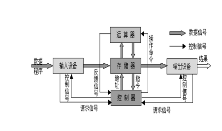

# 目录
<!-- vim-markdown-toc GFM -->

- [逻辑电路](#逻辑电路)
  - [逻辑门](#逻辑门)
  - [加法器](#加法器)
  - [经典组合逻辑](#经典组合逻辑)
- [触发器](#触发器)
- [处理器](#处理器)
- [现代处理器](#现代处理器)

<!-- vim-markdown-toc -->

# 逻辑电路
## 逻辑门

&emsp;基础的逻辑门只有与门(串联)、或门(并联)、非门(反相器)，他们之间互相组合可构成其它6种基础逻辑门。
注意观察上图最右边的表格，图片来自维基百科，将右侧的表格转换成如下格式可更直观的观察逻辑门之间的关系。

&emsp;第一行的0、1表示逻辑门第一个输入，第一列的0、1表示第二个输入，其它地方的0、1表示输出

| AND | 0 | 1 |
|-----|---|---|
| 0   | 0 | 0 |
| 1   | 0 | 1 |

&emsp;将与门的表格的取反可得到与非门

| NAND | 0 | 1 |
|------|---|---|
| 0    | 1 | 1 |
| 1    | 1 | 0 |

&emsp;再观察或门

| OR | 0 | 1 |
|----|---|---|
| 0  | 0 | 1 |
| 1  | 1 | 1 |

&emsp;将或门和与非门的输出连接到同一个与门的输入，得到异或门

| XOR | 0 | 1 |
|-----|---|---|
| 0   | 0 | 1 |
| 1   | 1 | 0 |

&emsp;其它逻辑门同理。组合逻辑的设计其实就如同布尔代数一般。

## 加法器
&emsp;将二进制加法拆分为求和位与求进位，如$1+1$，和位为0，但向高位进一，则进位为1，的和为$01$

| 和位 | 0 | 1 |
|------|---|---|
| 0    | 0 | 1 |
| 1    | 1 | 0 |

| 进位 | 0 | 1 |
|------|---|---|
| 0    | 0 | 0 |
| 1    | 0 | 1 |

&emsp;发现没有，和位就是异或门，进位就是与门！于是设计半加器如下。
S为和位输出，C为进位输出。

&emsp;将输入A、B扩展为多位的二进制数时，必定需要将当前二进制位和位与低位运算的进位相加（第二个半加器），
相加所得和位即为当前位运算的结果位。
而将该进位进位与当前位的进位相加（第三个半加器），如此半加器又产生了新的和位与进位。
此时问题出现了，我们原本设计应该是3个输入和2个输出（S、C）。
但目前我们已经使用了3个半加器，得到3个输出
咋回事？

&emsp;数学上来讲，三个二进制位相加只有4种结果——00、01、10、11。两位输出S与C完全能表达这4种结果。
那到底是哪里出问题了呢？

&emsp;再观察观察和位与进位的运算表，发现没有，S与C不可能同时为1。
所以当S1（第1个半加器的S）为1时，CO1必定为0；反之，当CO1为1时，S必为0。
当S1为0时，CO2也必定为0。所以导致CO2与CO1不可能同时为1。
**也就是说，第三个半加器的进位输出必定为0，而其和位输出S3作为整个全加器设计的进位输出**

| S3 | 0 | 1 |
|----|---|---|
| 0  | 0 | 1 |
| 1  | 1 | - |

&emsp;`-`表示该情况不存在，则完全可以利用或门取代第三个半加器。最终全加器见下

扩展多位后得

**减法**

&emsp;关于减法，主要问题是需要向高位借位。为避免借位，可以如此计算减法（以4位二进制为例）

x - y = 1111 - y + x + 1 - (1111 + 1) = ~y + 1 + x - 10000

&emsp;如此一来，仅有的减法是减去10000，不可能导致借位。而且我们只关心低4位，
高位结果被简单丢弃。

x + (-y) = x + (~y + 1)

&emsp;嗯哼。发现没有，`-y = ~y + 1`，这不就是补码求逆元(求反)公式吗？
没错，这就是补码的由来，将n位二进制位表示的数字空间中一半的容量拿出来表示负数。

&emsp;从正数1开始，以四位二进制位为例，1为0001，则-1为1111。
如此计算，直到7(0111)与-7(1001)。
最后还剩0000与1000还未使用，毫无疑问0000用来表示0，
那1000呢，是表示8呢还是表示-8呢？

&emsp;当然，如今我们知道，1000表示的应该是-8，这样一来补码的表示便有了简洁的数学公式。

$向量\overrightarrow{x}=[x_{w-1},\space x_{w-2},\space ...,\space x_0]$
$$B2T_w(\overrightarrow{x})\doteq-x_{w-1}2^{w-1}+\sum^{w-2}_{i=0}x_i2^i$$

## 经典组合逻辑
&emsp;与门的输入必须全为1，则其输出才为1。而只要我们控制其中一个输出为0，则与门输出就总是0。
所以与门天生就是做分支逻辑的料。
> 以下图片来自[知乎@JoshCena](https://zhuanlan.zhihu.com/p/107009452)

**编码器**

**选择器**。将所有输入数据Dn撤销后得到**译码器**。将输入数据换成唯一的D得到**分配器**。

# 触发器
&emsp;想象一下，如果将一个逻辑门的输出连接到它输入会怎么样？
该逻辑门的输出就可能改变它的输入，
比如或非门只要有一个输入为1则输出为0，而输出改变又导致输入变为全0，输出又变为1，又导致输入...

&emsp;逻辑门的输出与上次的输入有关，理论上，可以找到一种方法设计出一个组合逻辑用于记忆上次输入。
于是两位英国无线电物理学家在1918年发明了触发器。

| S | R | Q | $\bar{Q}$ |
|---|---|---|-----------|
| 1 | 0 | 1 | 0         |
| 0 | 1 | 0 | 1         |
| 0 | 0 | Q | $\bar{Q}$ |
| 1 | 1 | 0 | 0         |
&emsp;S表示置位，R表示复位，Q表示设置的输出，$\bar{Q}$表示Q的反相（为保证这层抽象，应该禁止S与R均为1的情况出现）。
注意，当S与R皆为0时，输出保持不变，这就是我们希望的记忆功能。

将上面触发器稍微改进一下，用时钟信号控制输入的有效性。
此为电平触发器（时钟处于高电平状态时即可触发）。

此时当时钟信号为1时，只要输入改变，输出也会跟着改变。
若本应在下个时钟周期的输入提早到来，则可能导致错误的输出。
再改进一下，利用两个电平触发器结合，得到边沿触发器（只在时钟上沿的一瞬间触发）

观察一下周期图，输出只在时钟上沿瞬间改变，而且周期翻倍了。

**计数器** 

把下面的周期图顺时针旋转90度再从上往下看看。

Surprise！计数器大功告成。

# 处理器
&emsp;将各个逻辑电路组合在一起，并暴露出输入接口与输出接口，就可以实现各种各样的数据处理。

&emsp;最初，人们通过手动输入数据。后来，很自然地想到，将输入数据放在某个地方，
让处理器从该位置自动顺序读取数据指令与数据，而这些指令有可以控制处理器进行跳转而读取其他地方的指令。
于是，整个过程都自动化了，我们只需要提前编写好程序并放到某个位置，而这个位置就有存储器扮演。
冯诺依曼结构降临人间。

利用计数器、选择器、触发器(锁存器)实现顺序读取内存。

&emsp;这样一笔一划的利用图纸来设计处理器无疑是效率低下的，于是诞生了HDL(硬件描述语言)。
HDL是一种文本表示，看上去和编程语言类似，但是它是用来描述结构而非过程的。
最常用的语言是Verilog，语法类似C。另一种是VHDL，语法类似Ada。

&emsp;提高生产效率的方式无非就是提供高级抽象与可复用对象。就像C语言之于汇编，OOP之于POP。
而HDL也是如此。

**处理器设计** 

&emsp;步入正题，现代处理器都利用了流水线来提高性能。
想要设计出流水线，就要将指令进行“动作分解”。但不同指令、不同动作锁需要的时间很可能是不同的，
想要处理器正常工作，将各个阶段进行同步是必须的，于是引入了时钟寄存器来作屏障。
PS:是不是觉得边沿触发器正合此意？

&emsp;将指令划分为更多阶段则可以提高指令吞吐量，但因为时钟寄存器也需要时间来传递逻辑流，
所以也会增大指令延迟。

# 现代处理器
&emsp;一个处理器支持的指令和指令的字节级编码称为它的ISA(指令集架构)。
说到指令集架构，就不得不提RSIC与CISC的历史了。

&emsp;RSIC(复杂指令集)其实先于CSIC(精简指令集)诞生。
CSIC的思想就是利用一个个简洁的指令简化CPU设计，并利用流水线提高指令的吞吐量。
因为当时RSIC中许多高级指令其实很难被编译器产生，故也很少用到这些指令；
再者，复杂的指令通常需要多个时钟周期来完成，很占用资源。

&emsp;当然，如今看来，RSIC与CSIC的界限早已模糊，CSIC中有了更多、更复杂的指令，
而RSIC也引入了流水线的设计。双方取长补短，都有了长足的进步。
现在，x86与ARM就是RSIC与CSIC的代表了。ARM相比x86，凭借更低的成本与能耗在移动端市场混的风生水起。

引脚
流水线
指令并行
