# 目录

<!-- vim-markdown-toc GFM -->

- [逻辑电路](#逻辑电路)
  - [逻辑门](#逻辑门)
  - [经典组合逻辑](#经典组合逻辑)
  - [加法器](#加法器)
  - [触发器](#触发器)
- [处理器设计](#处理器设计)
- [现代微处理器](#现代微处理器)
- [高速缓存](#高速缓存)
- [性能优化](#性能优化)

<!-- vim-markdown-toc -->

# 逻辑电路

## 逻辑门

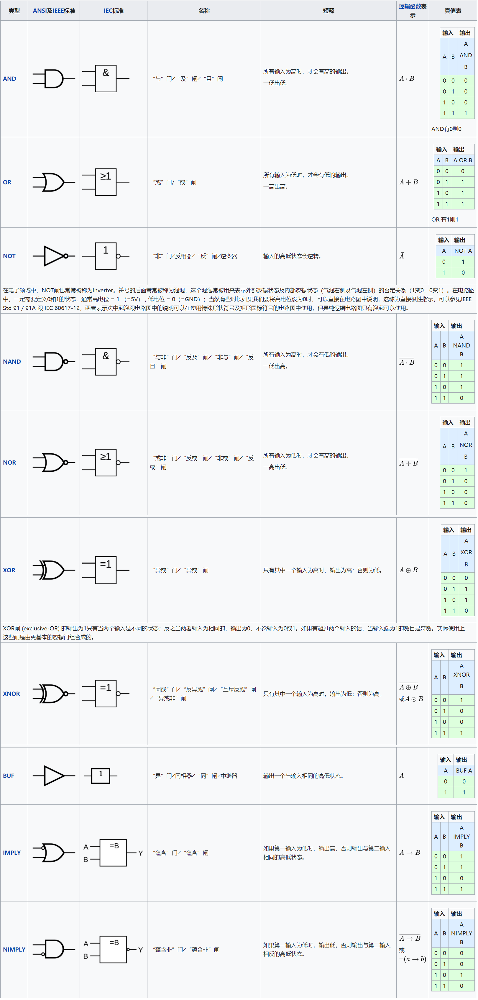

&emsp;基础的逻辑门只有与门(串联)、或门(并联)、非门(反相器)，他们之间互相组合可构成其它 6 种基础逻辑门。
注意观察上图最右边的表格，图片来自维基百科，将右侧的表格转换成如下格式可更直观的观察逻辑门之间的关系。

&emsp;第一行的 0、1 表示逻辑门第一个输入，第一列的 0、1 表示第二个输入，其它地方的 0、1 表示输出

| AND | 0   | 1   |
| --- | --- | --- |
| 0   | _0_ | _0_ |
| 1   | _0_ | _1_ |

&emsp;将与门的表格的取反可得到与非门

| NAND | 0   | 1   |
| ---- | --- | --- |
| 0    | _1_ | _1_ |
| 1    | _1_ | _0_ |

&emsp;再观察或门

| OR  | 0   | 1   |
| --- | --- | --- |
| 0   | _0_ | _1_ |
| 1   | _1_ | _1_ |

&emsp;将或门和与非门的输出连接到同一个与门的输入，得到异或门

| XOR | 0   | 1   |
| --- | --- | --- |
| 0   | _0_ | _1_ |
| 1   | _1_ | _0_ |

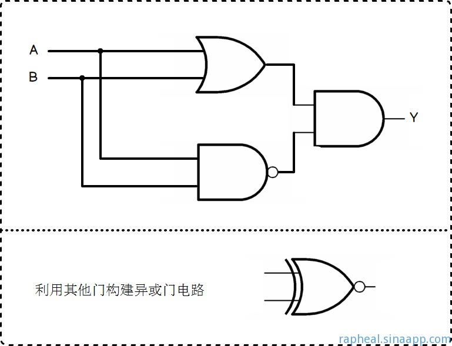

&emsp;其它逻辑门同理。组合逻辑的设计其实就如同布尔代数一般。

## 经典组合逻辑

&emsp;与门的输入必须全为 1，则其输出才为 1。而只要我们控制其中一个输出为 0，则与门输出就总是 0。
所以与门天生就是做分支逻辑的料。

> 以下图片来自[知乎@JoshCena](https://zhuanlan.zhihu.com/p/107009452)

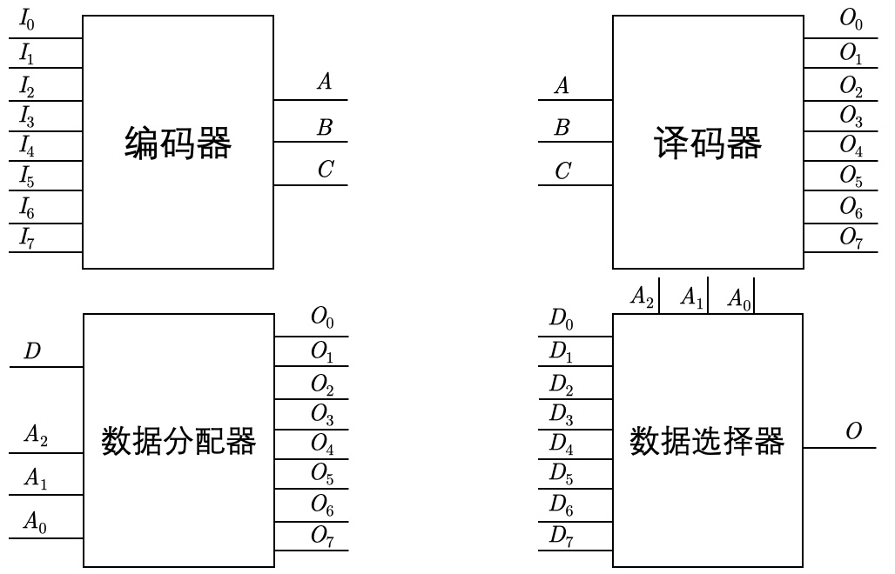

**编码器**

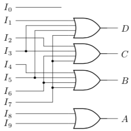

**选择器**。将所有输入数据 Dn 撤销后得到**译码器**。将输入数据换成唯一的 D 得到**分配器**。

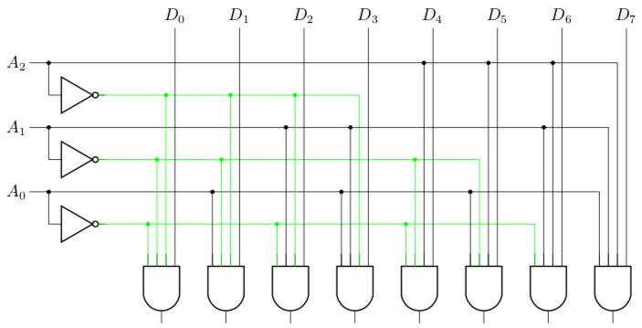

## 加法器

&emsp;将二进制加法拆分为求和位与求进位，如$1+1$，和位为 0，但向高位进一，则进位为 1，的和为$01$

| 和位 | _0_ | _1_ |
| ---- | --- | --- |
| 0    | _0_ | _1_ |
| 1    | _1_ | _0_ |

| 进位 | _0_ | _1_ |
| ---- | --- | --- |
| 0    | _0_ | _0_ |
| 1    | _0_ | _1_ |

&emsp;发现没有，和位就是异或门，进位就是与门！于是设计半加器如下。
S 为和位输出，C 为进位输出。

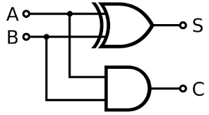

&emsp;将输入 A、B 扩展为多位的二进制数时，必定需要将当前二进制位和位与低位运算的进位相加（第二个半加器），
相加所得和位即为当前位运算的结果位。
而将该进位进位与当前位的进位相加（第三个半加器），如此半加器又产生了新的和位与进位。
此时问题出现了，我们原本设计应该是 3 个输入和 2 个输出（S、C）。
但目前我们已经使用了 3 个半加器，得到 3 个输出
咋回事？

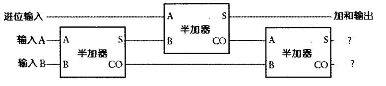

&emsp;数学上来讲，三个二进制位相加只有 4 种结果——00、01、10、11。两位输出 S 与 C 完全能表达这 4 种结果。
那到底是哪里出问题了呢？

&emsp;再观察观察和位与进位的运算表，发现没有，S 与 C 不可能同时为 1。
所以当 S1（第 1 个半加器的 S）为 1 时，CO1 必定为 0；反之，当 CO1 为 1 时，S 必为 0。
当 S1 为 0 时，CO2 也必定为 0。所以导致 CO2 与 CO1 不可能同时为 1。
**也就是说，第三个半加器的进位输出必定为 0，而其和位输出 S3 作为整个全加器设计的进位输出**

| S3  | 0   | 1   |
| --- | --- | --- |
| 0   | _0_ | _1_ |
| 1   | _1_ | -   |

&emsp;`-`表示该情况不存在，则完全可以利用或门取代第三个半加器。最终全加器见下

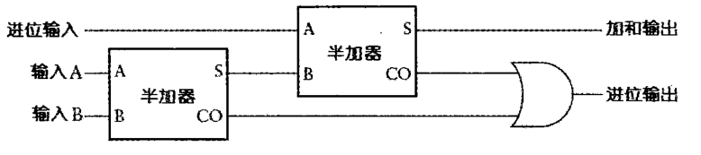

封装并扩展多位后得

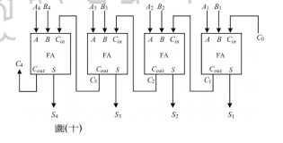

**减法**

&emsp;关于减法，主要问题是需要向高位借位。为避免借位，可以如此计算减法（以 4 位二进制为例）

$$x - y = 1111 - y + x + 1 - (1111 + 1) = \sim y + 1 + x - 10000$$

&emsp;如此一来，仅有的减法是减去 10000，不可能导致借位。而且我们只关心低 4 位，
高位结果被简单丢弃。

$$x + (-y) = x + (\sim y + 1)$$

&emsp;嗯哼。发现没有，`-y = ~y + 1`，这不就是补码求逆元(求反)公式吗？
没错，这就是补码的由来。

&emsp;将 n 位二进制位表示的数字空间中一半的容量拿出来表示负数，
以四位二进制位为例，从正数 1 开始，1 为 0001，则-1=~1+1=1111。
如此计算，直到 7(0111)与-7(1001)。
最后还剩 0000 与 1000 还未使用，毫无疑问 0000 用来表示 0，
那 1000 呢，是表示 8 呢还是表示-8 呢？

&emsp;当然，如今我们知道，1000 表示的应该是-8，这样一来补码的表示便有了简洁的数学公式。

$向量\overrightarrow{x}=[x_{w-1},\space x_{w-2},\space ...,\space x_0]$
$$B2T_w(\overrightarrow{x})\doteq-x_{w-1}2^{w-1}+\sum^{w-2}_{i=0}x_i2^i$$

## 触发器

&emsp;想象一下，如果将一个逻辑门的输出连接到它输入会怎么样？
该逻辑门的输出就可能改变它的输入，
比如或非门只要有一个输入为 1 则输出为 0，而输出改变又导致输入变为全 0，输出又变为 1，又导致输入...

&emsp;逻辑门的输出与上次的输入有关，理论上，可以找到一种方法设计出一个组合逻辑用于记忆上次输入。
于是两位英国无线电物理学家在 1918 年发明了触发器。

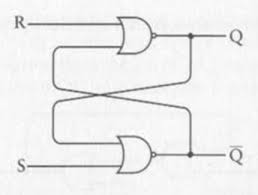

| S   | R   | Q   | $\bar{Q}$ |
| --- | --- | --- | --------- |
| 1   | 0   | 1   | 0         |
| 0   | 1   | 0   | 1         |
| 0   | 0   | Q   | $\bar{Q}$ |
| 1   | 1   | 0   | 0         |

&emsp;S 表示置位，R 表示复位，Q 表示设置的输出，$\bar{Q}$表示 Q 的反相（为保证这层抽象，应该禁止 S 与 R 均为 1 的情况出现）。
注意，当 S 与 R 皆为 0 时，输出保持不变，这就是我们希望的记忆功能。
可利用其制作**锁存器**

将上面触发器稍微改进一下，用时钟信号控制输入的有效性。
此为**电平触发器**（时钟处于高电平状态时即可触发）。

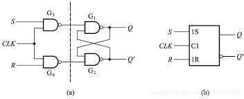

此时当时钟信号为 1 时，只要输入改变，输出也会跟着改变。
若本应在下个时钟周期的输入提早到来，则可能导致错误的输出。
再改进一下，利用两个电平触发器结合，得到**边沿触发器**（只在时钟上沿的一瞬间触发）

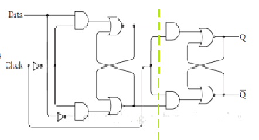

观察一下周期图，输出只在时钟上沿瞬间改变，而且周期翻倍了。

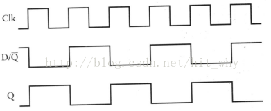

**计数器**

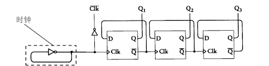

把下面的周期图顺时针旋转 90 度再从上往下看看。

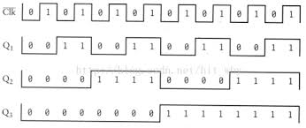

Surprise！计数器大功告成。

# 处理器设计

&emsp;将各个逻辑电路组合在一起，并暴露出输入接口与输出接口，就可以实现各种各样的数据处理。

&emsp;最初，人们通过手动输入数据。后来，很自然地想到，将输入数据放在某个地方，
让处理器从该位置自动顺序读取数据指令与数据，而这些指令有可以控制处理器进行跳转而读取其他地方的指令。
于是，整个过程都**自动化**了，我们只需要提前编写好程序并放到某个位置，而这个位置就有存储器扮演。

_
冯诺依曼结构
_

---

_
哈佛结构
_

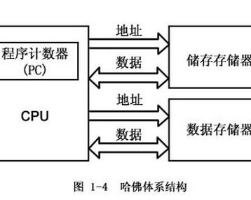

利用计数器、选择器、触发器(锁存器)实现顺序读取内存。
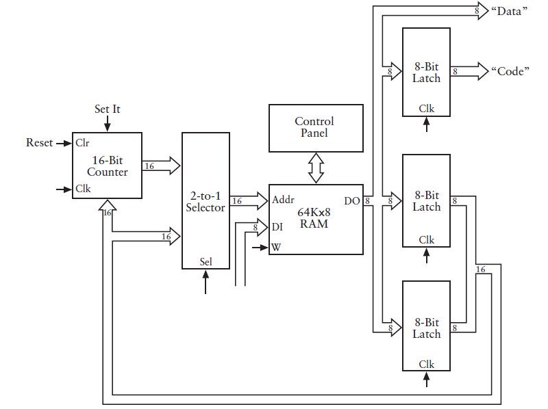

&emsp;这样一笔一划的利用图纸来设计处理器无疑是效率低下的，于是诞生了 HDL(硬件描述语言)。
HDL 是一种文本表示，看上去和编程语言类似，但是它是用来描述结构而非过程的。
最常用的语言是 Verilog，语法类似 C。另一种是 VHDL，语法类似 Ada。
提高生产效率的方式无非就是提供高级抽象与可复用对象。就像 C 语言之于汇编，OOP 之于 POP。而 HDL 也是如此。

**处理器设计**

&emsp;步入正题，现代处理器都利用了流水线来提高性能。
想要设计出流水线，就要将指令进行“动作分解”。但不同指令、不同动作锁需要的时间很可能是不同的，
想要处理器正常工作，将各个阶段进行同步是必须的，于是引入了时钟寄存器来作流水线屏障。
PS:是不是觉得边沿触发器正合此意？

CPE 并发性能计算：

- 流水线的发射时间：$L=\frac{(指令延迟\times指令数 + 流水线长度延迟)}{指令数}$，
  发射时间指同类型指令之间需要的时间间隔
- 指令级并行的指令延迟：$\frac{L}{指令并行度}$

&emsp;将指令划分为更多阶段则可以提高指令吞吐量，但因为时钟寄存器也需要时间来传递逻辑流，
所以也会增大指令延迟。以下为《CSAPP》中设计的 Y86 指令集架构的五流程流水线处理器的结构示意图。
具体设计代码请参考原书。

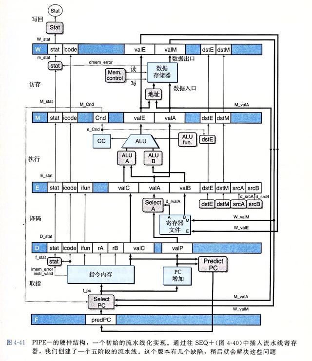

**关于分支预测**

&emsp;反向选择，若跳转地址比下一条指令地址低则选择；
正向不选择，若跳转地址比下一条指令地址高则不选择。
目的都是为了预测进入循环体，因为循环体代码一般会执行多次。

&emsp;还有过程调用的返回地址判断，高性能处理器会在取指单元放入一个硬件栈，保存`call`指令产生的返回地址。
当取指`ret`时就从这个栈中弹出值作为预测返回地址，当然预测失败也需要进行恢复。

**关于流水线冒险**

- 数据冒险：指令从寄存器或内存中读取的值，可能已被流水线中之前的指令更新但还未被写回。
- 控制冒险：分支预测失败需要恢复机制
- 异常：指令出错需要产生异常控制流并处理之

# 现代微处理器

**指令集架构**

&emsp;一个处理器支持的指令和指令的字节级编码称为它的 ISA(指令集架构)。
说到指令集架构，就不得不提 RSIC 与 CISC 的历史了。

&emsp;RSIC(复杂指令集)其实先于 CSIC(精简指令集)诞生。
CSIC 的思想就是利用一个个简洁的指令简化 CPU 设计，并利用流水线提高指令的吞吐量。
因为当时 RSIC 中许多高级指令其实很难被编译器产生，故也很少用到这些指令；
再者，复杂的指令通常需要多个时钟周期来完成，很占用资源。

&emsp;当然，如今看来，RSIC 与 CSIC 的界限早已模糊，CSIC 中有了更多、更复杂的指令，
而 RSIC 也引入了流水线的设计。双方取长补短，都有了长足的进步。
现在，x86 与 ARM 就是 RSIC 与 CSIC 的代表了。ARM 相比 x86，凭借更低的成本与能耗在移动端市场混的风生水起。

**现代处理器结构**

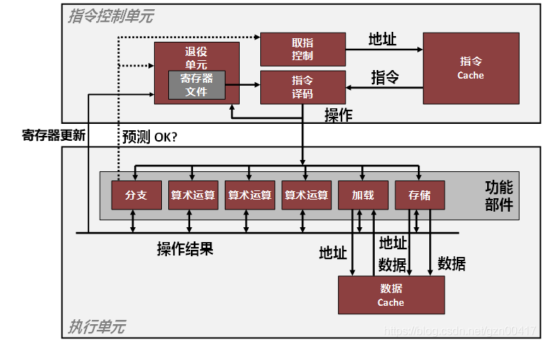

&emsp;主要分为 ICU(指令控制单元)与 EU(执行单元)两部分。
前者主要负责提前取指并译码为各个微操作再发射给 EU，此外，ICU 中的退役单元还负责解决数据冒险。
在 EU 中存在着多条流水线，可并行执行多个操作，而每条流水线可以执行多种操作。
因为有了这些流水线，我们才能利用指令集并行来优化程序性能。

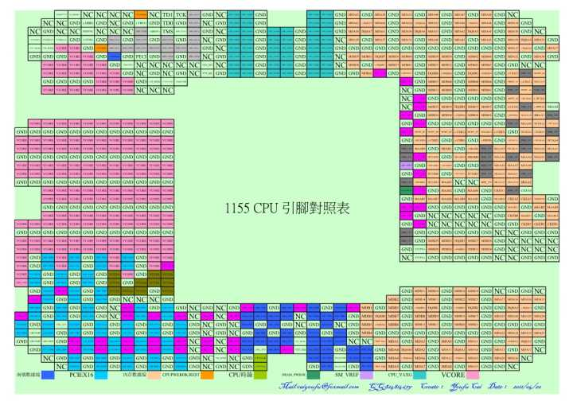

# 高速缓存

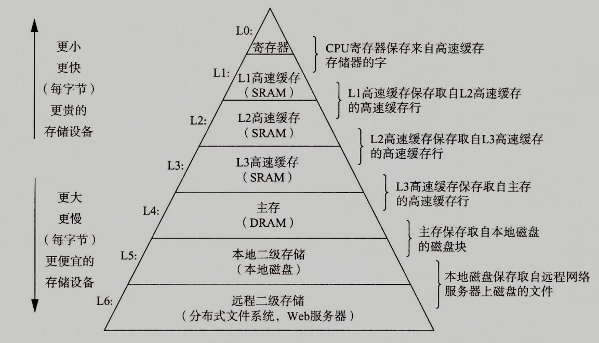

&emsp;访问越快速的存储器，也越昂贵，导致容量也越小。于是形成了上图那样的存储层次结构。
而在 CPU 内部有三级高速缓存，它们一般为 SRAM。

_CPU 内部的哈佛结构_

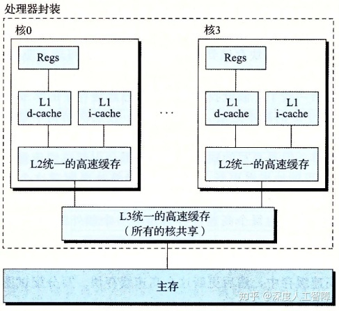

**局部性原理**

> 两种局部性都可以增大缓存命中率

- 良好的时间局部性是指被引用过一次的内存位置很可能在不久的将来再被多次引用
- 良好的空间局部性是指被引用过一次的内存位置，很可能在不久的将来引用其附近一个内存位置

**缓存地址**

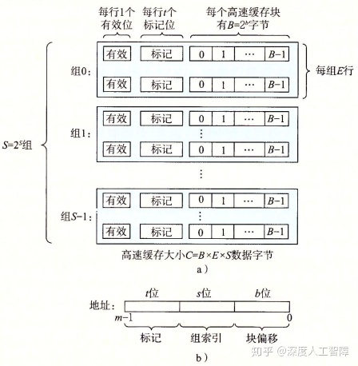

&emsp;内存地址被分为三部分，因为不命中时会驱除目标组中的块，所以为了提高空间局部性，
尽可能能够将连续的块加载如高速缓存，则应该每组进行均摊，于是并未分割高段为组索引，
而是取中段地址为组索引，如此一来，加载连续的块时会均摊到每个组，
而不是一下子全加载到一个组而可能导致“抖动”。

&emsp;缓存读不命中的驱逐策略：LFU(频率最低者)，LRU(最旧引用者)

&emsp;缓存写不命中的处理方式：写分配（从低级缓存中加载到高速缓存再写），
写不分配（直接写入低级缓存）。对于前者需要额外的硬件来标记并处理脏数据。
低级缓存倾向与写分配（因为数据传送时间长）。

- 高速缓存参数
  - 不命中率
  - 命中率
  - 命中时间
  - 不命中处罚
- 影响因素
  - 缓存大小：越大命中率越高，但也越难越贵
  - 块大小：在缓存大小一定的情况下，块越大则空间局部性越好，但时间局部性越差；同时增加了不命中处罚
  - 相联度：更高的相联度需要更复杂的硬件与处理机制，也就越贵且增加了命中时间与不命中处罚。
    对于局部性的影响倒是与“块大小”相反。一般在高级缓存中选择较高相联度(处罚很小)，而在低级缓存中使用较低相联度

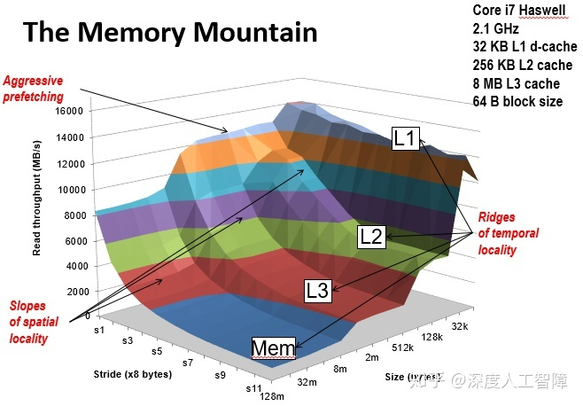

存储器山说明，编写步长越小，局部性越高，总数据据越接近高速缓存容量，则性能越好。
步长小时高性能 CPU 还会对数据进行预取来优化性能

# 性能优化

- CPU：缩小制程、提高主频、增加核心
- 减少冗余开销
  > 用临时变量保存中间结果来减少内存引用。  
  > 将冗余函数调用移出循环来减少函数调用。
- 循环展开
  > 减少循环次数
- 累积变量
  > 充分利用指令集并行
- 重新结合
  > 减少循环片段间的相互依赖关系，充分利用流水线
- 局部性
  > 结合 CPU 高速缓存大小与存储器山的指导，尽量让局部数据全部存入高速缓存

<!--
逻辑电路    ：九大逻辑门、加法器、编码器、选择器-译码器-分配器、触发器(计数器、锁存器)
处理器设计  ：时序处理(取指、译码、执行、访存、写回)、流水线(数据冒险、控制冒险)
现代微处理器：超标量、流水线、分支预测、调用栈预测、缓存预取
高速缓存    ：三级缓存、标识-组-块、写回与直写、驱逐策略、局部性原理(内循环步长)
-->
