# DirectX

> [DirectX graphics and gaming](https://learn.microsoft.com/en-us/windows/win32/directx)

DirectX 包含了多套 API 用于增强图形和游戏的交互，其中最主要的就是 Direct3D

## COM

> [Programming DirectX with COM](https://learn.microsoft.com/en-us/windows/win32/prog-dx-with-com)

DirectX API 是基于 COM 的

- 对象都直接或间接由工厂构造，构造时需要指定抽象接口的 GUID `__uuidof(IDXGIFactory2)` `IID_PPV_ARGS(&pID3D11Texture2D)`
- 仅通过抽象接口与具体对象进行交互，可以尝试扩展或转换接口 `IUnknown::QueryInterface`
- 利用 COM 智能指针管理对象生命周期 `#include <wrl/client.h>` `Microsoft::WRL::ComPtr`
- 返回结果均为 `HRESULT`，可以使用宏 `SUCCEEDED` 和 `FAILED` 来检测结果

## DXGI

> [DXGI overview](https://learn.microsoft.com/en-us/windows/win32/direct3ddxgi/d3d10-graphics-programming-guide-dxgi)

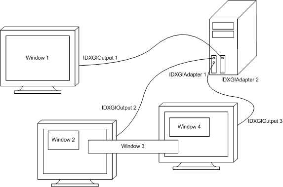

从 Direct3D 10 开始，Direct3D 利用 DXGI 作为中间层来与显卡内核驱动交互

- `IDXGIFactory`
  - `IDXGIAdapter`：代表显卡
    - `IDXGIOutput`：代表显示器
    - `IDXGIDevice`：负责与显卡交互
      - `IDXGISwapChain`：负责与窗口交互
      - `IDXGIResource`：代表显存资源

> - 不要混用 DXGI 1.0 (IDXGIFactory) 和 DXGI 1.1 (IDXGIFactory1)
> - 不要在 DllMain 中调用 DXGI，因为 DXGI 可能需要加载 DLL
> - 不要再窗口线程中等待渲染线程，调用 Present 时渲染线程会同步等待 (SendMessage) 窗口线程

以下情况可能会触发错误 `DXGI_ERROR_DEVICE_REMOVED` 或 `DXGI_ERROR_DEVICE_RESET`

- 显卡驱动升级
- 系统切换使用显卡
- 显卡未响应或被重置
- 显卡被插入或移除
- GPU 超时检测和恢复

可以在调用 `IDXGISwapChain::Present` 或 `WM_SIZE` -> `IDXGISwapChain::ResizeBuffers` 后检测并处理，届时需要销毁所有 DXGI 资源并重新创建

### Device

`IDXGIDevice` 通常使用 D3D API 如 `D3D11CreateDevice`/`D3D12CreateDevice` 来构造，`ID3D11Device`/`ID3D12Device` 均实现了 `IDXGIDevice` 接口

在 DXGI 中`IDXGIDevice` 负责创建资源和提交指令，但在上层的 D3D API 中则将其功能拆分出来了

- 在 D3D11 中
  - `ID3D11Device` 负责创建资源对象
  - `ID3D11DeviceContext` 负责录制 GPU 指令并在适当时机自动提交
    - 指令缓冲区满时
    - CPU 同步等待 GPU 结果时，比如 `ID3D11DeviceContext::Map` 或 `ID3D11DeviceContext::GetData` 等
    - 调用 `IDXGISwapChain::Present` 时
    - 调用 `ID3D11DeviceContext::Flush` 时
- 在 D3D12 中则更加底层
  - `ID3D12Device` 负责创建资源对象
  - `ID3D12CommandList` 负责录制 GPU 指令
  - `ID3D12CommandQueue` 负责提交指令，不同类型的 CommandQueue 可以并行提交指令（比如图形、拷贝、计算等）

### Resource

> [Resources](https://learn.microsoft.com/en-us/windows/win32/direct3d10/d3d10-graphics-programming-guide-resources)

D3D 资源即对数据结构的抽象，其通常存储于 GPU 显存中用作渲染管线的输入输出

- Buffer
  - Vertex
  - Index
  - Constant
- Texture
  - 1D (Array)
  - 2D (Array)
  - 3D

Vertex Buffer 用于存储结构化数据的数组，比如上图中每个元素是一个包含节点位置、法线、纹理坐标的结构

Index Buffer 用于存储索引的数组，因为节点信息通常有大量的重复，使用索引来引用节点数据可以减少冗余

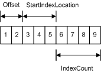

Constant Buffer 用于为着色器提供常量

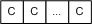

Texture 纹理是用于存储像素的数组，特别地，纹理支持多重采样和多级贴图

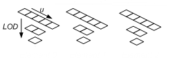
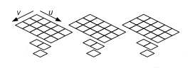
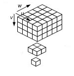

Subresources 同于引用内部资源，某些资源内部可以包含多个资源，比如每个 LOD 都是一个独立资源。通过一个索引数据来引用子资源，索引编号如上图。可以用 `D3D11CalcSubresource` 来计算资源索引，其中 Array Slice 表示第几个 texture，Mip Slice 表示第几级 mip

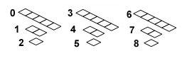
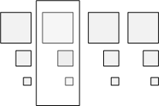
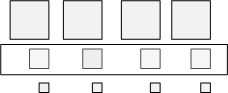

每个元素的格式分为两类，强类型和弱类型。强类型即再创建资源时就指定，且不可再更改，可以被优化。弱类型资源则通过资源视图来引用，只要元素位长相同就可以重新解释为不同的类型。

> **GPU 资源如何与 CPU 内存交互？**  
> [D3D11_USAGE](https://learn.microsoft.com/en-us/windows/win32/api/d3d11/ne-d3d11-d3d11_usage)

| Resource Usage | Default | Immutable | Dynamic | Staging |
| -------------- | ------- | --------- | ------- | ------- |
| GPU-Read       | yes     | yes       | yes     | yes¹    |
| GPU-Write      | yes     |           |         | yes¹    |
| CPU-Read       |         |           |         | yes¹    |
| CPU-Write      |         |           | yes     | yes¹    |

| Resource Can Be Bound As | Default | Immutable | Dynamic | Staging |
| ------------------------ | ------- | --------- | ------- | ------- |
| Input to a Stage         | yes²    | yes       | yes³    |         |
| Output from a Stage      | yes²    |           |         |         |

> 1. GPU 不能直接读写 Staging 资源，只能通过拷贝到另一个资源来读写
> 2. Default 资源不能同时对同一个子资源进行读写
> 3. Dynamic 资源只能是单个子资源，不能是数组，不能有 mipmap

- CPU -> GPU
  - `D3D11_SUBRESOURCE_DATA* pInitialData` (All)
  - `ID3D11DeviceContext::Map` (Dynamic|Staging)
  - `ID3D11DeviceContext::UpdateSubresource` (Default|Staging)
- GPU -> GPU
  - `ID3D11DeviceContext::CopyResource` (Default|Staging)
  - `ID3D11DeviceContext::CopySubresourceRegion` (Default|Staging)
- GPU -> CPU
  - `ID3D11DeviceContext::Map` (Staging)

4 种类型针对不同应用场景做了优化，同一个类型，GPU 访问优化好，CPU 访问优化自然就差，反之亦然。其中只有 Dynamic 和 Staging 可以利用 Map 将虚拟内存映射到 GPU 显存，Map 调用是同步的，需要等待 GPU 将资源更新完毕才返回，CPU 使用完资源后需要成对的调用 Unmap 来将数据异步写到 GPU。

### SwapChian

> [DXGI overview](https://learn.microsoft.com/en-us/windows/win32/direct3ddxgi/d3d10-graphics-programming-guide-dxgi)  
> [Present Latency, DWM and Waitable Swapchains](https://jackmin.home.blog/2018/12/14/swapchains-present-and-present-latency/)  
> [Sample Application for Direct3D 12 Flip Model Swap Chains](https://www.intel.com/content/www/us/en/developer/articles/code-sample/sample-application-for-direct3d-12-flip-model-swap-chains.html)  
> [Advanced API Performance: Swap Chains](https://developer.nvidia.com/blog/advanced-api-performance-swap-chains/)

SwapChain 新的构造函数（如 `IDXGIFactory2::CreateSwapChainForHwnd`）通常需要如下步骤

- D3D11

  1. `CreateDXGIFactory1`
  2. `IDXGIFactory1::EnumAdapters1`
  3. `D3D11CreateDevice`
  4. `IDXGIFactory2::CreateSwapChainForHwnd`

- D3D12
  1. `CreateDXGIFactory1`
  2. `IDXGIFactory1::EnumAdapters1`
  3. `D3D12CreateDevice`
  4. `ID3D12Device::CreateCommandQueue`
  5. `IDXGIFactory2::CreateSwapChainForHwnd`

SwapChain 有若干个缓冲区，通常会将其中一个作为渲染目标，渲染完成后会将缓冲区内容输出到窗口，SwapChain 有两种工作模型与 DWM(Desktop Window Manager) 交互：新的 Flip 和旧的 Blt

Blt 模式下（指定 `DXGI_SWAP_EFFECT_DISCARD` 或 `DXGI_SWAP_EFFECT_SEQUENTIAL`），SwapChain 的后缓冲区需要先位块传输到 DWM 中的前缓冲区，再进行窗口合成，然后显示到屏幕。

Flip 模式下（指定 `DXGI_SWAP_EFFECT_FLIP_SEQUENTIAL` 或 `DXGI_SWAP_EFFECT_FLIP_DISCARD`），SwapChain 的所有缓冲区与 DWM 共享，所以节约了一次复制，但是 DWM 无法读取正在被使用的缓冲区（比如用作渲染目标），所以 Flip 模式下 SwapChain 至少需要 2 个缓冲区。在 D3D11 中只需要访问将第一个缓冲区作为渲染目标即可，调用`Present`会自动切换；而在 D3D12 中需要手动指定用作渲染目标的缓冲区索引。

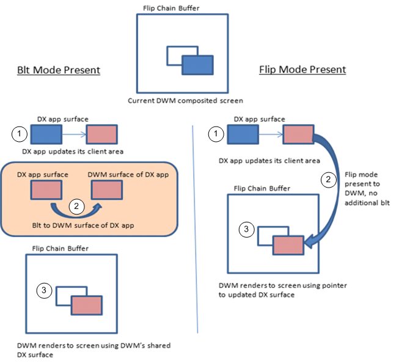

SwapChain 提交缓冲区给 DWM 时可以使用 `IDXGISwapChain1::Present1` 的增量更新功能，即脏矩形和滚动区域

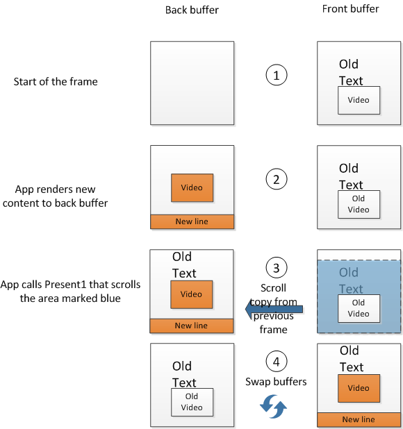

假设一共 n 个缓冲区，则作为当前渲染目标的缓冲区中的内容是前 n 帧，为了更新当前帧，除了渲染当前帧的脏矩形外，还需要拷贝部分前 n-1 帧的脏矩形。

对于 Blt 模式，若只有一个缓冲区则无需跟踪脏矩形，因为每帧都全部重绘，若有多个缓冲区，则与 Flip 模式类似。且 Blt 模式无法使用滚动区域，除此之外多重采样无法与增量更新同时使用。脏矩形更新计算公式如下，0 代表当前缓冲区，buffer 为缓冲区数量。

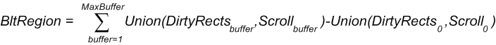

完整渲染工作流程（以窗口化 Flip 模式为例）：

1. CPU 阶段：CPU 录制用于渲染当前帧的指令（比如图形、拷贝、计算等）并提交到 GPU

2. CPU 提交阶段：当命令队列超过最大值时，`Present` 等待上帧 GPU 渲染完成再提交

3. GPU 阶段：GPU 开始渲染当前帧并将结果写入 Back Buffer 并交换到 Front Buffer

4. DWM 阶段：等到下个 VBLANK 时 DWM 被唤醒然后读取应用的 Front Buffer 进行合成（若 1 个 VBLANK 期间完成了多次步骤 1~3 则意味着只有最后渲染的帧被显示），并将最终渲染结果输出到它自己的 Front Buffer

5. Display 阶段：再等到下个 VBLANK 时通过 DAC 将 DWM 的 Front Buffer 输出到屏幕

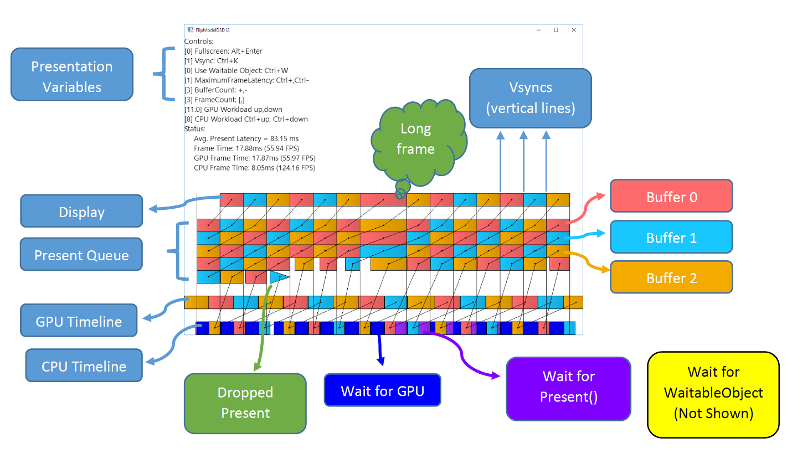

通常情况：2 Buffer, 3 Maximum Frame Latency, Present Without Vsync, CPU Time < GPU Time

如下图，当 GPU 渲染时间大于 CPU 渲染时间（即性能瓶颈在 GPU）时，为了限制 CPU 一直提交渲染指令给 GPU 而导致指令累积，然后导致帧延迟无限增大，提供了 Maximum Frame Latency 机制来限制已提交但未完成的帧数量，当超过限制时 `Present` 调用会阻塞直到队列中有一帧渲染完成

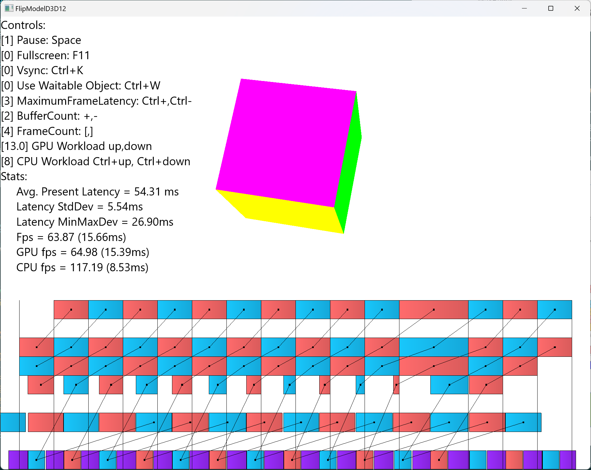

可以利用 `DXGI_SWAP_CHAIN_FLAG_FRAME_LATENCY_WAITABLE_OBJECT` 来将 `Present` 的延迟提前到 CPU 阶段之前从而降低帧内延迟，代价是 FPS 可能会降低。若渲染时长超过一个 VBLANK 则至少需要设置最大帧延迟为 2 来保证让 CPU 和 GPU 可以并行运行。

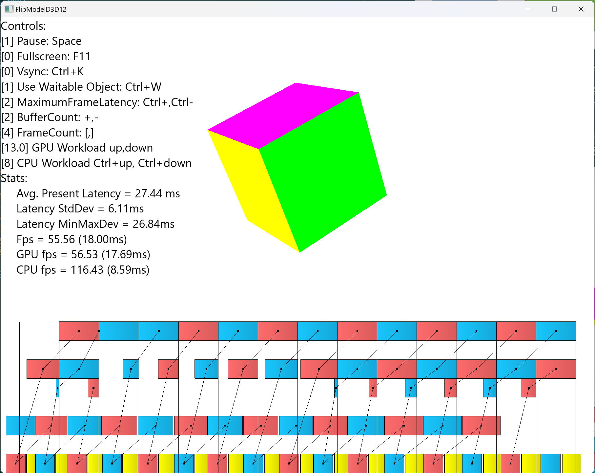

除此之外，还可以利用全屏模式或全屏窗口可以降低 DWM 引入的延迟，因为此时直接将应用的 Front Buffer 输出到屏幕

- `IDXGIFactory::MakeWindowAssociation`：监听窗口消息，`Alt+Enter` 切换全屏模式，`Print-Screen` 截屏
- `IDXGISwapChain::SetFullscreenState`：切换全屏模式，通常步骤如下

  1. `IDXGISwapChain::GetContainingOutput` 选择一个合适的屏幕
  2. `IDXGIOutput::FindClosestMatchingMode` 选择一个合适的屏幕分辨率
  3. `IDXGISwapChain::ResizeTarget` 调整窗口大小/屏幕分辨率
  4. 触发 `WM_SIZE` 消息
     1. 释放所有 SwapChain 相关的 Buffer
     2. `IDXGISwapChain::ResizeBuffers` 调整 Buffer 大小
     3. 重新获取 SwapChain 相关的 Buffer
  5. `IDXGISwapChain::SetFullscreenState` 切换全屏模式

- `DXGI_SWAP_CHAIN_FLAG_ALLOW_MODE_SWITCH` 该创建标志使得全屏模式下调用 `IDXGISwapChain::ResizeTarget` 会自动设置屏幕分辨率
- 全屏模式下如果 Target 大小和 Buffer 大小不匹配，或 DXGI_MODE_DESC 设置的刷新率与屏幕不匹配，则 Flip 模式会退化为 Blt 模式
- 有窗口遮挡时自动退出全屏。D3D12 之后不再支持独占全屏，切换全屏状态后其他窗口仍可以显示在全屏窗口上
- 注意退出全屏模式后再释放 SwapChain
- 全屏时若缓冲区内容同时被读取到屏幕和写入渲染结果，则会出现画面撕裂，考虑以下 Nvidia 设置中的权衡
  - Off：关闭垂直同步，高 FPS，低延迟，但可能出现画面撕裂
  - On：开启垂直同步，低 FPS，高延迟（FPS 低于刷新率更明显），解决画面撕裂
  - Fast：关闭垂直同步，但当渲染帧率超过屏幕刷新率则丢弃多余帧
  - Adaptive：开启垂直同步，但当渲染帧率低于屏幕刷新率时关闭
  - Adaptive2：开启垂直同步，但帧率限制为屏幕刷新率的一半
- 使用 `DXGI_SWAP_CHAIN_FLAG_ALLOW_TEARING` 和 `DXGI_PRESENT_ALLOW_TEARING` 是支持屏幕可变刷新率的必要条件

### Misc

- [Desktop Duplication API](https://learn.microsoft.com/en-us/windows/win32/direct3ddxgi/desktop-dup-api)
- [Multi-adapter systems](https://learn.microsoft.com/en-us/windows/win32/direct3d12/multi-engine)
- [Improved usage of shared resources and synchronized events](https://learn.microsoft.com/en-us/windows/win32/direct3ddxgi/dxgi-1-2-improvements#improved-usage-of-shared-resources-and-synchronized-events)
- [Waiting on an event when rendering is unnecessary](https://learn.microsoft.com/en-us/windows/win32/direct3ddxgi/waiting-when-occluded)
- [Variable refresh rate displays](https://learn.microsoft.com/en-us/windows/win32/direct3ddxgi/variable-refresh-rate-displays)
- [Use DirectX with Advanced Color on high/standard dynamic range displays](https://learn.microsoft.com/en-us/windows/win32/direct3darticles/high-dynamic-range)
- [Using gamma correction](https://learn.microsoft.com/en-us/windows/win32/direct3ddxgi/using-gamma-correction)

## Direct3D
