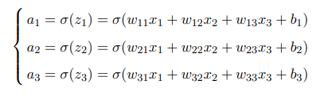
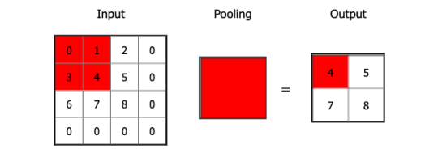
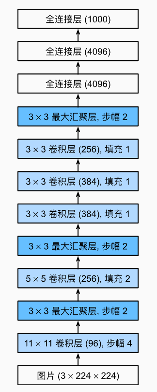
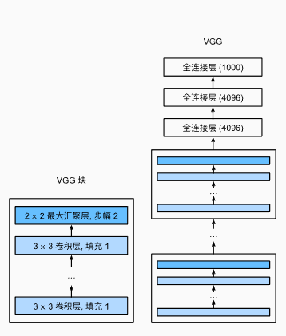
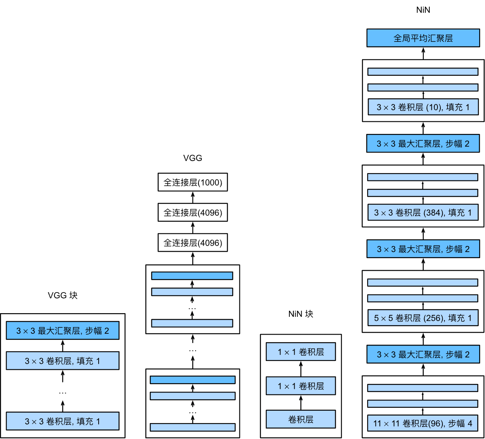
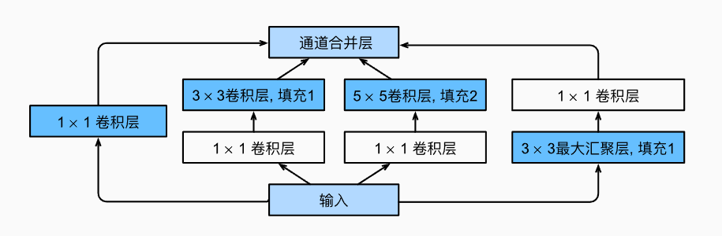
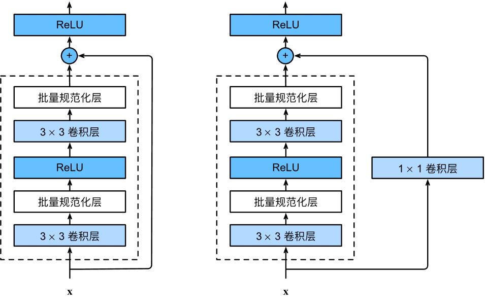
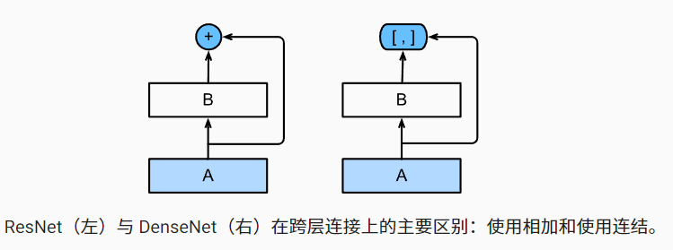
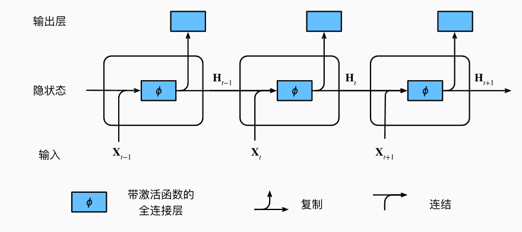

# 深度学习

## 深度前馈网络

深度前馈网络(Deep Feedforward Network, DFN)也叫前馈神经网络(Feedforward Neural Network, FNN)或多层感知机(Multilayer Perceptron, MLP)。网络包含输入层、隐含层、输出层，层与层之间是全连接的。

> 万能近似定理：⼀个前馈神经⽹络如果具有线性层和⾄少⼀层具有 “挤压” 性质的激活函数（如 sigmoid 等），给定⽹络⾜够数量的隐藏单元，它可以以任意精度来近似任何从⼀个有限维空间到另⼀个有限维空间的 borel 可测函数。


### 输入层

通常输入数据是二维张量（样本，特征）

### 隐含层



$\sigma$是激活函数，如果不引入激活函数，可以验证，无论多少层神经网络，
输出都是输入的线性组合。常见激活函数有

- ReLU: $g(z)=max\{0,z\}$
- tanh: $g(z)=\frac{e^z-e^{-z}}{e^z+e^{-z}}$
- sigmoid: $g(z)=\frac{1}{1+e^{-z}}$

### 输出层

假设前⾯已经使⽤若⼲隐藏层提供了⼀组隐藏特征 $h$，输出层的任务就是要对这些特征做⼀些额外变换。常见输出单元有

- linear: $\hat{y}=z=Wh+b$
- softmax: $\hat{y}_i=\frac{exp(z_i)}{\sum_jexp(z_j)}$

### 后向传播

> 关于后向传播算法见 [3Blue1Brown@youtube](https://www.youtube.com/watch?v=Ilg3gGewQ5U&t=464s)

任何能够衡量模型预测值与真实值之间的差异的函数都可以叫做代价函数；通过链式求导与梯度下降可从后往前优化代价函数的参数。

## 卷积神经网络

### 卷积层

> 稀疏交互、参数共享、等变表示


- 输入通常为 4 维张量（样本，通道，宽度，高度）
- 填充
  - valid: 不填充，输出大小为 (m − f + 1, n−f + 1)
  - same: 用 0 填充使得卷积后输出大小与输入一致，p=(f-1)/2
  - full: 用 0 填充使得输出大小为 (m+f-1, n+f-1)
- 步幅
- 卷积运算
- 激活函数

### 池化层

> 降低卷积层对位置的敏感性，同时降低对空间降采样表示的敏感性



- 池化运算
  - Max
  - Average

### 卷积神经网络模型

- LeNet: 逐渐降低其表示的空间分辨率，同时增加通道数。

  

- AlexNet

  

- VGG

  

- NiN: 利用 1×1 卷积核代替全连接层，全局平均池化代替输出层

  

- GoogLeNet

  

- ResNet

  

- DenseNet

  

## 循环神经网络



输入形状：（步长，批量，特征）通常需要转置（批量，步长）后独热编码

## Pytorch 框架

- 加载数据：加载，转换
- 加载模型：model, optimizer
- 定义模型
- 定义优化器
- 定义损失函数
- 梯度计算模式
- channels_last memory format & Automatic Mixed Precision

### Tensor

```python
torch.tensor([[1, 2, 3], [4, 5, 6]], dtype=torch.float)
torch.arange(5)
torch.arange(1, 4)
torch.arange(1, 2.5, 0.5)
torch.zeros(2, 3)
torch.ones(2, 3)
torch.full((2, 3), 3.14)
torch.rand(2, 3)
torch.randint(3, 10, (2, 3))
torch.randn(2, 3)

x_data.shape  # torch.Size([2, 3])
x_data.dtype  # torch.float32
x_data.device # cpu

x_data[0]     # first row, 降维 dim=0
x_data[:, 0]  # first column, 降维 dim=1
x_data[...,-1]# last column, 降维 dim=1
```

### 超参数

- Batch Size: 64 ~ 256

- Model

  - Hidden Linear Features:

    - input \* 2 / 3 + output
    - (input + output) / 2
    - sqrt(input \* output)

- Optimizer:

  - Algorithm: Adam
  - weight_decay: 1e-4 ~ 9e-4

- Loss Function:

  - Regression:
    - L1Loss: noise
    - SmoothL1Loss: large values
    - MSELoss: not large values, not very high-dimensional
  - multi-class Classification:
    - CrossEntropyLoss & Softmax
  - binary Classification:
    - BCEWithLogitsLoss & Sigmoid

- Overfitting solution:
  - Dropout: 20% ~ 50%
  -
