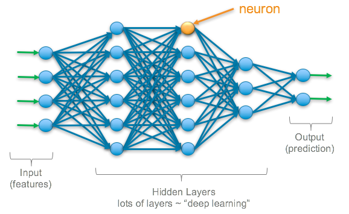
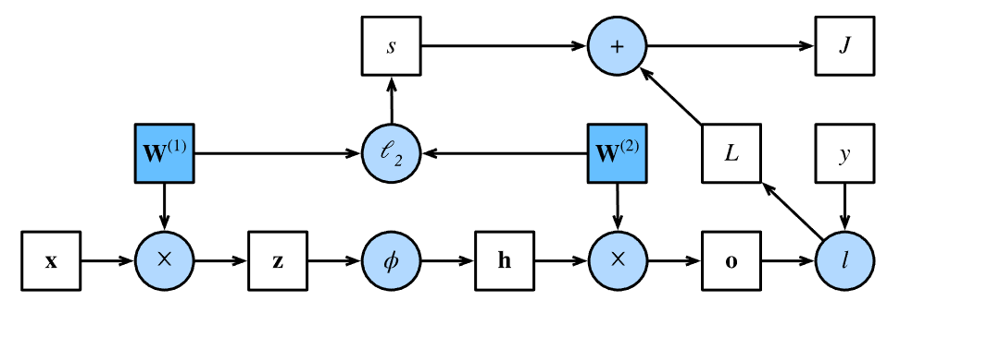
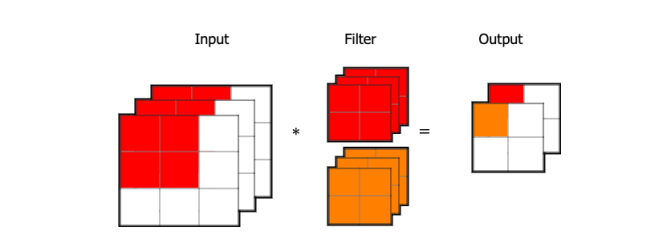
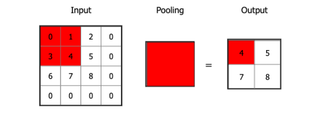
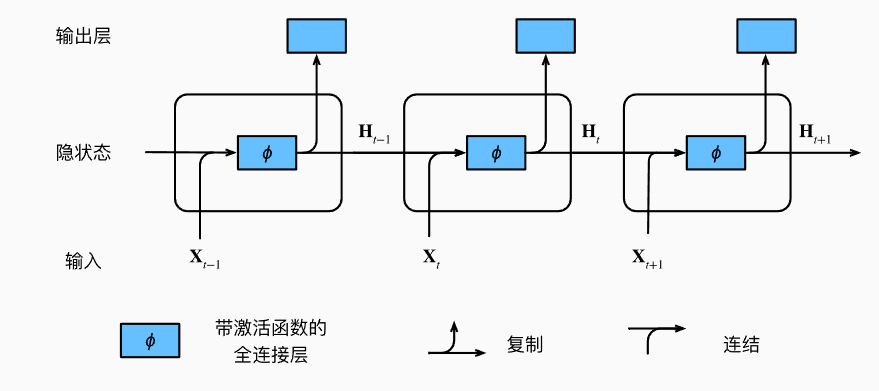
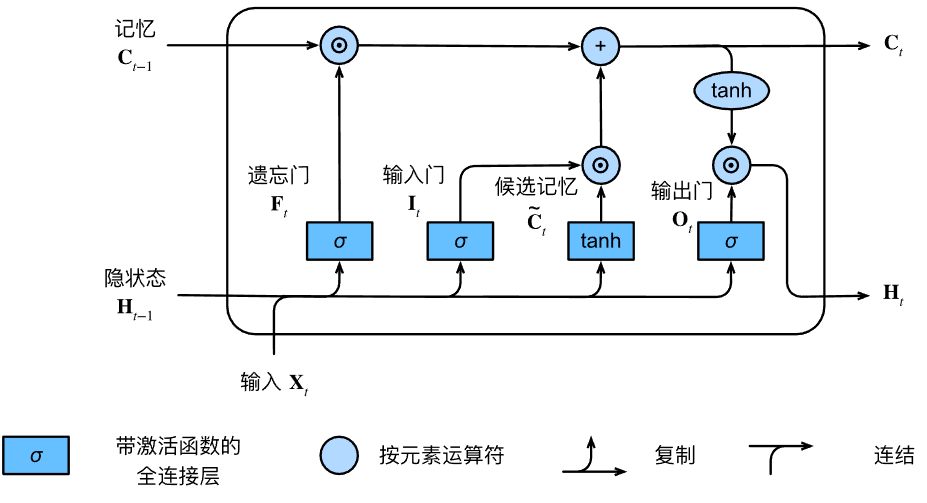
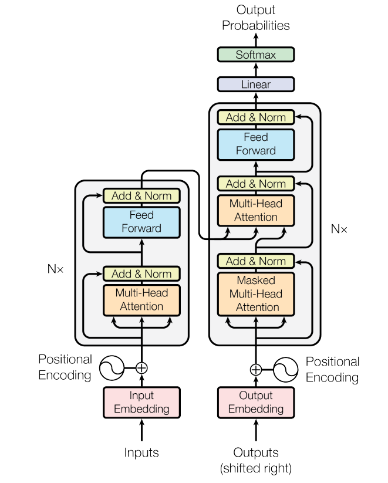

# 深度学习

- [深度学习](#深度学习)
  - [张量](#张量)
  - [线性回归](#线性回归)
  - [多层感知机](#多层感知机)
    - [过拟合](#过拟合)
  - [卷积神经网络](#卷积神经网络)
    - [卷积层](#卷积层)
    - [池化层](#池化层)
  - [循环神经网络](#循环神经网络)
  - [Transformer](#transformer)
  - [Pytorch 框架](#pytorch-框架)
    - [Tensor](#tensor)
    - [Dataset](#dataset)
    - [Model](#model)
    - [Optimizer](#optimizer)
    - [Loss Function](#loss-function)
    - [Training Loop](#training-loop)
    - [Performance Tuning](#performance-tuning)
    - [Overfitting Solution](#overfitting-solution)
    - [Hyperparams Optimization](#hyperparams-optimization)

## 张量

- 张量：`Tensor: shape=(3, 4, 5), dtype=float32`

- 访问

  - 切片：`t[0:2]` 得 `(3, 4, 5)` -> `(2, 4, 5)`（轴 0 取前两个元素，轴 0 长度变短）
  - 索引：`t[0,-1]`，得 `(3, 4, 5)` -> `(5)` （轴 0 取第一个元素，轴 1 取最后一个元素，轴 0,1 消失，降两维）
  - 切片+索引：`t[0:2,0,-1]`，得 `(3, 4, 5)` -> `(2)` （轴 0 取前两个元素，轴 0 长度变短，轴 1 取第一个元素，轴 2 取最后一个元素，轴 1,2 消失，降两维）

- 运算

  - 逐元素运算符，如 `+` `-` `*` `/` `**` 等，需要两个 Tensor 具有相同的 dtype 和尽量相同的 shape

    - 广播机制：对两个 shape 不同的 Tensor 进行逐元素运算时，会尝试扩张两个 Tensor 以让它们 shape 一样
      1. 从最右边的维度开始比较两个 Tensor
      2. 如果每对维度都是，相等的或其中一个为 1 或 0（没有该维度）
      3. 则允许运算，必要时广播
      4. 比如两个维度为 `(3, 1, 4) + (3, 4)` 的 Tensor 广播为 `(3, 3, 4) + (3, 3, 4)`

  - 降维运算

    - 求和：例如将 Tensor `(3, 4, 5)` 对轴 0, 2 进行求和

      1. 轴 0 元素为 `(4, 5)`，求和后轴 0 消失得 `(4, 5)`
      2. 轴 2 元素为 `()`，求和后轴 2 消失得 `(4)`

      - 避免降维：通常可以指定参数 `keepdims=True` 使求和后保持轴长度为 1，即 `(3, 4, 5)` -> `(1, 4, 1)`

    - 缩并：例如将 Tensor A `(3, 4, 5)` 和 B `(3, 1, 4)` 对轴 0_a, 1_a 和 0_b, 2_b 进行缩并

      1. 对 A 的轴编号（指标） `(i, j, k)`，对 B 的轴编号 `(l, m, n)`
      2. 缩并轴 `i`, `l` 具有相同长度 3，缩并轴 `j`, `n` 具有相同长度 4，允许缩并
      3. 自由轴排列得最终结果 Tensor 的 shape 为 `(k, m)` 即 `(5, 1)`

      ```python
      for k:
        for m:
          for i_l:
            for j_n:
              C[k,m] += A[i_l,j_n,k] * B[i_l, m, j_n]

      # 爱因斯坦求和约定：缩并运算的特殊表示法
      einsum("ijk,imj->km", A, B)
      ```

      - 线性代数中向量和矩阵运算即是特殊的缩并运算

        - 点积：`(n)` • `(n)` -> `()`
        - 矩阵-向量积：`(m, n)` • `(n)` -> `(n)`
        - 矩阵乘法：`(m, k)` • `(k, n)` -> `(m, n)`

      - 全连接神经网络层的本质也是缩并运算，即 `X(B, ..., n)` • `W(n, m)` + `b(m)` -> `y(B, ..., m)`

## 线性回归

- 线性模型
  - $\hat{y} = w \cdot x + b$
  - 用来拟合潜在的目标函数
- 损失函数
  - $L=\frac{1}{2B}\sum (\hat{y} - y)^2$
  - 用来度量预测 (predict) 与目标 (target) 之间的误差
- 梯度下降
  - $w = w - \alpha\frac{\partial L}{\partial w} = w - \alpha\frac{\partial L}{\partial \hat{y}} \frac{\partial \hat{y}}{\partial w} = w - \alpha \cdot \frac{1}{B}\sum (\hat{y} - y) \cdot x$
  - $b = b - \alpha\frac{\partial L}{\partial b} = b - \alpha\frac{\partial L}{\partial \hat{y}} \frac{\partial \hat{y}}{\partial b} = b - \alpha \cdot \frac{1}{B}\sum (\hat{y} - y)$
  - 调整参数 $w$ 和 $b$ 使它们朝误差变小的方向前进
- 训练

  - 独立同分布假设：训练集中每个样例之间相互独立没有关联，且训练集中的样例分布与全集相同
  - 样例 (example)：特征 (feature)、标签 (label)
  - 数据集：
    - 训练集：每次 epoch 用来优化模型
    - 验证集：每次 epoch 用来验证模型是否过拟合
    - 测试集：仅在最后用来测试模型的真实水平

## 多层感知机

- 输入层：输入 Tensor，第一维通常是 batch
- 隐含层
  - 线性层：提取特征
  - 激活层：非线性化
    - ReLU: $g(z)=max\{0,z\}$
    - tanh: $g(z)=\frac{e^z-e^{-z}}{e^z+e^{-z}}$
    - sigmoid: $g(z)=\frac{1}{1+e^{-z}}$
- 输出层：将输入数据映射到特定的输出范围
  - linear: $\hat{y}=z=Wh+b$
  - softmax: $\hat{y}_i=\frac{exp(z_i)}{\sum_jexp(z_j)}$
  - sigmoid: $\hat{y}=\frac{1}{1+exp(-z)}$



- 前向传播：记录每层的计算结果
- 后向传播：计算损失函数(L)对输出层(o)的梯度，再将该梯度一层层向前转播即可计算每层的梯度，从而对每层参数应用梯度下降优化算法



> 通用近似定理：⼀个前馈神经⽹络如果具有线性层和⾄少⼀层具有 “挤压” 性质的激活函数（如 sigmoid 等），给定⽹络⾜够数量的隐藏单元，它可以以任意精度来近似任何从⼀个有限维空间到另⼀个有限维空间的 borel 可测函数。
>
> 隐含层数量的影响：
>
> - `0`: 只能表示线性可分函数或决策
> - `1`: 可以近似任何包含从一个有限空间到另一个有限空间的连续映射的函数
> - `2`: 可以用有理激活函数以任意精度表示任意决策边界，并且可以近似任何平滑映射到任何精度
> - `≥3`: 额外的隐藏层可以学习复杂的描述（某种自动特征工程）
>
> 后向传播参考
>
> - <https://zh.d2l.ai/chapter_multilayer-perceptrons/backprop.html#id4>
> - <https://www.youtube.com/watch?v=Ilg3gGewQ5U&t=464s>

### 过拟合

- 权重衰减：过拟合通常因为参数太过复杂（扭曲），即 W 过大导致的，通过在损失函数中加一项范数来惩罚 W 过大的情况，从而改善过拟合
  - L1 and L2 Regularization: 1e-3 ~ 1e-4，越大正则化能力越强
- Dropout：通过往层之间添加噪声可以优化模型的泛化能力
  - Dropout: 20% ~ 50%, 越大正则化能力越强，放在激活函数后
- Add more training data
- Data Augmentations
- Batch Size: 4 ~ 512，越小泛化能力越强，但训练成本也越高
- Early Stopping: 验证损失持续不下降则停止训练
- Batch/Layer Normalisation: 放在激活函数前

## 卷积神经网络

### 卷积层

> 稀疏交互、参数共享、等变表示



- 填充：为防止边缘像素参与卷积运算次数过少，对边缘进行 0 填充
- 步幅：每次移动卷积核的距离
- 核：通常是三维张量（通道，高度，宽度），通道数等于输入数据的通道数，核的数量等于输出数据的通道数
- 卷积：每个核将局部像素信息提取出来

### 池化层

> 降低卷积层对位置的敏感性，同时降低对空间降采样表示的敏感性



## 循环神经网络





## Transformer



## Pytorch 框架

[完整的训练代码示例](https://github.com/mrbeardad/pytorch_example/blob/master/main.py)

### Tensor

```python
import torch

torch.arange(5)
torch.arange(1, 4)
torch.arange(1, 2.5, 0.5)
torch.zeros(2, 3)
torch.ones(2, 3)
torch.full((2, 3), 3.14)
torch.rand(2, 3)
torch.randint(3, 10, (2, 3))
torch.randn(2, 3)
x = torch.tensor([[1, 2, 3], [4, 5, 6]], dtype=torch.float, device="cuda")

x.shape  # torch.Size([2, 3])
x.dtype  # torch.float32
x.device # gpu

x = x.reshape(-1)
x = x.to(torch.int)
x = x.to("cpu")

x[0]     # first row, 降维 dim=0
x[:, 0]  # first column, 降维 dim=1
x[...,-1]# last column, 降维 dim=1
```

### Dataset

```python
from torch.utils.data import Dataset, DataLoader
from torchvision import datasets, transforms

class CustomDataset(Dataset):
    def __init__(self, root, transform=None, target_transform=None):
        pass

    def __len__(self):
        pass

    def __getitem__(self, idx):
        pass


# Dataset 迭代元素为一个样例数据 (X, y)
train_data = datasets.FashionMNIST(
    root="data",                    # 数据目录
    train=True,                     # 训练集 or 测试集
    download=True,                  # 数据不存在则联网下载
    transform=transforms.ToTensor() # 将图片转换为张量并缩放至[0,1]
)

# DataLoader 迭代元素为一个 mini-batch 的所有样例数据 (X, y)
train_loader = DataLoader(
    train_data,               # 绑定 Dataset
    batch_size,               # mini-batch 大小
    shuffle=True,             # 每次循环是否打乱顺序
)
```

### Model

```python
from torch import nn

class MyNeuralNetwork(nn.Module):
    def __init__(self):
        super().__init__()
        self.flatten = nn.Flatten()
        self.net = nn.Sequential(
            nn.Linear(28 * 28, 512),
            nn.BatchNorm1d(512)
            nn.ReLU(),
            nn.Dropout(),
            nn.Linear(512, 10),
        )

    def forward(self, x):
        x = self.flatten(x)
        return self.net(x)

model = MyNeuralNetwork()
```

- Hidden Neurons

  - `input * 2 / 3 + output`
  - `(input + output) / 2`
  - `sqrt(input * output)`

- Structed Pruning

  - 提高运算速度
  - 提高泛化能力

- Convolution Layer

  - $n_o=\frac{(n_i-f+2p)}{s}+1$
  - valid: 不填充
  - same: 填充使得卷积后输出大小与输入一致
  - full: 填充使得输出大小为 n+f-1

- Activation Function
  - ReLU: first try
  - PReLU: avoid the dying ReLU problem
  - ReLU6: limit high positive value to avoid computational issue during the training
  - HardSwish: give it a try

### Optimizer

```python
torch.optim.SGD(model.parameters(), lr=1e-3, momentum=0.9,weight_decay=1e-4)

torch.optim.AdamW(model.parameters(), lr=1e-3, weight_decay=1e-2, amsgrad=True)
```

### Loss Function

```python
# Regression
nn.SmoothL1Loss(beta=1.0) # 绝对元素误差小于 beta 则使用 MSELoss，其他情况使用 L1Loss

# Multi-Class Classification
nn.CrossEntropyLoss() # 多远分类利用 Softmax(logits) 获取概率

# Binary Classification
nn.BCEWithLogitsLoss() # 二元分类利用 Sigmoid(logits) 获取概率
```

### Training Loop

```python
# 模型有两种模式：
# model.train() 训练时使用，Dropout 与 BatchNorm 等会生效
# model.eval() 测试或推理时使用，Dropout 与 BatchNorm 等不生效

# Pytorch 全局模式有三种：
# Grad Mode: 默认模式，此模式下设置了`requires_grad=True`的张量为记录操作图用于计算梯度
# No-Grad Mode: 此模式下不再记录操作图，可加速测试或推理
# Inference Mode: 同 No-Grad Mode 但更极端，且此模式下创建的张量无法用于其他模式

model.train()
for i in range(epochs):
    for x, y in dataloader:
        # 将张量拷贝到 GPU
        x = x.to("cuda", non_blocking=True)
        y = y.to("cuda", non_blocking=True)

        optimizer.zero_grad(set_to_none=True) # 将累加的梯度归零
        y_hat = model(x) # 前向传播
        loss = criterion(y_hat, y) # 计算损失标准
        loss.backward() # 计算梯度并累加到模型参数张量的.grad字段
        optimizer.step() # 梯度下降优化权重参数

model.eval()
with torch.no_grad():
    for x, y in dataloader:
        x = x.to("cuda", non_blocking=True)
        y = y.to("cuda", non_blocking=True)
        y_hat = model(x)
```

### Performance Tuning

- 数据归一化 `transforms.ToTensor()` `nn.BatchNormd1(...)`
- 异步加载数据 `DataLoader(..., num_workers=1, ...)`
- 固定内存 `DataLoader(..., pin_memory=True, ...)`
- 使用 GPU 加速 `model.to("cuda")` `tensor.to("cuda")`
- 减少不必要梯度计算 `torch.no_grad()` `torch.inference_mode()`
- 加速优化函数 `torch.optim.AdamW(..., fuse=True, ...)`
- JIT 编译 `torch.compile(model)`
- channels_last memory format & Automatic Mixed Precision (Require Tensor Core)

### Overfitting Solution

- Add more training data
- Data Augmentations
- Batch Size: 4 ~ 512，越小泛化能力越强，但训练成本也越高
- Early Stopping: 验证损失持续不下降则停止训练
- Batch/Layer Normalisation: 放在激活函数前
- Dropout: 20% ~ 50%, 越大正则化能力越强。放在激活函数后
- L1 and L2 Regularization: 1e-3 ~ 1e-4，越大正则化能力越强

### Hyperparams Optimization

```language
pip install optuna
```

- Batch Size
- Learning Rate
- Weight Decay
- Model Architecture
