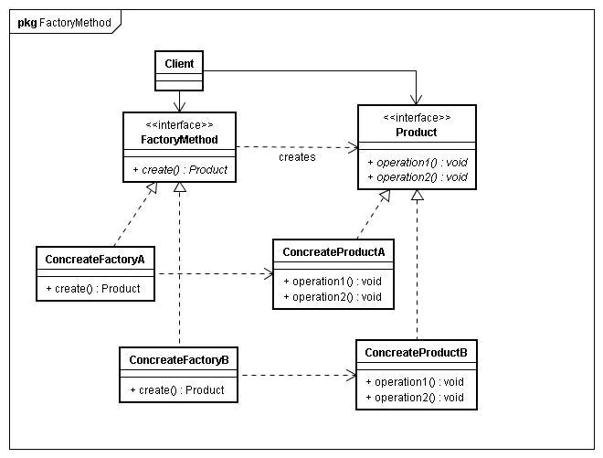
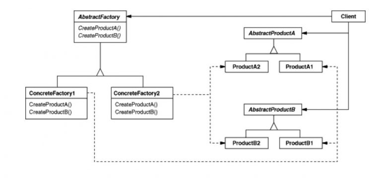
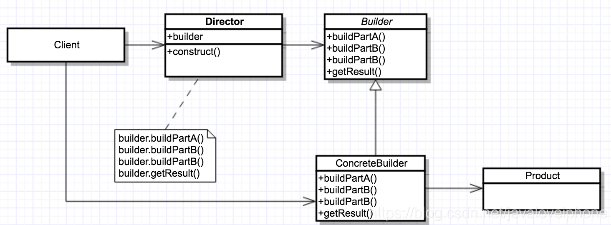
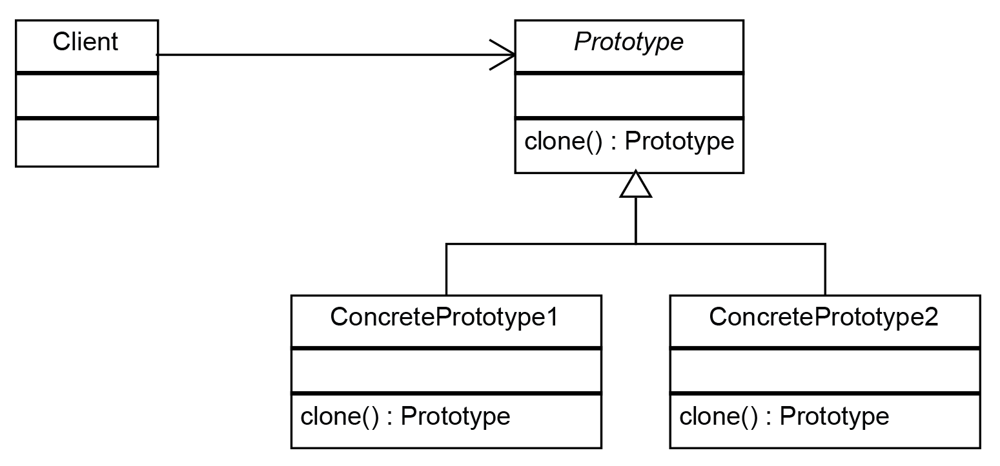
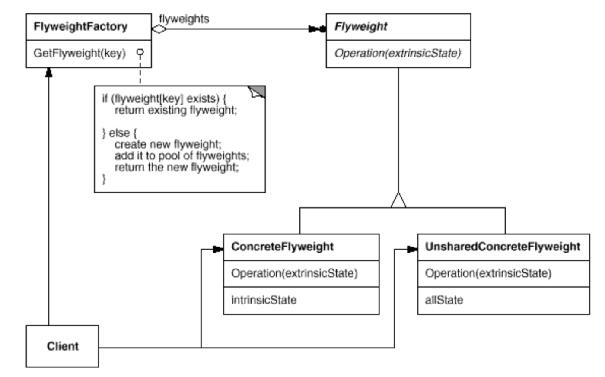
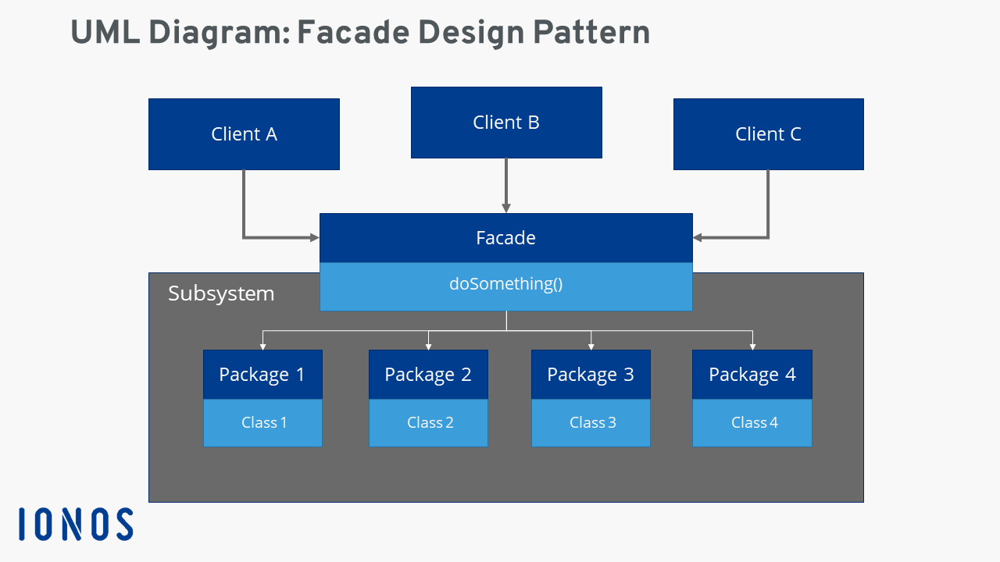
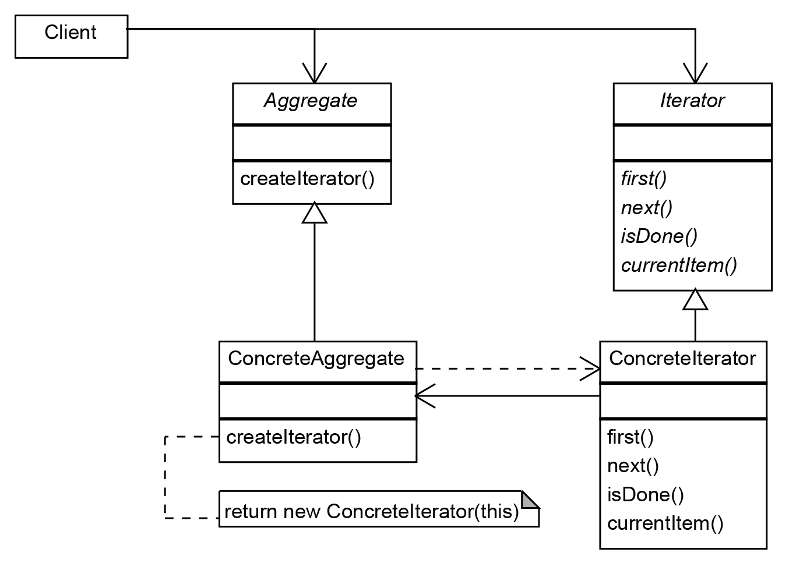
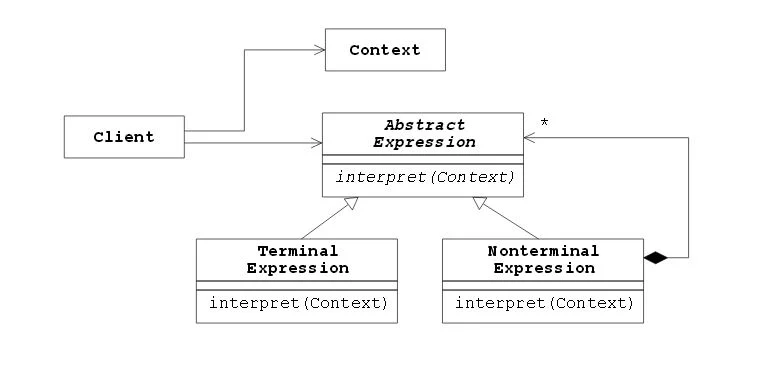
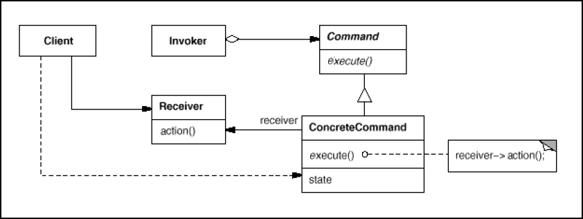
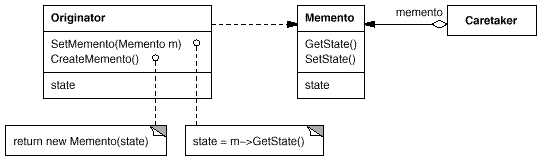

# Design Pattern

- [Design Pattern](#design-pattern)
  - [学习网站](#学习网站)
  - [设计原则](#设计原则)
  - [创建型](#创建型)
    - [工厂方法模式(Factory Method)](#工厂方法模式factory-method)
    - [抽象工厂模式(Abstract Factory)](#抽象工厂模式abstract-factory)
    - [建造者模式(Builder)](#建造者模式builder)
    - [原型模式(Prototype)](#原型模式prototype)
    - [单例模式(Singleton)](#单例模式singleton)
  - [结构型](#结构型)
    - [享元模式(Flyweight)](#享元模式flyweight)
    - [表观模式(Facade)](#表观模式facade)
    - [组合模式(Composite)](#组合模式composite)
    - [桥接模式(Bridge)](#桥接模式bridge)
    - [代理模式(Proxy)](#代理模式proxy)
    - [适配器模式(Adapter)](#适配器模式adapter)
    - [装饰器模式(Decorator)](#装饰器模式decorator)
  - [行为型](#行为型)
    - [访问者模式(Visitor)](#访问者模式visitor)
    - [迭代器模式(Iterator)](#迭代器模式iterator)
    - [解释器模式(Interpreter)](#解释器模式interpreter)
    - [责任链模式(Chain of Responsibility)](#责任链模式chain-of-responsibility)
    - [命令模式(Command)](#命令模式command)
    - [备忘录模式(Memento)](#备忘录模式memento)
    - [中介者模式(Mediator)](#中介者模式mediator)
    - [观察者模式(Observer)](#观察者模式observer)
    - [状态模式(State)](#状态模式state)
    - [策略模式(Strategy)](#策略模式strategy)
    - [模板方法模式(Template Method)](#模板方法模式template-method)

## 学习网站

<https://design-patterns.readthedocs.io/zh_CN/latest/index.html>  
<https://www.tutorialspoint.com/design_pattern/design_pattern_overview.htm>  
<https://springframework.guru/gang-of-four-design-patterns/>

## 设计原则

- 依赖倒置原则：面向接口编程从而解耦调用方与实现方
- 接口分离原则：拆分接口使其粒度足够细可提高整体灵活性
- 里氏替换原则：通过**继承抽象**来实现接口功能，适用于 **is-a** 关系（实现、泛化）
- 单一职责原则：通过**组合对象**来实现接口功能，适用于 **has-a** 关系（组合、聚合）
- 迪米特法则：通过**调用对象**来实现接口功能，适用于 **use-a** 关系（关联、依赖）
- 开放关闭原则：最终目的为实现一个高可复用的系统，可随意替换任何模块（隔离性），轻松添加额外模块（扩展性）

## 创建型

创建型设计模式提供了一种在隐藏创建逻辑的同时创建对象的方法，而不是直接使用 new 操作符实例化对象。这使程序在决定需要为给定的用例创建哪些对象时更加灵活。

### 工厂方法模式(Factory Method)

当一个抽象类体系中存在很多复杂的具体类时，利用工厂类，将创建对象时所需要的创建逻辑与具体类型集中隐藏起来管理，从而减少用户可能的硬编码。

### 抽象工厂模式(Abstract Factory)

利用抽象工厂（即工厂的工厂），它将多个工厂类组合起来，从而统一地创建一套内部相互关联的对象族。

### 建造者模式(Builder)

将一个复杂类实例对象的创建过程分成两部分，Builder 负责可变或可选的部分（如原始数据），Director 负责不变的部分（如构建算法或数据校验）。

### 原型模式(Prototype)

当构造函数开销很大时（如需要网络 IO 或磁盘 IO），不必对用户的每次请求都完全创建一个新对象，转而克隆原型对象获取其副本。

实现细节：

- 注意浅拷贝与深拷贝
- 考虑写时复制技术(Copy On Write)

### 单例模式(Singleton)

仅允许类存在一个实例，并提供全局方法访问之，一般用于“管理类”和“工厂类”等

实现细节：

- 注意线程安全性，包括创建时与更改时
- 注意需求“延迟初始化”或“提前初始化”

## 结构型

结构型设计模式涉及类和对象组合。继承的概念用于组合接口和组合对象以获得新的功能。

### 享元模式(Flyweight)

使用享元工厂来创建对象，将可共享复用的内部数据与不可共享的外部状态分开创建，可提高整体性能。

### 表观模式(Facade)

当与多个子系统的交互比较复杂时，使用表观模式封装子系统从而避免用户与子系统耦合

注意：与中介者模式区别在于，表观为对外封装解耦，中介者为对内封装解耦

### 组合模式(Composite)

使用组合模式来创建层状树结构，并提供统一的方法来访问非叶节点和叶节点。

### 桥接模式(Bridge)

使用桥接模式来让类可以在两个维度上任意变换扩展和组合

### 代理模式(Proxy)

使用代理对象来代替实际对象，从而控制实际对象的创建与访问。常见代理：

- 远程代理：延迟加载
- 虚拟代理：延迟创建
- COW 代理：写时复制
- 缓存代理：缓存结果
- 保护代理：权限区分
- 智能引用代理：引用计数

### 适配器模式(Adapter)

使用适配器来使将一个接口转换到互不兼容的另一个接口上工作。
优先选择组合，以下情况才考虑多重继承：

- 需要覆盖 virtual 函数实现
- 需要访问 protected 成员
- 需要空基类优化(EBO)

### 装饰器模式(Decorator)

使用装饰器装饰（组合）基础对象来动态地为其附加额外的职责。各个职责相互独立从而可相互组合，若使用继承来扩展的话会产生很多类，代码过于冗余。

## 行为型

行为型设计模式特别关注对象之间的通信。

### 访问者模式(Visitor)

访问者允许你定义一个新的操作，而不需要改变它所操作的元素的类。双分派技术缺点是当添加元素类时需要修改所有访问者。

### 迭代器模式(Iterator)

按顺序访问对象的元素，而不暴露其底层表示。

### 解释器模式(Interpreter)

利用组合模式实现语法解析器，若语言支持还可利用重载操作符。满足一下条件才适用：

- 业务规则频繁变化
- 类似的结构不断重复出现
- 并且容易抽象为语法规则的问题

### 责任链模式(Chain of Responsibility)

赋予多个对象处理请求的机会，最终只有一个负责处理。

### 命令模式(Command)

使用命令对象来传递请求，将请求的发送方与接收方解耦。类似制定通讯协议。

### 备忘录模式(Memento)

在外部存储内部状态以届时恢复

### 中介者模式(Mediator)

利用中介对象来隔离一系列对象的复杂交互，使同事类对象之间无需显示相互引用

### 观察者模式(Observer)

是一种发布/订阅模式，允许多个观察者对象查看事件。

### 状态模式(State)

利用更改内部抽象对象来实现状态切换。

### 策略模式(Strategy)

允许在运行时动态地选择一个算法族。

### 模板方法模式(Template Method)

将算法的框架定义为一个抽象类，允许其子类提供具体的行为覆盖之。

