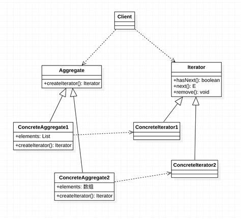

# 目录
<!-- vim-markdown-toc GFM -->

- [设计模式SOLID原则](#设计模式solid原则)
- [创建型](#创建型)
  - [简单工厂模式(Simple Factory)](#简单工厂模式simple-factory)
  - [工厂方法模式(Factory Method)](#工厂方法模式factory-method)
  - [抽象工厂模式(Abstract Factory)](#抽象工厂模式abstract-factory)
  - [原型模式(Prototype)](#原型模式prototype)
  - [建造者模式(Builder)](#建造者模式builder)
  - [单例模式(Singleton)](#单例模式singleton)
  - [享元模式(Flyweight)](#享元模式flyweight)
- [结构型](#结构型)
  - [组合模式(Composite)](#组合模式composite)
  - [表观模式(Facade)](#表观模式facade)
  - [代理模式(Proxy)](#代理模式proxy)
  - [桥接模式(Bridge)](#桥接模式bridge)
  - [适配器模式(Adapter)](#适配器模式adapter)
  - [装饰器模式(Decorator)](#装饰器模式decorator)
- [行为型](#行为型)
  - [解释器模式(Interpreter)](#解释器模式interpreter)
  - [迭代器模式(Iterator)](#迭代器模式iterator)
  - [备忘录模式(Memento)](#备忘录模式memento)
  - [命令模式(Command)](#命令模式command)
  - [责任链模式(Chain of Responsibility)](#责任链模式chain-of-responsibility)
  - [观察者模式(Observer)](#观察者模式observer)
  - [中介者模式(Mediator)](#中介者模式mediator)
  - [状态模式(State)](#状态模式state)
  - [策略模式(Strategy)](#策略模式strategy)
  - [模板方法模式(Template Method)](#模板方法模式template-method)
  - [访问者模式(Visitor)](#访问者模式visitor)

<!-- vim-markdown-toc -->

# 设计模式SOLID原则
* **单一职责原则(SRP)**：一个类应该仅有一个引起它变化的原因
* **开放关闭原则(OCP)**：类模块应该是可扩展的，但是不可修改
* **里氏替换原则(LSP)**：子类应该具有其父类的所有功能(is-a)
* **接口分离原则(ISP)**：类的接口粒度要足够细，避免客户依赖他们不用的方法
* **依赖倒置原则(DIP)**：高层模块与底层模块都应面向稳定的接口编程

**可大致总结为5种目的：**
> 以下设计模式会标注该模式所侧重增强的目的
* 隔离性：当修改已有代码时，尽量减少连带修改其他代码。特别地，尽量减少将类型硬编码进代码中
* 扩展性：当扩展新业务功能或产品系列时，无需修改原有代码
* 复用性：将已有的代码适配到当前场合中
* 封装性：提高接口易用性，加强实现透明性
* 功能性：设计一套适合于某些场合下运作的类或对象结构

**利用测试驱动开发(TDD)与依赖注入(DI)不仅有利于程序正确性，还有利于思考上述五大特性，拆分模块**

```cpp
/*
 * 构造类实例对象时
*/
// 错误做法
doSomething(ProductA{});
// 正常情况每次创建对象都会硬编码其类型ProductA
// 但未来可能由变化为其他类型如ProductB，二者可能并不兼容，所以应该面向接口编程

// 正确做法
Factory& factory{FactoryA{}};
doSomething(factory.product());
// 工厂对象只需一个（单例）即可，即只需硬编码具体工厂类型一次，然后只由它产出满足Product接口的对象

/*
 * 引用类的成员时
*/
using WondoerType = ConcreteType::type;
auto& StaticRef   = ConcreteType::StaticMem_;
// 以上两行在类型不兼容时就无效了，若二者兼容则未来变更时只需修改这一处
```


# 创建型
## 简单工厂模式(Simple Factory)

（隔离性）
* 将对象的创建与使用分离，面向接口编程，避免将具体类型硬编码到客户代码中，从而在未来扩展更换时丧失兼容性
* 用户层扩展更换时只需修改静态工厂函数的参数（可通过配置文件动态设置）
* 缺点：扩展产品需要修改静态工厂函数的源码


## 工厂方法模式(Factory Method)

（隔离性）
* 将对象的创建与使用分离，面向接口编程，避免将具体类型硬编码到客户代码中，从而在未来扩展更换时丧失兼容性
* 用户层扩展更换时只需要修改一处创建代码
* 缺点：会产生较多的类


## 抽象工厂模式(Abstract Factory)

（隔离性）
* 将对象的创建与使用分离，面向接口编程，避免将具体类型硬编码到客户代码中，从而在未来扩展更换时丧失兼容性
* 用户层扩展更换时只需要修改一处创建代码
* 统一创建同一产品族的多个对象
    * 工厂方法模式实现：可以隐藏具体产品类
    * 原型模式实现：动态配置工厂且减少类的创建


## 原型模式(Prototype)

（隔离性）
* 将对象的创建与使用分离，面向接口编程，从而在未来扩展更换时丧失兼容性
* 用户层扩展更换时只需要修改一处创建代码
* 缺点：具体类型暴露给用户从而无法保证客户代码的正确的使用原型


## 建造者模式(Builder)

（复用性）
* 对象的创建非常复杂，需要复杂的算法来组装各个部件，将组装算法提取出来，让各部件独立变化
* 用户层扩展更换时只需要修改一处创建代码


## 单例模式(Singleton)

（功能性）
* 限制一个类只需有一个对象实例，从而减少开销


## 享元模式(Flyweight)

（功能性）
* 将对象化分为内部状态与外部状态，内部状态由享元工厂产出，外部状态由客户代码提供


# 结构型
## 组合模式(Composite)

（功能性）
* 将对象组合成树形结构以表示“部分-整体”的层次结构，使得客户不用区分单个对象与组合对象


## 表观模式(Facade)

（封装性）
* 添加一层新的接口，将多个复杂的子系统封装起来


## 代理模式(Proxy)

（封装性）
* 通过代理对象去掉客户不能看到的内容或者添加客户需要的额外服务
* 主体类完成关键功能
* 常见的代理模式类型：
    * 远程代理：延迟加载
    * 虚拟代理：延迟创建
    * COW 代理：写时复制
    * 缓存代理：缓存操作结果用于共享
    * 保护代理：权限区分
    * 同步代理：并发同步
    * 智能引用代理：引用计数


## 桥接模式(Bridge)

（扩展性）
* 在初期，设计两个接口，用于将抽象部分（业务功能）与实现部分（平台实现）分离，使其在两个维度上独立变化


## 适配器模式(Adapter)


（复用性）
* 在后期，已存在两个接口，将它们
* 优先选择类的组合，以下考虑类的继承：
    * 需要覆盖virtual函数实现
    * 需要访问protected成员
    * 需要空基类优化(EBO)


## 装饰器模式(Decorator)

（扩展性）
* 一种代替继承，可为“对象”动态扩展添加的功能的技术，或者动态进行功能的组合


# 行为型
## 解释器模式(Interpreter)

（功能性）
* 只有满足“业务规则频繁变化，且类似的结构不断重复出现， 并且容易抽象为语法规则的问题”才适合使用Interpreter模式
* 通过利用组合模式与重载操作符，就相当与借用编译器的语法解析器


## 迭代器模式(Iterator)

（功能性）
* C++自带，不多解释


## 备忘录模式(Memento)

（功能性）
* 在外部存储内部状态以届时恢复


## 命令模式(Command)

（隔离性）
* 将请求的调用与实现分离，从而可以实现：
    * 请求排队
    * 请求日志
    * 撤销与恢复(结合Memento)
    * 宏命令(结合Composite)


## 责任链模式(Chain of Responsibility)

（隔离性）
* 运行时赋予多个对象处理请求的机会（但最终只有一个负责处理），从而使请求的发送者与接收者解耦
* 可设计成混合类


## 观察者模式(Observer)

（隔离性）
* 定义对象间的多对一的依赖关系


## 中介者模式(Mediator)

（隔离性）
* 利用中介对象来隔离一系列对象的复杂交互，使各对象无需显示相互引用
    > C++中中介者持有shared_ptr，同事类持有weak_ptr


## 状态模式(State)

（扩展性）
* 内部状态改变时改变其行为


## 策略模式(Strategy)

（扩展性）
* 将算法独立出来可替换、复用


## 模板方法模式(Template Method)

（扩展性）
* 基类定义算法的骨架（各个步骤方法的默认实现），子类选择性覆盖之


## 访问者模式(Visitor)

（扩展性）
* 适用于对象结构包含很多对象且有不同的接口，或者对象中包含很多不相关的操作
* 不修改类体系而进行接口（功能）扩展
* 利用双分派技术使具体操作内容取决于visitor和element的类型
* 缺点：添加元素时需要修改所有visitor对象


