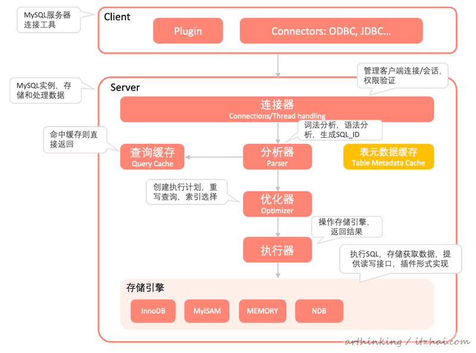
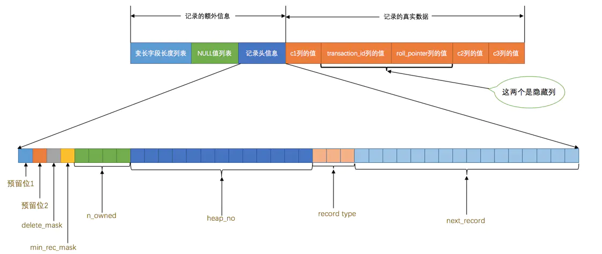
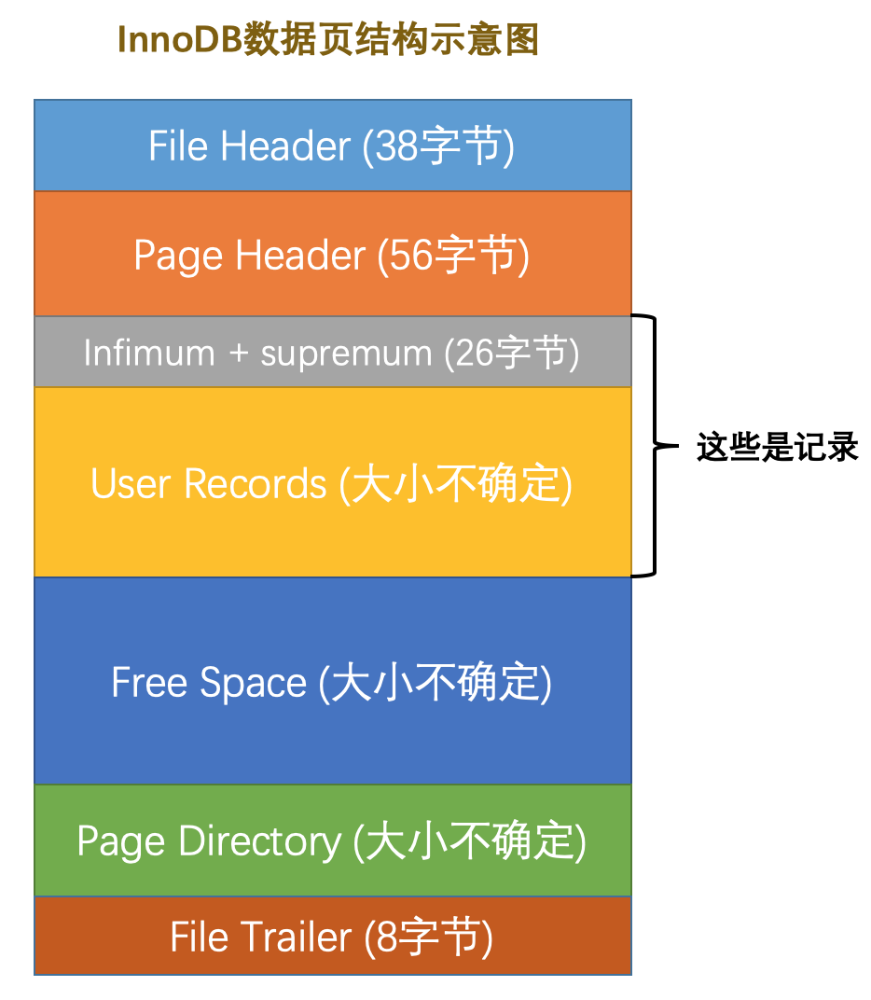
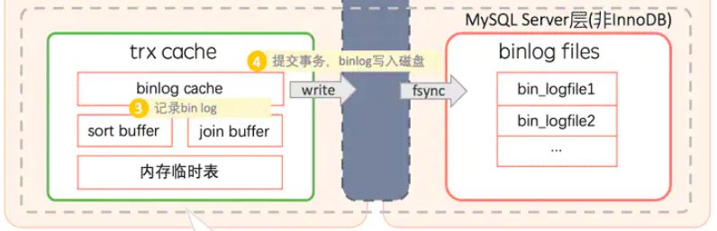

# 目录
<!-- vim-markdown-toc GFM -->

- [系统架构](#系统架构)
- [存储引擎架构](#存储引擎架构)
  - [内存结构](#内存结构)
    - [缓冲池](#缓冲池)
    - [更改缓冲区](#更改缓冲区)
    - [自适应哈希索引](#自适应哈希索引)
    - [日志缓冲区](#日志缓冲区)
  - [磁盘结构](#磁盘结构)
    - [表空间结构](#表空间结构)
      - [行记录结构](#行记录结构)
      - [数据页结构](#数据页结构)
      - [区、段、组](#区段组)
    - [双写缓冲区](#双写缓冲区)
    - [Redo日志](#redo日志)
- [索引](#索引)
  - [B+Tree索引](#btree索引)
- [事务](#事务)

<!-- vim-markdown-toc -->

# 系统架构

* 连接与线程管理
* 语法解析与查询优化
* 存储引擎

# 存储引擎架构

## 内存结构
### 缓冲池
缓冲池是主内存中的一个区域，在InnoDB访问表和索引数据时会在其中进行 高速缓存。
缓冲池允许直接从内存访问经常使用的数据，从而加快了处理速度。
为了提高大容量读取操作的效率，缓冲池被划分为多个页面，这些页面可以潜在地容纳多行。
为了提高缓存管理的效率，缓冲池被实现为页面的链接列表。
使用最近最少使用（LRU）算法的变体，将很少使用的数据从缓存中老化掉。

普通LRU算法的缺点：
> 以下读取的数据的访问频率很可能很低，如果用普通LRU算法则很容易将一些真正的热点数据给驱逐掉
* 线性预读：如果顺序访问了某个区的`innodb_read_ahead_threshold`个页面，则据异步读取下一个区中全部页面到缓冲池
* 随机预读：如果已经缓存了某个区的13个连续页面，且页面处于LRU Young子列表的前1/4，则读取本区所有其他页面到缓冲池
* 全表扫描

改良版的LRU算法优点如下：
* 会将从磁盘读取的新页面插入到Old子列表头部，保护热点数据不容易被驱逐；
* 在第一次读取页面时会记录读取时间，只有在此刻之后`innodb_old_blocks_time`的读取才会将其加入到young子列表头部
* 访问yuong子列表中的热点数据时，为减少链表调整频率，仅当访问young后1/4的数据才会将其调整到young子列表头部
* 冲刷脏页时的两种途径：后台线程定时冲刷flush链表；冲刷Old子列表中的冷数据

### 更改缓冲区
当对表执行INSERT、UPDATE和DELETE操作时，索引列的值(尤其是辅助键的值)通常是无序的，需要大量的 I/O 才能使辅助索引保持最新状态。
当相关的页面不在缓冲池中时，更改缓冲区缓存对辅助索引条目的更改，从而通过不立即从磁盘读取页面来避免昂贵的 I/O 操作。
当页面加载到缓冲池中时，缓冲的更改将合并，更新的页面随后将刷新到磁盘。
InnoDB主线程在服务器接近空闲时和slow shutdown期间合并缓冲的更改。
由于更改缓冲区功能可以减少磁盘读写操作，因此它对于受 I/O 约束的工作负载(例如，具有大量 DML 操作的应用程序，例如批量插入)最有价值。
但是，更改缓冲区占用了缓冲池的一部分，从而减少了可用于缓存数据页的内存。
如果工作集几乎适合缓冲池，或者表具有相对较少的二级索引，则禁用更改缓冲可能很有用。
如果工作数据集完全适合缓冲池，则更改缓冲不会带来额外的开销，因为它仅适用于不在缓冲池中的页面。

### 自适应哈希索引
当注意到某些索引值被非常频繁的使用时，会在内存中基于B+Tree索引上再创建一个哈希索引；
这样就让B+Tree索引具有一些哈希索引的优点，比如快速的哈希查找。

### 日志缓冲区
将日志冲刷到磁盘RedoLog中去；
缓冲区大小由`innodb_log_buffer_size`控制，默认16M；
冲刷方式由`innodb_flush_log_at_trx_commit`控制；
冲刷频率由`innodb_flush_log_at_timeout`控制；

## 磁盘结构
### 表空间结构
#### 行记录结构

**行溢出处理**：  
行记录数据列最长为65535字节（不计算头记录，不计算隐藏列，不计算TEXT与BLOB族的类型）；
而数据页一般最大为16384字节(16KB)，且规定一页至少要放两行用户记录；
于是针对过长的VARCHAR、TEXT、BLOB类型数据进行行溢出处理。
* Compact处理方式：将部分数据存储于本页，其余部分存储于溢出页
* Dynamic处理方式：将全部数据存储于溢出页中

**InnoDB四种行格式** 
* Compact
* Redundant
    > 相对Compact，使用字段长度偏移列表
* Dynamic
    > 相对Compact，行溢出时将全部数据存储于溢出页
* Compress
    > 相对Dynamic，使用压缩算法压缩页数据

#### 数据页结构

| 名称               | 中文名      | 简单描述                                                         |
|--------------------|-------------|------------------------------------------------------------------|
| File Header        | 文件头部    | 页的一些通用信息（包含页类型与前后指针）                         |
| Page Header        | 页面头部    | 数据页专有的一些信息（包含空闲空间地址与垃圾回收链表）           |
| Infimum + Supremum | 最小/大记录 | 两个虚拟的行记录                                                 |
| User Records       | 用户记录    | 实际存储的行记录内容                                             |
| Free Space         | 空闲空间    | 页中尚未使用的空间                                               |
| Page Directory     | 页面目录    | 页中的某些记录的相对位置（将已排序的记录链表分组以进行二分搜索） |
| File Trailer       | 文件尾部    | 校验页是否完整                                                   |

| 页类型                  | 十六进制 | 描述                  |
|-------------------------|----------|-----------------------|
| FIL_PAGE_TYPE_ALLOCATED | 0x0000   | 最新分配，还没使用    |
| FIL_PAGE_UNDO_LOG       | 0x0002   | Undo日志页            |
| FIL_PAGE_INODE          | 0x0003   | 段信息节点            |
| FIL_PAGE_IBUF_FREE_LIST | 0x0004   | Insert Buffer空闲列表 |
| FIL_PAGE_IBUF_BITMAP    | 0x0005   | Insert Buffer位图     |
| FIL_PAGE_TYPE_SYS       | 0x0006   | 系统页                |
| FIL_PAGE_TYPE_TRX_SYS   | 0x0007   | 事务系统数据          |
| FIL_PAGE_TYPE_FSP_HDR   | 0x0008   | 表空间头部信息        |
| FIL_PAGE_TYPE_XDES      | 0x0009   | 扩展描述页            |
| FIL_PAGE_TYPE_BLOB      | 0x000A   | 溢出页                |
| FIL_PAGE_INDEX          | 0x45BF   | 索引页                |

**页分裂处理**：  
当向页中插入数据而页空间不足时，将一半的数据（按键大小顺序）移到其他页中去，并将两页连接成双向链表

**垃圾回收**：  
页面头部中存储有 **垃圾记录链表**与 **空闲空间大小**；
当删除一条记录时，先将其头记录中的`delete_mask`置位（此中间态为MVCC保留），再将其加入垃圾记录链表头部；
当插入新记录时，先判断垃圾链表头节点空间是否足够，若足够则覆盖之并更新 **垃圾记录链表**与 **空闲空间大小**，
否则直接向页面申请空间而非遍历垃圾链表；
若页面空间申请失败，则观察 **空闲空间大小**是否满足插入记录，满足则重整页面以消除碎片，
否则进行页分裂；

#### 区、段、组
* 每连续的 64个页划分为1个区(1M)，当数据量大的时候，就会以区为单位给索引分配空间来较少随机I/O；
* 每连续的256个区划分为1个组(256M)，每组的第一个区中的头几页会存储区相关元数据，第一组第一区第一页还会存储表相关元数据；
* 功能相同的“区”组成一个逻辑段，如：非叶节点段、叶节点段、回滚段、等等；
段中各区不一定连续，将功能不同的数据区别存放于不同的区中可减少随机I/O，并利用段来组织它们；
如：叶节点段、非叶节点段、回滚段等等。

存在4种类型的区：
* 空闲区
* 有剩余空间的碎片区
* 无剩余空间的碎片区
* 附属某一段的区

其中碎片区中的页是可以用于存储不同的段中的数据的；
为节省空间，初始时会利用碎片区中的页来存储不同段中的数据；
当某一段占用了32个碎片区后，就会以整个区为单位来分配空间了；

* 所有区加起来组成一个表空间，在文件系统上表现为一个文件
    * 系统表空间
    * 独立表空间（file-per-table）
    * 通用表空间（共享表空间）
    * 临时表空间
    * 撤销表空间

### 双写缓冲区
在冲刷缓冲池中页面到磁盘适当位置前，需要先将数据拷贝一份到双写缓冲区中，
当系统崩溃时，可从双写缓冲区中找到良好的数据副本；
虽然数据写了两次，但是磁盘I/O开销并非翻倍，
数据会以较大的序列块通过一次系统调用冲刷到磁盘中；

如果没有双写缓冲区，则系统崩溃时可能仅冲刷非完整的页到磁盘，导致FileTrailer校验失败；
redo log恢复事务操作需要完整的页面，只冲刷了一半的页面是无法恢复的；

### Redo日志
为满足事务的持久性，在事务提交会先将redo log（很小的数据量）写入磁盘，而页数据由缓冲池适时冲刷。

# 索引
## B+Tree索引
**索引构建**
1. 每创建一个B+Tree索引，便为此创建一个根节点（页面）
2. 初始时根节点（页面）为空，随后向其中插入用户记录
3. 当根节点（页面）空间不足时，先将数据复制到另一页中然后进行页分裂
    > 页分裂最终使同一层级的节点连接成一个双向链表
4. 此时根节点（页面）存储目录项，每个目录项包含键与该键所在节点（页面）
5. 每当页分裂时便会再上一层节点中创建新的目录项，当根节点（页面）空间又不足时循环步骤3

**索引策略**
* B+Tree索引
    * 优点：适用于索引列的左前缀匹配查询，范围查询，排序与分组
* 聚簇索引
    * 优点：将相关数据存储在一起可能减少磁盘I/O次数
    * 缺点：插入速度严重依赖与插入行的主键大小（插入顺序）
* 二级索引
    * 优点：相比聚簇索引更小
    * 缺点：用户记录仅存储索引列与主键列（以降低维护成本），若要获取完整用户记录需要回表查询
* 伪哈希索引
    * 优点：将字符串转换为哈希整数值从而减小索引大小且大幅加速比较过程
    * 缺点：仅可用于全键匹配查询
* 前缀索引
    * 优点：根据平均索引选择性以及最坏情况来决定前缀长度从而减小索引大小且加速比较过程
    * 缺点：仅可用于`LIKE`范围查询
* 联合索引
    * 优点：根据索引选择性、单独查询频率、等值查询概率调整索引列顺序可用于优化WHERE子句中的条件相交`AND`
    * 缺点：只能从左往右进行匹配不能跳过某些中间列，可通过使用`IN()`来部分解决
* 冗余索引
    * 优点：解决多列索引按列顺序匹配的问题
    * 缺点：引入冗余索引而增大维护成本与空间成本
* 合并索引
    > 一般情况下多条件查询只会使用一条索引然后查表返回，再使用WHRER匹配；
    > 是否进行合并取决于优化器判断其是否相比单键索引更高效；
    > 甚至是否使用二级索引也取决与优化器判断是否二级索引+回表查询比全表查询更高效。
    * 交集合并：
        > 考虑创建多列索引
        * 二级索引列全值匹配
        * 主键范围匹配
    * 并集合并：
        * 二级索引列全值匹配
        * 主键范围匹配
        * 与交集合并结果的合并
    * 并集排序：
        * 二级索引范围匹配
* 覆盖索引
    * 覆盖索引是一种指导思想，旨在使二级索引尽量覆盖需要查询与匹配的列，从而尽量避免回表查询
    * 索引分为三星级别：
        * 索引仅仅是将相关查询记录放在一起:star:
        * 索引将查询记录按查询顺序排在一起:star: :star:
        * 索引中包含了所有查询所需的全部列:star: :star: :star:

**索引类型**
* `const`       ：唯一索引的对常量的等值比较
* `eq_ref`      ：唯一索引的对非常量的等值比较
* `ref`         ：非唯一索引的对常量的等值比较
* `ref_or_null` ：同上，且非NOT NULL索引对NULL值进行匹配
* `index_merge` ：索引合并查询
* `range`       ：索引的范围匹配
* `index`       ：扫描二级索引
* `ALL`         ：扫描聚簇索引

**单表查询**
* 多索引过滤
    * 判断是否使用合并索引
    * 判断是否使用索引以及使用哪一条索引
    * 根据选取的索引进行单索引过滤，获取临时表后再使用WHERE条件过滤
* 单索引过滤
    * 判断是否直接扫描叶节点
    * 若为等值/范围匹配，则可根据索引快速圈定查询目标记录的链表范围
    * 若为多范围匹配，则可条件扫描第一个范围圈定的目标记录的链表范围
    * 根据实际情况（如查询列、多条件等）判断是否回表查询

**多表查询**
* 对驱动表和被驱动表进行单表查询过滤除结果
* 将驱动表查询结果加入join buffer中，根据连接条件对被驱动表进行扫描匹配
* 第一轮查询结果作为驱动表，再次迭代进行扫描

# 事务
* 原子性：整个事务中的操作要么全部提交成功，要么全部失败回滚（Undo Log）
* 一致性：未成功提交的事务中所做的修改不会保存至数据库      （Undo Log）
* 隔离性：一个事务在最终提交前其修改对其他事务的可见性      （MVCC）
* 持久性：一旦事务提交则其所做的修改就会永久保存到数据库中  （Redo Log与Double Write Buffer）

| 隔离级别 | 并发问题   | 解决方案 |
|----------|------------|----------|
|          | 脏写       | 互斥锁   |
| 未提交读 | 脏读       | MVCC     |
| 已提交读 | 不可重复读 | MVCC     |
| 可重复读 | 幻读       | 间隙锁   |
| 串行化   |            |          |

**多版本并发控制(MVCC)**

* Undo日志
    * 为满足事务的原子性，每次修改都会记录undo log，其中包含了足够的信息来获取旧版本数据，Undo日志会连成一条版本链
    * 会有后台线程自动删除已无用的undo log；
        插入型UndoLog在事务提交后便可删除；
        更改型UndoLog在没有事务使用时才可以删除；
        在删除为`DELETE`编写的UndoLog时才会真正的删除行记录；

* ReadView
    * 目的：将事务的可见性依据时间节点顺序来建立
    * 内容：
        * `m_ids`：生成时刻系统活跃的事务列表
        * `min_trx_id`：生成时刻系统最小活跃事务ID
        * `max_trx_id`：生成时刻系统分配给下个事务的ID
        * `creator_trx_id`：生成该ReadView的事务ID，第一次执行更易操作时才分配事务ID，否则为0
    * 已提交读：每次读都重新生成ReadView，于是每次读都可读到新提交的其他事务的修改结果
    * 可重复读：只在第一次读时生成ReadView，于是每次读都只能读到生成ReadView之前就以提交的其他事务的修改结果
    * 对于二级索引，没有隐藏的事务ID列与回滚指针列：
        * 会在二级索引页面元数据中设置最大修改事务ID，
            若用ReadView确认其小于`min_trx_id`则表示该页中所有修改已提交，
            否则所有查询均需回表；

* 锁
    * 当一个事务修改一个页面时，会为该页面加互斥锁，修改完成后便会释放该锁，
    * 但是仍会对修改过的行加锁，其他事务只能读取历史适当的历史版本，试图修改该行的事务都会阻塞，直到事务提交

* INSERT
    * 判断是否存在间隙锁
    * 获取目标页互斥锁
    * 向所有索引中插入新行
    * 设置聚簇索引中记录的事务ID（当前事务ID）与回滚指针（undo log）
    * 更新二级索引页面的最大修改事务ID
    * 释放目标页互斥锁，并获取目标行的互斥锁
* DELETE
    * 获取目标页的互斥锁
    * 将所有索引中的目标行的delete_mask置位
    * 设置聚簇索引中记录的事务ID（当前事务ID）与回滚指针（undo log）
    * 更新二级索引页面的最大修改事务ID
    * 释放目标页的互斥锁，并获取目标行的互斥锁
* UPDATE
    * 获取目标页的互斥锁
    * 若不更改索引键：若修改后所有列长度不变则就地修改并生成undo log，否则完全删除原记录在执行一次INSERT
    * 若要更改索引键：执行一次DELETE再执行一次INSERT
    * 释放目标页的互斥锁，并获取目标行的互斥锁
* SELECT
    * 查询的目标行需要满足：行的事务ID要小于或等于当前事务TID，且未置位删除位标识
    * 若查询行的事务ID大于当前事务TID，则根据回滚指针指向的版本链回溯适当的历史版本
    * 若无适当历史版本则这条记录对当前事务不可见
    * 范围搜索时还会给范围加上间隙锁，避免出现幻行

