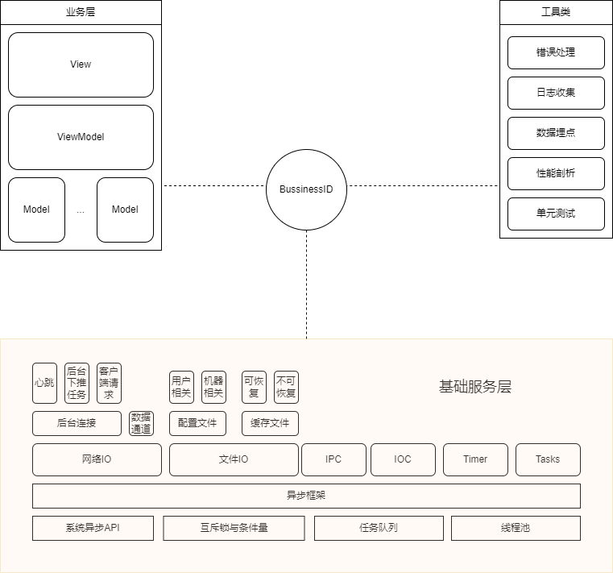

# 编程语言总结

- [编程语言总结](#编程语言总结)
  - [依赖](#依赖)
  - [变量](#变量)
  - [常量](#常量)
  - [表达式](#表达式)
  - [语句](#语句)
  - [函数](#函数)
  - [面向对象](#面向对象)
    - [封装](#封装)
    - [继承](#继承)
    - [多态](#多态)
  - [命名规范](#命名规范)
  - [基础库与框架](#基础库与框架)

## 依赖

- C++

  - 程序入口：main 函数
  - 依赖单元：一个头文件 + 一个实现文件（可选）
  - 依赖导出：头文件中所有宏与符号
  - 依赖导入：`#include <path/to/header.hpp>`，符号限定于命名空间
  - 依赖初始化：global-constructor
  - 依赖管理：手动（git-submodule & cmake）

- Go

  - 程序入口：main 包中 main 函数
  - 依赖单元：一个目录（不包括子目录）
  - 依赖导出：大写字母开头的符号
  - 依赖导入：`import "module.github.com/path/to/package"`，符号限定于包名
  - 依赖初始化：包中所有 init 函数
  - 依赖管理：自动（go-mod）

- Dart

  - 程序入口：main 函数
  - 依赖单元：一个源文件
  - 依赖导出：非`_`开头的符号
  - 依赖导入：`import 'package:lib/lib.dart'`
  - 依赖初始化：
  - 依赖管理：自动（flutter-pub）

- JavaScript

  - 程序入口：任意源文件
  - 依赖单元：一个源文件
  - 依赖导出：`export`声明
  - 依赖导入：`import { name } from 'root/path/to/module'`，符号限定于别名
  - 依赖初始化：脚本导入即执行
  - 依赖管理：自动（npm）

- Python
  - 程序入口：任意源文件（`__init__ == "__main__"`）
  - 依赖单元：一个源文件
  - 依赖导出：非`_`开头的符号
  - 依赖导入：`from package.subpackage import module`，符号限定于文件名
  - 依赖初始化：脚本导入即执行
  - 依赖管理：自动（pip）

## 变量

> - 结构型：变量本身代表一块包含数据结构的内存，拷贝时至少包括该内存
> - 引用型：变量仅仅指向一块包含数据结构的内存，拷贝时仅针对该指针值
> - 强类型：变量类型静态确定且不可随意变
> - 弱类型：变量类型动态确定且可随意变
> - 引用语义的目的：
>   - (Copy) 避免拷贝
>   - (Write) 修改对象
>   - (Polymorphism) 多态

- C++

  ```cpp
  // C++ 初始化方法：
  // 构造函数初始化的缺点：无法返回错误，无法安全调用虚函数（除非显式 final）
  // 工厂方法初始化的场景：解决构造函数初始化的问题
  // Init方法初始化的场景：仅在接口天然就适合两段式初始化时使用，因为在构造与初始化间存在不可用的中间态
  auto foo = Bar();                     // 默认
  auto foo = Bar(args);                 // 构造
  auto foo = initializer;               // 拷贝
  auto foo = static_cast<Bar>(other);   // 转换
  auto [a, b]  = aggregation;           // 解构
  ```

  - 变量类型：结构型强类型
  - 生命周期：退出块作用域时销毁
  - 作用域：退出块作用域后不可见

- Go

  ```go
  var foo Bar             // 默认
  foo  := Bar{fd: data}   // 构造
  foo  := initializer     // 拷贝
  foo  := Bar(other)      // 转换
  a, _ := value, list     // 解构
  ```

  - 变量类型：结构型强类型
  - 生命周期：直到引用计数为零才时销毁
  - 作用域：退出块作用域后不可见

- Dart

  ```dart
  var foo = Bar();        // 默认
  var foo = Bar(args);    // 构造
  var foo = initializer;  // 拷贝
  var foo = other as Bar; // 转换
  ```

  - 变量类型：引用型强类型
  - 生命周期：直到引用计数为零时才销毁
  - 作用域：退出块作用域后不可见

- JavaScript

  ```js
  let foo; // 待初始化
  let foo = new Bar(args); // 构造
  let foo = initializer; // 拷贝
  let foo = new Bar(other); // 转换
  let [a, ["1"]: b, ...rest] = array; // 解构
  ```

  - 变量类型：引用型弱类型
  - 生命周期：直到引用计数为零时才销毁
  - 作用域：退出块作用域后不可见

- Python

  ```python
  foo = Bar(args)     # 构造
  foo = initializer   # 拷贝
  foo = Bar(other)    # 转换
  a, b = iterable     # 解构
  ```

  - 变量类型：引用型弱类型
  - 生命周期：直到引用计数为零时才销毁
  - 作用域：直到退出函数才不可见

## 常量

- C++

  ```cpp
  #define CONST_VALUE 1       // 宏
  const int CONST_VALUE = 1;  // 常量
  enum Number { ONE, TWO };   // 枚举
  ```

- Go

  ```go
  const BigInt = 1 << 511     // 高精度无类型常量
  const (
    _, _ = iota, iota         // 枚举器，从0开始
    KB = 1 << (10 * iota)
    MB
    GB
  )
  ```

- Dart

  ```dart
  final map = {if (i is int) i: 'int'};         // final 不可改变变量本身，但可以改变其字段内容
  const set = {if (list is List<int>) ...list}; // const 两者都不可改变
  enum Color { red, green, blue }
  ```

- JavaScript

  ```js
  const CONST_VALUE = 1; // 仅限制变量禁止被重新赋值绑定或被重新声明
  ```

- Python

  ```python
  CONST_VALUE = 1 # 非强制
  ```

## 表达式

> 优先级：成员|函数|下标 > 单目 > 算术 > 关系 > 逻辑

- C++
  - 算数：`*`, `/`, `%`, `+`, `-`
  - 关系：`<`, `<=`, `>`, `>=`, `==`, `!=`
  - 逻辑：`!`, `&&`, `||`
  - 赋值：`=`
  - 其他：`? :`, `++`, `--`
- Go
  - 算数：`*`, `/`, `%`, `+`, `-`
  - 关系：`<`, `<=`, `>`, `>=`, `==`, `!=`
  - 逻辑：`!`, `&&`, `||`
  - 赋值：（语句）`=`, `:=`
  - 其他：（语句）`i++`, `i--`
- Dart
  - 算数：`*`, `/`, `~/`, `%`, `+`, `-`
  - 关系：`<`, `<=`, `>`, `>=`, `==`, `!=`
  - 逻辑：`!`, `&&`, `||`, `is`, `is!`
  - 赋值：`=`, `??=`
  - 其他：`? :`, `??`, `++`, `--`, `..`, `?..`, `expr!`
- JavaScript
  - 算数：`**`, `*`, `/`, `%`, `+`, `-`
  - 关系：`<`, `<=`, `>`, `>=`, `==`, `!=`, `===`, `!==`
  - 逻辑：`!`, `&&`, `||`
  - 赋值：`=`, `??=`
  - 其他：`? :`, `??`, `++`, `--`
- Python
  - 算数：`**`, `*`, `/`, `//`, `%`, `+`, `-`
  - 关系：`a < b <= c > d >= e`, `x == y != z`
  - 逻辑：`not`, `and`, `or`
  - 赋值：（语句）`a = b = c`
  - 其他：`x if cond else y`

## 语句

- C++

  - 分支

    ```cpp
    // if else
    if (condition) {
      statement;
    } else {
      statement;
    }

    // switch
    switch (int_or_enum) {
    case constant:
      statement;
      break;
    default:
      statement;
    }
    ```

  - 循环

    ```cpp
    // for
    for (declaration; condition; expression) {
      statement;
    }

    // range based for
    for (auto elem : iterabal) {
      statement;
    }
    ```

  - 异常

    ```cpp
    // try and function try
    // throw and rethrow
    // catch and catch all
    [void func()] try {
      throw std::exception();
    } catch (const std::exception& e) {
      statement;
    } catch (...) {
      throw;
    }
    ```

- Go

  - 分支

    ```go
    // if else
    if condition {
      statement
    } else {
      statement
    }

    // switch expr
    switch expr {
    case expr1, expr2:
      fallthrough
    default:
      statement
    }

    // switch condition
    switch {
    case condition:
      fallthrough
    default:
      statement
    }

    // switch runtime type
    switch rt := intf.(type) {
    case Type:
      fallthrough
    default:
      statement
    }
    ```

  - 循环

    ```go
    // for
    for declaration; condition; expression {
      statement
    }

    // for range
    for elem := range iterabal {
      statement
    }
    ```

  - 异常

    ```go
    panic("throw a panic!")

    defer call3rd()
    defer call2nd()
    defer call1st()

    defer func() {
      panic = recover()
      if panic != nil {
        statement
      }
    }()
    ```

- Dart

  - 分支

    ```dart
    // if else
    if (condition) {
      statement;
    } else {
      statement;
    }

    // switch
    switch (comparable) {
      case constant1:
        continue fallthrough;
      fallthrough:
      case constant2:
        statement;
        break;
      default:
        statement;
    }
    ```

  - 循环

    ```dart
    // for
    for (declaration; condition; expression) {
      statement;
    }

    // for in
    for (final elem in iterabal) {
      statement;
    }
    ```

  - 异常

    ```dart
    try {
      throw FormatException('exception');
    } on FormatException catch (e) {
      statement;
    } catch (e, s) {
      print('Exception details:\n $e');
      print('Stack trace:\n $s');
      rethrow;
    } finally {
      cleanup();
    }
    ```

- JavaScript

  - 分支

    ```js
    // if else
    if (condition) {
      statement;
    } else {
      statement;
    }

    // switch
    switch (expr) {
      case expr:
        statement;
        break;
      default:
        statement;
    }
    ```

  - 循环

    ```js
    // for
    for (declaration; condition; expression) {
      statement;
    }

    // for in
    for (const keyOrIndex in iterable) {
      statement;
    }

    // for of
    for (const element of iterable) {
      statement;
    }
    ```

  - 异常

    ```js
    try {
      throw new Error("error message");
    } catch (identifier) {
      statement;
    } finally {
      statement;
    }
    ```

- Python

  - 分支

  ```python
  # if elif else
  if condition:
    pass
  elif condition:
    pass
  else:
    pass
  ```

  - 循环

  ```python
  while condition:
    pass
  else:
    pass

  for val1, val2 in iterable:
    pass
  else:
    pass
  ```

  - 异常

  ```python
  try:
      raise Exception('error0')
  except Exception:
      raise Exception('error1')
  except Exception as excep:
      raise Exception('error2') from Exception('__cause__')
  except:
      raise
  else:
      pass
  finally:
      pass
  ```

## 函数

> - 注意函数对**纯函数性**与**线程安全性**的保证

- C++

  ```cpp
  auto foo() -> void {}

  auto bar(const string& src, char& dest, int idx) -> char {
      return (dest = src[idx]);
  }

  auto y = [&r, v, m = std::move(l)] (auto& elem) mutable {}
  ```

  - 签名修饰：`const &|&&`, `inline`, `constexpr`, `noexcept`
  - 默认实参
  - 函数重载
  - 泛型

- Go

  ```go
  func foo() {
  }

  func bar(s string, i int) (x, y int) {
      x, y = s[i], s[i + 1]
      return
  }
  ```

  - 类型折叠
  - 切片变参包：`args...`
  - 返回值列表

- Dart

  ```dart
  void voidFn() {}

  String foo(String r1, String? r2 [String o1 = "optional", String? o2]) {
    // ...
  }

  String bar({required String r1, required String? r2, String o1 = "optional", String? o2}) {
    // ...
  }

  (arg) {statements;}

  (arg) => expression;
  ```

  - 位置参数与命名参数
  - 显式指定`optional`或`required`

- JavaScript

  ```js
  function foo(s, i) {
    return s + i;
  }

  // 函数体仅单独return语句则可省略花括号与return
  let bar = (x, y) => {
    return x + y;
  };
  ```

  - 默认实参
  - 数组变参包：`...args`

- Python

  ```python
  def foo(s: str, /, l: list[int], *, d: dict[str,]) -> None:
      return True

  bar = lambda x, y: x + y
  ```

  - 类型注解：`None`、`Any`、`Optional[T]`、`tuple[int, str,...]`、`list[int]`、`set[str]`、`dict[str, int]`
  - 位置参数与键值参数
  - 位置变参包`*posargs`与键值变参包`**kwargs`
  - 默认实参：仅定义时构造一次，注意引用类型

## 面向对象

### 封装

- C++

  - 访问控制：public, protected, private
  - 结构定义：实例唯一，static 类唯一
  - 方法定义：实例相关，static 类相关
  - 构造控制：构造函数
  - 析构控制：析构函数
  - 拷贝控制：拷贝与移动函数
  - 比较操作：三相比较运算符
  - 类型转换：内置类型(bool&int&float, c-str&string)，单参构造函数与 operator 转换函数

  ```cpp
  class MyClass {
     public:
      MyClass() = default;
      MyClass(MyClass&&) = default;
      MyClass(const MyClass&) = default;
      auto operator=(MyClass&&) -> MyClass& = default;
      auto operator=(const MyClass&) -> MyClass& = default;
      ~MyClass() = default;
      auto operator<=>(const MyClass&) -> std::strong_ordering = default;
      explicit operator bool() const { return _name.size(); }

      auto name() -> string { return _name; }
      auto set_name(string name) -> void { _name = std::move(name); }
      void Method();

     private:
      string _name;
  };
  ```

- Go

  - 访问控制：首字母大写导出包外
  - 结构定义：实例唯一
  - 方法定义：实例相关
  - 构造控制：无
  - 析构控制：无
  - 拷贝控制：拷贝字段
  - 比较操作：比较字段
  - 类型转换：int&float, bytes&string, type, const, nil, chan, interface

  ```go
  type MyClass struct {
      name string
  }

  func (this *MyClass) Method() {
      doSomething(this.name)
  }
  ```

- Dart

  - 访问控制：非`_`开头导出类外
  - 结构定义：实例唯一，static 类唯一
  - 方法定义：实例相关，static 类相关
  - 构造控制：构造函数与命名构造函数
  - 析构控制：无
  - 拷贝控制：无
  - 比较操作：重载操作符
  - 类型转换：

  ```dart
  class MyClass {
    String _name;

    // constructor likes function but no return type
    MyClass(String name) {
      this._name = name;
    }

    // named constructor beacase no funtion overload
    MyClass.named(String name) {
      this._name = name;
    }

    // using this in constructor, a syntax sugar
    MyClass.useThis(this._name);

    // initializer lists: final fields must have values before the constructor body executes
    MyClass.initList(String name) : _name = name;

    // redirect to another constructor
    MyClass.redirecting1(String name) : this(name);
    MyClass.redirecting2(String name) : this.named(name);

    @override
    bool operator ==(Object other) => other is MyClass && other._name = name;

    String get name => name;
    set name(String value) => name = value;
  }
  ```

- JavaScript

  - 访问控制：非`#`开头导出类外
  - 结构定义：默认实例唯一，static 类唯一
  - 方法定义：默认实例相关，static 类相关
  - 构造控制：`constructor()`
  - 析构控制：无
  - 拷贝控制：无
  - 比较操作：无
  - 类型转换：->boolean, ->number, ->string

  ```js
  class MyClass {
    #name;

    constructor(name) {
      this.#name = name;
    }

    get name() {
      return this.#name;
    }

    set name(x) {
      this.#name = x;
    }

    method() {
      doSomething(this.#name);
    }
  }
  ```

- Python

  - 访问控制：非`_`开头导出文件外（非强制）
  - 结构定义：默认类唯一，实例可动态增删属性
  - 方法定义：默认实例相关，实例可动态增删方法
  - 构造控制：`__init__()`
  - 析构控制：`__del__()`
  - 拷贝控制：无
  - 比较操作：无
  - 类型转换：`__nonzero__()`与`__str__()`

  ```python
  class MyClass:
      def __init__(self, name: str):
          self._name = name

      def __del__(self):
          self._name.__del__()

      @property
      def name(self):
          return self._name

      @name.setter
      def name(self, name):
          self._name = name

      def method(self):
          do_something(self._name)
  ```

### 继承

- C++

  ```cpp
  class MyClass: public ExtendsBase, public WithMixin {
     public:
      MyClass() : ExtendsBase(), WithMixin() {}

      virtual ~MyClass() override = default;

      virtual void BaseMethod() override {
        ExtendsBase::BaseMethod();
        // ...
      }
  };
  ```

- Go

  ```go
  type MyClass struct {
      ExtendsBase   // ExtendsBase 的方法集可由 MyClass 与 *MyClass 继承
      *WithMixin    // *WithMixin  的方法集仅可由 *MyClass 继承而 MyClass 不行
  }
  ```

- Dart

  ```dart
  class Base {
    int key;
    void baseMethod() {}
  }

  class MyClass2 extends Base {
    MyClass2(super.key);

    @override
    void baseMethod() {
      super.baseMethod();
      // ...
    }
  }

  mixin Mixin {
    void functionalMethod() {}
  }
  class MyClass3 with Mixin {}
  ```

- JavaScript

  ```js
  class MyClass extends Base {
    // ...
  }
  ```

- Python

  ```python
  class MyClass(Base):
      def __init__(self):
          super().__init__()  # super(Base, self).__init__()

      def __del__(self):
          super().__del__()
  ```

### 多态

- C++

  ```cpp
  class Implemented {
   public:
    virtual ~Implemented() = defatul;
    virtual abstractMethod() = 0;
  }

  class MyClass: public Implemented {
   public:
    virtual ~MyClass() override = default;
    virtual abstractMethod() override {}
  };

  Implemented* pintf = new MyClass();
  Implemented& rintf = *pintf;
  ```

- Go

  ```go
  type Implemented interface {
      abstractMethod()
  }

  type MyClass struct {
  }

  func (this *MyClass) abstractMethod() {
  }

  var intf Implemented = MyClass{}
  ```

- Dart

  ```dart
  abstract class Interface {
    void abstractMethod();
  }

  class MyClass1 implements Interface {
    @override
    void abstractMethod() {}
  }
  ```

- JavaScript
- Python

## 命名规范

- 通用命名规范
  1. 作用域越宽泛，命名要越详细，且避免使用缩写词；反之作用域很狭窄的变量可简写，比如循环变量 `i`
  2. 让代码读起来像完整句子
- 变量、属性命名：
  1. 将最具描述性的名词放在标识符最后
  2. 若为非布尔类型，尽量使用名词短语
  3. 若为布尔类型，尽量使用非祈使动词短语，如使用 be 动词或助动词，且尽量使用“正向”的语义，如`isConnected`而非`isDisconnected`
- 函数、方法命名：
  1. 若有副作用，尽量使用祈使动词短语
  2. 若无副作用，命名参考变量、属性命名

常用命名前后缀：

- 布尔：`is`，`not`，`any`，`all`，`none`，`has`，`can`，`should`，`must`
- 位置：`idx`，`pos`，`prev`，`next`，`lhs`，`rhs`，`head`，`tail`，`mid`，`begin`，`end`
- 计数：`count`，`size`，`length`，`width`，`height`，`depth`
- 时间：`new`，`old`，`orig`，`cur`，`before`，`after`
- 循环：`idx`，`pos`
- 序数：`number`，`1st`，`2nd`，`3rd`
- 介词：`in`，`on`，`at`，`of`，`2`，`4`
- 用途：`ret`，`val`，`need`，`temp`，`deal`，`src`，`dest`

## 基础库与框架

- 分数
- 大数
- 数学库
- 随机数

---

- 字符串
- 正则表达式
- 格式化
- 序列化
- 本地化
- 国际化
- 标准输入输出
- 文件输入输出
- 文件系统
- 命令行参数解析

---

- 日期时间

---

- 容器（数组，栈，队列，堆，链表，树，哈希表）
- 算法（搜索，集合，数值，变序，更易）

---

- 并发与同步
- 异步框架（文件 IO、网络 IO、IPC、IOC、Timer、Tasks）

---

- 错误处理
- 日志收集
- 数据埋点
- 性能剖析
- 单元测试

---

- 窗口：坐标系中位置与大小、Z 轴顺序、显示状态、最大最小化状态、激活状态、禁用状态

  - 主窗口
  - 对话弹窗
  - 提示弹窗
  - 菜单弹窗
  - 基础控件

- 内容

  - 文本
  - 图标
  - 图像
  - 视频
  - 音频
  - 2D 绘制
  - 3D 绘制

- 呈现

  - 布局：图层、堆积、伸缩、网格、表格、树图
  - 样式：大小、方向、颜色、形状
  - 动画

- 事件

  - 鼠标事件：悬停、点击、双击、拖拽、选择、右键、滚轮
  - 键盘事件：快捷键、焦点切换
  - 系统事件

- MVVM 模式

  - View：负责展示状态数据并响应 UI 事件
  - ViewModel：负责数据绑定并提供响应逻辑
  - Model：负责维护并提供业务数据与业务逻辑


