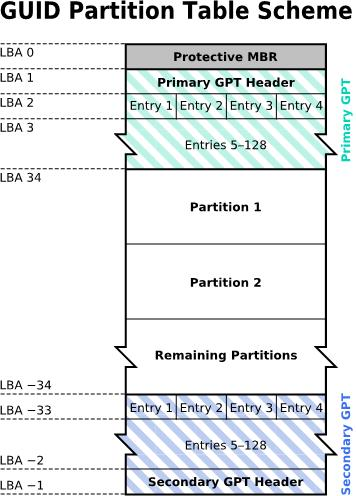
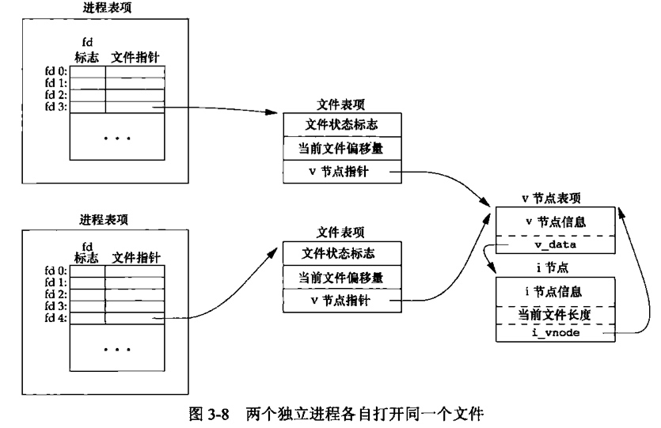

# 目录
<!-- vim-markdown-toc GFM -->

- [系统启动](#系统启动)
  - [MBR与GPT](#mbr与gpt)
    - [MBR](#mbr)
    - [GPT](#gpt)
  - [BIOS与UEFI](#bios与uefi)
    - [BIOS](#bios)
    - [UEFI](#uefi)
  - [grub](#grub)
    - [grub工作流程](#grub工作流程)
    - [grub配置](#grub配置)
    - [grub-shell](#grub-shell)
    - [grub选单](#grub选单)
  - [kernel](#kernel)
    - [kernel工作流程](#kernel工作流程)
    - [kernel引导参数](#kernel引导参数)
  - [systemd](#systemd)
    - [systemd启动流程](#systemd启动流程)
    - [systemctl命令](#systemctl命令)
    - [systemd配置](#systemd配置)
    - [unit配置](#unit配置)
      - [Unit小节](#unit小节)
      - [Install小节](#install小节)
      - [Service小节](#service小节)
      - [Timer小节](#timer小节)
  - [getty与login](#getty与login)
- [用户管理](#用户管理)
  - [用户资料文件](#用户资料文件)
  - [用户管理命令](#用户管理命令)
- [硬盘管理](#硬盘管理)
  - [分区工具](#分区工具)
  - [逻辑卷管理](#逻辑卷管理)
  - [硬盘文件系统](#硬盘文件系统)
- [系统配置](#系统配置)
  - [操作系统信息](#操作系统信息)
  - [日期时间与时区](#日期时间与时区)
  - [语系与字符集](#语系与字符集)
  - [字体服务](#字体服务)
- [日志管理](#日志管理)
- [进程管理](#进程管理)
  - [进程关系](#进程关系)
    - [会话](#会话)
    - [进程组](#进程组)
    - [进程](#进程)
  - [进程环境](#进程环境)
  - [异常控制流](#异常控制流)
    - [信号](#信号)
  - [资源限制](#资源限制)
  - [进程管理命令](#进程管理命令)
- [虚拟文件系统](#虚拟文件系统)
  - [文件描述符](#文件描述符)
  - [内核文件缓存/缓冲区](#内核文件缓存缓冲区)
  - [文件系统](#文件系统)
  - [归档包](#归档包)
  - [挂载命令](#挂载命令)
  - [文件与目录](#文件与目录)
  - [文件信息](#文件信息)
  - [自主访问控制](#自主访问控制)
    - [权限命令](#权限命令)
  - [强制访问控制](#强制访问控制)
  - [终端](#终端)
    - [终端原理](#终端原理)
    - [ANSI escape](#ansi-escape)
    - [作业控制](#作业控制)
    - [伪终端](#伪终端)
- [网络管理](#网络管理)
  - [网络配置](#网络配置)
  - [网络命令](#网络命令)

<!-- vim-markdown-toc -->

# 系统启动

## MBR与GPT
硬盘分区格式一般有两种，老式的MBR与新式的GPT。

| 二者区别         | MBR                              | GPT                          |
|------------------|----------------------------------|------------------------------|
| 单个分区容量大小 | 最大支持近2TB                    | 最大支持近18EB               |
| 主分区           | 最多只能有3个主分区与1个扩展分区 | 无主分区概念，或全部是主分区 |
| 引导加载器       | 在MBR头部以及主分区头部          | 在ESP中                      |
| 分区表健壮性     | 无校验、 无备份                  | 有校验、有备份               |

### MBR
> MBR小节参考自[鸟哥的Linux私房菜](http://linux.vbird.org/linux_basic/0130designlinux.php#partition_table)


**MBR区**  
&emsp;LBA0中的前446字节，用于存放boot-loader

**分区表项**  
&emsp;LBA0中的后64字节，最多存储4笔分区记录。其中最后一笔记录为扩展分区，其他为主分区。
扩展分区可以再细化分割出逻辑分区，而分割逻辑分区的分区表项存储再扩展分区头部。
扩展分区并非一个可使用的分区，它存在的目的即是容纳逻辑分区。

### GPT
> GPT小节参考自[金步国作品集](http://www.jinbuguo.com/storage/gpt.html)


> 注：LBA0表示0号扇区，即第一个512B的块

**保护MBR**  
&emsp;保护MBR包含一个DOS分区表，只包含一个类型值为0xEE的分区项，
在小于2TB的磁盘上，大小为整个磁盘；在更大的磁盘上，它的大小固定为2TB。
它的作用是阻止不能识别GPT分区的磁盘工具试图对其进行分区或格式化等操作，所以该扇区被称为“保护MBR”。
实际上，EFI根本不使用这个分区表。

**GPT头部**
| 相对字节偏移量 | 字节数 | 说明                             | 备注                                                |
|----------------|--------|----------------------------------|-----------------------------------------------------|
| 00～07         | 8      | GPT头签名                        | “45 46 49 20 50 41 52 54”(ASCII码为“EFI PART”)      |
| 08～0B         | 4      | GPT版本号                        | 目前是1.0版，其值是“00 00 01 00”                    |
| 0C～0F         | 4      | GPT头的大小                      | 通常为“5C 00 00 00”(0x5C)，也就是92字节             |
| 10～13         | 4      | GPT头CRC校验和                   | 计算时把这个字段本身看做零值                        |
| 14～17         | 4      | 保留                             | 必须为“00 00 00 00”                                 |
| 18～1F         | 8      | EFI信息区(GPT头)的起始扇区号     | 通常为“01 00 00 00 00 00 00 00”，也就是LBA1         |
| 20～27         | 8      | EFI信息区(GPT头)备份位置的扇区号 | 也就是EFI区域结束扇区号。通常是整个磁盘最末一个扇区 |
| 28～2F         | 8      | GPT分区区域的起始扇区号          | 通常为“22 00 00 00 00 00 00 00”(0x22)，也即是LBA34  |
| 30～37         | 8      | GPT分区区域的结束扇区号          | 通常是倒数第34扇区                                  |
| 38～47         | 16     | 磁盘GUID                         | 全球唯一标识符,与UUID是同义词                       |
| 48～4F         | 8      | 分区表起始扇区号                 | 通常为“02 00 00 00 00 00 00 00”(0x02)，也就是LBA2   |
| 50～53         | 4      | 分区表总项数                     | 通常限定为“80 00 00 00”(0x80)，也就是128个          |
| 54～57         | 4      | 每个分区表项占用字节数           | 通常限定为“80 00 00 00”(0x80)，也就是128字节        |
| 58～5B         | 4      | 分区表CRC校验和                  |                                                     |
| 5C～*          | *      | 保留                             | 通常是全零填充                                      |

**分区表项**
| 相对字节偏移量 | 字节数 | 说明                   | 备注                           |
|----------------|--------|------------------------|--------------------------------|
| 00～0F         | 16     | 分区类型               | 用GUID表示，可用gdisk查看      |
| 10～1F         | 16     | 分区唯一标示符         | 用GUID表示                     |
| 20～27         | 8      | 分区的起始扇区         | 用LBA值表示                    |
| 28～2F         | 8      | 分区的结束扇区         | 用LBA值表示，通常是奇数        |
| 30～37         | 8      | 分区的属性标志         | 一般用于Windows，可用gdisk查看 |
| 38～7F         | 72     | UTF-16LE编码的分区名称 | 最大32个字符                   |

## BIOS与UEFI
固件规范也基本分为两种，老式的BIOS与新式的UEFI。

### BIOS
&emsp;BIOS与一般MBR配合，作为老式主板的固件。在MBR格式的硬盘分区中，除了MBR头部的引导区，每个分区头部都有一个引导区用于存放boot-loader。
BIOS加载MBR头部的boot-loader，而后者便可以选择：
* 加载操作系统镜像
* 加载其他boot-loader

### UEFI
> UEFI小节参考自[知乎-老狼](https://zhuanlan.zhihu.com/p/25279889)

&emsp;EFI系统分区（ESP），是一个FAT16或FAT32格式的物理分区，但是其分区标识是EF (十六进制) 而非常规的0E或0C；
因此该分区在Windows操作系统下一般是不可见的。
ESP是系统引导分区，供UEFI引导系统使用，支持EFI模式的电脑需要从ESP启动系统，EFI固件可从ESP加载EFI启动程序或者应用。

**主要规范**
* 读取GPT分区表
* 读取ESP
* 能够执行EFI可执行文件
* 添加、删除、修改启动项
    > 默认启动项位于每个ESP的/EFI/BOOT/BOOT{x64,IA32,IA64,ARM,A64}.EFI  
    > 用于那些没有指定硬盘上具体目标，而只是让固件自行搜索的启动项
* 设置启动项顺序
* 设置启动项模式（UEFI or BIOS）

**安全启动**：  
&emsp;UEFI规范规定固件可以包含一系列签名，并拒绝运行未签名或签名与固件中包含的签名不一致的 EFI 可执行文件。
这种签名机制还用于内核对加载模块的验证。

**关于Microsoft Windows**：  
* 限制了需要获得预装Windows的批量许可（即“微软认证”）的在售PC：
    * 默认启用安全启动 (Secure Boot)（服务器除外）
    * 在其信任密钥列表中包含微软的密钥
    * 启用安全启动 (Secure Boot) 时，必须禁用 BIOS 兼容模式（如果没记错的话，UEFI 规范也有此要求）
    * 支持签名黑名单

* 符合微软认证要求的 x86 计算机 还必须满足以下附加条件：
    * 允许 自然人禁用安全启动 (Secure Boot)
    * 允许 自然人启用自定义模式，以及修改固件的信任密钥列表

* 符合微软认证要求的 ARM 计算机 还必须满足以下附加条件：
    * 不允许 自然人禁用安全启动 (Secure Boot)
    * 不允许 自然人启用自定义模式，以及修改固件的信任密钥列表

## grub
### grub工作流程
1. 加载bootx64.efi
2. 定义变量`cmdpath` `prefix` `root`
3. 加载normal.mod
    > 失败则进入救援模式
4. 执行`$prefix/grub.cfg`
    > 无grub.cfg则进入命令模式
5. 进入普通模式（选单界面）
    * 按`e`进入编辑模式
    * 按`c`进入命令模式
6. 加载initramfs
7. 加载kernel

### grub配置
* /etc/default/grub
    > 该文件中的内容会被grub-mkconfig程序转换后加入grub.conf

* /etc/grub.d/
    > 将这些脚本的标准输出重定向到grub.conf
    * 00_header     ：基础配置
    * 01_user       ：自定义环境
    * 10_linux      ：确定linux选单
    * 20_os-prober  ：确定其他OS选单
    * 40_custom     ：自定义选单

* /boot/grub/grub.conf
    > grub的直接配置文件

<!-- entry begin: grub-install grub-mkconfig -->
```sh
grub-install --target=x86_64-efi --efi-directory=/boot/efi --bootloader-id=GRUB

grub-mkconfig -o /boot/grub/grub.cfg
```
<!-- entry end -->

### grub-shell
* 模块：默认自动加载command.lst与crypto.lst

* 文件命令规则
    * 分区       ：(hd0，gpt1)
    * 文件       ：(hd0，gpt1)/path/to/file
    * 扇区       ：(hd0，gpt1)0+1

* 特殊变量
    * prefix     ：grub安装目录
    * root       ：根设备，未指定设备名的文件的默认设备
    * cmdpath    ：core.image所在目录
    * superusers ：超级用户，逗号分隔

* grub命令
    * ls                    ：列出已知设备/设备中的文件/目录的内容
    * cat                   ：显示文件内容，--dos选项处理换行符
    * echo                  ：与bash用法一样
    * normal                ：执行命令脚本
    * source                ：将文件内容插入当前位置
    * configfile            ：将文件做配置加载，不会保留其设置的环境变量
    * set var=val           ：设置变量
    * export var            ：导出至环境变量，使其对configfile命令载入的配置文件可见
    * lsmod                 ：列表已加载模块
    * insmod/rmmod          ：加载/卸载模块
    * loopback dev isofile  ：建立loop设备，-d删除
    * halt/reboot           ：关机/重启

### grub选单
* menuentry
    * "title"    ：选单名
    * --class    ：选单主题样式
    * --id       ：赋值chosen，覆盖原来的"title"
    * 语句块
        * linux       ：加载内核
        * initrd      ：加载内核映像
        * boot        ：启动已加载的os或loader，选单结束时隐含
        * chianloader ：链式加载文件

* grub安全
    * 设置超级用户：`set superusers="root"`
        > 注 ：设置后只有超级用户才能修改选单
    * 设置加密密码：`password_pbkdf2 root grub.pbkdf2.sha512...`
        > 注 ：使用grub-mkpasswd-pbkdf2命令产生密码
    * 设置明文密码：`password user ...`
    * menuentry选项
        * --unrestricted    ：所有人可执行
        * --users ""        ：仅超级用户
        * --users "user"    ：仅user与超级用户

## kernel
### kernel工作流程
1. 挂载initramfs模拟的`/ (根目录设备)`
    1. 加载模块
    2. 启动init程序(systemd)
    3. 启动initrd.target

2. 挂载硬盘中真正`/ (根目录设备)`，并释放initramfs
3. 准备启动磁盘上的default.target

### kernel引导参数
<!-- entry begin: grub kernel rescue -->
* 修改选单内核参数为`rd.break`，并`chroot`
    > 注 ：rd.break模式下无SELinux，修改密码会导致其安全上下文失效而导致无法登陆
* 修改选单内核参数为`systemd-unit=rescu.target`
<!-- entry end -->

## systemd
> systemd小节参考自[金步国作品集](http://www.jinbuguo.com/systemd/systemd.index.html)与[鸟哥的Linux私房菜](http://linux.vbird.org/linux_basic/#part5)
### systemd启动流程
1. 寻找并启动default.target，同时递归检查依赖，一般情况依赖如下

2. sysinit.target：
    * 特殊文件系统的挂载与启动
        > 如LVM与 RAID等
    * 启动plymouthd
        > 开机动画服务
    * 启动systemd-journald
        > 系统日志服务
    * 载入额外的内核模块
        > /etc/modules-load.d/*.conf
    * 载入额外的内核参数
        > /etc/sysctl.conf 与 /etc/sysctl.d/*.conf
    * 启动乱数产生器
    * 设置终端字体
    * 启动systemd-udevd
        > 动态设备管理器
    * 加载本地文件系统与swap
        > 读取/etc/fstab

3. basic.target
    * SELlinux
    * FireWall
    * pathes.target
    * slices.target
    * sysinit.target
    * sockets.target
    * timers.target
    * getty.target

4. multi-user.target

5. graphical.target

### systemctl命令
<!-- entry begin: systemctl systemd-analyze -->
* systemctl
    * 开机管理
        * enable            ：加入开机启动，指定选项`--now`同时执行start
        * disable           ：取消开机启动，指定选项`--now`同时执行stop
        * static            ：只能作为依赖被启动
        * mask              ：禁止启动（创建符号连接指向/dev/null）
        * unmask            ：解除禁止启动
    * 手动控制
        * start
        * stop
        * restart
        * reload
    * 信息查看
        * status
        * show
        * cat
        * edit
    * units查看
        * --state=
        * -t                ：指定unit类型
        * -a                ：所有
        * list-units        ：已加载的
        * list-unit-files   ：所有
        * list-dependencies [--reverse]
    * 主机状态
        * suspend
        * hibernate
        * rescue
        * emergency
    * 主机target
        * get-default
        * set-default
        * isolate
    * 让systemd重新读取units
        * daemon-reload

* systemd-analyze
    * blame
    * plot > plot.svg
<!-- entry end -->

### systemd配置
* unit配置目录(优先级降序)
    > * systemd无法管理手动执行启动的服务
    > * 只有在配置目录的unit才在systemd视线里
    > * 是否开机启动取决于满足上述的unit是否在default.target的依赖链中
    * /etc/systemd/system/
    * /run/systemd/system/
    * /lib/systemd/system/

* unit类型
    * service       ：封装了一个被 systemd 监视与控制的进程
    * socket        ：封装了一个用于进程间通信的套接字(socket)或管道(FIFO)， 以支持基于套接字的启动
    * path          ：封装了一组由 systemd 监视的文件系统路径，以支持基于路径的启动
    * timer         ：封装了一个由 systemd 管理的定时器， 以支持基于定时器的启动
    * mount         ：封装了一个由 systemd 管理的文件系统挂载点
    * automount     ：封装了一个由 systemd 管理的 文件系统自动挂载点
    * swap          ：封装了一个由 systemd 管理的 swap设备或swap文件
    * device        ：封装了一个位于 sysfs/udev(7) 中的设备
    * slice         ：封装管理一组进程资源占用的控制组的 slice 单元。 此类单元是通过在 Linux cgroup(Control Group) 树中创建一个节点实现资源控制的
    * scope         ：仅能以编程的方式通过 systemd D-Bus 接口创建。范围单元用于管理 一组外部创建的进程， 它自身并不派生(fork)任何进程
    * target        ：一系列unit的集合
        > 一般包括有：graphical，multi-user，basic，sysinit，rescue，emerge，shutdown，getty

### unit配置
* 模板单元：命名`foo@.service`，配置中`%i`替换为实例`foo@bar.service`中的`bar`，`%I`替换为未转移的`bar`
* 单元别名：通过在单元目录下创建符号链接即可形成单元别名
* 依赖目录：单元目录下名如`foo.service.wants/`与`foo.service.required/`的目录中的单元文件会加入`foo.service`中的`Wants=`与`Requires=`依赖中
* 额外配置：单元目录下名如`foo.service.d/`，当解析完主单元文件`foo.service`后会按字典序读取额外配置目录下的名如`*.conf`的文件
    * 选项可重复设置，后面覆盖前面
    * 对于`foo@bar.service`会优先读取`foo@bar.service.d/`，再读`foo@.service.d/`
    * 对于`foo-bar.service`会优先读取`foo-.service`，再读`foo-bar.service`，且后者中的同名文件会覆盖前者

注意：systemd的单元配置文件格式为ini，为了美观将注释（#后的文本）写在后面是不正确的，
它会被当作变量内容，正确做法应该式#放在行首，其后直到换行符皆为注释

#### Unit小节
<!-- entry begin: [Unit] -->
```ini
[Unit]
Description=            # 描述该服务的名词
Documentation=          # 该服务的详细文档。接受 http://、https://、file:、info:、man: 五种URI。若为空字符串则表示清空之前设置
After=                  # 当与列表中单元同时启动时，在其启动完成之后才启动，同时关闭时在其之前
Before=                 # 当与列表中单元同时启动时，在其启动完成之前就启动，同时关闭时在其之后
Wants=                  # 同时启动依赖单元
Requires=               # 同时启动依赖单元。若同时设置了After=依赖单元且其启动失败，则无法启动本单元。若依赖单元被显式停止，本单元连带被停止
BindsTo=                # 同时启动依赖单元。若依赖单元停止，则本单元连带被停止
Requisite=              # 只检查而不启动依赖，检查失败则fail
PartOf=                 # 跟着依赖同时关闭或重启
Conflicts=              # 与这些单元不能同时存在
```
<!-- entry end -->

#### Install小节
<!-- entry begin: [Install] -->
```ini
[Install]
WantedBy=               # enable时创建到指定的foo.service.wants/目录下的符号链接，disable时删除
RequiredBy=             # enable时创建到指定的foo.service.required/目录下的符号链接，disable时删除
Alias=                  # 更改上述创建的符号链接的文件名（别名）
Also=                   # enable与disable本单元时，也对列表中单元进行相同操作
DefaultInstance=        # 对于模板单元，设置默认实例，即直接启动该模板单元而未指定实例时的默认实例
```
<!-- entry end -->

#### Service小节
<!-- entry begin: [Service] -->
```ini
Type=
# simple    表示当fork()返回时即算启动完成
# exec      表示当exec()执行成功时才算是启动完成
# forking   表示当父进程退出且至少有一个子进程才算完成，应该设置PIDFile=以跟踪主进程
# oneshot   表示当执行完成并退出后才算完成，直接从activating到inactive，应该设置RemainAfterExit
# notify    表示当返回状态信息后才算完成
# dbus      表示当从D-Bus获得名称后算完成，需设置BusName选项
# idle      表示当所有任务完成后才启动，最多延迟5秒

User=
Group=
ExecPre=
ExecStart=
ExecPost=
ExecReload=
ExecStop=
ExecStopPost=
# 只有Type=oneshot才支持启动多个程序
# -绝对路径名，表示失败退出被视为成功，否则停止该单元
# +绝对路径名，表示使用超级权限

Restart=                # 如何重启
RestartSec=             # 重启前暂停时间，需要指定单位
# | 退出原因         | no | always | on-success | on-failure | on-abnormal | on-abort | on-watchdog |
# |------------------|----|--------|------------|------------|-------------|----------|-------------|
# | 正常退出         |    | X      | X          |            |             |          |             |
# | 退出码不为"0"    |    | X      |            | X          |             |          |             |
# | 进程被强制杀死   |    | X      |            | X          | X           | X        |             |
# | systemd 操作超时 |    | X      |            | X          | X           |          |             |
# | 看门狗超时       |    | X      |            | X          | X           |          | X           |
```
<!-- entry end -->

#### Timer小节
<!-- entry begin: [Timer] -->
```ini
OnBootSec=              # 相对内核启动
OnStartupSec=           # 相对systemd启动
OnActiveSec=            # 相对该timer.target启动
OnUnitActiveSec=        # 相对匹配service最后一次启动
OnUnitInactiveSec=      # 相对匹配service最后一次关闭
OnCalendar=             # 星期 年-月-日 时:分:秒
# 星期(可选)            Mon、Tue、Wed、Thu、Fri、Sat、Sun
# x,y                   表示指定列表
# x..y                  表示指定范围
# *                     表示指定任一
# x/N                   表示指定N间隔跳跃
# ~日                   表示指定月中倒数第几天
# 秒                    us、ms、s、m、h、d、w、M、y

AccuracySec=            # 设置精度，默认一分钟
Persistent=             # 是否操作OnCalendar不错过
WakeSystem=             # 是否到时唤醒系统
Unit=                   # 指定匹配unit，默认同名.service
```
<!-- entry end -->

## getty与login
1. 启动getty.target创建终端，并打印提示`/etc/issue`
2. 启动systemd-logind并连接到上述终端，然后打印提示`/etc/motd`
3. 用户输入用户名与密码，systemd-logind调用PAM进行身份验证与授权。
    > 相关文件：/etc/pam.d/、/etc/login.defs、/etc/nologin.txt、/etc/nologin
4. systemd-logind作为超级用户进程，需要为接下来用户shell初始化安全的、基础的进程环境
5. systemd-logind调用exec加载shell，将`argv[0][0]`设置为`-`表示登录shell
6. shell读取其配置文件

# 用户管理
&emsp;用户：系统中为区分不同的系统使用者而产生了用户的概念。
用户身份是通过用户启动的进程来表达的，用户的第一个进程由login服务根据用户输入的用户名与密码来启动。
进程中与用户相关的信息包括但不仅限于：`UID`、`GID`、`EUID`、`EGID`、`SUID`、`SGID`。
通过进程的这些标识（主要是`EUID`与`EGID`）来限制用户进程对系统资源的访问。

&emsp;用户组：而为了方便管理同一群体的用户，于是有了用户组的概念。

&emsp;当创建新用户时，一般会同时为该新用户创建一个同名的用户组，并将该用户加入该组。

## 用户资料文件
* /etc/passwd
    > `用户名:密码:UID:GID:描述信息:主目录:默认Shell`
* /etc/shadow
    > `用户名:加密密码:最后一次修改时间:最小修改时间间隔:密码有效期:密码需要变更前的警告天数:密码过期后的宽限时间:账号失效时间:保留`
* /etc/group
    > `组名:密码:GID:组附加用户列表`
* /etc/gshadow
    > `组名:加密密码:组管理员:组附加用户列表`
* /etc/skel
    > 创建用户家目录时，复制该目录下的所有文件到新建的用户家目录中去

## 用户管理命令
<!-- entry begin: whoami id groups -->
* whoami        ：打印当前用户名
* groups        ：打印当前用户参与的组的组名
* id            ：打印当前用户的UID、GID、附属组ID等
<!-- entry end -->

<!-- entry begin: useradd userdel usermod -->
* useradd
    * -u        ：指定UID
    * -g        ：指定GID
    * -G        ：指定附加组
    * -c        ：指定描述信息
    * -d        ：指定主目录绝对路径
    * -s        ：指定默认shell
    * -m        ：自动创建主目录
    * -o        ：允许用户UID相同
    * -r        ：添加系统用户(1-499)
    * -D        ：查看或修改默认配置`/etc/default/useradd`

* userdel
    * -r        ：删除主目录，邮箱需要手动删除

* usermod
    * -l        ：用户名
    * -u        ：UID
    * -g        ：GID
    * -G        ：附加组
    * -c        ：描述信息
    * -d        ：主目录绝对路径
    * -s        ：默认shell
<!-- entry end -->

<!-- entry begin: passwd chage -->
* passwd
    * -S        ：查看信息
    * -l        ：锁定用户
    * -u        ：解锁用户
    * --stdin   ：指明从管道读取密码

* chage
    * -l        ：详情
    * -d        ：最后一次修改YYYY-MM-DD，为0强制修改
    * -m        ：最小修改间隔天数
    * -M        ：最大修改间隔天数(密码过期后强制修改)
    * -W        ：密码到期提前警告天数
    * -I        ：宽限天数，这段时间用户可以登录，但会强制其修改密码
    * -E        ：失效日期YYYY-MM-DD，-1则无
<!-- entry end -->

<!-- entry begin: groupadd groupdel groupmod gpasswd -->
* groupadd
    * -g        ：GID
    * -r        ：系统群组

* groupdel

* groupmod
    * -g        ：GID
    * -n        ：组名

* gpasswd
    * -A        ：管理员
    * -r        ：移除群组密码
    * -R        ：密码失效
    * -M        ：将用户加入群组(root)
    * -a        ：将用户加入群组
    * -d        ：移除用户
<!-- entry end -->

# 硬盘管理
## 分区工具
<!-- entry begin: gdisk parted 分区 -->
* gdisk  DEV [-l]
    * m ：普通模式
    * x ：专家模式
    * r ：恢复模式
    * ? ：帮助

* parted DEV
    * p
    * mktable
    * mkpart LABLE START END
    * resizepart NUM END
    * rm NUM
    * name NUM NAME
    * set NUM FLAG on/off
        > FLAG：raid  lvm  boot  hidden  diag
```
    parted-Flag      Type                     Attr
        hidden         -                        0
        boot        EFI System                  -
        diag        Windows RE                  -
        msftres     Micorsoft reserved          -
```
* partprobe：让内核重载硬盘信息
<!-- entry end -->

<!-- entry begin: lsblk blkid -->
* lsblk
    * -f        ：显示文件系统类型
    * -m        ：权限及所有者

* blkid [DEV]
    * 文件系统标签与类型
    * 文件系统UUID（fstab所用）
    * 分区标签
    * 分区UUID
<!-- entry end -->


## 逻辑卷管理
<!-- entry begin: lvm pv -->
LVM-PV阶段
    * pvs
    * pvdisplay  PV
    * pvcreate  DEV
    * pvremove  DEV
<!-- entry end -->

<!-- entry begin: lvm vg -->
* LVM-VG阶段
    * vgs
    * vgdisplay  VG
    * vgcreate VG  PV
        * -s ：指定PE大小
    * vgextend VG  PV
    * vgreduce VG  PV
    * vgchange  -a `y/n`
    * vgremove  VG
<!-- entry end -->

<!-- entry begin: lvm lv -->
* LVM-LV阶段
    * lvs
    * lvdisplay  LV
    * lvcreate
        * -L SIZE -n LV                 ：普通LV
        * -L SIZE -T VG/LVpool          ：建立LVpool
        * -V SIZE -T VG/LVpool -n LV    ：在指定LVpool中建立LV
        * -s -L SIZE -n LVS VG/LV       ：建立快照
    * lvresize
        * -L +|-SIZE
    * lvchange  -a y|n
    * lvremove  LV
<!-- entry end -->

## 硬盘文件系统
<!-- entry begin: mkfs.xfs xfs_admin xfs_info xfs_growfs -->
* mkfs.xfs  DEV
    * -f        ：强制
    * -L        ：设置文件系统标签
    * -b size=
    * -i size=
    * -d agcount=
    * -d file
    * -l external,logdev=  ,size=

* xfs_admin
    * -l        ：查看文件系统标签
    * -L        ：修改标签
    * -u        ：查看文件系统uuid
    * -U        ：修改uuid

* xfs_info
* xfs_growfs
<!-- entry end -->

<!-- entry begin: xfsdump xfsrestore -->
* xfsdump MP
    > 注 ：挂载点*MP*末不能带/号
    * -l        ：备份级别0为全量，其他在前一级基础上增量
    * -L        ：备份文件标签
    * -M        ：备份设备标签
    * -f        ：指定备份文件
    * -e        ：排除属性含d的文件
    * -s        ：指定目录（无增量备份）

* xfsrestore MP
    * -f        ：指定使用的备份文件
    * -s        ：只还原指定的文件或目录
    * -I        ：查询基础数据库/var/lib/xfsdump/inventory/
<!-- entry end -->

<!-- entry begin: xfs_repair -->
* xfs_repair
    * -f        ：对image-file修复
    * -n        ：只检测
    * -l        ：指定logdev
    * -d        ：用于单用户模式强制恢复以ro挂载的/
<!-- entry end -->

# 系统配置
## 操作系统信息
Linux系统的全称应该叫**基于GNU/Linux内核的操作系统发行版**

<!-- entry begin: uname screenfetch hostnamectl lscpu lspci lsusb -->
* screenfetch
* uname -a
* hostnamectl
* lscpu
* lspci
    * -s        ：显示指定设备
    * -vv       ：显示详情
* lsusb -t
<!-- entry end -->

## 日期时间与时区
电脑主板有专门的硬件用于记录日期时间，其由电池供电。
Linux提供两种系统时间方案：
* 硬件记录UTC时间，然后由系统根据时区转换得到本地时间
* 硬件记录本地时间，然后由系统根据时区转换得到UTC时间

系统启动后一般就读取一次硬件时间，之后系统时间便与硬件时间无关了。
利用NTP服务器校对时间后，记得将系统时间写入硬件。

**命令：** 
<!-- entry begin: timedatectl -->
* timedatectl
    * set-timezone
    * set-local-rtc
    * set-ntp

* hwclock -w    ：将系统时间写入硬件
<!-- entry end -->

<!-- entry begin: date cal -->
* date
    * +timeformat           ：指定时间打印格式
    * -d timeformat         ：指定时间
    * -d @N                 ：指定时间为epoch之后N秒
    * -d '19700101  Ndays'  ：指定时间为epoch之后N天

* cal [MONTH] [YEAR]
<!-- entry end -->

## 语系与字符集
语系关系到应用程序如何展示如时间、货币、消息等信息的格式和自然语言。  
字符集关系到应用程序如何解析或存储系统字符信息（如文件）。

**命令：** 
<!-- entry begin: locale localectl -->
* locale [-a]
* localectl
<!-- entry end -->

## 字体服务
<!-- entry begin: fontconfig mkfontdir mkfontscale fc-cache fc-list -->
* fc-list       ：字体缓存查看

> 以下三条命令为字体安装三部曲
* mkfontdir
* mkfontscale
* fc-cache -f
<!-- entry end -->

# 日志管理
系统提供了一个套接字与系统的日志服务通讯：`/dev/log`

<!-- entry begin: logger -->
| 代号  | 日志类型        | 说明                                                               |
|-------|-----------------|--------------------------------------------------------------------|
| 0     | kern(kernel)    | 内核日志，大都为硬件检测与内核功能加载                             |
| 1     | user            | 用户层信息(如logger)                                               |
| 2     | mail            | 邮件服务有关                                                       |
| 3     | daemon          | 系统服务(如systemd)                                                |
| 4     | auth            | 认证与授权(如login,ssh,su)                                         |
| 5     | syslog          | rsyslogd服务                                                       |
| 6     | lpr             | 打印                                                               |
| 7     | news            | 新闻组                                                             |
| 8     | uucp            | 全名"Unix to Unix Copy Protocol"，早期用于unix系統间的程序资料交换 |
| 9     | cron            | 计划任务(如cron,at)                                                |
| 10    | authpriv        | 与auth类似，但记录较多账号私人信息，包括PAM模块                    |
| 11    | ftp             | 与FTP协议有关                                                      |
| 16~23 | local0 ~ local7 | 本地保留                                                           |

| 代号 | 日志级别      | 说明                                                                 |
|------|---------------|----------------------------------------------------------------------|
| 7    | debug         | 除错                                                                 |
| 6    | info          | 基本信息说明                                                         |
| 5    | notice        | 正常通知                                                             |
| 4    | warning(warn) | 警告，可能有问题但还不至与影响到daemon                               |
| 3    | err (error)   | 错误，例如配置错误导致无法启动                                       |
| 2    | crit          | 严重错误                                                             |
| 1    | alert         | 警报                                                                 |
| 0    | emerg(panic)  | 疼痛等級，意指系統几乎要死机，通常大概只有硬件出问题导致内核无法运行 |

* logger -p user.info MSG
<!-- entry end -->

<!-- entry begin: last lastlog lastb w journalctl -->
**系统日志**
* w         ：系统现在的登录情况
    > /var/run/utmp
* last      ：系统的启动与用户登陆日志
    > /var/log/wtmp
* lastlog   ：每个用户最后一次登陆时间
    > /var/log/lastlog
* lastb     ：上次错误登录记录
    > /var/log/btmp
* journalctl：系统管理日志
    > /var/log/journal/*
    * -b        ：开机启动日志
    * -n        ：最近的几行日志
    * -r        ：反向，由新到旧
    * -f        ：监听
    * -t        ：类型
    * -p        ：级别
    * -S、-U    ：since与until某时刻的日志(date格式时间)
    * 指定范围：
        * -u        ：指定unit
        * `_PID=`
        * `_UID=`
        * `_COMM=`
<!-- entry end -->

# 进程管理
## 进程关系
### 会话
&emsp;会话是进程组的集合。
每个会话有一个会话首进程，会话首进程调用`setsid()`创建了该会话（当然也可能已经退出）。
一个会话可以与一个终端进行关联，关联后该终端成为该会话中所有进程的控制终端(`/dev/tty`)。

新建会话的作用：
* 新建或切断与终端的联系，从而与原来的作业控制机制隔离（并不会自动关闭之前的终端文件描述符）

会话首进程的作用：
* 会话首进程调用`open()`打开第一个尚未关联会话的终端时，只要未指定`O_NOCTTY`则将本会话与该终端关联
* 终端挂断时终端驱动会发射信号SIGHUP给与该终端关联的会话的会话首进程（或直接发给会话中所有进程）

<!-- entry begin: daemon -->
&emsp;那些不与终端联系，不属于用户会话的进程，即被称为Daemon（守护进程）。
以下是编写Daemon时的一般流程：
* 调用`fork()`后，子进程调用`setsid()`创建新会话并成为会话首进程
    > 因为调用`setsid()`的进程不能时进程组组长，所以要先调用`fork()`以保证其子进程必定非进程组组长。
* 接下来新的会话首进程有4种选择：
    * 不退出父进程，则新会话仍可通过父进程与旧会话进行联系
    * 退出父进程，彻底成为一支Daemon
    * 选择连接新的控制终端
    * 调用`fork()`后退出父进程，以保证该会话无法连接新的控制终端
* 更改cwd到根目录，防止占用而不能卸载文件系统
* 关闭从父进程继承而来的文件描述符
* 调用syslog报告日志
<!-- entry end -->

### 进程组
进程组是进程的集合，每个进程组有一个组长进程

进程组的作用：
* 方便使用信号来管理整个进程组中的进程，尤其是作业控制机制中的前台进程组与后台进程组

进程组组长：
* 不能调用`setsid()`新建会话

以下常见操作形成的进程的进程组相同：
* fork出的子进程与父进程同组
* shell中使用管道符连接的多个进程也同属一个进程组（因为不会发生终端竞争）
* 非交互模式执行shell脚本时，shell与命令进程同属一个进程组

### 进程
进程即是程序的运行实例，进程通常通过`fork()`与`exec`函数产生

父进程：
* 可为子进程调用`setpgid()`
* 退出可形成孤儿进程：某进程的父进程终止后，该进程成为孤儿进程，由init进程收养，防止形成僵尸进程。  
* 退出也可形成孤儿进程组：某进程组中的所有进程的父进程，没有一个是同会话中其他进程组的进程，表示该进程组与同会话中的其他进程组缺乏联系了。
当孤儿进程组中有停止的进程时，内核向孤儿进程组发送信号`SIGHUP`与`SIGCONT`

## 进程环境
标注为(线程n)表示同一进程中每个线程的有独立的该类信息，
n为0表示线程启动时清除该信息；n为1表示继承启动该线程的线程的该信息

| 进程信息           | 说明                         | fork子进程继承信息 | exec保留信息                                   |
|--------------------|------------------------------|--------------------|------------------------------------------------|
| UID, GID           | 进程的实际用户、用户组       | 1                  | 1                                              |
| EUID, EGID         | 进程的有效用户、有效用户组   | 1                  | 0 (依赖执行文件SUID与SGID)                     |
| SUID, SGID         | 进程的保留用户、保留用户组   | 1                  | 0 (依赖EUID与EGID)                             |
| 附属GID            | 进程有效用户加入的附属组     | 1                  | 1                                              |
| PID                | 进程ID                       | 0 (产生新进程)     | 1                                              |
| PPID               | 父进程ID                     | 0 (产生新进程)     | 1                                              |
| PGID               | 进程组ID                     | 1                  | 1                                              |
| SID                | 会话ID                       | 1                  | 1                                              |
| CWD                | 进程当前所在目录             | 1                  | 1                                              |
| RTD                | 进程所见的“根目录”           | 1                  | 1                                              |
| UMASK              | 进程的文件权限掩码           | 1                  | 1                                              |
| LIMITS             | ulimit资源限制               | 1                  | 1                                              |
| NICE(线程1)        | 调度优先级，越低越优先       | 1                  | 1                                              |
| FD                 | 打开的文件描述符             | 1                  | 0 (依赖文件描述符FD_CLOEXEC)                   |
| ENV                | 进程的环境表（环境变量）     | 1                  | 0 (依赖exec参数)                               |
| VMEM               | 虚拟内存                     | 1                  | 0 (exec重新加载执行程序)                       |
| SIGNAL_HANDLE      | 信号处理（默认、忽略、捕获） | 1                  | 0 (设置了处理函数的信号恢复默认，其余设置不变) |
| SIGNAL_MASK(线程1) | 信号阻塞集                   | 1                  | 1                                              |
| SIGNAL_SET         | 信号接收集                   | 0 (产生新进程)     | 1                                              |
| ALARM              | alarm定时闹钟                | 0 (产生新进程)     | 1                                              |
| TIME(线程0)        | 进程的cpu_time与sys_time     | 0 (产生新进程)     | 1                                              |
| LOCK               | 文件锁                       | 0 (产生新进程)     | 1                                              |

## 异常控制流
**异常类型**
* 中断  ：来自外设的I/O信号，返回下条指令
    > 如键盘的输入、网络数据包的到达、硬盘的读取、时钟滴答等等
* 陷入  ：程序指令的有意结果，返回下条指令
    > 最重要的用途便是进行系统调用
* 故障  ：若能修正则返回当前指令，否则终止程序
    > 如算数除零、段错误等
* 终止  ：不可回复的致命错误，直接终止程序
    > 一般由一般硬件错误引发

由此产生不同的进程状态：
* 运行(R)           ：该进程在调度队列中
* 可中断睡眠(S)     ：该进程在相应事件等待队列中
* 不可中断睡眠(D)   ：该进程不响应异步信号，以保护控制流不被打断
* 停止或跟踪(T)     ：停止就是进程被暂停，跟踪还不能响应SIGCONT
* 僵尸(Z)           ：进程已经终止但还未被父进程回收
* 退出(X)           ：进程马上将要销毁

### 信号
&emsp;CPU的异常控制流由操作系统内核进行处理，表现到用户层时分为两种形式：系统调用与信号

&emsp;信号中断对于用户态进程是可见的（不同于CPU中断），
若捕获了某信号，则对该信号的处理会占用当前进程中的一个线程控制流。
若该信号与硬件故障有关，则定向占用引起该事件的线程；否则随机占用一个线程。

&emsp;由于信号是异步产生的，所以信号处理函数也会异步调用，由此产生异步安全问题。
与线程的异步安全问题不同，线程加锁阻塞后，总会有一个线程解锁并启动阻塞的线程；
而信号是占用的线程的控制流，若使用互斥锁机制，则可能锁可能一直将信号处理程序锁住，
而无法返回到上锁的那个线程，形成死锁。

&emsp;信号的处理流程：
* 信号发射
    > 对于普通用户，信号只能发射给同一用户的进程，即发射进程的UID或EUID要与接收进程的UID或EUID相同。
    > 特殊地，SIGCONT可以发射给同一会话中的任一进程
* 未决信号
    > 进程已经接收到信号但还未处理，可能只是没“反应”过来，也可能信号被阻塞了
* 信号递送（信号处理）
    > 3中处理方式：默认（终止、停止、继续、忽略）、主动忽略、主动处理。

<!-- entry begin: signal -->
| 信号编号 | 信号名称          | 信号描述                   | 备注                                                         | 默认处理方式     |
|----------|-------------------|----------------------------|--------------------------------------------------------------|------------------|
| 1        | SIGHUP            | 会话挂断                   | 连接断开时发射给会话首进程、会话首进程终止时发射给前台进程组 | 终止             |
| 2        | SIGINT            | 终端中断                   | 一般由`Ctrl+C`发射给前台进程组                               | 终止             |
| 3        | SIGQUIT           | 终端退出                   | 一般由`Ctrl+\`发射给前台进程组                               | 终止、core dump  |
| 4        | SIGILL            | 非法指令                   | 执行非执行页中指令、堆栈溢出                                 | 终止、core dump  |
| 5        | SIGTRAP           | 跟踪陷入                   | 一般用来将控制转移至调试程序                                 | 终止、core dump  |
| 6        | SIGABRT           | 异常终止(abort)            | 异常终止                                                     | 终止、core dump  |
| 7        | SIGBUS            | 非法地址                   | 地址对齐问题                                                 | 终止、core dump  |
| 8        | SIGFPE            | 算术异常                   | 如除以0、浮点溢出等                                          | 终止、core dump  |
| 9        | SIGKILL           | 强制终止进程               | 不可捕获                                                     | 终止             |
| 10       | SIGUSR1           | 用户自定义信号1            |                                                              | 终止             |
| 11       | SIGSEGV           | 无效内存引用（段错误）     | 访问未分配的地址                                             | 终止、core dump  |
| 12       | SIGUSR2           | 用户自定义信号2            |                                                              | 终止             |
| 13       | SIGPIPE           | 写至无读进程的管道         |                                                              | 终止             |
| 14       | SIGALRM           | 定时器超时(alarm)          | 调用alarm函数发射此信号给调用进程                            | 终止             |
| 15       | SIGTERM           | 终止进程                   | 正常终止进程                                                 | 终止             |
| 16       | SIGSTKFLT         | 协处理器栈故障             |                                                              | 终止             |
| 17       | SIGCHLD           | 子进程停止或终止           |                                                              | 忽略             |
| 18       | SIGCONT           | 使暂停进程继续             | 可发送给同一会话的任一进程而无视UID与EUID的匹配              | 若停止则继续执行 |
| 19       | SIGSTOP           | 强制停止进程               | 不可捕获                                                     | 暂停执行         |
| 20       | SIGTSTP           | 终端停止                   | 一般由`Ctrl+Z`发射给前台进程组                               | 暂停执行         |
| 21       | SIGTTIN           | 后台读取                   | 后台进程试图读取终端输入                                     | 暂停执行         |
| 22       | SIGTTOU           | 后台写入                   | 后台进程试图进行终端输出                                     | 暂停执行         |
| 23       | SIGURG            | 紧急IO数据                 | out-of-band数据到达socket时产生                              | 忽略             |
| 24       | SIGXCPU           | 突破对cpu时间的限制        |                                                              | 终止、core dump  |
| 25       | SIGXFSZ           | 突破对文件大小的限制       |                                                              | 终止、core dump  |
| 26       | SIGVTALRM         | 虚拟定时器超时(setitimer)  |                                                              | 终止             |
| 27       | SIGPROF           | 性能分析定时器超时（弃用） |                                                              | 终止             |
| 28       | SIGWINCH          | 终端窗口尺寸发生变化       |                                                              | 忽略             |
| 29       | SIGIO             | 异步I/O                    | 文件描述符准备就绪                                           | 终止             |
| 30       | SIGPWR            | 电量行将耗尽               |                                                              | 终止             |
| 31       | SIGSYS            | 错误的系统调用             |                                                              | 终止、core dump  |
| 34~64    | SIGRTMIN~SIGRTMAX | 实时信号                   |                                                              | 终止             |
<!-- entry end -->
与作业控制有关的信号详见[作业控制](#作业控制)

## 资源限制
**CGroup**

<!-- entry begin: cgroup -->
* 基础组件：
    * hierarchy     ：/sys/fs/cgroup/*
    * cgroup        ：/sys/fs/cgroup/*/**/*
* 接口文件：
    * cgroup.clone_children ：是否继承父cgroup（默认0）
    * cgroup.procs          ：加入该cgroup的GID
    * task                  ：加入该cgroup的PID

系统创建hierarchy后，所有进程都会加入该hierarchy的根cgroup；  
同一进程可同时加入多个不同hierarchy中的cgroup；  
新建的cgroup可以继承父cgroup的配置；
<!-- entry end -->

* * * * * * * * * *

<!-- entry begin: ulimit -->
* ulimit  -a -HS
    > /etc/security/ulimits.d/
    * -v    ：进程虚拟内存最大长度
    * -l    ：进程调用mlock()能锁住的最大内存 
    * -l    ：进程最大驻留内存长度
    * -d    ：进程数据段最大长度
    * -s    ：进程栈的最大值
    * -f    ：进程写入文件的最大长度
    * -c    ：进程core文件最大长度
    * -q    ：进程POSIX消息队列最大长度
    * -i    ：进程可排队信号的最大数量
    * -n    ：进程同时打开文件最大数量
    * -t    ：进程CPU时间最大秒数
    * -u    ：实际用户可拥有的最大进程数
<!-- entry end -->

<!-- entry begin: nice renice -->
* nice -n NI CMD
* renice -n NI PID
<!-- entry end -->

**进程优先级**
* PRI(Priority)与NI(Nice)
    * PRI (最终值) = PRI (原始值) + NI
    * PRI值是由内核动态调整的，用户不能直接修改，只能通过修改 NI 值来影响 PRI 值，间接地调整进程优先级
* NI 值越小，进程的 PRI 就会降低，该进程就越优先被 CPU 处理
* NI 范围是 -20~19。
* 普通用户调整 NI 值的范围是 0~19，只能调整自己的进程，只能调高 NI 值，而不能降低
* 只有 root 用户才能设定进程 NI 值为负值，而且可以调整任何用户的进程

**CPU使用时间**
* real：运行期间流逝的时间
* sy  ：内核进程
* us  ：用户进程(un-niced)
* ni  ：用户进程(niced)
* id  ：空闲资源
* wa  ：等待I/O
* hi  ：硬中断请求服务
* si  ：软中断请求服务
* st  ：虚拟机偷取的时间，即虚拟CPU等待实际CPU

## 进程管理命令
<!-- entry begin: ps pstree -->
* ps
    * -l        ：只显示当前shell的进程
    * -le       ：显示所有进程
* pstree -Uup
<!-- entry end -->

<!-- entry begin: kill killall pkill -->
* kill -(signal) PID
    PID为负，表示其绝对值为进程组号
* killall -(signal) Pname
    * -I        ：忽略大小写
* pkill (-signal)
    * -ce       ：显示匹配进程的数量并显示每个进程信息
    * -u        ：EUID
    * -U        ：UID
    * -G        ：GID
    * -P        ：PPID
    * -s        ：PSID
    * -t        ：TTY
<!-- entry end -->

<!-- entry begin: top -->
* top
    * -bn       ：指定刷新次数并手动重定向到文件
    * -d        ：指定刷新周期
    * -u        ：指定监视用户
    * -p        ：指定监视PID
<!-- entry end -->

<!-- entry begin: free -->
* free
    * -wh       ：人性化输出
    * -s        ：刷新周期
    * -c        ：刷新次数
<!-- entry end -->

<!-- entry begin: vmstat -w -->
* vmstat -w  [周期]  [次数]
<!-- entry end -->

<!-- entry begin: iostat -h -->
* iostat -h
<!-- entry end -->

<!-- entry begin: nohup -->
* nohup CMD [&]
<!-- entry end -->

<!-- entry begin: lsof -->
* lsof
    > 列出打开的文件
    * -i        ：打开的端口
    * -a        ：and条件逻辑
    * -u        ：UID
    * -p        ：PID
    * -c        ：指定进程cmd的开头字符串
    * +d        ：列出目录下被打开的文件，+D递归
<!-- entry end -->

<!-- entry begin: fuser -->
* fuser -uv FILE/DIR
    > 列出打开目标文件的进程
<!-- entry end -->


# 虚拟文件系统
## 文件描述符

* 文件描述符（进程唯一）
    * 描述符标识
    * 文件表项指针
* 文件表项（系统共享）
    * 文件打开标识
    * 文件偏移量
    * v节点表项指针
* v节点表项
    * 文件系统相关i节点
    * 文件系统无关i节点

文件系统中有一个特别的目录`/dev/fd/`，在Linux中它为一指向`/proc/self/fd/`的符号链接，
而该目录下又有多个符号链接指向当前进程的文件描述符所指向的文件。

## 内核文件缓存/缓冲区
&emsp;当进程陷入系统调用读取文件时，内核会先搜索文件缓存/缓冲区，若未找到则调用驱动程序加载文件。  
&emsp;内核为进程提供了一层称作 **虚拟文件系统(VFS)** 的抽象，这也是 **“UNIX哲学：一切皆文件”** 的由来。
进程可以通过它来一致性地访问不同挂载位置、不同类型的文件：
* 挂载
    > 注意，如下所列，在系统的根文件系统中，不是所有的文件都是硬盘上的持久划文件；
    > 有些文件是动态变化的，甚至对于不同的进程所看见的文件也不一样（如/proc/self、/dev/tty、/dev/ptmx等）
    * 远程网络文件
    * 本地硬盘文件
    * 临时内存文件
    * 内核接口文件
    * 硬件设备文件
* 类型
    * 目录
    * 符号链接
    * 普通文件
    * IPC文件（如pipe、socket）
    * 字符文件（如终端）
    * 块文件（如硬盘）

&emsp;而其中不同的类型的文件的内核缓冲区是不同的。
最典型的，pipe文件缓冲区以队列的形式进行I/O，特点是：
* 区分读写端
* 不能反复读取相同内容

而存储在硬盘上的普通文件，会以区块的形式缓存/缓冲，特点是：
* 不区分读写端
* 可以移动文件位置以读取相同位置的内容

## 文件系统
&emsp;此处“文件系统”与上述“虚拟文件系统”不同，在此描述的是硬盘上组织存储块来存储文件的一种特殊的“数据结构”。
还有一处叫做“文件系统”的地方是“根文件系统”。  
&emsp;我们通常会将硬盘上“文件系统”挂载到“根文件系统”或其下的一个目录上，
于是该硬盘“文件系统”中的所有文件便暴露在“虚拟文件系统”这层接口（或称为命名空间）中，
然后进程就可以通过这个接口来访问文件了。
而这个接口通过文件描述符能访问的文件可能并不出现在“根文件系统”中，如无名管道pipe。  
&emsp;为消除歧义，若为特殊说明，“文件系统”指根文件系统，
“硬盘文件系统”指硬盘上组织文件的数据结构，
“虚拟文件系统”即内核提供的访问文件的抽象层（接口）。

* 结构：
    * 分配组
        * 超级块(只在第一个分配组)
        * 空闲空间索引
        * Inode索引
    * Inodes
    * Blocks
    * Log
    * Realtime

* 特性：
    * 分配组的并行性
    * 日志与恢复
    * 延迟分配
    * 扩展属性
    * 文件空洞优化

## 归档包
归档包即一种特殊的文件系统

制作归档包时，应该让解包出来的文件都在一个目录中，故一般在要打包的目录的父目录进行操作从而将整个目录打包

<!-- entry begin: zip -->
* zip ZIPFILE  FILES
    * -[1-9]        ：压缩等级，越大压缩比越高
    * -r            ：打包目录时指定递归
    * -e或-P密码    ：加密
* unzip ZIPFILE [LIST]
    > `LIST`指定提取ZIPFILE中的哪些文件
    * -p            ：解压文件到stdout
<!-- entry end -->

<!-- entry begin: gzip bzip2 xz -->
* gzip/bzip2/xz
    * -[1-9]    ：压缩等级，越大压缩比越高
    * -k        ：保存原文件不删除
    * -l        ：查看压缩包信息
<!-- entry end -->

<!-- entry begin: tar -->
* tar
    * -[z|j|J]    ：gzip | bzip2 | xz
    * -[c|x|t|u]  ：打包|解包|查询|更新
    * --delete    ：删除
    * -f          ：指定压缩文件名
    * -v          ：详述
    * -p          ：保留权限等信息
    * --exlcude   ：排除，pattern
    * -C          ：解包时指定路径
<!-- entry end -->

<!-- entry begin: dd -->
* dd
    * if=
    * skip=
    * of=
    * seek=
    * bs=
    * count=
    * conv=
        * lcase      ：小写
        * ucase      ：大写
        * notrunc    ：不截断，覆盖
> 例：dd if=*manjaro.iso* of=*usb-dev* bs=8M oflag=sync status=progress
<!-- entry end -->

<!-- entry begin: losetup -->
* losetup */dev/loop0*  *loopfile*
    > 制作loop设备
* losetup -d */dev/loop0*
    > 解除loop设备
<!-- entry end -->

## 挂载命令
<!-- entry begin: df -->
* df
    * -T        ：显示文件系统类型
    * -h        ：人性化size
    * -i        ：显示inode使用情况
<!-- entry end -->

<!-- entry begin: mount -->
* mount DEV MP
    * -a        ：忽略其他参数，按/etc/fstab挂载
    * --bind    ：转移挂载点
    * --rbind   ：递归转移挂载点
    * -t        ：指定文件系统类型(sysfs,proc,devtmpfs,tmpfs)
    * -o
        * remount       ：重新挂载
        * default       ：默认属性
        * loop          ：挂载loop设备
        * logdev=       ：挂载xfs时指定logdev
        * nouuid        ：用于挂载LVM快照
        * iocharset=    ：字符集
        * ro/rw
        * sync/async
        * atime/noatime
        * suid/nosuid
        * exec/noexec
        * userquota/grpquota/quota/noquota
* umount
<!-- entry end -->

## 文件与目录
**文件系统** ：目录与文件的层次结构，起点称为“根(root)”。
通过挂载技术，文件系统可映射到不同的物理设备上。

**文件名** ：每个文件的名字存在与其父目录的目录项中（目录项中还包含i-node）。
`.`与`..`为特殊文件名，且文件名还不能包含`/`。

**路径名** ：文件名在不同目录下可具有相同的名字，需要用路径名唯一确定。
以`/`开头的路径名为绝对路径，否则为相对路径（相对路径与文件名形似）

**工作目录** ：上述相对路径，相当于将当前的工作目录加在相对路径名前面形成绝对路径。`/proc/self/cwd`

> 以下目录结构摘录自[菜鸟教程](https://www.runoob.com/linux/linux-system-contents.html)


| 目录        | 说明                                                                                                                                       |
|-------------|--------------------------------------------------------------------------------------------------------------------------------------------|
| /bin        | bin是Binaries(二进制文件)的缩写，这个目录存放着最经常使用的命令                                                                            |
| /boot       | 存放的是启动Linux时使用的一些核心文件，如initramfs与内核镜像                                                                               |
| /boot/efi   | UEFI固件系统中，用于挂载EFI分区                                                                                                            |
| /dev        | dev是Device(设备)的缩写，该目录下存放的是Linux的外部设备，在Linux中访问设备的方式和访问文件的方式是相同的                                  |
| /etc        | etc是Etcetera(等等)的缩写，这个目录用来存放所有的系统管理所需要的配置文件和子目录                                                          |
| /home       | 用户的主目录，在Linux中，一般每个用户都有一个自己与用户名相同的目录                                                                        |
| /lib        | lib是Library(库)的缩写，这个目录里存放着系统最基本的动态连接共享库，其作用类似于Windows里的DLL文件                                         |
| /lost+found | 这个目录一般情况下是空的，当系统非法关机后，这里就存放了一些文件                                                                           |
| /media      | linux系统会自动识别一些设备，例如U盘、光驱等等，当识别后，Linux 会把识别的设备挂载到这个目录下                                             |
| /mnt        | 系统提供该目录是为了让用户临时挂载别的文件系统的，我们可以将光驱挂载在/mnt/上，然后进入该目录就可以查看光驱里的内容了                      |
| /opt        | opt是optional(可选) 的缩写，这是给主机额外安装软件所摆放的目录                                                                             |
| /proc       | proc是Processes(进程)的缩写，/proc是一种伪文件系统，它是系统内存的映射，我们可以通过直接访问这个目录来获取系统信息                         |
| /root       | 该目录为系统管理员，也称作超级权限者的用户主目录                                                                                           |
| /sbin       | sbin，是Superuser Binaries(超级用户的二进制文件)的缩写，这里存放的是系统管理员使用的系统管理程序                                           |
| /selinux    | 这个目录是Redhat/CentOS所特有的目录，Selinux是一个安全机制，类似于 windows 的防火墙，这个目录就是存放selinux相关的文件的                   |
| /srv        | 该目录存放一些服务启动之后需要提取的数据                                                                                                   |
| /sys        | 该文件系统是内核设备树的一个直观反映。当一个内核对象被创建的时候，对应的文件和目录也在内核对象子系统中被创建                               |
| /tmp        | tmp是temporary(临时)的缩写这个目录是用来存放一些临时文件的                                                                                 |
| /usr        | usr是unix shared resources(unix共享资源)的缩写，用户的很多应用程序和文件都放在这个目录下，类似于 windows 下的 program files 目录           |
| /usr/bin    | 系统用户使用的应用程序                                                                                                                     |
| /usr/sbin   | 超级用户使用的比较高级的管理程序和系统守护程序                                                                                             |
| /usr/src    | 内核源代码默认的放置目录                                                                                                                   |
| /var        | var是variable(变量)的缩写，这个目录中存放着在不断扩充着的东西，我们习惯将那些经常被修改的目录放在这个目录下，如包括各种日志文件            |
| /run        | 是一个临时文件系统，存储系统启动以来的信息。当系统重启时，这个目录下的文件应该被删掉或清除。如果你的系统上有/var/run目录，应该让它指向/run |

附注：对于ArchLinux系列的发行版来说，/bin、/sbin、/usr/sbin都是指向/usr/bin的符号链接

## 文件信息
典型的文件信息，由`stat`命令打印
```
  File: /dev/tty
  Size: 0               Blocks: 0          IO Block: 4096   character special file
Device: 6h/6d   Inode: 14344       Links: 1     Device type: 5,0
Access: (0666/crw-rw-rw-)  Uid: (    0/    root)   Gid: (    5/     tty)
Access: 2020-11-07 14:24:02.060000000 +0800
Modify: 2020-11-07 13:53:39.060000000 +0800
Change: 2020-11-07 13:53:39.060000000 +0800
```

* 文件名        ：存在于文件父目录的目录项中，文件的inode并不存储文件名
* 文件长度      ：只对普通文件、目录、符号链接有意义
* 占用块数      ：该文件占用的硬盘块数，每块大小一般为512B。因Block指针、文件空洞、文件对齐的原因，文件长度并不等于块数乘以块大小
* 最优I/O块大小 ：提示系统以这么大小的块进行I/O性能最优
* 文件类型      ：有普通文件、目录、符号链接、套接字、pipe或FIFO、块设备、字符设备
* 设备号        ：标识文件所处的文件系统位置
* 特殊文件设备号：标识设备类型，只有块设备与字符设备才有
* Inode         ：文件Inode信息块的索引号，Inode不能跨越文件系统
* 硬链接        ：即指向该文件的目录项的个数，目录项中除了存储文件名，还存储文件名对应的Inode。
当一文件的硬链接数为0且无进程正打开它，则文件判定为可删除。
若一文件的硬链接数为0但有进程正打开它，则文件对其他进程不可见，且待最后一个打开它的进程结束后，文件被判定为可删除。
* 文件访问权限  ：限制用户进程对该文件的访问
* Uid           ：文件的拥有者。大多数更改文件元信息的操作需要进程EUID为文件的Uid
* Gid           ：文件的所有组
* 访问时间      ：上次读取该文件块内容的日期时间
* 修改时间      ：上次修改该文件块内容的日期时间
* 更改时间      ：上次更改该文件元信息的日期时间

## 自主访问控制
**权限的意义** ：
* 对于普通文件
    * 读    ：可以读取其block中的内容
    * 写    ：可以更改其block中的内容
    * 执    ：可以使用exec函数加载并执行该（程序）文件
    * SUID  ：执行该文件时将进程EUID设置为该文件的UID
    * SGID  ：执行该文件时将进程EGID设置为该文件的GID
* 对于目录
    * 读    ：可以读取其目录项（文件名与i-node）
    * 写    ：可以添加、删除或修改其目录项
    * 执    ：可以通过该目录作为路径名中的一员访问其目录项所指向的文件
    * SGID  ：创建在该目录下的文件的GID默认为该目录的GID
    * SBIT  ：创建在该目录下的文件，只有超级用户、该目录拥有者或文件的拥有者才能删除该文件

**权限的判断** ：
1. 若`EUID==0`则直接授权读写（不包括执行）
2. 若`EUID==OWNER`则进行适当权限判断，然后结束
3. 若`EGID==GROUP`则进行适当权限判断，然后结束
4. 若存在`EUID的附属GID==GROUP`则进行适当权限判断，然后结束
5. 否则使用OTHER权限进行适当权限判断，然后结束

**权限的设置** ：
* 对于符号链接，一般权限为`777`且无法更改
* 每个进程有个umask标识表示权限掩码，除了chmod函数外，其他函数设置的权限皆受影响
* 当非root进程写一个普通文件时，自动清除其SUID与SGID

**文件的所有者** ：
* 默认创建
    * ONWER为进程EUID
    * GROUP为进程EGID。但若父目录设置SGID，则GROUP为父目录的GROUP
* 主动修改
    * 普通用户只能修改文件UID为进程EUID，超级用户随意修改
    * 普通用户只能修改文件GID为进程EGID或附属GID之一，超级用户随意修改

### 权限命令

<!-- entry begin: setfacl getfacl -->
* ACL权限
    * setfacl
        > 设置ACL权限，优先级在owner和group之后
    * getfacl
<!-- entry end -->

<!-- entry begin: chattr lsattr -->
* 额外属性
    * chattr
        > 设置文件额外属性
        * -R：    递归目录
        * 以下选项的前缀，-设置，+取消
            * a   ：    只能追加
            * i   ：    无法变更
            * A   ：    不更新atime
            * S   ：    同步存储文件
            * d   ：    不被dump
    * lsattr
<!-- entry end -->

<!-- entry begin: sudo -->
* sudo CMD
    * -u        ：使用目标用户权限(仅root可用)
    * -l        ：列出本用户sudo信息
    * -b        ：后台执行
<!-- entry end -->

<!-- entry begin: su -->
* su
    * `-`         ：转为root
    * `- user`    ：转为user
    * `-c`        ：用对应目标用户执行一条命令
<!-- entry end -->

<!-- entry begin: visudo -->
* visudo
    > /etc/sudoers与/etc/sudoers.d  
    > user host=(root) cmd，!cmd  
    > %grp host=(%root) NOPASSWD:ALL
<!-- entry end -->

<!-- entry begin: umask chmod -->
* umask
* chmod [+- ] PERM PATH
    * -R        ：递归目录
* chown OWNER:GROUP PATH
    * -R        ：递归目录
<!-- entry end -->


## 强制访问控制
&emsp;**自主访问控制**是通过进程的用户标识来限制其对系统资源的访问；
而**强制访问控制**是通过进程的“强制访问特殊标识”（如SELinux标识）来限制进程对系统资源的访问。  
&emsp;如此一来，对各个程序进程限制，可以有效防止滥用、误用超级权限。

## 终端
一个终端通常会与一个进程会话相关联，并能辨别其中的前台进程组。

### 终端原理
**终端的结构：**
* 终端驱动程序：
    * 利用键盘驱动程序，将键盘发送的扫描码转换成字符流，并发送给行规程处理
    * 接收行规程回传的字符流，根据ANSI规范将字符流渲染成图形画面（字体、颜色等），再送给屏幕打印。

* 行规程(line discipline)：
    * 接收、处理输入字符流，并将其加入输入缓冲队列(I)供进程读取；  
    当输入流中有特殊字符则进行特殊处理（如发射信号）；  
    若设置了终端回显，则会将输入字符处理后送给终端驱动程序打印。

    * 接收并处理存放进程的输出的缓冲队列(O)，处理后送给终端驱动程序打印。

### ANSI escape
<!-- entry begin: ansi color -->
* 8/16/24 colors
    > `${ID}`：见下表
    * `\033[${ID}m`     (普通)
    * `\033[${ID};1m`   (粗体，高亮)
    * `\033[${ID};2m`   (低暗)

|  color | foreground | background |
|:------:|:----------:|:----------:|
|  black |     30     |     40     |
|   red  |     31     |     41     |
|  green |     32     |     32     |
| yellow |     33     |     33     |
|  blue  |     34     |     34     |
| purple |     35     |     35     |
|  cyan  |     36     |     36     |
|  white |     37     |     37     |

* 256 color
    > `${fg_bg}`：前景为`38`，背景为`48`  
    > `${ID}`：0~255见<https://jonasjacek.github.io/colors/>
    * `\033[${fg_bg};5;${ID}m`

* true color
    > `${fg_bg}`：前景为`38`，背景为`48`  
    > `${red|green|blue}`：见系统调色板
    * `\033[${fg_bg};2;${red};${green};${blue}m`
<!-- entry end -->

<!-- entry begin: ansi escape -->
* ansi escape
<!--  -->
|   escape  |   meaning  |
|:---------:|:----------:|
|  `\e[0m`  |    复原    |
|  `\e[1m`  |    加粗    |
|  `\e[2m`  |    低暗    |
|  `\e[3m`  |    斜体    |
|  `\e[4m`  |   下划线   |
| `\e[4:3m` | 下划波浪线 |
|  `\e[5m`  |    闪烁    |
|  `\e[7m`  |    反显    |
|  `\e[8m`  |    消隐    |
|  `\e[9m`  |   删除线   |
| `\e[?25l` |  隐藏光标  |
<!-- entry end -->

### 作业控制
在作业控制概念中，将连接到终端的用户会话中的进程组分为两部分，前台进程组与后台进程组。
前台进程组能输出到终端从而打印字符到屏幕，也能从终端读取用户输入。
而后台进程一般不能输出到终端也不能从终端读取输入。

| 信号名   | 说明                                                                                                                                    |
|----------|-----------------------------------------------------------------------------------------------------------------------------------------|
| SIGINT   | 一般按键`^C`，发射给前台进程组，若进程阻塞或忽略该信号则不发送                                                                          |
| SIGTSTP  | 一般按键为`^Z`，发射给前台进程组，若进程阻塞或忽略该信号则不发送                                                                        |
| SIGQUIT  | 一般按键为`^\`，发射给前台进程组，若进程阻塞或忽略该信号则不发送                                                                        |
| SIGTTIN  | 后台进程组中进程试图读取终端，发射该信号给该后台进程组，若进程阻塞或忽略该信号则不发送，但会使本次read调用失败。SIGPIPE有类似机制       |
| SIGTTOU  | 后台进程组中进程试图输出到终端，发射该信号给该后台进程组，若进程阻塞或忽略该信号则不发送，且write调用仍可成功                           |
| SIGWINCH | 终端窗口尺寸发生变化，发射给前台进程组                                                                                                  |
| SIGHUP   | 连接断开时发射给会话首进程、会话首进程终止时发射给前台进程组（或整个会话中的进程）                                                      |
| SIGCONT  | 当对进程产生停止信号（SIGTSTP、SIGSTOP、SIGTTIN、SIGTTOU）时，清除该进程未决的SIGCONT；反之亦然。捕获该信号并不会取消其“继续运行”的功能 |

作业控制命令：
<!-- entry begin: jobs fg bg -->
* jobs
    * -l        ：显示PID
    * -r        ：显示running jobs
    * -s        ：显示suspended jobs

* fg/bg  *%JID*
<!-- entry end -->


### 伪终端
&emsp;伪终端的的结构与物理终端类似，不过终端驱动程序拆分为了主设备与从设备。
写到主设备的数据可从从设备读出，反之亦然，就像套接字一样。  
&emsp;当进程打开文件`/dev/ptmx`时，内核产生与之配对的从设备`/dev/pts/N`(N为数字)。
于是当两个进程打开配对的终端主设备与终端从设备时，就可以进行通讯了，故伪终端技术也可当作一种IPC技术。
&emsp;但与pipe、socket之类的正统IPC不同，使用伪终端的目的主要是使用其**终端行规程**！

伪终端用途：
* 协程通讯，协程的输入与输出针对终端会有特殊处理
* 协程通讯，强制协程使用的标准流进程行缓冲（相对管道为全缓冲）
* 终端模拟器
* 远程终端

<!-- entry begin: stty -->
* stty
    * -a    ：查看标准输入连接的终端的所有设置，可通过重定向更改查看的终端
    * -flag ：关闭终端标识flag
    * flag  ：开启终端标识flag
<!-- entry end -->

更多终端信息见[Linux系统接口](https://github.com/mrbeardad/SeeCheatSheets/blob/master/apue.md#%E7%BB%88%E7%AB%AF)

# 网络管理
详见[计算机网络](network.md)
## 网络配置
| 配置文件         | 说明               |
|------------------|--------------------|
| /etc/services    | 服务名与端口对照   |
| /etc/protocols   | 系统支持的网络协议 |
| /etc/hosts       | 已知主机名         |
| /etc/resolv.conf | DNS服务器          |

## 网络命令
<!-- entry begin: ip -->
* ip [--color]
    * link/l
        * set IF up/down
        * set name NAME
        * set promisc
    * addr/a
        * add IP/MASK  broadcast +  dev IF
        * del IP/MASK  dev IF
    * route/r
        * list table TBL_NAME|TBL_NR
        * add IP/MASK  via GWIP  dev IF  src IP  metric 600
        * add [throw|unreachable|prohibit|blackhole] IP/MA
        * del IP/MASK  via GWIP  dev IF
    * neigh/n
        * add/del IP  lla MAC  dev IF
<!-- entry end -->

<!-- entry begin: nmcli nmtui -->
* nmcli
    * radio/r
        * wifi on|off
    * connection/c
        * up  CON-NAME
        * add type . ifname . ssid . con-name .
        * del SSID
        * reload
    * device/d
        * wifi
        * dis IF
        * wifi c SSID  password PASSWD  (hidden yes)
* nmtui
<!-- entry end -->

<!-- entry begin: ss -->
* ss
    * -atp       ：TCP端口
    * -atpn      ：TCP端口，指定端口号
    * -aup       ：UDP端口
    * -axp       ：UNIX类型socket
<!-- entry end -->

<!-- entry begin: nmap ping -->
* ping
* nmap

<!-- entry end -->

