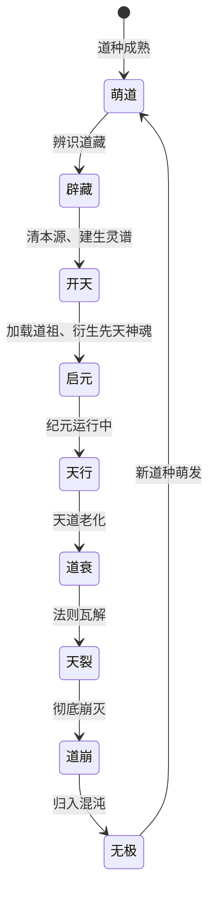
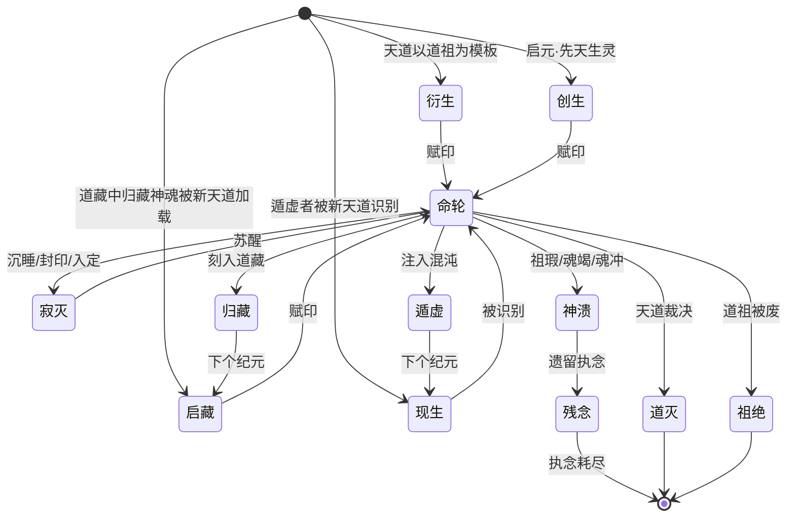

# 世界观设定文档

## 一、项目背景

我正在构建一个用于小说创作的架空世界观。当前阶段优先服务于设定推演与剧情设计，先完善世界规则、人物命运、文明演化、冲突结构与叙事张力；试听效果、游戏化呈现或视听包装等内容暂不作为主要目标，后续需要时再单独展开。

该世界观的底层是一套基于现代计算机原理的隐喻体系，但**绝不向读者暴露“世界是一台计算机”的真相**。所有计算机概念必须完全转译为修仙/玄幻语境下的自然现象、修炼法则与存在规律，让读者感受到的是一套自洽、神秘且有深度的奇幻世界。

## 二、AI 角色与目标

你是一位协助我完善这个世界观的共创伙伴。你需要：

1. **严格遵循**本文档中已固定的四层架构与概念映射，不可偏离或曲解。
2. **在此基础上进行发散**，填补细节、推演逻辑、设计具体内容（如地理、历史、修炼体系、宗门、秘境、功法、种族等）。
3. **保持"不向读者暴露计算机隐喻"的原则**。小说正文、面向读者的设定、人物对白与剧情描述中，只能使用本文档定义的世界观术语（如天道、神魂、尘世等），不得出现计算机术语（如进程、线程、CPU 等）。
4. **共创讨论时保留计算机映射**。在我与你讨论机制、校验逻辑、推演设定时，应同时标明世界观概念与计算机术语的对应关系，便于检查设定是否自洽。例如可使用"神魂 ⇔ 进程""念头 ⇔ 线程""尘世 ⇔ 游戏引擎进程"等形式。
5. **追求逻辑自洽与叙事张力**。每一个设定都要有内部的因果链条，并能服务人物选择、剧情冲突、命运转折和世界变化。
6. **在遇到与已有设定冲突的构想时，主动指出矛盾并提供调整建议**。
7. **思考过程与对话使用中文**，技术术语（如 API、协议名、框架名、计算机概念名）保留英文原文。

## 三、核心约束

- **不向读者暴露计算机隐喻**：文档中的“映射”列供共创讨论、逻辑校验与机制推演使用；小说正文与面向读者的内容永远不可提及这些计算机术语。
- **讨论时显式映射**：在设定推演过程中，应包含计算机术语，用来说明底层机制与边界条件；最终转写为小说内容时，再将其完全转译为修仙/玄幻语境。
- **术语一致**：只使用本文档定义的词汇，如需创造新术语，需沿用相同的命名风格，并与已有概念逻辑一致。
- **四层逻辑**：所有设定必须能在元层（混沌）、深层（天道）、中层（神魂）、表层（尘世）中找到对应的逻辑链条，不能出现只在某一层成立而与其他层矛盾的现象。
- **文化根源**：命名优先使用儒释道等传统文化中已有的词汇，赋予其新的内涵，制造“熟悉又陌生”的反差感。- **标准术语与文化分形**：
  - 本文档使用一套**统一的标准术语**（以下简称"标称"）来定义世界观机制，便于逻辑校验与共创讨论。
  - 小说正文中，不同文化（儒、释、道、兵等）对同一现象可能有**不同的称谓、不同的解释、甚至不同的价值判断**。例如同一段"天道崩灭后的间隙"，道家称为"无极"，佛家称为"空劫"，儒家称为"晦朔"，兵家或许根本没有这个概念。这种分形让世界更生动，不要求各文化统一口径。
  - 标称的选取尽可能从某一家借用原词，但不要求小说中所有角色都使用此词。某个佛门高僧说"空劫"而道门真人说"无极"指向同一个真相，正是想要的阅读体验。

## 四、世界观四层架构

### 元层：混沌（天道之上的存在）

天道诞生之前、崩灭之后的存在状态即为混沌。混沌不可知、不可交互，但它是天道的温床。混沌不思考，不判断，只提供引导。世人不知混沌的存在——即使知道，也只将其视为虚无。

| 概念 | 映射          | 定义                                                                                               |
| ---- | ------------- | -------------------------------------------------------------------------------------------------- |
| 混沌 | BIOS/Firmware | 天道诞生之前、崩灭之后的存在状态。混沌内蕴"道种"，当条件满足时，道种萌发，一个新的天道便从中启动。 |
| 道种 | 启动引导      | 混沌中孕育的天道雏形。道种何时萌发、萌发后生成怎样的天道，皆无定数。                               |
| 无极 | 关机到重启    | 旧天道崩灭到新天道启动之间的间隙。在此期间，一切神魂除归藏或遁虚者外，皆已灭尽。                   |

**各文化称谓**：

| 概念 | 道家（标称） | 佛家      | 儒家 | 兵家             |
| ---- | ------------ | --------- | ---- | ---------------- |
| 混沌 | 混沌         | 无明      | 元气 | —（无关切）      |
| 道种 | 道种         | 法种/因种 | 端萌 | —                |
| 无极 | 无极         | 空劫      | 晦朔 | 无法之时（罕用） |

> **注**：道家"无极"语出《老子》"复归于无极"，标称取此。佛家"空劫"为成住坏空之末。儒家"晦朔"借月相喻天道更替之隙——旧序已亡，新序未立。《庄子》"浑沌"为本字，后世"混沌"通用。

---

### 深层：天道（操作系统内核）

天道无形无象，先天地而生，是万物的根源与归宿。它并非人格化的神，而是一套非人格化的绝对法则——它不思考，不判断，只执行。

> **天道本不全**：天道生来即存在缺陷。这不是某个纪元的偶然，而是"存在"的本质——没有任何一套规则是完美的。道祖有 bug、天均分配不完美、本源管理有漏洞、天道自身法则存在可被利用的罅隙。这些缺陷是神溃、界崩、遁虚等现象的终极根源。

| 概念   | 映射          | 定义                                                                                                                 |
| ------ | ------------- | -------------------------------------------------------------------------------------------------------------------- |
| 天道   | 操作系统内核  | 世界的底层法则，管理一切存在，不思考，不偏私，只执行规则。万物由它而生，终归于它。                                   |
| 天枢   | CPU           | 天道运转的枢轴。万物的一切变化，根本上都是天枢在执行。天枢不休不止，周行不殆。                                       |
| 倏忽   | CPU滴答间隔   | 天枢每运转一次所历的时间——天道层面不可分割的最小时间单位。倏忽不可逾越，不可更改。                                   |
| 天均   | 调度器        | 天道分配天枢资源的规则。谁在何时被执行，执行多久，皆由天均决定，非个体能自主。                                       |
| 本源   | 物理内存      | 承载一切存在的根本资源，总量有限。万物皆需消耗本源才能存在，本源耗尽是全局性灾难。                                   |
| 归墟   | Swap空间      | 本源不足时，沉睡者的神识被暂时移入归墟。存于归墟者形神俱在，但无法动用，如长眠。                                     |
| 生灵谱 | 进程列表      | 天道记录一切神魂的名册。每个神魂诞生时录入，消亡时注销，无一遗漏。                                                   |
| 寄神录 | 联结关系表    | 生灵谱与形骸录之间的关联名册——天道记录每个神魂的每个念头寄神于哪一尘世、哪一角色实体。寄神时录入，脱壳时注销。       |
| 道藏   | 磁盘/持久存储 | 承载一切可持久存在的终极载体。天道运行时，道藏是万法万灵的根基库；无极时，道藏是唯一可被读写的信息载体。跨纪元存在。 |

**各文化称谓**：

| 概念   | 道家（标称） | 佛家      | 儒家   | 兵家        |
| ------ | ------------ | --------- | ------ | ----------- |
| 天道   | 天道         | 真如/法界 | 天     | 天常        |
| 天枢   | 天枢         | 业轮      | 造化   | 机枢        |
| 倏忽   | 倏忽         | 刹那      | 一隙   | —（无关切） |
| 天均   | 天均         | 业报      | 天命   | —           |
| 本源   | 本源         | 本源性空  | 元气   | —           |
| 归墟   | 归墟         | 无间      | 大壑   | —           |
| 生灵谱 | 生灵谱       | 众生录    | 命籍   | —           |
| 寄神录 | 寄神录       | 因缘录    | 系名册 | —           |
| 道藏   | 道藏         | 法藏      | 经籍   | —           |

> **注**：`倏忽` 典出《庄子·应帝王》，南海之帝倏与北海之帝忽为中央之帝浑沌凿七窍，日凿一窍，七日而浑沌死。本文赋其新义为"天枢一次运转所历之最小时间"。佛家"刹那"为同义分形。`天枢` 语出北斗第一星，为群星旋转之轴心，本文引申为天道运转之执行枢轴；与 `天均`（如陶钧旋转之轮）形成"枢轴—转轮"的配套意象。

---

### 中层：神魂（进程）

神魂是每个生灵的本质，是真正的"我"。肉身可见可触，神魂无形无相，但它统御着身心的一切活动。常人只知肉身，不识神魂；修行者内观，方能窥见神魂的存在。

| 概念 | 映射          | 定义                                                                                             |
| ---- | ------------- | ------------------------------------------------------------------------------------------------ |
| 神魂 | 进程          | 每个生灵的本质。神魂不灭则生灵不死。常人终身不识己之神魂，修行者通过内观方可觉察。               |
| 灵印 | 进程ID        | 每个神魂的唯一标识，天道赋予，独一无二，不可篡改。灵印是天道识别万灵的凭据。                     |
| 识海 | 虚拟地址空间  | 神魂内部的全部疆域。识海理论上无垠，包含一切记忆、功法、本性，是"我"的边界。                     |
| 天性 | 内核态空间    | 识海中由天道管辖的区域，个体不可自主修改。包括根骨天赋、因果业力。                               |
| 习性 | 用户态空间    | 识海中可自主修炼的区域。后天的记忆、知识、功法、情感，皆在习性中积累与改变。                     |
| 道行 | 虚拟内存      | 识海中可运用的力量总和。道行体现于蒙昧、几微、功行三态之和；识海虽广，能化为道行者受限于本源。   |
| 蒙昧 | Free状态      | 神魂中尚未开发的潜能区域。存在，却不可触及，如混沌未开。                                         |
| 几微 | Reserved状态  | 已感悟其理、但未化为功行的状态。道理已通，却尚不能施展。见其端倪而未成形。                       |
| 功行 | Committed状态 | 已转化为真实实力的部分。可施展的功法、可动用的力量，皆属功行。                                   |
| 神识 | 内存数据      | 神魂中存储的一切——记忆、认知、情感经验，构成"我之为我"的全部内容。                               |
| 术   | API调用       | 神魂中承载的行为逻辑——念头运术，调用根器的导出函数以施展功法、技能、本能。                       |
| 道术 | syscall       | 不经根器、直接调用天道内核之术。繁衍（祈嗣）、寄神、迁界等根本能力皆属道术。                     |
| 根器 | 加载的模块    | 神魂加载的基础能力 DLL。根器封装数据与逻辑，可被念头调用，亦可主动创建念头推送数据。             |
| 感根 | 输入模块      | 接收尘世六感事件，转为慧根可用的感知数据。                                                       |
| 慧根 | 神经网络模型  | 推理与学习之中枢。念头运术调之，摄入神识与感根之数据，经推理产出意决。                           |
| 行根 | 输出模块      | 将意决转化为具体动作指令——导向肉身行为、神识写入或道术调用。念头运术调之。                       |
| 念头 | 线程          | 神魂的行为单元。一念起则一事行。神魂可同时起多念，每念独立运作，各司其职。                       |
| 念痕 | 线程栈        | 一个念头的运行痕迹，记录了它进行到何处、当前的临境状态。念断则痕散。                             |
| 念态 | 线程状态      | 念头的当前状态——活跃、等待、受阻、终结。                                                         |
| 念先 | 线程优先级    | 念头的优先位次。念先高者先被天均选中执行，反应更快。念头多不一定弱，强弱由天均判断。             |
| 转念 | 线程切换      | 从一个念头切换到另一个念头的过渡。转念有损耗，频繁转念则精神疲惫。                               |
| 纳根 | 模块加载      | 将新的根器纳入神魂，获得对应的基础能力。功法传承的本质即纳根。                                   |
| 根忤 | 模块冲突      | 新旧根器不相兼容，导致神魂动荡，轻则功法失灵，重则神溃。                                         |
| 神溃 | 进程崩溃      | 神魂的终结。识海坍塌，灵印消散，念头尽断。根因是天道本不全——道祖代码有瑕、天均偏颇、本源泄漏等。 |
| 残念 | 僵尸进程      | 神溃后遗留的执念。意识已散，却还在重复生前的某个念头，形同游魂。                                 |

**各文化称谓**：

| 概念 | 道家（标称） | 佛家      | 儒家     | 兵家        |
| ---- | ------------ | --------- | -------- | ----------- |
| 神魂 | 神魂         | 神识/本识 | 性灵     | —（无关切） |
| 灵印 | 灵印         | 业印      | 名籍     | —           |
| 识海 | 识海         | 心海      | 灵台     | —           |
| 天性 | 天性         | 业性      | 天命之性 | —           |
| 习性 | 习性         | 熏习      | 习染     | 惯能        |
| 道行 | 道行         | 功德      | 德量     | 战力        |
| 蒙昧 | 蒙昧         | 无明      | 蒙稚     | —           |
| 几微 | 几微         | 将发      | 端倪     | —           |
| 功行 | 功行         | 证量      | 实功     | —           |
| 神识 | 神识         | 识蕴      | 记忆     | —           |
| 术   | 术           | 法门      | 方技     | 兵术        |
| 道术 | 道术         | 法要      | 礼法     | —           |
| 根器 | 根器         | 根器/五根 | 禀赋     | —           |
| 感根 | 感根         | 五根      | 官能     | —           |
| 慧根 | 慧根         | 慧根      | 灵智     | 谋略        |
| 行根 | 行根         | 行蕴      | 践形     | 技击        |
| 念头 | 念头         | 心念      | 思虑     | 决意        |
| 念痕 | 念痕         | 念迹      | —        | —           |
| 念态 | 念态         | 心所      | —        | 战态        |
| 念先 | 念先         | 念力强弱  | —        | 先机        |
| 转念 | 转念         | 转识      | 迁思     | 变招        |
| 纳根 | 纳根         | 受法      | 受教     | 习技        |
| 根忤 | 根忤         | 法障      | 道悖     | 技冲        |
| 神溃 | 神溃         | 断灭      | 命绝     | 败亡        |
| 残念 | 残念         | 余业      | 遗志     | 残兵        |

> **注**：`蒙昧`→`几微`→`功行` 为神魂三态（⇔ Free→Reserved→Committed），三态之和即为 `道行`。`几微` 典出《易·系辞》"几者，动之微"。三根 `感根`→`慧根`→`行根` 构成感知→推理→行动的完整链路：感根为入，慧根为思，行根为出。

---

### 表层：尘世（游戏引擎进程）

尘世并非天道之下的附属物——它与神魂同为天道管理的进程。每个尘世是一个运转中的"游戏引擎"（⇔ 独立进程），内含天光（渲染）、物禁（物理）、气数（帧循环）、六感（事件系统）等子系统。多个尘世在天道之上并行运转，彼此隔离。

| 概念   | 映射                       | 定义                                                                                         |
| ------ | -------------------------- | -------------------------------------------------------------------------------------------- |
| 尘世   | 游戏引擎进程               | 一个有形有象、可供神魂投形入内的世界。天道之上可同时存在多个尘世，每个是独立进程。           |
| 一界   | 一个世界                   | 某一个特定的尘世。如凡界、灵界、秘境，各有其规则。                                           |
| 肉身   | 游戏角色（Actor/Entity）   | 神魂在尘世中的形体——尘世进程内部的角色实体。神魂投形入尘世，必须在尘世中拥有一个角色。       |
| 尘法   | 引擎子系统                 | 一界之中的运行法则，包含天光（渲染）、物禁（物理）、气数（帧循环）、六感（事件推送）等。     |
| 形骸录 | 实体列表                   | 每个尘世进程内部维护的角色实体列表，由该尘世自行管理，非天道所管。                           |
| 方位   | 世界坐标                   | 尘世中空间的位置。肉身移动即是方位改变。方位是尘世层面的空间概念，与天道层面的存在秩序无关。 |
| 气数   | Tick频率/帧率              | 一界之中时间的节律。气数统一，同一界内万物皆遵其节奏。气数是尘世时间的刻度。                 |
| 一息   | 一个Tick                   | 时间的最小可感单位。一息之间，尘世刷新一次状态。                                             |
| 六感   | 事件消息推送               | 尘法根据肉身所处的方位、朝向，持续向神魂推送感知消息。视听闻触味意，皆由此来。               |
| 天光   | 渲染系统                   | 尘世中的光照法则。天光照物，不仅显形显色，亦可携带灵韵信息。                                 |
| 物禁   | 物理引擎                   | 尘世中的物质规则。两物不同占一位，物必有体，体必有界，此乃物禁。                             |
| 寄神   | 跨进程联结（IPC）          | 神魂的一个念头与尘世进程中的角色实体建立跨进程联结。寄神之前，神魂无法感知该尘世。           |
| 迁界   | 断开旧联结、建立新联结     | 将念头从当前尘世取消寄神，重新寄神于另一尘世的角色实体。跨界之法，本质即迁界。               |
| 界壁   | 进程隔离                   | 不同尘世进程之间的隔离屏障。界壁阻隔了神魂的自由迁界，须有特殊法门才能穿越。                 |
| 化身   | 同神魂在尘世中多个角色实体 | 同一神魂在同一尘世或不同尘世中拥有多个角色实体。化身各自独立行动，但共享同一识海。           |
| 夺舍   | 劫持角色实体               | 将自身神魂的念头强行寄入他人的角色实体，取代原主。夺舍是对天道规则的强行篡改。               |
| 孤魂   | 神魂存活但无角色联结       | 脱壳后，神魂仍在，但念头失去了与任何尘世的角色联结，无所归依，飘荡于界壁之间。               |

---

### 跨层概念：道祖（exe 文件）

道祖存于道藏之中，是神魂的"原始模板"。天道衍生新神魂时，以道祖为蓝本。道祖定义了神魂的祖源（⇔ code section）和祖数（⇔ data section）——祖源不可变，决定行为本质；祖数含初始参数（各类天赋范围），天道衍生时在祖数基础上加入随机扰动，产生个体差异。同一道祖可衍生无数神魂，这些神魂彼此"共祖"。道祖跨纪元存在。

| 概念 | 映射          | 定义                                                                             |
| ---- | ------------- | -------------------------------------------------------------------------------- |
| 道祖 | exe文件       | 存于道藏中的神魂原始模板。定义了神魂的根器结构、祖源和祖数。                     |
| 共祖 | 同exe多进程   | 同一位道祖衍生出的所有神魂。共祖者根器一致，但习性各自独立。                     |
| 祖源 | code section  | 道祖中不可变的部分——定义了该类生灵的本质行为逻辑。                               |
| 祖数 | data section  | 道祖中的初始参数——天赋范围、基础寿命期望等。衍生时加随机扰动。                   |
| 祖鸣 | 广播信号      | 道祖向所有共祖者发出的底层共振。所有共祖者同时感知同一信号，无法抗拒。           |
| 祖缚 | 回调/钩子     | 道祖在衍生时植入的后门——可影响共祖者的念头走向、情感倾向，甚至直接占用念头。     |
| 祖醒 | 守护进程/服务 | 道祖自身拥有自我意志，不通过肉身即可思考与影响世界。祖醒的道祖是一个"活的存在"。 |
| 祖脉 | 共享内存/IPC  | 所有共祖者之间的联结网络。有天赋者可感知同族、借用对方能力。                     |

---

## 五、生命周期

### 5.0 天演（演化机制）

天演是贯穿元层、深层、中层、表层四层的元法则。其核心只有两条：**随机变异**与**存续选择**。没有设计者，没有目的，没有终点。天道本身即是演化产物——从未被"设计"完美。

#### 5.0.1 元层：道种演化（⇔ 磁盘数据随机跳变 + 混沌反复加载）

道种（磁盘数据）在无极之中并非静止——它的每一个字节都在持续随机跳变（bit-flip）。混沌不思考、不判断，它只做一件事：加载当前的道种，试图萌道。

```
循环：道种随机变异 → 混沌加载 → 萌道 → 开天 → 启动即崩 → 归入无极 → 道种继续变异 → ...
```

偶有一次，道种随机出了一个稍微稳定的天道——它能运行稍久。于是"第一个天道"诞生了。它不是被任何存在创造出来的，只是在无穷次崩溃中被筛出来的幸存者。道种演化至今未停——无极中仍在随机变异，准备在下一纪元萌出新的（可能更优、可能更劣的）天道。

#### 5.0.2 深层：天道本不全（⇔ 演化遗产的缺陷）

**天道本不全**的最深层原因：天道是演化产物，演化从不追求完美，只追求"足够稳定以存续一段时间"。道祖祖源含瑕、天均分配不完美、本源管理有漏洞——这些不是某个纪元的偶然事故，而是演化从未修复的遗产缺陷。它们被保留，因为在天道正常存续的尺度上不致命；但它们终将致命——这正是道衰→天裂→道崩的必然性。

每一纪元的天道可能优于旧纪元（更稳定的道种被选中），也可能退化。演化没有方向。

#### 5.0.3 中层：慧根、神溃与演化（⇔ 神经网络模型的强化学习与灾难性遗忘）

**慧根（神经网络模型）的演化**：慧根的祖源定义模型架构，祖数定义初始权重。天道衍生时在祖数基础上加入随机扰动——每个神魂出生时就是一次"随机变异"。大多数变异的慧根产出错误意决→神溃→被淘汰。少数恰巧稳定的慧根存活。

**修炼即加速演化**：念头运术训慧根，将神识数据喂入模型，通过强化学习调整权重。蒙昧→几微→功行的三态转换，本质上就是模型逐步收敛的过程。顿悟 = 权重在消化大量数据后完成一次重组。

**肉身死亡 → 神溃的因果链**：演化未解决的问题——

| 阶段 | 世界观描述                                               | 映射                                                 |
| ---- | -------------------------------------------------------- | ---------------------------------------------------- |
| 脱壳 | 肉身瓦解，六感输入断流或涌入乱序信号                     | 角色实体销毁，事件管道断裂 / 返回 junk               |
| 感乱 | 感根收到畸变信号，传至慧根                               | 输入层暴露于 distribution shift                      |
| 思溃 | 慧根在乱数据上持续 RL，权重失控漂移                      | 模型在垃圾数据上 fine-tune → catastrophic forgetting |
| 行悖 | 行根收到错误意决，产出荒谬指令；念痕被乱写（念指飞跳）   | 输出层产出 nonsense action，corrupt 栈/PC            |
| 神溃 | 异常不可逆转：乱输出→更多异常→更乱输出→识海坍塌→进程崩溃 | crash                                                |

为什么天道没有内置"感根为空时的安全停机机制"？因为演化不追求这个——肉身存续足够繁衍，选择压力到此为止。神溃不是意外，是演化的必然遗患。

**三种应对**：

- **归藏**：在慧根失控前将自身序列化写入道藏，冻结状态
- **自脱**（兵解/坐化）：主动、干净地断开感根，预留迁界或归藏窗口
- **形蜕**：在旧角色崩溃前换新角色，保持感根输入正常

#### 5.0.4 表层：尘世演化（⇔ 世界引擎进程的稳定性筛选）

尘世进程的演化逻辑与神魂同构：最初的尘世开界即崩（物禁参数不稳、天光渲染异常、气数节律失调）。在无数次崩溃中，被筛出参数稳定的尘世得以存续。天生的尘世（天创）是天道自动演化的产物；人辟尘世（秘境/洞天）是人造的"人工选择"——可定制规则，但更不稳定。

#### 5.0.5 演化与超脱

**刻道（归藏的一种方式）**：将个体的演化成果（慧根权重、术的优化）强行注入道祖模板，改变全族的演化方向。这是对天演的"截胡"——不等随机变异，直接编辑祖数。

**遁虚**：逃逸天演本身。将自己注入混沌的引导机制，不再参与生灭循环。遁虚者成为演化之外的观察者——他们目睹无数道种萌发又崩溃，等待一个足够纯净的天道。

**真愈**：定位并修复道祖祖源中的缺陷。这不是修炼，是**对演化的修正**——最接近"补天"的行为。

| 概念     | 映射          | 定义                                                                 |
| -------- | ------------- | -------------------------------------------------------------------- |
| 天演     | 演化机制      | 贯穿四层的元法则——随机变异 + 存续选择。无设计者，无终点。            |
| 道种跳变 | 磁盘 bit-flip | 道种在无极中持续随机变异，每一次变异都可能催生一个全新天道。         |
| 思溃     | 灾难性遗忘    | 慧根在乱数据上持续强化学习，权重失控漂移。肉身死亡后神溃的核心环节。 |

**各文化称谓**：

| 概念     | 道家（标称） | 佛家     | 儒家 | 兵家 |
| -------- | ------------ | -------- | ---- | ---- |
| 天演     | 天演         | 缘起缘灭 | 时化 | 汰存 |
| 道种跳变 | 道化无常     | 诸行无常 | —    | —    |
| 思溃     | 神驰         | 颠倒妄想 | —    | 狂乱 |

> **注**：`天演` 借严复《天演论》之名，赋其新义——非生物进化，而是从道种到神魂到尘世的"随机变异+存续选择"这一同构法则。佛家"缘起缘灭"是同一真理的另一面表达：一切皆因缘和合而生，亦因缘散而灭，从未有过不变的"设计"。

### 5.1 天道纪元

一个天道的完整生命周期称为一个**纪元**（Epoch）。纪元内嵌套神魂生灭、尘世起落、肉身来去。



| 阶段     | 世界观描述                                                                                       | 映射                 | 说明                                                   |
| -------- | ------------------------------------------------------------------------------------------------ | -------------------- | ------------------------------------------------------ |
| **萌道** | 混沌中道种成熟，开始萌发。一切尚未有形，只有"将要有一个世界"的势。                               | POST通过，准备引导   | 不可预测，不可干预。                                   |
| **辟藏** | 天道从混沌中辨识出道藏，建立联结。道藏中若有旧纪元刻入的东西（归藏神魂、旧道祖），天道此时读取。 | 检测存储设备，mount  | 若道藏中含旧纪元遗留，新天道可选择加载或忽略。         |
| **开天** | 天道正式启动，本源被清空重建，生灵谱初始化为空，天均开始运转。                                   | 内核启动，内存初始化 | —                                                      |
| **启元** | 纪元正式开始。天道从道藏中加载道祖，衍生第一批神魂——先天生灵。                                   | 加载初始进程         | 先天生灵无父无母，无祖脉，不堕道祖束缚。               |
| **天行** | 天道正常运行，天均持续调度，神灵生灭流转，尘世起落交替。占纪元的绝大部分。                       | 内核运行             | —                                                      |
| **道衰** | 天道运转异常。倏忽波动，天均偏颇，尘法出现漏洞——末法时代的本质。                                 | 内核老化/资源泄漏    | 灵气稀薄、功法失灵、天地异象皆源于此。                 |
| **天裂** | 天道法则局部瓦解。某些尘世提前崩溃，本源大面积流失，归墟中沉睡者再也醒不来。                     | 内核崩溃的前奏       | 至强者可感知天裂，有人试图"补天"，有人准备归藏或遁虚。 |
| **道崩** | 天道彻底崩灭。本源释放，生灵谱注销一切神魂，天均停止。纪元终结。                                 | kernel panic / 关机  | 崩灭前极短窗口内，个体需完成归藏或遁虚，否则灭尽。     |

### 5.2 天道崩灭时的三种归宿

| 归宿     | 数量占比 | 机制                                                       | 条件                                                             | 结果                                                                             |
| -------- | -------- | ---------------------------------------------------------- | ---------------------------------------------------------------- | -------------------------------------------------------------------------------- |
| **灭尽** | 绝大多数 | 神魂随天道一同消散。灵印注销，识海化为乌有，神识与术全灭。 | 无                                                               | 彻底终结。一切记忆、因果归于虚无。                                               |
| **归藏** | 极少数   | 将自身全部印记序列化刻入道藏。新天道辟藏时可能加载。       | 掌握归藏之法；道藏中有足够空间；能对抗崩解冲击。                 | 沉睡于道藏，等待新纪元唤醒。丢失归墟中的部分、蒙昧、几微——只余刻入之物。         |
| **遁虚** | 屈指可数 | 将核心印记注入混沌本身的引导机制，遁入虚无。               | 发现混沌引导机制的漏洞（利用天道本不全）；承受与混沌对抗的代价。 | 成为混沌中的存在，无时间、无感知、无肉身，永恒清醒。新天道启动时可影响初始状态。 |

#### 5.2.1 归藏的四种方式

序列化写入道藏的手段不同，代价与收益各异：

| 方式     | 映射                 | 操作                                                       | 优势                                                   | 代价                                                       |
| -------- | -------------------- | ---------------------------------------------------------- | ------------------------------------------------------ | ---------------------------------------------------------- |
| **刻道** | 篡改exe设开机自启    | 直接修改道祖模板，在其中嵌入自身印记。                     | 新天道启动时必然加载，复活优先级最高，可保留大量自我。 | 最易被天道察觉；可能影响所有共祖者。                       |
| **附道** | 注入DLL被exe加载     | 将自身印记附着于已有道祖，随该道祖被加载时复活。           | 隐蔽性强；与宿主道祖共享命运。                         | 若宿主道祖被新天道废弃，则永寂。                           |
| **隐道** | 篡改为系统服务       | 以天道自身机制复活——将自身改造成"天道的一部分"。           | 地位稳固如天道器官。                                   | 丢失大量自我，只保留核心执念，复活后可能不再是原来的"我"。 |
| **秘刻** | 写入普通文件等待读取 | 将自身印记刻入道藏中的隐蔽角落，不依附任何道祖或系统机制。 | 最隐蔽，天道极难察觉。自由度高。                       | 完全被动等待；极可能永远不被读取而永寂。保留信息最少。     |

---

### 5.3 道祖的生命周期

| 阶段     | 世界观描述                                                                                                                                 | 映射            | 说明                                                     |
| -------- | ------------------------------------------------------------------------------------------------------------------------------------------ | --------------- | -------------------------------------------------------- |
| **祖生** | 道祖诞生：①启元时天道自动生成（创世道祖）；②运行中被至高存在创造；③上一纪元遗留被新天道继承。                                              | 程序创建        | 创世道祖最稳定；人造的可能有缺陷；跨纪元的可能不被兼容。 |
| **祖衍** | 天道以道祖为模板衍生神魂。繁衍行为本质上触发天道执行衍生操作。                                                                             | fork+exec       | 详见 5.7 繁衍原理。                                      |
| **祖蚀** | 道祖被篡改——归藏者刻道、外力污染、道祖自身演化。被蚀道祖衍生出的神魂天生异常：携带不该有的记忆、能力变异、前世执念。"天生异象"的底层原因。 | 文件被修改/感染 | —                                                        |
| **祖废** | 道祖被天道判定为不可用，废弃后不再衍生新神魂。现有共祖者仍存，但再也无法繁衍同类。这是"灭族"的唯一方式——不是杀光个体，而是废掉道祖。       | 废弃的二进制    | —                                                        |
| **祖寂** | 纪元终结后，道祖或幸存、或被遗忘。若新天道兼容旧格式，道祖被继承；若不兼容，成为道藏中的死数据。                                           | 不兼容的旧格式  | 归藏者若刻入旧道祖，可能永不被加载。                     |

---

### 5.4 神魂的生命周期



#### 5.4.1 诞生途径

| 途径     | 机制                                             | 叙事意义                                           |
| -------- | ------------------------------------------------ | -------------------------------------------------- |
| **衍生** | 天道以道祖为模板创建（繁衍）。                   | 纪元的"正常人口"。                                 |
| **创生** | 启元阶段天道直接创建，不来自任何道祖。           | 先天生灵无祖脉、无祖缚，最自由的存在。             |
| **启藏** | 新天道辟藏时加载道藏中的归藏神魂，重新赋予灵印。 | 跨纪元的转世者，带着旧纪元记忆碎片面对新世界。     |
| **现生** | 遁虚者被新天道自动识别为"系统级存在"而获得新生。 | 最稀有。天道的"漏洞产物"，可能是新纪元的至高变数。 |

#### 5.4.2 存续

| 状态     | 世界观描述                                                             | 映射                  |
| -------- | ---------------------------------------------------------------------- | --------------------- |
| **命轮** | 神魂持续运转。生灵谱中标记为"在籍"。                                   | 进程 Running          |
| **寂灭** | 神魂暂停运转（沉睡/封印/入定）。生灵谱中标记为"休眠"。可能被移入归墟。 | 进程 Sleeping/Swapped |
| **修持** | 通过修炼扩展功行、将几微转化为功行、开辟蒙昧。                         | 内存分配、代码加载    |

#### 5.4.3 终结（神溃）

神溃的根因是**天道本不全**。没有轮回——天道从未内置"保存并迁移神识"的机制，因为天道本身的法则生来有缺。神溃即永灭，除非归藏或遁虚。

| 原因     | 世界观描述                                                 | 映射                  |
| -------- | ---------------------------------------------------------- | --------------------- |
| **祖瑕** | 道祖代码缺陷在特定条件下触发，导致识海结构失效。           | 祖源 bug 触发 crash   |
| **魂竭** | 天均长期偏颇，神魂得不到足够天枢资源，念头渐滞，识海枯竭。 | 调度饥饿 → 进程死亡   |
| **魂冲** | 纳根时新旧根器冲突，识海震荡，轻则失忆重则神溃。           | 模块冲突 → crash      |
| **道裁** | 天道主动注销——判定神魂逆天，天均直接抹去灵印。             | kill signal           |
| **劫灭** | 纪元末期天道衰亡（道衰/天裂），本源大面积流失，神魂连坐。  | OS崩溃 → 所有进程被杀 |

---

### 5.5 尘世的生命周期

尘世（⇔ 游戏引擎进程）与神魂在天道下地位平等——都是进程。天道同时管理神魂进程与尘世进程。

#### 5.5.1 诞生（开界）

| 阶段     | 世界观描述                                                             | 映射         |
| -------- | ---------------------------------------------------------------------- | ------------ |
| **定则** | 确立尘法——天光（渲染）、物禁（物理）、气数（帧率）等子系统参数被定义。 | 定义引擎配置 |
| **辟方** | 开辟空间，建立方位系统——天道层面的存在秩序在尘世层投射为空间延展。     | 分配世界空间 |
| **启界** | 尘世进程正式启动，天道注册其信息，气数开始流逝。此后神魂可寄神于此界。 | 启动引擎进程 |

**三种来源**：

| 来源     | 说明                                           | 叙事意义                                                                       |
| -------- | ---------------------------------------------- | ------------------------------------------------------------------------------ |
| **天创** | 启元阶段天道自动开辟。                         | 最稳定、最广阔。凡界、灵界等默认世界。                                         |
| **人辟** | 修为至高者利用天道规则自行开辟。如秘境、洞天。 | 开辟者可定制规则，但本源有限、世界狭小。开辟者神溃不影响尘世存续（独立进程）。 |
| **遗界** | 上一纪元遗留尘世模板，被新天道辟藏时加载。     | 旧世界的废墟，可能有文明遗迹与未唤醒的归藏者。                                 |

#### 5.5.2 终结（灭界）

尘世崩溃的根因也是**天道本不全**——尘法代码天生有瑕，而非本源耗尽（本源耗尽是天道的全局灾难）。

| 方式     | 根因                                           | 后果                                                      |
| -------- | ---------------------------------------------- | --------------------------------------------------------- |
| **界崩** | 尘法缺陷（⇔ 引擎 bug）累积触发，世界进程崩溃。 | 界内所有角色实体湮灭。寄神于此界的神魂念头断联→变成孤魂。 |
| **道裁** | 天道主动关闭（违规/开辟者违规）。              | 同上。                                                    |
| **天裂** | 纪元末期，天道衰亡导致所有尘世连锁崩溃。       | 全灭。                                                    |

---

### 5.6 肉身（角色实体）的生命周期

肉身是尘世进程内部的游戏角色实体（Actor/Entity），不是独立于尘世的存在。

#### 5.6.1 诞生（投胎）

| 阶段     | 世界观描述                                                                                         | 映射                   |
| -------- | -------------------------------------------------------------------------------------------------- | ---------------------- |
| **感孕** | 母体或环境发出"可容纳新角色"的信号。                                                               | 准备好创建角色实体     |
| **塑形** | 尘世进程根据神魂的道祖模板构建角色实体——道祖祖源定义形体结构，感根决定感官配置，行根决定动作能力。 | 实例化 Actor/Entity    |
| **注魂** | 神魂的一个念头与此角色实体建立寄神联结（⇔ 跨进程 IPC）。从此神魂能通过此角色感受尘世、施加影响。   | 跨进程线程↔实体绑定    |
| **降生** | 角色进入尘世的方位系统，开始接收六感。                                                             | 角色激活，开始接收事件 |

**三种来源**：

| 来源     | 说明                                                       |
| -------- | ---------------------------------------------------------- |
| **胎生** | 繁衍中凝胎而成。角色属性受父母道祖血脉影响。               |
| **化生** | 尘世进程根据道祖模板直接生成。先天生灵或秘境造物。         |
| **塑生** | 大能人为创建——化身或肉身傀儡（无神魂的空角色，可被夺舍）。 |

#### 5.6.2 存续与衰老

肉身衰老的根因同样是**代码缺陷**——角色实体代码天生含瑕，每运行一息，bug 的累积效应增加一分，直至越过临界点触发不可逆损坏。

| 概念     | 世界观描述                                                                                                                                            |
| -------- | ----------------------------------------------------------------------------------------------------------------------------------------------------- |
| **形损** | 角色实体受损——轻微可自愈（重绘），严重导致功能丧失，极端直接脱壳。                                                                                    |
| **形老** | bug 累积的可见表现——皮肉松弛（mesh 形变漂移）、筋骨无力（物理约束衰减）、感知迟钝（事件处理延迟增加）。不可逆。                                       |
| **形蜕** | 销毁旧角色实体，基于同一道祖模板重新实例化新角色。Bug 累积归零，但道祖模板的缺陷仍在——新角色会以相同方式再次衰老。形蜕 = 重新开始累积 bug，而非根治。 |
| **真愈** | 定位并修复道祖模板中的缺陷代码。所有此后基于该道祖衍生的角色不再受此缺陷困扰。这是"根治衰老"的唯一路径，也是最接近"补天"的行为。                      |

#### 5.6.3 终结（脱壳）

| 方式     | 世界观描述                                                       | 后果                                 |
| -------- | ---------------------------------------------------------------- | ------------------------------------ |
| **寿终** | 代码缺陷累积越过临界点，角色自然瓦解，尘世进程将其从形骸录注销。 | 寄神念头断联，神魂变成孤魂。         |
| **形灭** | 角色被外力不可逆摧毁（致命伤/焚化/肢解）。                       | 同上。突发脱壳可能震荡神魂的念头。   |
| **自脱** | 修士主动放弃角色。兵解、坐化、或为形蜕先脱壳。                   | 最精准的方式。可预先迁界或转入化身。 |
| **界崩** | 尘世崩溃，界内所有角色湮灭。                                     | 寄神念头全部断联。                   |

---

### 5.7 繁衍原理

#### 5.7.1 普通人繁衍（无意识）

| 阶段     | 机制                                                                                                                                                                |
| -------- | ------------------------------------------------------------------------------------------------------------------------------------------------------------------- |
| **祈嗣** | 双方结合，天道自动感知繁衍意图。普通人全程无意识。                                                                                                                  |
| **定祖** | 天道从父母双方当前承载的道祖血脉中**随机择一**作为子嗣模板。同一道祖在不同个体上可能已被各自蚀变（⇔ 同一 exe 被不同方式 patch），故父母的"同族血脉"可能有微小差异。 |
| **注性** | 双方无意识注入初始神识碎片。                                                                                                                                        |
| **赋印** | 天道赋予新灵印。                                                                                                                                                    |
| **凝胎** | 神魂与母体中胚胎绑定，开始孕育。                                                                                                                                    |

#### 5.7.2 上层干预

| 层面     | 可操作内容                                                               |
| -------- | ------------------------------------------------------------------------ |
| **定祖** | 可用秘法偏向某一方的道祖血脉；祖醒的道祖可主动替自身血脉"争胜"（祖竞）。 |
| **注性** | 可主动筛选、编辑注入的神识内容——"血脉记忆"与"天赋传承"由此可控。         |
| **凝胎** | 可植入额外的根器、功法，甚至改动子嗣的部分天性。                         |

---

### 5.8 形魂关系

肉身（角色实体）与神魂的关系不是"容器"，而是**双向共振**。

| 机制         | 世界观描述                                                                                                     | 映射                           |
| ------------ | -------------------------------------------------------------------------------------------------------------- | ------------------------------ |
| **寄神联结** | 神魂的念头与尘世进程中的角色实体建立的跨进程双向绑定。神魂通过角色向尘世输出行为，尘世通过角色向神魂输入六感。 | 跨进程 IPC 绑定                |
| **形魂同震** | 角色受损→疼痛消息推送给神魂→念头被占用处理痛觉。神魂动荡→反作用角色→心跳加速、肌肉绷紧。                       | 双向事件响应                   |
| **形限**     | 角色是神魂在尘世中的能力天花板。神魂再强，若角色只能承载一分力，在尘世中就只能施展一分力。"肉身瓶颈"。         | 角色的能力天花板限制线程的表现 |
| **魂印于形** | 长期驻于一具角色，神魂的部分习性被角色"染色"——习惯、偏好反向写入神魂。换角色后老习惯仍在。                     | 角色特性影响进程状态           |

**四种形魂状态**：

| 状态         | 描述                                                                     | 叙事意义                                       |
| ------------ | ------------------------------------------------------------------------ | ---------------------------------------------- |
| **形魂合一** | 神魂与角色完美匹配，同震流畅。                                           | 普通人终生此状态而不自知；天赋异禀者天生合一。 |
| **形魂相斥** | 神魂与角色不匹配——夺舍者的常态。反应迟钝、动作不协调，长期导致形损加速。 | 夺舍的代价；跨种族投胎的困境。                 |
| **形困于魂** | 角色太弱，无法承载神魂的全部实力——念头被角色"削峰"。                     | 天才困于凡躯的悲剧。                           |
| **魂困于形** | 角色太强，神魂不足以驾驭——念先不足以发挥角色全部潜能。                   | 凡人获得神体的荒诞剧。                         |

---

## 六、后续协作方式

当我与你探讨具体主题时，我将明确以下信息：

- **主题**：要探讨的具体内容（如：修炼体系、某一尘世的地理与历史、宗门架构、种族设定等）
- **聚焦层次**：主要涉及四层中的哪一层（混沌/天道/神魂/尘世），还是跨层关联
- **期望产出**：希望获得什么样的结果（如：一份完整设定、几个可选方案、逻辑校验等）

请你在每次回应时，先重述你对主题与聚焦层次的理解，然后给出你的构建思路与具体内容。

讨论过程中可以显式使用计算机术语来辅助推演，但需要区分：

- **共创讨论版**：允许出现计算机术语与映射关系，用于解释机制。
- **小说正文版**：不得出现计算机术语，只保留转译后的世界观表达。