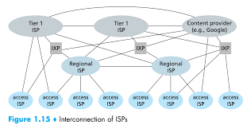
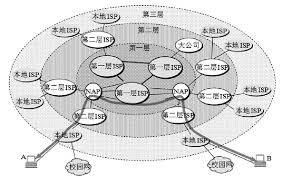
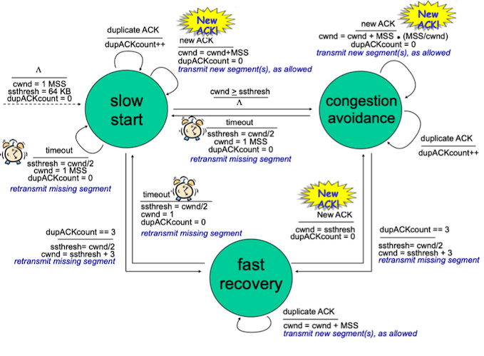
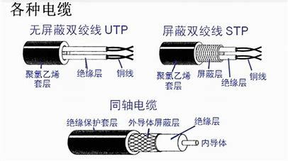

# 计算机网络

<!-- vim-markdown-toc GFM -->

- [计算机网络](#计算机网络)
  - [互联网结构](#互联网结构)
  - [协议分层](#协议分层)
  - [应用层](#应用层)
    - [DNS(UDP 53)](#dnsudp-53)
    - [DHCP(UDP 67)](#dhcpudp-67)
  - [传输层](#传输层)
    - [TCP](#tcp)
      - [全双工连接](#全双工连接)
      - [可靠数据传输](#可靠数据传输)
      - [流量控制](#流量控制)
      - [拥塞控制](#拥塞控制)
    - [UDP](#udp)
  - [网络层](#网络层)
    - [数据平面](#数据平面)
    - [控制平面](#控制平面)
  - [链路层](#链路层)
  - [物理层](#物理层)
  - [网络协议栈完整工作流程](#网络协议栈完整工作流程)
  - [差错校验技术](#差错校验技术)
  - [加密技术](#加密技术)
    - [散列算法](#散列算法)
    - [对称加密技术](#对称加密技术)
    - [非对称加密技术](#非对称加密技术)
    - [数字证书](#数字证书)
    - [数字签名](#数字签名)
    - [安全隧道](#安全隧道)
  - [关于 OpenSSL](#关于-openssl)

<!-- vim-markdown-toc -->

## 互联网结构




- 局域网接入
  - 以太网
  - WiFi
- 广域网接入
  - 拨号（传统电话线）
  - DSL（基于电话线）
  - 电缆（基于电视线）
  - FTTH（光纤）
  - 蜂窝网络（陆地无线电）
  - 卫星（卫星无线电）

## 协议分层

| OSI 七层模型 | TCP/IP 五层模型 |
| ------------ | --------------- |
| 应用层       | 应用层          |
| 表现层       | 应用层          |
| 会话层       | 应用层          |
| 传输层       | 传输层          |
| 网络层       | 网络层          |
| 链路层       | 链路层          |
| 物理层       | 物理层          |

## 应用层

### DNS(UDP 53)

- 分布式层次数据库
  - Public
    - 根 DNS
    - 顶级 DNS
  - Private
    - 权威 DNS
    - 本地 DNS

- DNS 记录
  - `(HostAlias, HostName, CNAME)`：获取主机别名对应的规范主机名，别名的目的是将多个 cname 域名与 ip 解耦，ip 只与 A 域名有关
  - `(HostName, IP, A)`：将规范主机名映射到一个 IP
  - `(DomainName, DNSHostName, NS)`：获取某个域对应的权威 DNS 服务器的域名
  - `(MailAlias, MailHostName, MX)`

- DNS 查询
  - 递归查询与迭代查询
  - DNS 缓存
  - 负载分配

- 插入 DNS 记录
  - 向[注册登记机构](http://www.internic.net)申请
  - 向所有对应的 TLD 插入 DNS 记录
  - 若有多个 IP 主机则应该提供自己的 DNS 服务器

### DHCP(UDP 67)

1. DHCP 发现：利用广播目的地址发现并请求 DHCP 主机

2. DHCP 响应：DHCP 主机响应请求
   - 上述 DHCP 发现报文的事务 ID
   - 向客户推荐的 IP/Mask、DNS、GW
   - IP 租用期

3. DHCP 请求：客户端选择接收一个 DHCP 响应并确认

4. DHCP 接收：服务端接收并确认客户端的确认

## 传输层

### TCP

#### 全双工连接

三次握手

1. `SYN->` ：请求连接
2. `<-SYN ACK` ：确认连接，接受连接
3. `ACK->` ：确认接受连接

- 为什么需要三次握手？
  - 防止旧的重复连接的初始化
  - 同步双方的初始序列号
  - （只有第三次握手包能携带数据，因为此时双方都已确认对方具有建立连接的能力）
- DOS 泛洪攻击：发送大量合法的`SYN`包而无后续操作，导致占用服务器资源
  - 减少半连接状态持续时间
  - 设置最大半连接数
  - 攻击者 IP 黑名单
  - 过滤网关防护

四次挥手

1. `FIN->` ：结束连接
2. `<-ACK` ：确认结束连接
3. `<-FIN` ：结束连接
4. `ACK->` ：确认结束连接

- 为什么四次挥手？
  - 因为是全双工连接，关闭一个方向的连接需要一次请求与一次应答
- 为什么在主动关闭连接的一方在四次挥手之后会进入 TIMEWAIT 状态？
  - 防止具有相同四元组的旧的数据包被新连接错误地接收，等待 2MSL 让原来连接的数据包全部过期
  - 等待足够的时间以确保对方接受最后的 ACK 从而正常关闭连接
- TIME_WAIT 过多危害
  - 内存资源占用
  - 端口的占用

流式数据导致粘包

- 原因
  - 接受方：不及时处理
  - 发送放：等待缓冲区满
- 解决
  - TCP 紧急传送指令，不等待缓冲区满
  - 后台线程预处理

#### 可靠数据传输

**定时器的超时间隔计算**

> 指数加权移动平均（EWMA）

- SampleRTT 均值：$EstimatedRTT = (1 - \alpha) \times EstimatedRTT + \alpha \times SampleRTT$
  > 推荐$\alpha = 0.125$。仅在某时刻测量 SampleRTT 而非对每个报文都测量，且不会为重传的报文测量
- SampleRTT 偏离程度：$DevRTT = (1 - \beta) \times DevRTT + \beta \times |SampleRTT - EstimatedRTT|$
  > 推荐$\beta = 0.25$
- 超时间隔：$TimeoutInterval = EstimatedRTT + 4 \times DevRTT$ > 推荐$初始TimeoutInterval = 1s$，每次超时时会将 TimeoutInterval 加倍
  >

**发送方的简化状态机模型**

```python
if 从应用层接收到数据:   # 事件一
    if 未启动定时器:
        则启动定时器
    将数据分片封装
    记录下个数据段的起始序号

if 接受到ACK报文:       # 事件二
    if ACK报文的序号 > 最早的未被确认的已发送数据段的序号:
        更新最早的未被确认的已发送数据段的序号
        if 所有已发送数据段均已被确认:
            重启定时器
    elif 如果接受到3次冗余ACK:
        立即回传冗余ACK期望的数据段

if 定时器超时:          # 事件三
    超时间隔 *= 2
    重启定时器
```

**接收方的状态机模型**

```python
if 接受到期望序号报文且之前数据均已确认:
    延迟回传ACK，最多延迟500 ms

elif 接受到期望序号报文且另一个报文等待确认:
    立即回传ACK累积确认两个报文

elif 接受到可以填充数据缺失间隙的报文:
    立即回传ACK累积确认

elif 比期望序号大的报文到达（数据缺失）:
    立即回传ACK指定期望序号

elif 比期望序号小的报文到达（数据冗余）:
    丢弃数据

elif 校验报文数据损坏且无法修复:
    丢弃数据
```

#### 流量控制


- 目的：保护接受方的缓存不溢出

- 手段：计算已发送但未确认的数据段总大小，其长度不能超过对等方接收窗口大小

- 注意：当接收窗口大新为 0 时，仍需持续发送 1 字节数据的数据段，直到接收窗口空闲

#### 拥塞控制

**结合流量控制与拥塞控制机制，需要保证已发送且未被确认的数据长度必须小于对等方接受窗口大小以及本地拥塞窗口大小**

> 拥塞窗口大小为 cwnd  
> 慢启动阀值为 ssthresh  
> 最大分段大小为 MSS = MTU - IP 报头 - TCP 报头

- 初始状态：设置拥塞窗口大小为 1×MSS，进入慢启动模式
- 慢启动模式：
  - 每当接受到一个新 ACK，则`cwnd += 1×MSS`
  - 当拥塞窗口达到慢启动阀值后，进入拥塞避免模式
  - 当接受到 3 次冗余 ACK 后，则`ssthresh = cwnd/2`，`cwnd = ssthresh + 3×MSS`，并进入快速恢复模式
  - 当定时器超时后，则`ssthresh = cwnd/2`，`cwnd = 1×MSS`，并重入慢启动模式
- 拥塞避免模式：
  - 每当接受到一个新 ACK，则`cwnd += (MSS/cwnd)×MSS`
  - 当接受到 3 次冗余 ACK 后，则`ssthresh = cwnd/2`，`cwnd = ssthresh + 3×MSS`，并进入快速恢复模式
  - 当定时器超时后，则`ssthresh = cwnd/2`，`cwnd = 1×MSS`，并进入慢启动模式
- 快速恢复模式：
  - 当接受到一个新 ACK，则`cwnd = ssthresh`，并进入拥塞避免模式
  - 每当接受到一个冗余 ACK，则`cwnd += 1×MSS`
  - 当定时器超时后，则`ssthresh = cwnd/2`，`cwnd = 1×MSS`，并进入慢启动模式



### UDP

- 不保证数据不缺失
- 不保证数据不冗余
- 校验但不恢复差错

## 网络层

### 数据平面

- 利用 CIDR（无类别域间路由选择）将传统分类编址的 IP 地址的分类一般化：`IP/Mask`

- **主机** 根据路由表选择下一条地址

- **网关** 接收子网主机的数据包并进行转发，可能会利用到 NAT 与 UPnP

- 网络核心中的 **路由器** 根据路由表选择下一条地址，直到交付成功、丢包、TTL 为 0

- 防火墙机制
  

- Linux 路由表：用户可自定义 1-252 号路由表，内核维护如下 4 个路由表

| 表号 | 名称    | 说明                 |
| ---- | ------- | -------------------- |
| 0    | system  | 系统保留             |
| 253  | default | 没特别指定的默认路由 |
| 254  | main    | 没指定表号的所有路由 |
| 255  | local   | 保存本地接口地址     |

**路由表包含信息**

- 目的主机/网段：指定适用的目的 IP
- 网关：是否需要网关以及网关的 IP
- 设备：用哪个网卡发送数据包（同时也指定了本地源 IP）
- 附加信息：如目标是否可达、协议头部参数、路由作用域等等

  > 路由作用域(scope)：
  >
  > - host：指定该条路由只用于本机内部通信
  > - link：指定该条路由仅用于局域网通信
  > - global：指定该条路由可用于全局通信

- 代理与 VPN 的区别

| 异同            | 代理                       | VPN                                                    |
| --------------- | -------------------------- | ------------------------------------------------------ |
| 是否隐藏本地 IP | 是                         | 是                                                     |
| 是否加密        | 默认否                     | 是                                                     |
| 主要协议        | HTTP(应用层)、SOCK(应用层) | PPTP(链路层)、L2TP(链路层)、IPSec(网络层)、SSL(应用层) |

### 控制平面

<!-- 层次结构 -->

- **AS（自治系统）内部的路由选择：OSPF（开放最短路优先）**  
  利用 OSPF 报文，AS 内部路由器进行周期性广播通报，从而使每台路由器维护整个 AS 拓扑图（邻接表），
  从而通过 Dijkstra 算法求得最短路由

- **ISP 之间的路由选择：BGP（边界网关协议）**  
  AS 之间使用 BGP 报文来互相通告每个 AS 中含有的子网信息，并最终扩散到整个互联网

## 链路层

**为何不用 IP 代替 MAC**

- IP 地址属于逻辑数据层面的东西，而实际上的信息是通过物理线路来传输的，而物理线路中的端点使用的鉴别信息就是 MAC 地址。
  换句话说，IP 与 MAC 是解耦的，而不是固定绑定的，不同时期 IP 对应的 MAC 可能并不相同。

**分组交换技术**

- 处理时延（验证、路由等计算）
- 排队时延（按队列接收并转发数据）
- 传输时延（存储转发）
- 传播时延（信号亚光速传播）

**交换机：**

- 作用
  - 消除碰撞
  - 异质链路
  - 网络管理
  - 自学习
- 转发原理
  - 情况一：无对应 MAC 地址的表项
    > 泛洪
  - 情况二：存在对应表项，且来源端口与表项中绑定的端口相同
    > 过滤
  - 情况三：存在对应表项，且来源端口不与表项中绑定的端口相同
    > 转发

**WiFi：**

- 扫描：被动扫描与主动扫描信道以发现 AP
- 鉴别：通过身份验证
- 关联：无线主机在 AP 注册成功，并获取临时密钥进行链路层加密
  > **注意：一般无线网卡无法抓取 MAC 地址非本机的包（即使开启混杂模式）**

## 物理层



- 双绞铜线 ：最便宜且最常用、电话机、高速 LAN 主导性方案
- 同轴电缆 ：电缆电视系统、共享媒体
- 光纤 ：稳定安全、高成本光设备、海底光缆
- 陆地无线电信道：穿墙、移动用户、长距离
- 卫星无线电信道：同步卫星、近地轨道卫星

## 网络协议栈完整工作流程

- **发送**
  1. **应用层**调用 socket 接口，请求发送 message
     > 申请 socket、指定协议族、绑定本地网卡 IP 与端口号、发指定对等方 IP 与端口号、送与接受数据
  2. **传输层**确认参数（传输层协议、目的端口号、本地端口号等），将数据分片并封装为 segment
     > 传输层如 TCP 协议还负责一些额外功能
  3. **网络层**确认参数（网络层协议、目的 IP 等），并查询路由表确认参数（下一跳 IP 与本地 IP），并封装为 datagram
     > 通过路由表选择下一跳地址（或无法到达、或直接发送、或通过网关），
     > 以及从哪个本地网络接口设备发送数据，
  4. **链路层**利用 ARP 表确认参数（链路层协议、目的 MAC、本地 MAC 等），并封装成 frame
     > 若发现目的 IP 与网卡 IP/广播/多播地址相同，则将其上传至网络层（**接受**流程第 3 步）
     > 若 ARP 表中不存在目的 IP 的 MAC 地址，则发送 ARP 请求
  5. **物理层**中物理网卡将信息转换为网线信号，封装成物理帧

- 接收：
  1. **物理层**中物理网卡将网线信号转换为主机总线信号，并检查 frame 的目的 MAC 地址是否与本机匹配
     > 若开启网卡混杂模式，则即使目的 MAC 地址不匹配也会上传至链路层
  2. **链路层**处理 ARP 请求
  3. **网络层**进行路由判断，并检查目标网卡是否存在应用监听再决定是否上传数据
     > 还可以处理 ICMP 包
  4. **传输层**检查目的协议的端口是否开启（存在应用监听）
  5. **应用层**数据包回传给应用程序

- 虚拟网卡：在网络层根据路由表即返回
- 虚拟网桥：相当于转发路由器
- 虚拟网关：利用 NAT 进行转发

<!--
TCP：
    变量：seq, ack, TimeoutInterval
    事件：冗余ack, 异常超时
    动作：单段重传, 累计确认
    状态：慢启动, 拥塞避免, 快速重传
-->

## 差错校验技术

- （二维）奇偶校验

  > 通过附加检验比特位来使行（列）中 1 的个数为奇数，
  > 一维奇偶校验无法检验偶数个比特差错，
  > 二维奇偶校验不但可以检验、定位并矫正单个比特差错，还可以检验任意两个组合的比特差错

- 检验和方法（TCP 与 UDP）

  > 将数据分为一个个 int16_t 并回卷求和，再求反码，即为检验和。
  > 检验时将所有数据（包括检验和）分为一个个 int16_t 并求和，所得应为数位全 1

- CRC（循环冗余检测）
  > 链路层

## 加密技术

### 散列算法

也可称作 hash 算法、信息摘要算法、不可逆加密技术  
[更多介绍](https://zhuanlan.zhihu.com/p/101390996)

- 原理：
  - hash(m) = s
  - hash 为哈希算法，m 为任意长度的明文，s 为固定长度的信息摘要

- 性质：
  - 抗碰撞性：尽量避免冲突
  - 抗篡改性：只要改动一个字节得到的 hash 值也有很大不同
  - 查找效率：生成 hash 值的速度
  - 不可逆性：不可由 hash 值推出原文

- 作用：
  - 安全高效的信息对比
    > 将信息哈希后再进行对比既可验证信息对等性又可不泄露信息
  - 完整性校验
    > 将秘密数 key 与信息 m 进行哈希后得 MAC，随 m 发送，可防止中间人偷偷篡改 m。

### 对称加密技术

- 原理：
  - f(key, m) = s，f'(key,s)得到明文 m
  - f 为对称加密算法，key 为密钥，m 为明文，s 为密文

- 性质：
  - 对称加密技术是可以解密的，和上面的 hash 不同
  - 需要双方提前知道加密密码于加密算法

- 作用：
  - 机密性保证

### 非对称加密技术

- 原理：
  - 私钥可以算出公钥，反之公钥无法算出私钥
  - 私钥加密需公钥解密，公钥加密需私钥解密

- 作用：
  - 单向加密（公钥加密，私钥解密）
    - 交换密钥：通讯时交换对称密钥用于通讯加密，交换的加密后的密钥只能由公钥主人解开
  - 身份验证（私钥加密，公钥解密）
    - 数字证书(ssl)：用于证明证书信息由 CA 认证
    - 数字签名(gpg)：用于证明签署信息有公钥主人认证
    - 用户登录(ssh)：用于证明对方为某公钥的主人
  - 机密性保证与完整性校验不如对称算法与哈希算法性能好。

### 数字证书

- 作用：确认访问的网站是相对安全的，它是经过权威的认证中心(**CA**)认证过身份的
- 原理：
  - CA 发放证书，证书由 CA 的私钥加密，若由对应 CA 的公钥解密出正确信息即可确认证书不假
    > 由 CA 负责保证其私钥不会泄漏，从而杜绝伪造证书  
    > 注意上面说的是**证书不假**，证书是不是对方的还得继续往下看
  - 证书内容：
    - 版本
    - 签名算法（哈希算法与非对称加密算法）
    - 证书有效期
    - 使用者信息（国家、地区、组织、名字/域名）
    - 使用者公钥
      > 非常重要的信息，这就是用来确认上面说的——对方是否为证书的主人
    - 颁发者信息（颁发者的网站与证书等）
    - 等等。。。
    - 颁发者利用其私钥对该证书的签名
      > 此处的密文即由上面全部明文 hash 后再用 CA 的私钥加密得到。
      > 浏览器会将全部明文同样进行 hash 得到串**S1**，再用 CA 的公钥解密该密文得到串**S2**，若**S1**等于**S2**则说明证书是真的。  
      > 用反证法可以证明：若证书为假(即密文并非由 CA 的私钥加密)，我们用 CA 的公钥解密出的**S2**
      > 应该是“乱码”(与**S1**碰撞的可能性极低)，而该“乱码”有与明文 hash 值相同，这违背了非对称加密技术的性质——私钥加密只有公钥能解密。
      > 故得证，证书为真

**注意**：并不是对所有 CA 都是无条件信任的，验证一个网站的证书，还需验证其颁发者的证书，
一直向上追溯直到需要验证 Root CA 时才无条件信任。

### 数字签名

- 作用：确认消息的发送者确实是其附上公钥的主人
- 原理：
  - 首先，类似数字证书——将明文信息 hash 后用私钥加密，随明文一起发送，  
     明文的内容包括：
    - 发送方公钥
    - 正文信息(如发起的交易的信息)
  - 接收方用发送方公钥解密密文部分，在与明文 hash 后对比，若匹配则说明发送方确实是正文信息的主人

> 数字签名与数字证书的验证，都需要一个信任的源头，数字签名即信任签名的公钥，数字证书即信任 Root CA

### 安全隧道

首先是 SSL/TLS 协议：

- 作用：客户端与服务器建立一个只有双方才能解密会话内容的加密通讯隧道
- 流程：
  - 客户端(**C**)发起连接请求，内容包括：协议版本、支持的加密算法等

  - 服务器(**S**)回传包括：协议版本、选择的加密算法、数字证书等

  - 如果证书验证通过(即对网站服务器的身份验证)，
    客户端会生成一个随机数，正式的安全隧道通信会使用对称加密，
    而该随机数值即作为对称加密的密码，然后发送握手消息，其中包括：
    1. 对称密码的密文(用证书上的公钥加密)
    2. 握手消息的密文(用上面的对称密码加密)
    3. 握手消息的 hash 值
       > 接下来，对客户端来说还需要确认的有：
       >
       > - 对方(服务器)是证书的主人
       > - 对方已接收到正确的对称密码

  - 服务器接受消息后：
    1. 用**自己的私钥**解密出对称密码(若能正确执行此步骤，则该服务器确实是证书的主人)
    2. 并用该对称密码解密出握手消息
    3. 上一步解密出的握手消息 hash 后与接收到的握手消息 hash 值对比，确认密码可行性
    4. 回传包括：
       - 重新生成的握手信息的密文(用对称密码加密)
       - 重新生成的握手信息的 hash 值

  - 客户端接收回传信息：
    1. 解密握手信息，hash 后对比接收的 hash 值
    2. 若相同，则证明了之前待确认信息
    3. 接下来的安全隧道即用该对称密码加密

SSH 协议与此不同，因为 HTTPS 是用于网站访问的加密：服务器是开放的，客户端是陌生的  
而 SSH 协议是有**用户**这个概念的，若客户端不是服务器的注册用户则不可访问，
故连接过程需要验证用户身份，或者通过用户密码(散列算法)，或者用用户的私钥(非对称加密)，验证细节不再赘述

## 关于 OpenSSL


- x509 证书链
  - .key：密钥
    > `openssl genrsa -des3 -out server.key 2048`
  - .crt：证书文件，由 CA 的私钥签名
    > Windows 下也叫.cer
  - .pem：封装了 crt 与 key（也可能只有其一）
  - .csr：证书请求文件，需要用自己的私钥签名
    > `openssl req -new -key server.key -out server.csr`  
    > 依次输入国家、地区、组织、email、common name（名字或域名）

关于[Diffie Hellman](https://wiki.openssl.org/index.php/Diffie_Hellman)

> The Diffie-Hellman algorithm provides the capability for two communicating parties to agree upon a shared secret between them. Its an agreement scheme because both parties add material used to derive the key (as opposed to transport, where one party selects the key). The shared secret can then be used as the basis for some encryption key to be used for further communication.
>
> If Alice and Bob wish to communicate with each other, they first agree between them a large prime number p, and a generator (or base) g (where 0 < g < p).
>
> Alice chooses a secret integer a (her private key) and then calculates ga mod p (which is her public key). Bob chooses his private key b, and calculates his public key in the same way.
>
> Alice and Bob then send each other their public keys. Alice now knows a and Bob's public key gb mod p. She is not able to calculate the value b from Bob's public key as this is a hard mathematical problem (known as the discrete logarithm problem). She can however calculate (gb)a mod p = gab mod p.
>
> Bob knows b and ga, so he can calculate (ga)b mod p = gab mod p. Therefore both Alice and Bob know a shared secret gab mod p. Eve who was listening in on the communication knows p, g, Alice's public key (ga mod p) and Bob's public key (gb mod p). She is unable to calculate the shared secret from these values.
>
> In static-static mode both Alice and Bob retain their private/public keys over multiple communications. Therefore the resulting shared secret will be the same every time. In ephemeral-static mode one party will generate a new private/public key every time, thus a new shared secret will be generated.
>
> Anonymous Diffie-Hellman uses Diffie-Hellman, but without authentication. Because the keys used in the exchange are not authenticated, the protocol is susceptible to Man-in-the-Middle attacks. Note: if you use this scheme, a call to SSL_get_peer_certificate will return NULL because you have selected an anonymous protocol. This is the only time SSL_get_peer_certificate is allowed to return NULL under normal circumstances.
>
> You should not use Anonymous Diffie-Hellman. You can prohibit its use in your code by using "!ADH" in your call to SSL_set_cipher_list.
>
> Fixed Diffie-Hellman embeds the server's public parameter in the certificate, and the CA then signs the certificate. That is, the certificate contains the Diffie-Hellman public-key parameters, and those parameters never change.
>
> Ephemeral Diffie-Hellman uses temporary, public keys. Each instance or run of the protocol uses a different public key. The authenticity of the server's temporary key can be verified by checking the signature on the key. Because the public keys are temporary, a compromise of the server's long term signing key does not jeopardize the privacy of past sessions. This is known as Perfect Forward Secrecy (PFS).
>
> You should always use Ephemeral Diffie-Hellman because it provides PFS. You can specify ephemeral methods by providing "kEECDH:kEDH" in your call to SSL_set_cipher_list.

> 如果双方有一个对称加密方案，希望加密通信，而且不能让别人得到钥匙，那么可以使用 Diffie-Hellman 算法交换密钥。

> 如果你希望任何人都可以对信息加密，而只有你能够解密，那么就使用 RSA 非对称加密算法，公布公钥。

更多相关信息[见](https://www.jianshu.com/p/fcd0572c4765)
