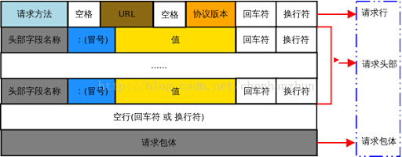
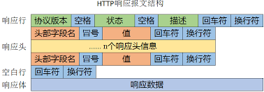

# 目录
<!-- vim-markdown-toc GFM -->

- [互联网结构](#互联网结构)
  - [ISP](#isp)
  - [接入网](#接入网)
  - [物理媒体](#物理媒体)
- [协议分层](#协议分层)
  - [应用层](#应用层)
    - [DNS](#dns)
    - [DHCP](#dhcp)
    - [HTTP](#http)
    - [SMTP](#smtp)
    - [BitTorrent](#bittorrent)
  - [传输层](#传输层)
    - [TCP](#tcp)
      - [全双工连接](#全双工连接)
      - [可靠数据传输](#可靠数据传输)
      - [流量控制](#流量控制)
      - [拥塞控制](#拥塞控制)
    - [UDP](#udp)
  - [网络层](#网络层)
    - [数据平面](#数据平面)
    - [控制平面](#控制平面)
  - [链路层](#链路层)
    - [WiFi](#wifi)
- [分组交换技术](#分组交换技术)
- [安全通讯](#安全通讯)
- [总览](#总览)

<!-- vim-markdown-toc -->

# 互联网结构
## ISP
<!-- 层次结构 -->

## 接入网
* 广域网接入
    * 拨号      （传统电话线）
    * DSL       （基于电话线）
    * 电缆      （基于电视线）
    * FTTH      （光纤）
    * 蜂窝网络  （陆地无线电）
    * 卫星      （卫星无线电）
* 局域网接入
    * 以太网
    * WiFi

## 物理媒体

* 双绞铜线      ：最便宜且最常用、电话机、高速LAN主导性方案
* 同轴电缆      ：电缆电视系统、共享媒体
* 光纤          ：稳定安全、高成本光设备、海底光缆
* 陆地无线电信道：穿墙、移动用户、长距离
* 卫星无线电信道：同步卫星、近地轨道卫星

# 协议分层
| OSI七层模型 | TCP/IP五层模型 |
|-------------|----------------|
| 应用层      | 应用层         |
| 表现层      | 应用层         |
| 会话层      | 应用层         |
| 传输层      | 传输层         |
| 网络层      | 网络层         |
| 链路层      | 链路层         |
| 物理层      | 物理层         |

## 应用层
### DNS
***UDP 53***
<!-- 层次结构 -->
**分布式层次数据库**
* Public
    * 根DNS
    * 顶级DNS
* Private
    * 权威DNS
    * 本地DNS

**DNS记录**
> `(Name, Value, Type ,TTL)`
* `(HostAlias, HostName, CNAME)`
    > 获取主机别名对应的规范主机名
* `(HostName, IP, A)`
    > 将规范主机名映射到一个IP
* `(DomainName, DNSHostName, NS)`
    > 获取某个域对应的权威DNS服务器的域名
* `(MailAlias, MailHostName, MX)`

**查询DNS记录**
* 递归查询与迭代查询
* DNS缓存
* 负载分配

**插入DNS记录**
* 向[注册登记机构](http://www.internic.net)申请
* 向所有对应的TLD插入DNS记录
* 若有多个IP主机则应该提供自己的DNS服务器，并设置别名

### DHCP
**UDP 67**
* DHCP发现：利用广播目的地址发现并请求DHCP主机

* DHCP响应：DHCP主机响应请求
    * 上述DHCP发现报文的事务ID
    * 向客户推荐的IP/Mask、DNS、GW
    * IP租用期

* DHCP请求：客户端选择接收一个DHCP响应并确认

* DHCP接收：服务端接收并确认客户端的确认

### HTTP
***TCP 80***

**请求报文格式**  

* 方法：
    * `GET`
        > 请求URL定位的资源，URL后`?`结尾表示URL结尾与请求参数开始
    * `POST`
    * `HEAD`
    * `PUT`
    * `DELETE`
    * `OPTIONS`
    * `TRACE`
    * `CONNECT`
* 首部行：
    * `Host`                    ：目的主机名`google.com`
    * `User-Agent`              ：浏览器类型`Mozilla/5.0`
    * `Connection`              ：连接方式`close|Keep-Alive`
    * `Accept`                  ：内容类型`*/*`
    * `Accept-Language`         ：自然语言`zh-CN`
    * `Accept-Encoding`         ：压缩格式`gzip`
    * `Accept-Charset`          ：字符编码`ISO-8859-1`
    * `If-Modified-Since`       ：是否已变更`Wed, 9 Sep 2015 09:23:24`
    * `Cookie`                  ：客户端存储目的域名的Cookie
    * `Reference`               ：由`URL`跳转而来

**响应报文格式**  

* 方法：`GET` `POST` `HEAD` `PUT` `DELETE`
* 状态码：
    * 200 OK                    ：表示客户端请求成功
    * 400 Bad Request           ：表示客户端请求有语法错误，不能被服务器所理解
    * 401 Unauthonzed           ：表示请求未经授权，该状态代码必须与 WWW-Authenticate 报头域一起使用
    * 403 Forbidden             ：表示服务器收到请求，但是拒绝提供服务，通常会在响应正文中给出不提供服务的原因
    * 404 Not Found             ：请求的资源不存在，例如，输入了错误的URL
    * 500 Internal Server Error ：表示服务器发生不可预期的错误，导致无法完成客户端的请求
    * 503 Service Unavailable   ：表示服务器当前不能够处理客户端的请求，在一段时间之后，服务器可能会恢复
* 首部行：
    * `Location`                ：重定向
    * `Server`                  ：服务器类型`Apache/2.2.3`
    * `Date`
    * `Last-Modified`
    * `Content-Length`
    * `Content-Type`
    * `Set-Cookie`

**访问HTTP服务**
* Cookie：
    * 客户端：记录本机在服务器上对应的Cookie号
    * 服务器：记录客户端在本机上对应的Cookie号，以及相应的用户信息。

* Web代理/缓存：
    * 进行代理访问
    * 缓存http报文

* DASH：基于HTTP的动态适应性流  
    将视频编码为多个清晰度的版本，并将每个版本的视频切分为块，下载时动态选择将要下载的块的版本

### SMTP
***TCP 25***

**特点**
* SMTP握手
* 持续连接
* ASCII7

**一般流程**
* 发送方发送报文给SMTP服务器
* SMTP服务器利用SMTP协议转发报文给接收方SMTP服务器（循环尝试，失败则发邮件提醒发送方）
* 接收方连接SMTP服务器接收报文，并存入接收方邮箱
* 接收方通过客户端与其SMTP服务器通讯获取邮件

**客户端与邮件服务器通讯协议**
* POP3
* IMAP
* HTTP

### BitTorrent
**特点**
* 文件分块
* 同时下载和上传文件块

**一般流程**
* 向追踪器注册自己
* 追踪器随机提供一个对等方子集
* 并行连接所有对等方子集
* 周期性向对等方询问其已有块列表
* 应该选择下载哪个块：最稀缺优先原则
* 响应哪些邻居请求：疏通
    > 疏通即4个最高带宽的对等方，每30秒随机选取新的试探对等方加入筛选

## 传输层
### TCP
#### 全双工连接
* 三次握手
    > 同时确定初始序号、超时间隔
    * `SYN->`       ：请求连接
    * `<-SYN ACK`   ：确认连接，接受连接
    * `ACK->`       ：确认接受连接

* 四次挥手
    * `FIN->`       ：结束连接
    * `<-ACK`       ：确认结束连接
    * `<-FIN`       ：结束连接
    * `ACK->`       ：确认结束连接

三次握手与四次挥手的目的就是为了连接双方都能确认对方明白了自己的意图

#### 可靠数据传输
可能出现的问题：
* 数据损坏：校验-丢弃-重传
* 数据缺失：单段重传、累积确认
* 数据冗余：丢弃

**定时器的超时间隔计算**
> 指数加权移动平均（EWMA）
* SampleRTT均值：$EstimatedRTT = (1 - \alpha) \times EstimatedRTT + \alpha \times SampleRTT$
    > 推荐$\alpha = 0.125$。仅在某时刻测量SampleRTT而非对每个报文都测量，且不会为重传的报文测量
* SampleRTT偏离程度：$DevRTT = (1 - \beta) \times DevRTT + \beta \times |SampleRTT - EstimatedRTT|$
    > 推荐$\beta = 0.25$
* 超时间隔：$TimeoutInterval = EstimatedRTT + 4 \times DevRTT$
    > 推荐$初始TimeoutInterval = 1s$，每次超时时会将TimeoutInterval加倍

**发送方的简化状态机模型**
> 需要维护的变量：
> * 正常情况下，下次应该发送的报文段的编号`next`
> * 未被确认的最早的报文段的编号`base`（早于该报文段的其他所有报文段均已被确认接收）
* 状态：
    * 状态一：存在数据未被确认
    * 状态二：已发送数据皆被完全确认
    * 状态三：正在单段重传
        > 该状态下会同步等待重传的报文被确认才继续发送下一个报文段

* 事件：
    * 事件一：从应用层接收数据
        1. 将报文分段并编号
        2. 若未启动定时器，则启动之（计算TimeoutInterval）
        3. 将报文段发送到网络层
        4. **进入状态一**
    * 事件二：接受到ACK报文
        1. 如果为冗余ACK，则重传`base`报文段，并**进入状态三**
        2. 如果为非冗余ACK，且所有报文均已被确认，则重启定时器（计算TimeoutInterval），并**进入状态二**
        3. 如果为非冗余ACK，但所有报文并未都被确认，则**进入状态一**
    * 事件三：定时器超时
        1. 如果当前处于状态一，则重启计时器（TimeoutInterval翻倍），并重传`base`报文段，且**进入状态三**
        2. 如果当前处于状态二，则重启计时器（TimeoutInterval不变）

**接收方的状态机模型**
> 需要维护的变量：
> * 期望的下一个报文段的编号`next`
* 状态：
    * 状态一：正常接收
    * 状态二：报文缺失

* 事件：
    * 事件一：期望的序号按序到达
        1. 若当前处于状态二，则立即回传ACK
        2. 若当前处于状态二，且报文间隔填充完毕，则**进入状态一**
        2. 若超过500ms还未接收下一个报文，则回传ACK（延迟ACK以提高带宽利用率）
    * 事件二：期望序号按序到达，且另一报文等待ACK
        1. 立即发送累积ACK（防止发送方误以为己方未收到数据）
    * 事件三：比期望序号大的失序报文到达
        1. 立即发送冗余ACK，指定期望报文序号为`next`
        2. **进入状态二**

#### 流量控制
计算已发送但未确认的数据段总大小，其长度不能超过接收窗口和发送窗口的大小：
* 未确认的数据在发送方看来是正在路上还未到达目的地的数据，故这些数据的长度不能超过接收窗口大小
* 且因为发送方需缓存这些数据直到接收方确认（可能会重传），故这些数据的长度也不能超过发送窗口大小

当接收窗口大新为0时，仍需持续发送1字节数据的数据段，直到接收窗口空闲

#### 拥塞控制
* 原因与代价：
    * 存储转发引起的排队延迟
    * 报文重传导致的带宽下降

* 状态模式：
    * 慢启动  ：拥塞窗口大小呈指数增加，即每接收到一个数据段的ACK便增大1×MSS
    * 拥塞避免：拥塞窗口大小呈线性增加，即每RTT值增大1×MSS
    * 快速恢复：每收到的一个冗余ACK便增大1×MSS

* 事件触发：
    * 初始：拥塞窗口置1×MSS，进入慢启动
    * 超时：记录拥塞窗口半值，拥塞窗口置1×MSS，进入慢启动
    * 窗口大小达到上次记录的拥塞窗口半值：进入拥塞避免
    * 冗余ACK：进入快速恢复，接收到正常ACK后减小窗口并进入拥塞避免

**关于公平性：** TCP链接越多带宽占有率越大

### UDP
* 不保证数据不缺失
* 不保证数据不失序
* 不保证数据不冗余
* 校验但不恢复差错

## 网络层
### 数据平面
* 利用CIDR（无类别域间路由选择）将传统分类编址的IP地址的分类一般化：`IP/Mask`

* **主机** 根据路由表选择下一条地址

* **网关** 接收子网主机的数据包并进行转发，可能会利用到NAT与UPnP

* 网络核心中的 **路由器** 根据路由表选择下一条地址，直到交付成功、丢包、TTL为0

* 防火墙机制

* Linux路由表：用户可自定义1-252号路由表，内核维护如下4个路由表

| 表号 | 名称    | 说明                 |
|------|---------|----------------------|
| 0    | system  | 系统保留             |
| 253  | default | 没特别指定的默认路由 |
| 254  | main    | 没指定表号的所有路由 |
| 255  | local   | 保存本地接口地址     |

**路由表包含信息**
* 目的主机/网段：指定适用的目的IP
* 网关：是否需要网关以及网关的IP
* 设备：用哪个网卡发送数据包（同时也指定了本地源IP）
* 附加信息：如目标是否可达、协议头部参数、路由作用域等等
    > 路由作用域(scope)：
    > * host：指定该条路由只用于本机内部通信
    > * link：指定该条路由仅用于局域网通信
    > * global：指定该条路由可用于全局通信

* 代理与VPN的区别

| 异同           | 代理                       | VPN                                                    |
|----------------|----------------------------|--------------------------------------------------------|
| 是否隐藏本地IP | 是                         | 是                                                     |
| 是否加密       | 默认否                     | 是                                                     |
| 主要协议       | HTTP(应用层)、SOCK(应用层) | PPTP(链路层)、L2TP(链路层)、IPSec(网络层)、SSL(应用层) |

### 控制平面
<!-- 层次结构 -->
* **AS（自治系统）内部的路由选择：OSPF（开放最短路优先）**  
利用OSPF报文，AS内部路由器进行周期性广播通报，从而使每台路由器维护整个AS拓扑图（邻接表），
从而通过Dijkstra算法求得最短路由

* **ISP之间的路由选择：BGP（边界网关协议）**  
AS之间使用BGP报文来互相通告每个AS中含有的子网信息，并最终扩散到整个互联网

## 链路层
* 成帧：MTU
* 链路接入：MAC
    > 为何不用IP代替MAC
    > * 保证独立性
    > * 避免移动时重新配置IP
    > * 避免主机频繁被无关帧中断
* 数据有效

**交换机：**
* 作用
    * 消除碰撞
    * 异质链路
    * 网络管理
    * 自学习
* 转发原理
    * 情况一：无对应MAC地址的表项
        > 泛洪
    * 情况二：存在对应表项，且来源端口与表项中绑定的端口相同
        > 过滤
    * 情况三：存在对应表项，且来源端口不与表项中绑定的端口相同
        > 转发

### WiFi
* 扫描：被动扫描与主动扫描信道以发现AP
* 鉴别：通过身份验证
* 关联：无线主机在AP注册成功，并获取临时密钥进行链路层加密

**注意：一般无线网卡无法抓取MAC地址非本机的包（即使开启混杂模式）** 

# 分组交换技术
**时延：**
> 分类
* 处理时延（验证、路由等计算）
* 排队时延（按队列接收并转发数据）
* 传输时延（存储转发）
* 传播时延（信号亚光速传播）

**带宽：**
> 影响因素
* 网络设备
* 端设备
* 拓扑结构
* 数据类型
* 用户数量

# 安全通讯
* 机密性
* 完整性
* 端点鉴别
* 运行安全性

# 总览
**网络协议栈工作完整流程**
* **发送**
    1. **应用层**调用socket API，请求发送message
        > 申请socket、指定协议族并绑定本地（网卡）IP与端口号、发送与接受数据
    2. **传输层**确认参数（协议族、目的端口号、本地端口号），将数据分片并封装为segment
        > 传输层如TCP协议还负责一些额外功能
    3. **网络层**利用路由表确认参数（协议族、目的IP、本地IP等），并封装为datagram
        > 通过路由表选择下一条地址（经过网关或直接发送），以及从哪个本地网络接口设备发送数据，
        > 甚至可以根据路由表丢掉数据包
    4. **链路层**利用ARP表确认参数（协议、目的MAC、本地MAC），并封装成frame
        > 若发现目的IP与网卡IP/广播/多播地址相同，则将其上传至网络层（**接受**流程第3步）
        > 若ARP表中不存在目的IP的MAC地址，则发送ARP请求
    5. **物理层**中物理网卡将信息转换为网线信号，封装成物理帧
* 接收：
    1. **物理层**中物理网卡将网线信号转换为主机总线信号，并检查frame的目的MAC地址是否与本机匹配
        > 若开启网卡混杂模式，则即使目的MAC地址不匹配也会上传至链路层
    2. **链路层**处理ARP请求
    3. **网络层**进行路由判断，并检查目标网卡是否存在应用监听再决定是否上传数据
        > 还可以处理ICMP包
    4. **传输层**检查目的协议的端口是否开启（存在应用监听）
    5. **应用层**数据包回传给应用程序

* 虚拟网卡：在网络层根据路由表即返回
* 虚拟网桥：相当于转发路由器
* 虚拟网关：利用NAT进行转发

<!--
TCP：
    变量：seq, ack, TimeoutInterval
    事件：冗余ack, 异常超时
    动作：单段重传, 累计确认
    状态：慢启动, 拥塞避免, 快速重传
-->
