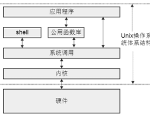

# 目录
<!-- vim-markdown-toc GFM -->

- [第一章、UNIX基础知识](#第一章unix基础知识)
  - [UNIX体系结构](#unix体系结构)
  - [登录](#登录)
  - [文件和目录](#文件和目录)
  - [输入和输出](#输入和输出)
  - [程序与进程](#程序与进程)
  - [出错处理](#出错处理)
  - [用户标识](#用户标识)
  - [信号](#信号)
  - [时间值](#时间值)
- [第二章、UNIX标准及实现](#第二章unix标准及实现)
  - [UNIX标准化](#unix标准化)
  - [限制](#限制)
- [第三章、文件I/O](#第三章文件io)
  - [文件描述符](#文件描述符)
  - [标识的位运算技巧](#标识的位运算技巧)
  - [不足值](#不足值)
- [第四章、文件与目录](#第四章文件与目录)
  - [文件信息](#文件信息)
    - [文件类型](#文件类型)
    - [权限](#权限)
  - [文件系统](#文件系统)
- [第八章、进程控制](#第八章进程控制)
- [第九章、进程关系](#第九章进程关系)
  - [作业控制](#作业控制)
  - [终端 TTY](#终端-tty)
  - [会话 SID](#会话-sid)
  - [进程组 PGID](#进程组-pgid)
- [信号](#信号-1)
- [线程](#线程)
- [附](#附)
  - [错误处理](#错误处理)
  - [标准与限制](#标准与限制)
  - [文件I/O](#文件io)
  - [文件与目录](#文件与目录)
    - [文件信息](#文件信息-1)
    - [目录](#目录)
    - [符号链接](#符号链接)
    - [设备文件](#设备文件)
    - [硬链接](#硬链接)
    - [权限](#权限-1)
    - [所有者](#所有者)
    - [文件日期](#文件日期)
  - [标准I/O](#标准io)
  - [系统数据文件和信息](#系统数据文件和信息)
    - [passwd](#passwd)
    - [shadow](#shadow)
    - [group](#group)
    - [hosts](#hosts)
    - [protocols](#protocols)
    - [services](#services)
    - [uname](#uname)
    - [时间](#时间)
  - [进程环境与进程关系](#进程环境与进程关系)
  - [进程控制](#进程控制)
  - [信号](#信号-2)
  - [线程](#线程-1)

<!-- vim-markdown-toc -->
# 第一章、UNIX基础知识
## UNIX体系结构


## 登录
&emsp;由login程序接收用户输入的“用户名”与“密码”，进行身份验证与授权。
然后根据`/etc/{passwd,shadow,group}`文件中的内容启动并设置shell。

## 文件和目录
&emsp; **文件系统** ：目录与文件的层次结构，起点称为“根(root)”。
通过挂载技术，文件系统可映射到不同的物理设备上。

&emsp; **文件名** ：每个文件的名字存在与其父目录的目录项中（目录项中还包含i-node）。
`.`与`..`为特殊文件名，且文件名还不能包含`/`。

&emsp; **路径名** ：文件名在不同目录下可具有相同的名字，需要用路径名唯一确定。
以`/`开头的路径名为绝对路径，否则为相对路径（相对路径与文件名形似）

&emsp; **工作目录** ：上述相对路径，相当于将当前的工作目录加在相对路径名前面形成绝对路径。

## 输入和输出
&emsp; **文件描述符** ：进程的信息之一，用来帮助进程标记一个文件。

&emsp; **标准文件描述符** ：`stdin, stdout, stderr`一般继承自shell并连接到终端设备。

&emsp; **终端输入** ：由内核驱动模块将键盘中的扫描码转换成字符再传送给程序。
其中有特殊字符，
* `NL`表示添加字符`\n`并冲刷输入内容；
* `CTRL-D`表示冲刷输入内容，若内容为空则表示结束输入即触发`EOF`。

## 程序与进程
&emsp; **程序与进程** ：进程是正在运行中的程序实例。

&emsp; **进程控制块** ：存储有进程的相关信息。
与环境变量不同在于，后者可由进程随意更改，故内核只查看前者。

&emsp; **进程控制** ：主要的函数调用有`fork, exec, wait、sleep、pause、exit`

&emsp; **线程** ：一个进程内的线程共享进程的控制块信息与虚拟内存

## 出错处理
&emsp; **errno** ：头文件`<errno.h>`中定义了左值`errno`及其相关常量（通常以`E`开头）。
多线程环境中，每个线程都拥有专属的局部`errno`。
两条重要规则，
* 若未出错则其值不会被清除
* 任何标准函数都不会将其置零

&emsp; **返回值** ：系统调用出错时大多数系统函数返回`-1`

## 用户标识
&emsp; **UID** ：一个UID可对应多个登录名（用户名），超级用户（root）的UID为0。

&emsp; **GID** ：以组的形式来管理多个用户的权限

&emsp; **附属GID** ：一个用户可加入多个组

## 信号
&emsp; **终端发送信号** ：
* `CTRL-C`：`SIGINT 2`
* `CTRL-\`：`SIGQUIT 3`
* `CTRL-Z`：`SIGTSTP 20`

&emsp; **信号处理** ：
* 忽略
* 默认
* 捕获并处理

## 时间值
&emsp; **日历时间** ：记录从Epoch（1970-1-1 00:00:00）起至今的秒数。
硬件中记录的可能是UTC时间，也可能是本地时间，通过系统调用可隐藏此细节。

&emsp; **进程时间** ：
* real  ：从进程启动到退出期间流逝的时间
* sys   ：进程进入内核态执行指令所花费的CPU时间
* user  ：进程在用户态中执行指令所花费的CPU时间

# 第二章、UNIX标准及实现
## UNIX标准化
`ISO C`、`IEEE POSIX`、`USU`标准规范了系统接口，通过C头文件的形式供程序调用

## 限制
UNIX系统实现了许多常量对系统的行为进行可移植性的标准化，包括：
* 编译时限制
* 与文件系统无关的运行时限制
* 与文件系统有关的运行时限制

# 第三章、文件I/O
## 文件描述符

* 文件描述符（进程唯一）
    * 描述符标识
        > 即`FD_CLOEXEC`：调用exec关闭该描述符
    * 文件表项指针
* 文件表项（系统共享）
    * 文件打开标识
    * 文件偏移量
        > 注意可能造成空洞，空洞可能不会占用实际磁盘块
    * v节点表项指针
* v节点表项
    > 与文件缓存缓冲区块关联，以执行原子操作
    * 文件系统相关i节点
    * 文件系统无关i节点

## 标识的位运算技巧
* 取值：`flag & mask`
* 置位：`flag | bit`
* 清除：`flag & ~bit`

## 不足值
* EOF
* 终端每行读取
* socket
* pipe,FIFO
* 面向记录设备
* 信号中断

# 第四章、文件与目录
## 文件信息
### 文件类型
将文件类型加入考虑后，读写目录与符号链接需要专门处理的函数

### 权限
将权限加入考虑后，许多函数需要满足某些权限才能正常工作

&emsp; **权限的判断顺序** ：
1. 若`EUID==0`则直接授权读写（不包括执行）
2. 若`EUID==OWNER`则进行适当权限判断，然后结束
3. 若`EGID==GROUP`则进行适当权限判断，然后结束
4. 若存在`附属GID==GROUP`则进行适当权限判断，然后结束
5. 否则使用OTHER权限进行适当权限判断，然后结束

&emsp; **权限的判断意义** ：
* 对于普通文件：
    * 读：可以读取其block中的内容
    * 写：可以更改其block中的内容
    * 执：可以使用exec函数加载并执行该（程序）文件
* 对于目录：
    * 读：可以读取其目录项（文件名与i-node）
    * 写：可以添加、删除或修改其目录项
    * 执：可以通过该目录作为相对路径访问其目录项所指向的文件
* 对于符号链接：
    * 一般权限为`777`且无法更改

&emsp; **文件的权限设置** ：
* 每个进程有个umask标识表示权限掩码，想要设置被掩盖的权限位则需要先更改umask
* 当非root进程写一个普通文件时，自动清除其SUID与SGID
* 创建新目录时，继承父目录的SGID（根据实现确定）

&emsp; **文件的所有者** ：
* ONWER为EUID
* GROUP为EGID。但若父目录设置SGID，则GROUP为父目录的GROUP

## 文件系统
&emsp; **硬盘文件系统结构** ：
* 超级块：存储整个文件系统的信息
* i-node：存储文件属性（包括block索引，不包括文件名）
* block ：包含文件内容

符号链接：文件内容为“路径名”的特殊文件。指向的文件可能不存在。

硬链接：指向某文件的目录项。  
当一文件的硬链接数为0且无进程正打开它，则文件判定为可删除。  
若一文件的硬链接数为0但有进程正打开它，则文件对其他进程不可见，且待最后一个打开它的进程结束后，文件被判定为可删除。

设备号：文件系统所在存储设备都由主、次设备号表示。

文件长度：只针对普通文件、目录文件、符号链接有效。
文件长度与文件占用的块大小可能并不一样（因为文件空洞与block指针），两者间的差别可判断文件是否空洞（整个块都为0则为空洞）

# 第八章、进程控制
进程的信息存储于进程控制块，环境变量可由用户更改而可能并非真实

| 进程信息      | fork子进程继承信息 | exec保留信息                                   |
|---------------|:------------------:|------------------------------------------------|
| UID, GID      |          1         | 1                                              |
| EUID, EGID    |          1         | 0 (依赖执行文件SUID与SGID)                     |
| SUID, SGID    |          1         | 0 (依赖EUID与EGID)                             |
| 附属GID       |          1         | 1                                              |
| PID           |          0         | 1                                              |
| PPID          |          0         | 1                                              |
| PGID          |          1         | 1                                              |
| SID           |          1         | 1                                              |
| PWD           |          1         | 1                                              |
| ROOTDIR       |          1         | 1                                              |
| UMASK         |          1         | 1                                              |
| FD            |          1         | 0 (依赖文件描述符FD_CLOEXEC)                   |
| ENV           |          1         | 0 (依赖exec参数)                               |
| VMEM          |          1         | 0                                              |
| LIMITS        |          1         | 1                                              |
| NICE          |          1         | 1                                              |
| SIGNAL_HANDLE |          1         | 0 (设置了处理函数的信号恢复默认，其余设置不变) |
| SIGNAL_MASK   |          1         | 1                                              |
| SIGNAL_SET    |          0         | 1                                              |
| alarm         |          0         | 1                                              |
| times         |          0         | 1                                              |
| 文件锁        |          0         | 1                                              |

# 第九章、进程关系
## 作业控制
&emsp;在交互shell中，执行命令的进程会拥有自己的、独立的、不同与shell的PGID，
而用管道连接的多个进程拥有相同的PGID。而每个进程组便是一个“作业”。  
&emsp;作业分为前台与后台，前台进程组号(TPGID)由TTY保存，其余均为后台进程组。
作业控制大都由终端驱动程序发送的信号构成。

## 终端 TTY
一个终端通常与一个进程会话相关联，并能辨别其中的前台进程组。

终端的作用：帮助进程与用户通过键盘、屏幕、网络进行交互

&emsp;终端驱动程序接收来自键盘的字符流（由键盘驱动程序负责将键盘扫描码转换为字符流）后，
送入某个适当的tty的读缓冲区供用户进程读取。  
&emsp;与此同时，将解析的ASCII编码转换后（方便用户观看）送给终端渲染程序 —— 如果终端设置了回显的话；
除此之外，还会将适当tty的写缓冲区（由用户进程写入）中的字符流送给终端渲染程序。  
&emsp;而终端渲染程序则根据ANSI规范，将字符流渲染为图形画面，最终呈现在屏幕上。
&emsp;简言之，终端驱动程序接收字符输入流，并发送字符输出流（回显、打印）。
同时为用户进程提供终端I/O缓冲区与作业控制（信号）。

终端驱动程序可以向打开它的进程发送信号来交流信息：
* 键盘输入`^C`，向前台进程组发送`SIGINT`
* 键盘输入`^Z`，向前台进程组发送`SIGTSTP`
* 键盘输入`^\`，向前台进程组发送`SIGQUIT`
* 检测到后台作业试图读取终端，向该作业发送`SIGTTIN`
* 检测到后台作业试图写入终端，向该作业发送`SIGTTOU`
* 检测到窗口调整，向前台进程组发送`SIGWINCH`
* 检测到连接挂断，向会话首进程发送`SIGHUP`
* 额外还有非信号：
    * 键盘输入`^M`时，冲刷缓冲区块
    * 键盘输入`^D`时，触发`EOF`
    * 键盘输入`^S`时，暂停打印与回显
    * 键盘输入`^Q`时，继续打印与回显

## 会话 SID
会话是进程组的集合，每个会话有一个会话首进程（调用setsid(3)），一个会话可以与一个终端进行关联。

新建会话的作用：用来切断与终端的联系，或新建与终端的联系

&emsp;那些不与终端联系，不属于用户会话的进程，即被称为Daemon（守护进程）。
通过fork后退出父进程然后子进程调用setsid即可形成。
若不像与用户会话脱离则不用退出父进程。
但是注意，退出了父进程但又不调用setsid，则可能形成孤儿进程组。

&emsp;用户登录时，由init程序启动getty程序来连接终端。
然后getty调用exec执行login提供用户登录界面，在执行login前会调用setsid建立会话。
login调用PAM来验证用户身份并授权，再为用户会话准备基础的、安全的环境。
然后再调用exec来执行shell（其argv[0]为"-sh"表示其为登录shell），shell加载配置以初始化环境。

## 进程组 PGID
进程组是进程的集合，每个进程组有一个组长进程（调用stdpgid(3)）

新建进程组的作用：脱离原来的进程组，避免信号连带影响对方。  
同一进程组的作用：可以使用信号来管理整个进程组

同一进程组：
* fork出的子进程与父进程同组
* shell中使用管道连接的多个进程也同属一个进程组（因为不会发生终端竞争）
* 非交互模式执行shell脚本时，shell与命令进程同属一个进程组

孤儿进程：某进程的父进程终止后，该进程成为孤儿进程，由init进程收养，防止形成僵尸进程。  

孤儿进程组：某进程组中的所有进程的父进程，没有一个是同会话中其他进程组的进程，
表示该进程组与同会话中的其他进程组缺乏联系了。
当孤儿进程组中有停止的进程时，内核向孤儿进程组发送信号`SIGHUP`与`SIGCONT`

# 信号
信号相关进程信息：
* SIGNAL_SET
    > 权限：只有发射UID或EUID匹配的进程（SIGCONT可发射给同一会话的所有进程）
* SIGNAL_MASK
    > 线程独立
* SIGNAL_HANDLE
    > 多线程中信号处理会占用一个线程的逻辑流

对于SIGCONT：  
处理停止信号（SIGTSTP、SIGSTOP、SIGTTIN、SIGTTOU）时，丢弃未决决的SIGCONT。
反之亦然。

安全处理信号：
* 只调用异步安全函数
* 保存和恢复errno
* 阻塞所有信号
* `volatile sig_atomic_t`
* 多次处理不排队的信号

# 线程
同步原语：
* 互斥量：读取-测试-上锁/阻塞
* 条件量：解锁-阻塞

线程独立数据主要有：
* 栈
* errno变量
* 调度优先级
* 信号屏蔽字

除此之外，绝大多数阻塞函数只针对调用线程阻塞

进程终止（所有线程终止）：
* main函数 **return**
    > 调用析构函数
* 调用exit
    > 不调用析构函数
* 终止信号默认处理
    > 不调用析构函数

单个线程终止：
* return
* pthread_exit（由主线程调用时会阻塞直到最后一个线程终止）
* pthread_cancle

# 附
## 错误处理
<!-- entry begin: strerror perror -->
```c
#include <string.h>
char* strerror(int errnum);                     // 返回errnum映射的字符串，未知errnum也会映射到提示字符
#include <stdio.h>
void perror(const char* msg);                   // 打印 "msg: " + strerror(errno)
```
<!-- entry end -->

## 标准与限制
<!-- entry begin: sysconf pathconf fpathconf -->
```c
#include <limits.h>
#include <unistd.h>
long sysconf(int name);                         // 返回对应限制值
long pathconf(const char* pathname, int name);  // 返回对应限制值
long fpathconf(int fd, int name);               // 返回对应限制值
```
* 若未特殊说明，则函数一般都会跟随符号链接
* 若未特殊说明，则at后缀函数支持`flag=AT_SYMLINK_NOFOLLOW`；否则仅支持特殊说明的flag
* 若未特殊说明，则at后缀函数都支持`fd=AT_FDCWD`
<!-- entry end -->

## 文件I/O
<!-- entry begin: open creat fcntl close dup lseek read write truncate sync fd oflag whence -->
**限制：**
| 常量         | 限制说明                           |
|--------------|------------------------------------|
| _PC_OPEN_MAX | 打开文件描述符数量                 |
| _PC_NAME_MAX | 文件名长度                         |
| _PC_PATH_MAX | 路径名长度                         |
| _PC_NO_TRUNC | 文件名或路径名超出限制是否直接截断 |

**errno：**
| 常量         | 说明                             |
|--------------|----------------------------------|
| ENAMETOOLONG | 文件名或路径名超出限制           |
| ESPIPE       | 对pipe,FIFO,socket设置文件偏移量 |

```c
#include <fcntl.h>
int     open(const char* path, int oflag, .../* mode_t mode */);            // 返回打开的文件描述符
int     openat(int fd, const char* path, int oflag, .../*mode_t mode */);   // 返回打开的文件描述符
int     creat(const char* path, mode_t mode);                               // 返回打开的文件描述符。相当于`O_WRONLY|O_CREAT|O_TRUNC`
int     fcntl(int fd, int cmd, .../* int arg */);                           // 返回待定

#include <unistd.h>
int     close(int fd);                                                      // 返回0
int     dup(int fd);                                                        // 返回新文件描述符（最小未占用），清除FD_CLOEXEC
int     dup2(int fd, int fd2);                                              // 返回新文件描述符（指定描述符），清除FD_CLOEXEC，合并close与dup为原子操作
off_t   lseek(int fd, off_t offset, int whence);                            // 返回新的偏移量。偏移量超过尾部可能产生文件空洞
ssize_t read(int fd, void* buf, size_t nbytes);                             // 返回读取的字节数，若遇EOF返回0
ssize_t write(int fd, const void* buf, size_t nbytes);                      // 返回已写的字节数
ssize_t pread(int fd, void* buf, size_t nbytes, off_t offset);              // 返回读取的字节数，若遇EOF返回0。合并lseek与read为原子操作且不更新文件偏移量
ssize_t pwrite(int fd, const void* buf, size_t nbytes, off_t offset);       // 返回已写的字节数。合并lseek与write为原子操作且不更新文件偏移量
int     truncate(const char* pathname, off_t length);                       // 返回0
int     ftruncate(int fd, off_t length);                                    // 返回0
void    sync(void);                                                         // 返回无。同步冲刷系统中所有文件块缓冲
int     fsync(int fd);                                                      // 返回0。冲刷指定文件
int     fdatasync(int fd);                                                  // 返回0。冲刷指定文件（仅数据）

/*
 * ***** fd ******
 * STDIN_FILENO
 * STDOUT_FILENO
 * STDERR_FILENO
 *
 * ***** oflag ******
 * O_RDONLY     前4个为互斥位，且必须选一个
 * O_WRONLY
 * O_RDWR
 * O_EXEC
 * O_TRUNC      直接清空文件内容
 * O_APPEND     每次写时自动原子性调整文件偏移量到文件末尾，但不会恢复之前偏移量
 * O_CLOEXEC    置位文件描述符标识位FD_CLOEXEC
 * O_CREAT      若文件不存在则自动创建，需要指定权限位
 * O_EXCL       若同时指定了O_CREAT，则若文件存在则出错
 * O_NOFOLLOW   若为符号链接则出错
 * O_DIRECTORY  若不为目录则出错
 * O_SYNC       数据与属性同步写入
 * O_DSYNC      数据同步写入
 * O_NONBLOCK
 * O_NOCTTY
 * O_TTY_INIT
 *
 * ***** cmd ******
 * F_DUPFD              返回新描述符。复制文件描述符，并清除FD_CLOEXEC
 * F_DUPFD_CLOEXEC      返回新描述符。复制文件描述符，并置位FD_CLOEXEC
 * F_GETFD              返回文件描述符标识（即FD_CLOEXEC）
 * F_SETFD              设置文件描述符标识（即FD_CLOEXEC）
 * F_GETFL              返回文件打开标识，前4个flag为互斥位而需要使用掩码O_ACCMODE
 * F_SETFL              设置文件打开标识，可以更改O_APPEND、O_NONBLOCK、O_SYNC、O_DSYNC
 * F_GETOWN             异步I/O所有权
 * F_SETOWN
 t F_GETLK              记录锁
 * F_SETLK
 * F_SETLKW
 *
 * ***** whence ******
 * SEEK_SET     文件开始处
 * SEEK_CUR     当前位置
 * SEEK_END     文件结尾处
*/
```
<!-- entry end -->

## 文件与目录
### 文件信息
<!-- entry begin: stat ft -->
```c
#include <sys/stat.h>
struct stat
{
    mode_t          st_mode;    // 文件类型及权限
    ino_t           st_ino;     // i-node
    dev_t           st_dev;     // 文件系统的设备号
    dev_t           st_rdev;    // 特殊文件的设备号
    nlink_t         st_nlink;   // 硬链接数
    uid_t           st_uid;     // UID
    gid_t           st_gid;     // GID
    off_t           st_size;    // 字节长度（只对普通文件、目录、符号链接有效）
    struct timespec st_atime;   // atime
    struct timespec st_mtime;   // mtime
    struct timespec st_ctime;   // ctime
    blksize_t       st_nlksize; // 最优I/O块大小
    blkcnt_t        st_blocks;  // 占用磁盘块数量（块大小为S_BLKSIZE）
};

int     stat(const char* restrict pathname, struct stat* restrict buf);                         // 返回0
int     lstat(const char* restrict pathname, struct stat* restrict buf);                        // 返回0，不跟随符号链接
int     fstat(int fd, struct stat* buf);                                                        // 返回0
int     fstatat(int fd, const char* restrict pathname, struct stat* restrict buf, int flag);    // 返回0

S_ISREG(st_mode);
S_ISDIR(st_mode);
S_ISLNK(st_mode);
S_ISFIFO(st_mode);
S_ISSOCK(st_mode);
S_ISBLK(st_mode);
S_ISCHR(st_mode);
```
<!-- entry end -->

### 目录
<!-- entry begin: 目录 mkdir rmdir chdir getcwd -->
```c
#include <sys/stat.h>
int     mkdir(const char* pathname, mode_t mode);               // 返回0，不自动建立不存在的目录
int     mkdirat(int fd, const char* pathname, mode_t mode);     // 返回0，不自动建立不存在的目录

#include <unistd.h>
int     rmdir(const char* pathname);                            // 返回0
int     chdir(const char* pathname);                            // 返回0
int     fchdir(int fd);                                         // 返回0
char*   getcwd(char* buf, size_t size);                         // 返回工作目录的真实绝对路径。原理即通过`..`层层向上递归到根来获取
int     chroot(const char* pathname);                           // 返回0。切换`/`所代指的路径（默认为系统`/`），只能由root调用，调用后该进程及其子进程则再无法恢复`/`了（因为隔离后根本无法指定原来的目录）
```
<!-- entry end -->

### 符号链接
<!-- entry begin: symlink readlink -->
```c
#include <unistd.h>
int     symlink(const char* actualpath, const char* sympath);                                   // 返回0
int     symlinkat(const char* actualpath,int fd, const char* sympath);                          // 返回0
ssize_t readlink(const char* restrict pathname, char* restrict buf, size_t bufsize)             // 返回读取字节数
ssize_t readlinkat(int fd, const char* restrict pathname, char* restrict buf, size_t bufsize)   // 返回读取字节数
```
<!-- entry end -->

### 设备文件
<!-- entry begin: major minor -->
```c
#include <sys/sysmacros.h>
major(st_dev);
minor(st_dev);
major(st_rdev);
minor(st_rdev);
```
<!-- entry end -->

### 硬链接
<!-- entry begin: link unlink remove rename  -->
```c
#include <unistd.h>
int     link(const char* existingpath, const char* newpath);                                    // 返回0。若epath为符号链接则创建符号链接
int     linkat(int efd, const char* existingpath, int nfd, const char* newpath, int flag);      // 返回0。若epath为符号链接则创建符号链接，flag可为AT_SYMLINK_FOLLOW表示强制创建硬链接
int     unlink(const char* pathname);                                                           // 返回0。不跟随符号链接
int     unlinkat(int fd, const char* pathname, int flag);                                       // 返回0。不跟随符号链接，flag可为AT_REMOVEDIR表示删除空目录
int     remove(const char* pathname);                                                           // 返回0。不跟随符号链接
int     rename(const char* oldname, const char* newname);                                       // 返回0。不跟随符号链接
int     frenameat(int oldfd, const char* pathname, int newfd, const char* newname);             // 返回0。不跟随符号链接
```
<!-- entry end -->

### 权限
<!-- entry begin: access umask chmod -->
```c
#include <unistd.h>
int     access(const char* pathname, int tmode);                                                // 返回0。按照实际的UID与GID进行权限判断
int     faccessar(int fd, const char* pathname, int tmode, int flag);                           // 返回0。设置flag为AT_EACCESS则使用EUID与EGID进行权限判断

#include <sys/stat.h>
mode_t  umask(mode_t mode);                                                                     // 返回之前umask。进程唯一（非本用户通用）
int     chmod(const char* pathname, mode_t mode);                                               // 返回0
int     fchmod(int fd, mode_t mode);                                                            // 返回0
int     fchmodat(int fd, const char* pathname, mode_t mode, int flag);                          // 返回0

/*
 * ***** tmode ******
 * F_OK
 * R_OK
 * W_OK
 * X_OK
 *
 * ***** mode ******
 * S_ISUID
 * S_ISGID
 * S_ISVTX
 * S_IRWXU
 *  S_IRUSR
 *  S_IWUSR
 *  S_IXUSR
 * S_IRWXG
 *  S_IRGRP
 *  S_IWGRP
 *  S_IXGRP
 * S_IRWXO
 *  S_IROTH
 *  S_IWOTH
 *  S_IXOTH
*/
```
<!-- entry end -->

### 所有者
<!-- entry begin: chown -->
```c
#include <unistd.h>
int chown(const char* pathname, uid_t owner, gid_t group);                      // 返回0
int lchown(const char* pathname, uid_t owner, gid_t group);                     // 返回0。不跟随符号链接
int fchown(int fd, uid_t owner, gid_t group);                                   // 返回0
int fchownat(int fd, const char* pathname, uid_t owner, gid_t group, int flag); // 返回0
```
<!-- entry end -->

### 文件日期
<!-- entry begin: utimes futimens -->
```c
#include <sys/time.h>
int utimes(const char* pathname, const struct timeval times[2]);                         // 返回0
int futimens(int fd, const struct timespec times[2]);                                    // 返回0
int utimensat(int fd, const char* pathname, const struct timespec times[2], int flag);   // 返回0

/*
 * ***** times ******
 * struct timeval {time_t tv_sec; long tv_usec;};
 * struct timespec {time_t tv_sec; long tv_nsec;};
 * times[0]表示atime，times[1]表示mtime
 *
 * 若times空指针表示设置为当前时间
 * 若times非空指针，且任一`tv_nsec`为`UTIME_NOW`，则设置当前时间
 * 若times非空指针，且任一`tv_nsec`为`UTIME_OMIT`，则保持时间不变
 *
 * 设置为当前时间时，需要权限：或owner、或root、或具有写权限
 * 设置为任意时间时，需要权限：或owner、或root
*/
```
<!-- entry end -->

## 标准I/O
<!-- entry begin: mkdtemp mkstemp -->
```c
#include <stdio.h>
char* mkdtemp(char* template);      // 利用template做文件名模板，创建临时目录并返回目录名
int   mkstemp(char* template);      // 利用template做文件名模板，创建临时文件并返回文件描述符
```
<!-- entry end -->

## 系统数据文件和信息
### passwd
<!-- entry begin: passwd apue -->
```c
#include <pwd.h>
struct passwd
{
    char*   pw_name;
    char*   pw_passwd;
    char*   pw_uid;
    char*   pw_gid;
    char*   pw_gecos;
    char*   pw_dir;
    char*   pw_shell;
};
struct passwd*  getpwuid(uid_t uid);        // 根据uid返回对应pawwd
struct passwd*  getpwnam(const char* name); // 根据username返回passwd
void            setpwent(void);             // 打开/etc/passwd，并将条款指针移动到初始位置
struct passwd*  getpwent(void);             // 返回当前指向的passwd(local-static)，自动后移指针
void            endpwent(void);             // 关闭打开的/etc/passwd
```
<!-- entry end -->
### shadow
<!-- entry begin: shadow -->
```c
#include <shadow.h>
struct spwd
{
    char*   sp_namp;
    char*   sp_pwdp;
    int     sp_lstchg;
    int     sp_min;
    int     sp_max;
    int     sp_warn;
    int     sp_inact;
    int     sp_expire;
    unsigned int sp_flag;
};
struct spwd*    getspnam(const char* name);
struct spwd*    getspent(void);
void            setspent(void);
void            getspent(void);
```
<!-- entry end -->
### group
<!-- entry begin: group -->
```c
#include <grp.h>
struct group
{
    char*   gr_name;
    char*   gr_passwd;
    int     gr_gid;
    char**  gr_mem;
};
struct group*   getgrgid(gid_t gid);
struct group*   getgrnam(const char* name);
void            setgrent(void);
struct group*   getgrent(void);
void            endgrent(void);
```
<!-- entry end -->

<!-- entry begin: 附数组 -->
**限制** ：
| 常量        | 说明             |
|-------------|------------------|
| NGROUPS_MAX | 附数组的最大数量 |
```c
#include <unistd.h>
int getgroups(int bufsize, gid_t gidlist[]);            // 返回存入的组的数量，若bufsize==0则只返回总的gid数
```
<!-- entry end -->

### hosts
<!-- entry begin: hosts -->
```c
#include <netdb.h>
struct hostnet
{
    int     h_addrtype;
    char**  h_addr_list;
    char**  h_aliases;
    int     h_length;
    char*   h_name;
};
```
<!-- entry end -->

### protocols
<!-- entry begin: protocols -->
```c
#include <netdb.h>
struct protoent
{
    char**  p_aliases;
    char*   p_name;
    int     p_proto;
};
```
<!-- entry end -->

### services
<!-- entry begin: services -->
```c
#include <netdb.h>
struct servent
{
    char**  s_aliases;
    char*   s_name;
    int     s_port;
    char*   s_proto;
};
```
<!-- entry end -->

### uname
**限制** ：
| 常量          | 说明           |
|---------------|----------------|
| HOST_NAME_MAX | 主机名最大长度 |
<!-- entry begin: uname -->
```c
#include <sys/utsname.h>
struct utsname
{
    char sysname[];     // 系统内核
    char nodename[];    // 网络主机名
    char release[];     // 内核版本
    char version[];     // 当前版本详细信息
    char machine[];     // 机器架构
}
int uname(struct utsname* name);                        // 返回非负
#include <unistd.h>
int gethostname(char* name, int namelen);               // 返回0
```
<!-- entry end -->
### 时间
<!-- entry begin: time gmtime localtime strftime mktime clock_gettime -->
```c
// 日期时间
#include <time.h>
time_t      time(time_t* calptr);                               // 返回时间值，若calptr非空则也会存储时间
struct tm*  gmtime(const time_t* calptr);                       // 返回UTC的tm*
struct tm*  localtime(const time_t* calptr);                    // 返回本地时区tm*
size_t      strftime(char* restrict buf,                        // 返回字符数
                    size_t maxsize,
                    const char* restrict format,
                    const struct tm* restrict tmptr);
size_t      strftime_l(char* restrict buf,                      // 返回字符数
                    size_t maxsize,
                    const char* restrict format,
                    const struct tm* restrict tmptr,
                    locale_t locale);
time_t      mktime(struct tm* tmptr);                           // 返回本地时区tm*对应time_t
char*       strptime(const char* restrict buf,                  // 返回下次解析位置的指针
                    const char* restrict format,
                    struct tm* restrict tmptr);

// 日期时间、单调时间、进程时间
#include <sys/time.h>
int clock_gettime(clockid_t clock_id, struct timespec* tsp);    // 返回0
int clock_getres(clockid_t clock_id, struct timespec* tsp);     // 返回0
int clock_settime(clockid_t clock_id, struct timespec* tsp);    // 返回0

/*
 ****** clock_id ******
 * CLOCK_REALTIME           std::chrono::system_clock
 * CLOCK_MONOTONIC          std::chrono::steady_clock
 * CLOCK_PROCESS_CPUTIME_ID
 * CLOCK_THREAD_CPUTIME_ID
*/

// 单调时间、进程时间
struct tms
{
    clock_t tms_utime;
    clock_t tms_stime;
    clock_t tms_cutime;
    clock_t tms_cstime;
};
clock_t times(struct tms* buf);                                 // 返回值为wall-clock，clock_t / sysconf(_SC_CLK_TCK)
```
<!-- entry end -->

## 进程环境与进程关系
<!-- entry begin: getenv setenv getpid -->
```c
#include <unistd.h>
char**  environ;
char*   getenv(const char* name);                                   // 返回value字符串，若出错返回NULL
int     setenv(const char* name, const char* value, int rewrite);   // 返回0
int     unsetenv(const char* name);                                 // 返回0
int     clearenv(void);                                             // 返回0

#include <unistd.h>
pid_t   getpid(void);                   // 返回PID
pid_t   getppid(void);                  // 返回PPID
pid_t   getpgid(pid_t pid);             // 返回PGID。pid==0表示获取调用进程的PGID
pid_t   getsid(pid_t pid);              // 返回SID（等价PID,PGID）。pid==0表示获取调用进程的SID
pid_t   tcgetpgrp(int fd);              // 返回TPGID

int     setpgid(pid_t pid, pid_t pgid); // 返回0。pid==0表示设置调用进程，pgid==0表示设置PGID为PID。只能设置调用进程及其子进程。
int     setsid(void);                   // 返回SID。调用进程不能是进程组组长
int     tcsetpgrp(int fd, pid_t pgid);  // 返回0。pgid必须属于同会话。若由后台进程组调用且其未忽略或阻塞SIGTTOU，则会发送SIGTTOU给该后台进程组
#include <termios.h>
pid_t   tcgetsid(int fd);               // 返回SID

#include <unistd.h>
char*   getlogin(void);                 // 返回登录名
uid_t   getuid(void);                   // 返回UID
uid_t   geteuid(void);                  // 返回EUID
gid_t   getgid(void);                   // 返回GID
gid_t   getegid(void);                  // 返回EGID


int     setuid(uid_t uid);              // 超级权限：同时设置euid,uid,suid
int     setgid(gid_t gid);              // 普通用户：只设置uid为euid,uid,suid之一
int     seteuid(uid_t uid);
int     setegid(gid_t gid);
```
<!-- entry end -->

## 进程控制
<!-- entry begin: fork exec nice wait -->
```c
#include <unistd.h>
pid_t   fork(void);                                                     // 父进程返回子进程PID，子进程返回0

int     execl(const char* pathname, const char* arg0, .../*(char*)0*/);
int     execlp(const char* pathname, const char* arg0, .../*(char*)0*/);
int     execle(const char* pathname, const char* arg0, .../*(char*)0, char*const envp[]*/);
int     execv(const char* filename, char* const argv[]);
int     execvp(const char* filename, char* const argv[]);
int     execve(const char* filename, char* const argv[], char*const envp[]);
int     fexecve(int fd, char* const argv[], char*const envp[]);

#include <sys/wait.h>
pid_t   wait(int* status);                                              // 返回子进程PID
pid_t   waitpid(pid_t pid, int* status, int options);                   // 返回进程PID，出错返回0，其他情况返回对应options
int     waitid(idtype_t idtype, id_t id, siginfo* infop, int options);
/*
 ****** pid ******
 * >0   指定子进程
 * 0    同进程组中的子进程
 * -1   任一子进程
 * <-1  等待绝对值所指的进程组中的进程
 *
 ****** waitpid options ******
 * WNOHANG      子进程若非立即可用，则直接返回
 * WCONTINUED   任一子进程停止后已继续，但尚未报告状态
 * WUNTRACED    任一子进程处于停止状态，但尚未报告状态
 *
 ****** status处理宏 ******
 * WIFEXITED(status)        WEXITSTATUS(status)
 * WIFSIGNALED(status)      WTERMSIG(status)    WCOREDUMP(status)
 * WIFSTOPPED(status)       WSTOPSIG(status)
 * WIFCONTINUED(status)
 *
 ****** idtype ******
 * P_PID
 * P_PGID
 * P_ALL
 *
 ****** waitid option *******
 * WEXITED          前3个互斥且必须选一个
 * WSTOPPED
 * WCONTINUED
 * WNOHANG
 * WNOWAIT
*/

#include <unistd.h>
void    _exit(int status);
#include <stdlib.h>
void    exit(int status);
int     atexit(void (*func)(void));                 // 返回0，若出错返回非0

#include <unistd.h>
int     nice(int incr);                             // 返回新友好值，incr范围0~(2*NZERO-1)，自动调节incr到范围内的值
#include <sys/resource.h>
int     getpriority(int which, id_t who);           // 返回新友好值，范围-NZERO~(NZERO-1)，若作用于多个进程，则返回优先级最高到（nice最小的）
int     setpriority(int which, id_t who, int value);

/*
 ****** which ******
 * PRIO_PROCESS
 * PRIO_PGRP
 * PRIO_USER
 *
 ****** who ******
 * 0
 * PID
 * PGID
 * UID
*/

```
<!-- entry end -->

## 信号
```c
#include <bash/signames.h> // 该头文件依赖signal.h
char *signal_names[NSIG + 4];                           // 信号名称数组
#include <string.h>
char*   strsignal(int signo);                           // 返回解释该信号的字符串
#include <signal.h>
int     sigemptyset(sigset_t* set);                     // 返回0
int     sigfillset(sigset_t* set);                      // 返回0
int     sigaddset(sigset_t* set, int signo);            // 返回0
int     sigdelset(sigset_t* set, int signo);            // 返回0
int     sigismember(const sigset_t* set, int signo);    // 返回true:false
int     kill(pid_t pid, int signo);                     // 返回0
int     raise(int signo);                               // 返回0
int     sigqueue(pid_t pid, int signo,
                const union sigval value);              // 发射实时可排队信号SIGMIN~SIGMAX
int     pthread_kill(pthread_t tid, int signo);         // 返回0，错误返回errno。signo为0用来测试线程是否存在

int     sigpending(sigset_t* set);                      // 返回0
int     sigprocmask(int how,
                    const sigset_t *restrict set,
                    sigset_t *restrict oldset);         // 返回0
int     pthread_sigmask(int how,
                        const sigset_t *restrict set,
                        sigset_t *restrict oleset);     // 返回0，错误返回errno

void    (*signal(int signo, void (*func)(int)))(int);   // 返回之前的Handler。处理时阻塞同类信号，处理后重启终端的系统调用，且不重置Handler
int     sigaction(int signo,
                const struct sigaction *restrict act,
                struct sigaction *restrict oldact);     // 返回0
struct sigaction
{
    void        (*sa_handler)(int signo);
    sigset_t    sa_mask;
    int         sa_flag;
    void        (*sa_sigaction)(int signo, siginfo_t* info, void* context);
}
/*
 * ***** how ******
 * SIG_BLOCK
 * SIG_UNBLOCK
 * SIG_SETMASK
 *
 * ***** sa_flag ******
 * SA_SIGINFO       使用sa_sigaction代替sa_handler
 * SA_RESTART       自动重启终端的系统调用
 * SA_INTERRUPT     不自动重启打断的系统调用（默认重启）
 * SA_RESETHAND     自动重置信号处理        （默认不重置）
 * SA_NODEFER       不自动阻塞相同信号      （默认阻塞）
 * SA_NOCLDSTOP     若signo为SIGCHLD则设置只在子进程终止而非停止时发送该信号
 * SA_NOCLDWAIT     若signo为SIGCHLD则设置不创建僵尸进程，若调用进程随后调用wait则需等待所有子进程终止
 * SA_ONSTACK       若用sigaltstack(2)已声明一个替换栈，则此信号递送给替换栈上的进程
*/

int             sigwait(const sigset_t *restrict set,
                        int *restrict signop);          // 返回0（阻塞线程）
int             sigsuspend(const sigset_t* sigmask);    // 返回0（阻塞线程）
#include <unistd.h>
int             pause(void)                             // 返回-1且errno置为EINTR。（阻塞线程）只有执行信号处理返回时返回
unsigned int    sleep(unsigned int seconds);            // 返回未休眠的秒数。（阻塞线程）超时或信号处理返回即返回
unsigned int    alarm(unsigned int seconds);            // 返回闹钟剩余秒数
#include <stdlib.h>
void            abort(void)                             // 发送SIGABRT给调用进程，处理函数返回则直接终止
int             system(const char* cmdstring);          // 返回shell命令行返回值（若shell的子进程被信号终止，则返回128+SIGNAL）。
                                                        // 同步调用，且期间阻塞SIGINT, SIGQUIT, SIGCHLD
```

## 线程
```c
#include <pthread.h>
int         pthread_equal(pthread_t tid1, pthread_t tid2);
pthread_t   pthread_self(void); 恐龙
int         pthread_create(pthread_t *restrict tidp,
                    const pthread_attr_t *restrict attr,
                    void* (*start_rtn)(void*),
                    void* restrict arg);
void        pthread_join(pthread_t tid, void** retv_ptr);
void        pthread_exit(void* retv_ptr);
int         pthread_cancle(pthread_t tid);
void        pthread_cleanup_push(void (*rtn)(void*), void* arg);    // 调用：1. pthread_exit 2. pthread_cancle 3. pthread_cleanup_pop(!0)
void        pthread_cleanup_pop(int execute);
int         pthread_detach(pthread_t tid);
int         pthread_attr_init(pthread_attr_t* attr);
int         pthread_attr_destroy(pthread_attr_t* attr);
int         pthread_attr_getdetachstate(const pthread_attr_t *,
                    int* detachstate);
int         pthread_attr_setdetachstate(pthread_attr_t *,
                    int* detachstate);                              // PTHREAD_CREATE_DETACHED、PTHREAD_CREATE_JOINABLE
int         pthread_setcancelstate(int state, int *oldstate);       // PTHREAD_CANCEL_ENABLE、PTHREAD_CANCEL_DISABLE
int         pthread_setcanceltype(int type, int *oldtype);          // PTHREAD_CANCLE_ASYNCHRONOUS、PTHREAD_CANCEL_DEFERRED
void        pthread_testcancel(void);                               // 手动产生cancel点
```
