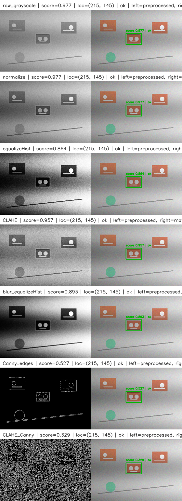

# OpenCV

## Read/write/display images/videos

## Image/Color process

## Template matching

- cv2.TM_CCOEFF
- cv2.TM_SQDIFF

## Feature detection

- SIFT
- AKAZE
- ORB

## Feature matching

- BFMatcher
- FLANN
- KNN + ratio test

## Object track
