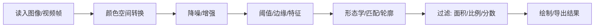

# OpenCV

- [OpenCV](#opencv)
  - [定位](#定位)
  - [数据模型](#数据模型)
  - [读写与显示](#读写与显示)
  - [颜色与通道](#颜色与通道)
  - [几何变换](#几何变换)
  - [滤波与边缘](#滤波与边缘)
  - [阈值与形态学](#阈值与形态学)
  - [轮廓 Contour](#轮廓-contour)
  - [模板匹配 Template matching](#模板匹配-template-matching)
  - [特征点 Feature](#特征点-feature)
  - [特征匹配 Feature matching](#特征匹配-feature-matching)
  - [视频与跟踪](#视频与跟踪)
  - [Camera calibration](#camera-calibration)
  - [DNN](#dnn)
  - [常见坑](#常见坑)
  - [典型流程](#典型流程)

## 定位

OpenCV 是传统 computer vision 工具箱，核心不是“理解图片”，而是提供大量图像/视频处理算子。

- 输入：image、video frame，本质是矩阵
- 输出：处理后的矩阵、几何结果、检测框、特征点、匹配关系等
- Python 中常用包名：`cv2`
- 深度学习相关功能主要在 `cv2.dnn`，但训练模型通常不用 OpenCV

## 数据模型

OpenCV Python 图像就是 `numpy.ndarray`。

| 概念     | 形式        | 说明                             |
| -------- | ----------- | -------------------------------- |
| 灰度图   | `(h, w)`    | 单通道                           |
| 彩色图   | `(h, w, 3)` | 默认通道顺序是 `BGR`，不是 `RGB` |
| 带透明图 | `(h, w, 4)` | 常见顺序 `BGRA`                  |
| 坐标     | `(x, y)`    | API 常用，`x` 横向、`y` 纵向     |
| 数组索引 | `img[y, x]` | `row = y`，`col = x`             |
| 常用类型 | `uint8`     | 像素范围 `0..255`                |

```python
import cv2
import numpy as np

img = cv2.imread("input.png")      # ndarray, BGR, uint8
h, w = img.shape[:2]
pixel = img[y, x]                  # 注意索引顺序是 [y, x]
```

## 读写与显示

```python
img = cv2.imread("input.jpg", cv2.IMREAD_COLOR)
gray = cv2.imread("input.jpg", cv2.IMREAD_GRAYSCALE)

cv2.imwrite("output.png", img)

cv2.imshow("win", img)
cv2.waitKey(0)
cv2.destroyAllWindows()
```

常用 `imread` flag：

| Flag                   | 说明                        |
| ---------------------- | --------------------------- |
| `cv2.IMREAD_COLOR`     | 读成 `BGR`，默认            |
| `cv2.IMREAD_GRAYSCALE` | 读成灰度图                  |
| `cv2.IMREAD_UNCHANGED` | 保留 alpha/depth 等原始信息 |

视频读写：

```python
cap = cv2.VideoCapture(0)          # 摄像头；也可以传视频路径

while cap.isOpened():
    ok, frame = cap.read()
    if not ok:
        break

    cv2.imshow("frame", frame)
    if cv2.waitKey(1) & 0xFF == ord("q"):
        break

cap.release()
cv2.destroyAllWindows()
```

## 颜色与通道

OpenCV 默认 `BGR`，而 `matplotlib`/PIL 通常使用 `RGB`。

```python
rgb = cv2.cvtColor(img, cv2.COLOR_BGR2RGB)
gray = cv2.cvtColor(img, cv2.COLOR_BGR2GRAY)
hsv = cv2.cvtColor(img, cv2.COLOR_BGR2HSV)

b, g, r = cv2.split(img)
merged = cv2.merge([b, g, r])
```

常用颜色空间：

| Color space | 用途                             |
| ----------- | -------------------------------- |
| `GRAY`      | 边缘、阈值、特征检测前常用       |
| `HSV`       | 按颜色分割更稳定，常用 `inRange` |
| `RGB`       | 显示、和 PIL/matplotlib 互操作   |
| `Lab`       | 颜色校正、亮度和色彩分离         |

颜色分割：

```python
hsv = cv2.cvtColor(img, cv2.COLOR_BGR2HSV)
mask = cv2.inRange(hsv, lowerb=(35, 50, 50), upperb=(85, 255, 255))
result = cv2.bitwise_and(img, img, mask=mask)
```


## 几何变换

| API                   | 作用          | 记忆点                        |
| --------------------- | ------------- | ----------------------------- |
| `cv2.resize`          | 缩放          | `dsize=(w, h)`                |
| `cv2.flip`            | 翻转          | `0` 上下，`1` 左右，`-1` 同时 |
| `cv2.rotate`          | 旋转 90° 倍数 | 简单旋转                      |
| `cv2.warpAffine`      | 仿射变换      | 平移、旋转、缩放、错切        |
| `cv2.warpPerspective` | 透视变换      | 四点矫正、鸟瞰图              |

```python
small = cv2.resize(img, (640, 360), interpolation=cv2.INTER_AREA)

M = cv2.getRotationMatrix2D(center=(w / 2, h / 2), angle=30, scale=1.0)
rotated = cv2.warpAffine(img, M, (w, h))
```

`dsize` 基本都写成 `(width, height)`，但 `shape` 是 `(height, width, channels)`。

## 滤波与边缘

滤波用于降噪、平滑、突出边缘或纹理。

| API                   | 作用       | 典型场景                     |
| --------------------- | ---------- | ---------------------------- |
| `cv2.blur`            | 均值滤波   | 简单平滑                     |
| `cv2.GaussianBlur`    | 高斯滤波   | 去除高斯噪声，边缘检测前常用 |
| `cv2.medianBlur`      | 中值滤波   | 椒盐噪声                     |
| `cv2.bilateralFilter` | 双边滤波   | 保边去噪，较慢               |
| `cv2.Sobel`           | 一阶梯度   | 横/纵边缘                    |
| `cv2.Laplacian`       | 二阶梯度   | 边缘、锐化                   |
| `cv2.Canny`           | Canny edge | 常用边缘检测                 |

```python
gray = cv2.cvtColor(img, cv2.COLOR_BGR2GRAY)
blur = cv2.GaussianBlur(gray, (5, 5), 0)
edges = cv2.Canny(blur, threshold1=50, threshold2=150)
```

## 阈值与形态学

阈值把图像变成 binary mask；形态学用于修补 mask。

```python
gray = cv2.cvtColor(img, cv2.COLOR_BGR2GRAY)
_, binary = cv2.threshold(gray, 127, 255, cv2.THRESH_BINARY)

adaptive = cv2.adaptiveThreshold(
    gray, 255,
    cv2.ADAPTIVE_THRESH_GAUSSIAN_C,
    cv2.THRESH_BINARY,
    blockSize=11,
    C=2,
)
```

| API                                  | 作用   | 直觉                    |
| ------------------------------------ | ------ | ----------------------- |
| `cv2.erode`                          | 腐蚀   | 白色区域变小，去小白点  |
| `cv2.dilate`                         | 膨胀   | 白色区域变大，补洞/连接 |
| `cv2.morphologyEx(..., MORPH_OPEN)`  | 开运算 | 先腐蚀后膨胀，去噪点    |
| `cv2.morphologyEx(..., MORPH_CLOSE)` | 闭运算 | 先膨胀后腐蚀，补小洞    |

```python
kernel = cv2.getStructuringElement(cv2.MORPH_RECT, (3, 3))
clean = cv2.morphologyEx(binary, cv2.MORPH_OPEN, kernel)
```

## 轮廓 Contour

Contour 是 binary image 中连通边界点的集合，常用于找物体外框、面积、中心点。

```python
contours, hierarchy = cv2.findContours(
    binary,
    cv2.RETR_EXTERNAL,
    cv2.CHAIN_APPROX_SIMPLE,
)

for cnt in contours:
    area = cv2.contourArea(cnt)
    if area < 100:
        continue

    x, y, w, h = cv2.boundingRect(cnt)
    cv2.rectangle(img, (x, y), (x + w, y + h), (0, 255, 0), 2)
```

常用 API：

| API                | 说明             |
| ------------------ | ---------------- |
| `cv2.contourArea`  | 面积             |
| `cv2.arcLength`    | 周长             |
| `cv2.boundingRect` | 水平外接矩形     |
| `cv2.minAreaRect`  | 最小旋转外接矩形 |
| `cv2.approxPolyDP` | 多边形拟合       |
| `cv2.moments`      | 矩，可算中心点   |

## 模板匹配 Template matching

适合“目标外观几乎固定”的场景：按钮、图标、小图块。不适合尺度/旋转/光照变化很大的目标。

```python
gray = cv2.cvtColor(img, cv2.COLOR_BGR2GRAY)
tpl = cv2.imread("template.png", cv2.IMREAD_GRAYSCALE)
th, tw = tpl.shape[:2]

score = cv2.matchTemplate(gray, tpl, cv2.TM_CCOEFF_NORMED)
_, max_val, _, max_loc = cv2.minMaxLoc(score)

if max_val > 0.8:
    x, y = max_loc
    cv2.rectangle(img, (x, y), (x + tw, y + th), (0, 255, 0), 2)
```

匹配方法：

| Method                 | 分数含义        | 备注         |
| ---------------------- | --------------- | ------------ |
| `cv2.TM_CCOEFF`        | 越大越像        | 相关系数     |
| `cv2.TM_CCOEFF_NORMED` | 越接近 `1` 越像 | 最常用之一   |
| `cv2.TM_SQDIFF`        | 越小越像        | 平方差       |
| `cv2.TM_SQDIFF_NORMED` | 越接近 `0` 越像 | 注意方向相反 |

## 特征点 Feature

Feature = keypoint + descriptor。

- `keypoint`：图像中稳定、可重复找到的位置，例如角点、斑点
- `descriptor`：描述 keypoint 附近纹理的向量，用于匹配

| 算法    | Descriptor | 特点                          |
| ------- | ---------- | ----------------------------- |
| `SIFT`  | float      | 稳定、效果好、较慢            |
| `AKAZE` | binary     | 非线性尺度空间，速度/效果折中 |
| `ORB`   | binary     | 快、免费、常用实时场景        |

```python
gray = cv2.cvtColor(img, cv2.COLOR_BGR2GRAY)

detector = cv2.ORB_create(nfeatures=1000)
keypoints, descriptors = detector.detectAndCompute(gray, None)

vis = cv2.drawKeypoints(img, keypoints, None, color=(0, 255, 0))
```

选择经验：

- 追求鲁棒性：先试 `SIFT`
- 实时或移动端：先试 `ORB`
- 纯色/低纹理区域：特征点天然少，可能需要 contour/template/深度学习

## 特征匹配 Feature matching

目标：把两张图中的 descriptor 配对，用于图像拼接、定位、目标识别、homography。

| Matcher            | 适合                 | 距离                     |
| ------------------ | -------------------- | ------------------------ |
| `BFMatcher`        | 数据少、简单可靠     | 暴力比对                 |
| `FLANN`            | 数据多、更快近似搜索 | 需按 descriptor 类型配置 |
| `KNN + ratio test` | 过滤误匹配           | Lowe's ratio test        |

```python
sift = cv2.SIFT_create()
kp1, des1 = sift.detectAndCompute(gray1, None)
kp2, des2 = sift.detectAndCompute(gray2, None)

index_params = dict(algorithm=1, trees=5)    # FLANN_INDEX_KDTREE, 适合 float descriptor
search_params = dict(checks=50)
flann = cv2.FlannBasedMatcher(index_params, search_params)
pairs = flann.knnMatch(des1, des2, k=2)

good = []
for m, n in pairs:
    if m.distance < 0.75 * n.distance:   # ratio test
        good.append(m)
```

`knnMatch` 返回值 `pairs` 不是 `ndarray`，而是近似二维的 match list：

- 形状可理解为 `(len(des1), k)`；这里 `k=2`，所以每个 `des1[i]` 找 `2` 个最近的 `des2`。
- `pairs[i]` 是第 `i` 个 query descriptor 的候选匹配列表，通常形如 `[m, n]`。
- `m`/`n` 是 `cv2.DMatch` 对象。
- 实际使用时可能某些 `pairs[i]` 少于 `k` 个匹配，严谨代码要先检查长度。

| `DMatch` 字段 | 含义                      |
| ------------- | ------------------------- |
| `queryIdx`    | `des1`/`kp1` 中的索引     |
| `trainIdx`    | `des2`/`kp2` 中的索引     |
| `distance`    | descriptor 距离，越小越像 |

Descriptor 和 distance 要匹配：

| Descriptor                      | 常用距离           |
| ------------------------------- | ------------------ |
| `SIFT`/`SURF` float descriptor  | `cv2.NORM_L2`      |
| `ORB`/`AKAZE` binary descriptor | `cv2.NORM_HAMMING` |

用匹配点估计透视变换：

```python
if len(good) >= 4:
    src = np.float32([kp1[m.queryIdx].pt for m in good]).reshape(-1, 1, 2)
    dst = np.float32([kp2[m.trainIdx].pt for m in good]).reshape(-1, 1, 2)
    H, mask = cv2.findHomography(src, dst, cv2.RANSAC, 5.0)
```

`findHomography` 两个返回值：

| 返回值 | 含义                    | 备注                                                                                        |
| ------ | ----------------------- | ------------------------------------------------------------------------------------------- |
| `H`    | `3x3` homography matrix | 把 `src` 平面点映射到 `dst` 平面点；失败时可能是 `None`                                     |
| `mask` | inlier mask             | 形状通常是 `(N, 1)`，第 `i` 项对应第 `i` 对匹配点；`1` 表示 RANSAC 认为是内点，`0` 表示外点 |

`H` 使用 homogeneous coordinates：

$$
\begin{bmatrix} x' \\ y' \\ w' \end{bmatrix}
= H
\begin{bmatrix} x \\ y \\ 1 \end{bmatrix},
\quad
(u, v)=\left(\frac{x'}{w'}, \frac{y'}{w'}\right)
$$

`mask` 常用于只保留可靠匹配点，例如画匹配结果时过滤 outlier。

为什么 `findHomography` 前要 `reshape(-1, 1, 2)`：

- `[kp.pt ...]` 先得到的是普通点列表，转成 `np.float32` 后形状通常是 `(N, 2)`。
- OpenCV 很多几何 API 接收 point set 的惯用形状是 `(N, 1, 2)`，等价于 `N` 个二维点，每个点有一个 `x, y` 坐标。
- `-1` 表示让 numpy 自动推断点数 `N`；`1` 是 OpenCV point array 的中间维；`2` 表示二维坐标。
- `findHomography` 实际只需要两组一一对应的 2D points；reshape 不改变点值，只是改成 OpenCV 更稳定识别的输入格式。

## 视频与跟踪

视频处理本质是逐帧 image processing。

```python
cap = cv2.VideoCapture("input.mp4")
fps = cap.get(cv2.CAP_PROP_FPS)
w = int(cap.get(cv2.CAP_PROP_FRAME_WIDTH))
h = int(cap.get(cv2.CAP_PROP_FRAME_HEIGHT))
```

常见跟踪思路：

| 方法                       | 适合场景           | 备注                              |
| -------------------------- | ------------------ | --------------------------------- |
| Background subtraction     | 固定摄像头运动检测 | `createBackgroundSubtractorMOG2`  |
| Optical flow               | 短时运动估计       | `calcOpticalFlowPyrLK`            |
| `TrackerKCF`/`TrackerCSRT` | 单目标跟踪         | 不同 OpenCV 版本 API 位置可能不同 |
| Detect-by-frame            | 每帧检测           | 更稳但依赖检测器速度              |

## Camera calibration

用于估计相机内参和畸变参数，解决镜头畸变、像素坐标到相机坐标的转换问题。

核心参数：

- Camera matrix：焦距 `fx/fy`、主点 `cx/cy`
- Distortion coefficients：径向/切向畸变
- Extrinsics：相机相对标定板或世界坐标的 `R/t`

常用 API：

| API                         | 说明              |
| --------------------------- | ----------------- |
| `cv2.findChessboardCorners` | 找棋盘格角点      |
| `cv2.cornerSubPix`          | 亚像素角点优化    |
| `cv2.calibrateCamera`       | 标定相机          |
| `cv2.undistort`             | 去畸变            |
| `cv2.solvePnP`              | 由 3D-2D 点求位姿 |

## DNN

`cv2.dnn` 主要用于加载并推理已有模型，不常用于训练。

```python
net = cv2.dnn.readNet("model.onnx")
blob = cv2.dnn.blobFromImage(img, scalefactor=1 / 255.0, size=(640, 640), swapRB=True)
net.setInput(blob)
out = net.forward()
```

关键点：

- `blobFromImage` 会做 resize、归一化、通道转换、维度变换
- `swapRB=True` 常用于把 OpenCV 的 `BGR` 转成模型常用的 `RGB`
- 后处理通常仍要自己写：decode boxes、NMS、坐标缩放回原图

## 常见坑

- `BGR`/`RGB` 混淆：显示颜色不对时优先查这个
- `shape` 是 `(h, w, c)`，很多 API 参数是 `(w, h)`
- 图像索引是 `img[y, x]`，绘图坐标是 `(x, y)`
- `uint8` 运算会截断/溢出；复杂计算可先转 `float32`
- `cv2.findContours` 要输入 binary image，不是普通彩色图
- `cv2.threshold` 返回 `(ret, dst)`，常写 `_, binary = ...`
- 模板匹配的 `TM_SQDIFF*` 是越小越好，其他常用方法多是越大越好
- `imshow` 后必须 `waitKey`，否则窗口可能不刷新
- `opencv-python` 和 `opencv-contrib-python` 不要同时混装；需要额外模块时装 contrib 版
- 不同 OpenCV 版本中 tracker API 可能在 `cv2` 或 `cv2.legacy`

## 典型流程

传统 CV 任务常按以下顺序试：



经验判断：

- 目标颜色明显：`HSV + inRange + morphology + contour`
- 目标外观固定：`matchTemplate`
- 目标有纹理且角度变化：`SIFT/ORB + matcher + homography`
- 目标语义复杂：用深度学习检测/分割模型，OpenCV 负责读写、预处理、后处理
