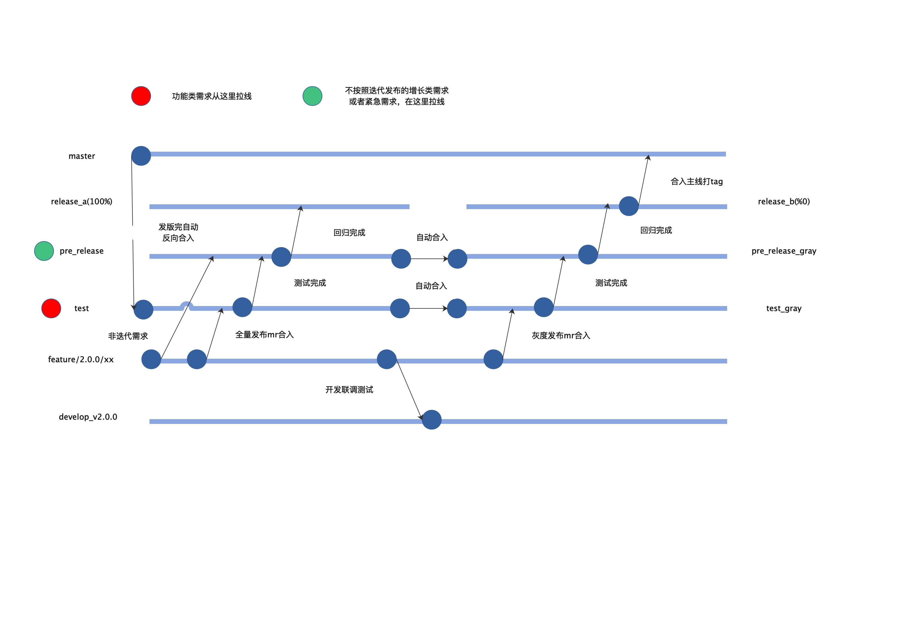

# 整体架构
## 分支管理

## 灰度策略
* 这个版本A集群是灰度，B中流量慢慢导向A，B中完全导向A后则完全灰度发版
* 此时流量都在A，则A应该为下个版本非灰度，B为灰度。如此来回切换。

# 业务流程
1. 创建需求单：使用通用模板创建需求单，尽量拆分为小需求并将需求描述清楚，关联开发者
2. 设计阶段：预先设计解耦代码模块，以及各层接口（主要前端接口与数据库）
3. 开发阶段：从test拉线且前后端创建同名新分支
4. 联调阶段：将工作区修改提交，再合并到dev分支，然后将dev分支推送到远程仓库，利用ssh与mysql客户端连入服务器部署环境
5. 准备提测：将分支推送到远程仓库，并申请向test|test_gray分支的合并请求，管理员review之后并入
6. 提测阶段：触发提测流水线部署test|test_gray环境（可能需要手动部署）并关联相应需求单，然后流转需求单状态为“需求转测试”
7. 测试阶段：确认测试环境部署完备后，拉群通知测试，接下来的阶段中出现任何缺陷都需要跟进并流转缺陷单
8. 预发布阶段：将test|test_gray并入pre_release|pre_release_gray并部署预发布环境再次测试
9. 发布阶段：将pre_release|pre_release_gray并入release_a|release_b并部署正式线上发布环境（AB环境并不固定是否为灰度环境）
10. 完全灰度：将灰度分支并入master，并反向合入test

# 设计经验
* 接口字段类型
    * 对于API接口的状态字段，需要使用可读性更好的字符类型而非数字类型
    * 对于数据库的状态字存储类型，尽量使用枚举类型以提高可读性

* 分层模式
    * controller负责
        * 解析报文
        * 控制响应, 完善的报错消息
        * 记录操作日志
    * bussiness负责
        * 封装复杂业务逻辑
        * 入库数据有效性校验
        * 过滤并转换处理从数据库读出的数据
    * model负责
        * 提供数据库model结构
        * 提供数据库CRUD操作接口

# 开发工具
* 进程管理：htop
* 集成开发：vscode-neovim、spacevim
* 版本管理：vscode-gitlens、git + tig
* 接口测试：postman
* 数据查询：DBeaver
* 缓存查询：AnotherRedisDesktopManager
* 渗透抓包：wireshark
