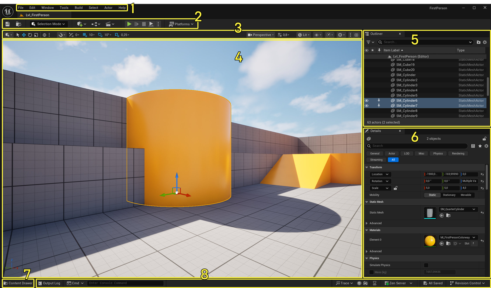

# Unreal Engine

## Project Structure

> [Epic C++ Coding Standard](https://dev.epicgames.com/documentation/en-us/unreal-engine/epic-cplusplus-coding-standard-for-unreal-engine)

UE 项目结构围绕 project descriptor、module、target、asset 目录组织：

- `.uproject`: project descriptor，记录 module、plugin、engine association 等
- `Source/`: C++ source，按 module 拆分
- `Content/`: `.uasset` / `.umap` 等项目资产，通常挂载到 `/Game/`
- `Config/`: `.ini` 配置，按层级覆盖
- `Plugins/`: 项目级 plugin，每个 plugin 可有自己的 `Source/`、`Content/`
- `Intermediate/`: UBT / UHT 生成的中间文件，不应依赖或提交
- `Binaries/`: 编译产物，通常不提交
- `Saved/`: log、autosave、local config、crash data，通常不提交
- `DerivedDataCache/`: shader、texture 等派生缓存，可再生成

关键边界：

| 概念    | 文件                     | 作用                                        |
| ------- | ------------------------ | ------------------------------------------- |
| Project | `.uproject`              | 项目描述，声明 module、plugin、Engine 版本  |
| Plugin  | `.uplugin`               | 可复用功能包，可包含 code module 和资产     |
| Target  | `*.Target.cs`            | 最终构建目标，如 Game / Editor / Server     |
| Module  | `*.Build.cs` + `Source/` | C++ 编译、链接、加载单元                    |
| Package | `.uasset` / `.umap`      | 资产序列化单元，运行时通过 object path 引用 |

典型 C++ 项目结构：

```text
MyProject/
  MyProject.uproject
  Config/
    DefaultEngine.ini
    DefaultGame.ini
  Content/
  Source/
    MyProject.Target.cs
    MyProjectEditor.Target.cs
    MyProject/
      MyProject.Build.cs
      Public/
      Private/
    MyProjectEditor/
      MyProjectEditor.Build.cs
      Private/
  Plugins/
    MyPlugin/
      MyPlugin.uplugin
      Source/
        MyPlugin/
        MyPluginEditor/
```

### Module

`Module` 是 UE 的 C++ 编译、链接和加载单元，不是 C++20 `module`，也不是 namespace。
项目和 plugin 都可以包含多个 module。

常见拆法：

- Runtime module: gameplay / runtime code，可进入 packaged build
- Editor module: editor-only 工具代码，不应进入 packaged build
- Plugin module: plugin 内的 runtime / editor code

`*.Build.cs`：

- 由 `Unreal Build Tool` 读取，声明依赖、include path、编译选项
- `PublicDependencyModuleNames`: public header 暴露了依赖 module 的类型 / 函数时使用
- `PrivateDependencyModuleNames`: 只在 `.cpp` 或 private header 中使用依赖时使用，优先选这个
- `Public/`: 对其他 module 暴露的 header
- `Private/`: module 内部实现和内部 header

| 场景                                 | 放法                           |
| ------------------------------------ | ------------------------------ |
| gameplay runtime code                | Runtime module                 |
| 自定义 editor panel、asset action    | Editor module                  |
| public header 用到了依赖 module 类型 | `PublicDependencyModuleNames`  |
| 只有 `.cpp` 使用依赖 module          | `PrivateDependencyModuleNames` |
| 需要被其他 module include 的 API     | 放 `Public/`                   |
| 只给本 module 使用的实现细节         | 放 `Private/`                  |

加载入口：

- 默认 game module 通常用 `IMPLEMENT_PRIMARY_GAME_MODULE`
- 普通 module 可实现 `IModuleInterface`
- `StartupModule()`: module 加载后注册类型、菜单、扩展点等
- `ShutdownModule()`: module 卸载前清理注册项
- runtime module 不应依赖 `UnrealEd` 等 editor-only module
- 少量 editor 条件代码可用 `#if WITH_EDITOR`，复杂工具逻辑应拆 Editor module

### Target

`Target` 定义最终构建目标，决定编译哪些 module、以什么规则编译。

- `MyProject.Target.cs`: game/runtime target
- `MyProjectEditor.Target.cs`: editor target，可包含 Editor module
- 常见 target type: `Game`、`Editor`、`Client`、`Server`
- `Target.cs` 管 project-level build；`Build.cs` 管 module-level build

## Runtime System

UE Runtime 的核心不是普通 C++ class hierarchy，而是 `UObject`、Reflection、Serialization、GC、Blueprint、Assets 共同组成的对象系统。
原生 C++ 和 `UObject` 体系可以混用，但构造规则、生命周期、指针语义和反射可见性不同。
理解 UE 代码时先判断对象属于普通 C++、`UObject`、`AActor` / `UActorComponent`，再判断它由谁创建、持有、序列化和回收。

### UObject

`UObject` 是 UE runtime object model 的基础，提供：

- Reflection / metadata
- Serialization / asset loading
- Garbage Collection
- Network Replication 基础能力
- Blueprint 暴露与调用
- Class Default Object（`CDO`）和默认属性系统

#### 反射

UE Reflection 由 `UnrealHeaderTool` 解析宏生成元数据，不是标准 C++ RTTI。

| Macro          | 用途                                       |
| -------------- | ------------------------------------------ |
| `UCLASS()`     | 声明 `UObject` 派生类                      |
| `UINTERFACE()` | 声明 UE Interface                          |
| `USTRUCT()`    | 声明可反射结构体                           |
| `UENUM()`      | 声明可反射枚举                             |
| `UPROPERTY()`  | 属性暴露、序列化、GC 引用跟踪、Replication |
| `UFUNCTION()`  | 函数暴露、RPC、Blueprint 调用              |
| `UPARAM()`     | 修饰函数参数                               |
| `UDELEGATE()`  | 声明 delegate 类型                         |

常见 specifier：

- `BlueprintType`: 类型可作为 Blueprint 变量
- `Blueprintable`: 类可被 Blueprint 继承
- `BlueprintReadOnly` / `BlueprintReadWrite`: 属性可读 / 可写
- `EditDefaultsOnly`: 只在 Class Default / Blueprint 默认值中编辑
- `EditInstanceOnly`: 只在 instance 上编辑
- `EditAnywhere`: 默认值和 instance 都可编辑
- `VisibleAnywhere`: 可见但不可编辑
- `Transient`: 不序列化到磁盘
- `Replicated`: 属性参与网络复制

#### 构造

**C++ constructor 与 CDO**

- 每个 `UClass` 有一个 Class Default Object（`CDO`），保存该 class 的默认属性
- 同一个 C++ constructor 会用于构造 CDO 和创建 instance；不要假设 `this` 一定是 gameplay instance
- `UObject` constructor 不支持自定义参数；运行时参数通常用 setter / init function / deferred spawn 传入
- Blueprint class 的默认值也会体现在对应 generated class / CDO 上
- 普通 instance 会从 class default / archetype 拷贝默认属性，再进入后续初始化流程
- constructor 适合设置 native 默认值和 default subobject，不适合做 gameplay 初始化
- constructor 中不要依赖 `World`、运行时 Actor 关系、Editor 中配置好的 instance 值
- `CreateDefaultSubobject<T>()` 只应在 constructor 中调用，常用于创建默认 `UActorComponent`

**构造途径**

| 目标                       | API                                                   | 要点                                      |
| -------------------------- | ----------------------------------------------------- | ----------------------------------------- |
| default subobject          | `CreateDefaultSubobject<T>()`                         | 只在 constructor 中用，成为 class 默认结构 |
| 普通 `UObject`             | `NewObject<T>(Outer)`                                 | 运行时创建，必须考虑 `Outer` 和 GC 可达性 |
| `AActor`                   | `UWorld::SpawnActor<T>()`                             | Actor 由 `UWorld` 管理，不用 `NewObject`  |
| 延迟初始化 `AActor`        | `SpawnActorDeferred<T>()` + `FinishSpawningActor()`   | spawn 后、construction 前设置参数         |
| 加载已有 asset / object    | `LoadObject<T>()` / `StaticLoadObject()`              | 从 object path 反序列化对象               |
| 复制已有 object            | `DuplicateObject<T>()`                                | 复制 object / subobject 图                |

- 不要用 `new` / `delete` 管理 `UObject`
- `.uasset` / `.umap` 本质上是 `UPackage` 序列化结果，加载路径会走反序列化而不是普通构造

**构造期 Hook**

| Hook                          | 触发场景                         | 备注                                      |
| ----------------------------- | -------------------------------- | ----------------------------------------- |
| C++ constructor               | CDO、spawn、load 等对象创建路径   | 设置 native default / default subobject   |
| `PostInitProperties()`        | constructor 后、属性初始化后      | 通用 `UObject` hook                       |
| `PostLoad()`                  | 从磁盘 / package 反序列化后       | load path；和 `PostActorCreated()` 互斥   |
| `PostActorCreated()`          | Actor 被 spawn / editor 创建后    | Actor spawn path；construction 前         |
| `OnConstruction()`            | Actor construction script 阶段    | Actor-only；对应 Blueprint Construction Script |
| `PreInitializeComponents()`   | Actor components 初始化前         | Actor-only；通常晚于 construction         |
| `PostInitializeComponents()`  | Actor components 初始化后         | Actor-only；进入 `BeginPlay()` 前         |

#### 生命周期

- 构造期逻辑优先看上一节；不要把 constructor 当作 gameplay init
- `BeginPlay()`: 进入 gameplay，适合依赖 `World`、其他 Actor、Editor 配置值的初始化
- `Tick()`: 每帧更新，需显式开启
- `EndPlay()` / `Destroyed()`: Actor 退出世界或销毁

#### GC

- UE GC 是 mark-sweep，不是普通引用计数
- 从 Root Set 出发，沿 `UPROPERTY` / reflected container 等可见引用标记对象
- 未被标记的 `UObject` 会在 GC 时回收，GC 通常在帧间执行
- `AddToRoot()` / `RemoveFromRoot()` 可手动加入 Root Set，慎用
- `AActor` 的生命周期主要由 `UWorld` 管理，销毁用 `Destroy()`
- `UActorComponent` 生命周期通常跟随 owner `AActor`

#### 指针规则

| 类型                              | 用途                                            |
| --------------------------------- | ----------------------------------------------- |
| `TObjectPtr<T>`                   | UE5 推荐的 `UObject` 成员引用，配合 `UPROPERTY` |
| `TWeakObjectPtr<T>`               | 弱引用 `UObject`，对象销毁后可检测失效          |
| `TSoftObjectPtr<T>`               | 软引用资产，记录路径，可延迟加载                |
| `TSubclassOf<T>`                  | 限制 Class 类型必须继承自 `T`                   |
| `TStrongObjectPtr<T>`             | 非 `UPROPERTY` 场景下强持有 `UObject`           |
| `TSharedPtr<T>` / `TSharedRef<T>` | 管理非 `UObject` 的原生 C++ 对象                |

#### Outer vs Owner

| 概念    | 作用域    | 核心含义                          | 典型用途                           |
| ------- | --------- | --------------------------------- | ---------------------------------- |
| `Outer` | `UObject` | 这个 object 在哪个 object 下面    | object path、package、序列化、查找 |
| `Owner` | `AActor`  | 这个 Actor 归哪个 Actor 负责/控制 | RPC、network ownership、relevancy  |

```cpp
UMyObject* Obj = NewObject<UMyObject>(this); // this 是 Obj 的 Outer
WeaponActor->SetOwner(PlayerController);     // PlayerController 是 WeaponActor 的 Owner
```

- `Outer` 不等于 `Owner`；`Owner` 不会改变 object path / Outer
- `Owner` 也不等于 attach parent；transform 层级看 `AttachToComponent()` / `RootComponent`

#### Replication

- Replication 只从 server 同步到 client
- `UPROPERTY(Replicated)`: 同步属性，需在 `GetLifetimeReplicatedProps()` 注册
- `ReplicatedUsing=OnRep_X`: client 收到属性更新后回调
- RPC 本质是通过网络调用 `UFUNCTION`
- `Server` RPC: client 请求 server 执行，常用于输入意图
- `Client` RPC: server 指定某个 owning client 执行
- `NetMulticast` RPC: server 广播到相关 client
- `GameMode` 不复制；跨端状态放 `GameState` / `PlayerState`

### Blueprint

- 蓝图可视作一个高级 C++ Class, 继承自某个 Base Class
- 不同于 C++ Class 用 UPROPERTY 和 UFUNCTION 封装数据与逻辑, 蓝图用 Event Graph 同时封装数据与逻辑
- UE 中的 Class 基于原型设计模式, 可以将 CDO 实例视作一个资产
- UE 中很多数据的拷贝是浅拷贝(引用), 特别是大多数资产(通过 Path 引用)

### Assets

UE asset 不是直接用磁盘路径访问，而是通过 package name / object path 访问。
物理文件先被注册到 mount point，再转换成 long package name，最后定位到 package 内的 `UObject`。

```text
Content/Characters/Hero.uasset
  -> /Game/Characters/Hero
  -> /Game/Characters/Hero.Hero
```

#### 虚拟文件系统

- 这里的 virtual file system 主要指 asset package namespace / mount point，不是普通磁盘文件 API
- UE 的资产路径是虚拟 package path，不是操作系统文件路径
- `Content/` 通常挂载到 `/Game/`
- Engine content 通常挂载到 `/Engine/`
- Plugin content 通常挂载到 `/<PluginName>/`
- C++ 反射类型不在 `Content/`，路径通常是 `/Script/<ModuleName>.<TypeName>`
- 自定义挂载点可通过 package 系统注册，核心是把物理目录映射到虚拟 package root
- Cook / Package 后物理文件可能进入 `.pak` / `.ucas`，但虚拟 package path 基本保持稳定
- 只有已注册 mount point 的路径才能在 package 系统中解析

常见映射：

| 物理来源                         | 虚拟根路径        | 示例                                      |
| -------------------------------- | ----------------- | ----------------------------------------- |
| `Content/`                       | `/Game/`          | `/Game/Characters/Hero`                   |
| `Engine/Content/`                | `/Engine/`        | `/Engine/EngineMaterials/DefaultMaterial` |
| `Plugins/MyPlugin/Content/`      | `/MyPlugin/`      | `/MyPlugin/Items/Sword`                   |
| C++ reflected type in `Engine`   | `/Script/Engine`  | `/Script/Engine.Actor`                    |
| C++ reflected type in game module | `/Script/MyProject` | `/Script/MyProject.MyActor`             |

#### Package / Object 路径

| 概念                    | 形式                                      | 含义                                      |
| ----------------------- | ----------------------------------------- | ----------------------------------------- |
| Physical File Path      | `Content/Characters/Hero.uasset`          | 磁盘文件；Editor / source control 层面    |
| Mount Point             | `/Game/`                                  | 虚拟根，把物理目录映射进 package namespace |
| Long Package Name       | `/Game/Characters/Hero`                   | package 名，不带扩展名、不含对象名        |
| Package File Name       | `Hero.uasset` / `Main.umap`               | package 在磁盘上的文件                    |
| Top-level Object Path   | `/Game/Characters/Hero.Hero`              | package 内 top-level object               |
| Subobject Path          | `/Game/Maps/Main.Main:PersistentLevel.X`  | top-level object 下的 subobject           |
| Blueprint Generated Class | `/Game/BP_Hero.BP_Hero_C`               | Blueprint asset 生成的 `UClass`           |
| Native Class Path       | `/Script/Engine.Actor`                    | C++ 反射类型，不对应 `Content/` 文件      |

易混点：

- `/Game/Foo/Bar` 是 package name，不是文件夹路径；磁盘上通常对应 `Content/Foo/Bar.uasset`
- `/Game/Foo/Bar.Bar` 才是 object path，`.` 后面是 package 内对象名
- asset 文件名和 top-level object 名通常相同，但概念上不是一回事
- `.umap` 也是 package，只是主要保存 `UWorld` / `ULevel` 相关对象
- `/Script/Module.Type` 是 native reflected type path，不表示 `Source/` 被挂载

#### 名称 API

| API / 类型             | 结果示例                                  | 备注                                      |
| ---------------------- | ----------------------------------------- | ----------------------------------------- |
| `GetName()`            | `Hero`                                    | 对象自身名字，不含 package / outer        |
| `GetPathName()`        | `/Game/Characters/Hero.Hero`              | object path；非 top-level object 会带 `:` |
| `GetFullName()`        | `SkeletalMesh /Game/Characters/Hero.Hero` | class name + object path                  |
| `GetOuter()`           | `UPackage` / outer object                 | asset 的 outer 通常是 `UPackage`          |
| `FPackageName`         | package path conversion                   | filename / long package name / mount point |
| `FTopLevelAssetPath`   | `/Game/Characters/Hero.Hero`              | top-level asset，不含 subobject path      |
| `FSoftObjectPath`      | `/Game/Maps/Main.Main:SubPath`            | soft reference，可包含 subobject path     |

#### 引用方式

- Hard Reference: 直接引用资产；加载当前对象时可能连带加载依赖
- Soft Reference: 只记录 object path，需要时手动 / 异步加载
- `TSoftObjectPtr<T>`: soft object reference，适合大资源、可选资源、跨关卡资源
- `TSoftClassPtr<T>`: soft class reference，常用于 Blueprint class
- `ConstructorHelpers::FObjectFinder`: constructor 中硬查找默认资产，只适合 native 默认绑定
- `TSoftObjectPtr::LoadSynchronous()`: 同步加载，简单但可能卡顿
- `StreamableManager`: 异步加载 soft reference

Editor 中选择资产不必然等于 hard reference，关键看属性类型：

| 场景                                     | 引用类型        | 影响                                      |
| ---------------------------------------- | --------------- | ----------------------------------------- |
| `UPROPERTY() TObjectPtr<UTexture2D>`      | Hard Reference  | 引用者加载时，目标资产也需要加载          |
| `UPROPERTY() UStaticMesh*`                | Hard Reference  | UE4 / 裸指针写法，本质仍是 hard object ref |
| Blueprint 变量类型是具体 asset class      | Hard Reference  | 默认值里选资产会序列化硬引用              |
| Component 默认属性里指定 mesh / material  | Hard Reference  | 常见于 Blueprint / Actor 默认资源         |
| `TSoftObjectPtr<UTexture2D>`              | Soft Reference  | Editor 可选资产，但保存的是 object path   |
| `TSoftClassPtr<AActor>`                   | Soft Reference  | 常用于引用 Blueprint class                |
| DataTable / config 中保存 asset path      | Soft Reference  | 通常避免配置表加载时连带加载大量资产      |

判断规则：

- 如果属性是 `UObject*` / `TObjectPtr<T>` / Blueprint object reference，Editor 中选资产通常形成 hard reference
- 如果属性是 `TSoftObjectPtr<T>` / `TSoftClassPtr<T>` / `FSoftObjectPath`，Editor 中选资产通常形成 soft reference
- hard reference 会影响加载链、cook 依赖和内存占用；大型可选资源优先考虑 soft reference
- 可用 Reference Viewer / Size Map 检查资产引用链和意外加载依赖

## Gameplay Framework

### 对象层级

**Engine-level singletons**

- `UEngine`: global engine instance
- `UGameInstance`: 跨 level 存活，适合保存会话级状态
- `ULocalPlayer`: 本地玩家入口，split screen 时可有多个

**Gameplay framework**

- `AGameMode`: server-only，定义规则、spawn、胜负等
- `AGameSession`: server-only，登录、会话、匹配相关
- `AGameState`: replicated，全局游戏状态
- `APlayerState`: replicated，玩家状态，通常跨 pawn 存活
- `APlayerController`: 玩家输入与控制入口
- `APawn` / `ACharacter`: 可被 controller possessed 的实体

**Per-world objects**

- `UWorld`: 一个运行中的世界
- `ULevel`: `World` 中的关卡数据块
- `AWorldSettings`: level 级配置
- `ALevelScriptActor`: Level Blueprint 的运行时实例

**World entities**

- `AActor`: 世界中的实体，有 transform，可 spawn / destroy
- `UActorComponent`: Actor 的行为模块，无独立 transform
- `USceneComponent`: 带 transform 的 component，可组成层级

### 运行时关系

- `GameMode` 只在 server 存在，client 用 `GameState` 获取同步后的规则状态
- `PlayerController` 不等于角色本体，角色本体通常是 `Pawn` / `Character`
- `Pawn` 被 `Controller` possess 后才有控制来源
- `ActorComponent` 用组合拆行为，避免 `Actor` 继承层级膨胀

## Editor

### Level Editor



**Viewport 导航**

- `LMB + drag`: 前后移动 / 左右旋转
- `MMB + drag`: 平移镜头
- `RMB + drag`: 自由旋转镜头
- `RMB + W/A/S/D`: WASD 飞行模式
- `RMB + Q/E`: 下降 / 上升
- `RMB + C/Z`: 拉远 / 拉近 FOV
- `F`: 聚焦选中对象
- `Alt + LMB + drag`: 围绕枢轴旋转
- `Alt + MMB + drag`: 平移
- `Alt + RMB + drag`: 推拉缩放

**变换工具**

- `Q`: 选择
- `W`: 移动
- `E`: 旋转
- `R`: 缩放
- `Space`: 切换变换工具（Move / Rotate / Scale）
- `V`: 顶点吸附（移动时按住）
- `End`: 吸附到地面

**视图切换**

- `G`: Game View，隐藏 editor-only 可视元素
- `Alt + 2`: Wireframe
- `Alt + 3`: Unlit
- `Alt + 4`: Lit
- `Ctrl + R`: 切换 Realtime
- `F11`: Viewport 全屏

**选择**

- `LMB click`: 选中 Actor
- `Ctrl + LMB click`: 切换选中 / 取消选中
- `Shift + LMB click`: 追加选中
- `Ctrl + Alt + LMB drag`: 框选
- `Ctrl + A`: 全选
- `Esc`: 取消全部选中
- `Ctrl + Alt + A`: 选中所有同类型 Actor

**编辑**

- `Ctrl + Z`: 撤销
- `Ctrl + Y`: 重做
- `Ctrl + C/V/X`: 复制 / 粘贴 / 剪切
- `Ctrl + D`: Duplicate
- `Delete`: 删除
- `H`: 隐藏选中
- `Ctrl + H`: 显示全部
- `Ctrl + B`: 在 Content Browser 中定位
- `Ctrl + E`: 打开选中资源 / 编辑相关资产
- `Ctrl + G`: Group
- `Shift + G`: Ungroup

### Node Graph

适用于 Blueprint Graph、Material Graph 等多数节点编辑器。

- `RMB + drag`: 平移 graph
- `Mouse Wheel`: 缩放
- `Home`: 缩放到选中节点
- `LMB drag` 空白处: 框选节点
- `Q`: 水平对齐选中节点
- `RMB click` 空白处: 打开节点搜索 / Action Menu
- `LMB drag` pin 到 pin: 连接
- `LMB drag` pin 到空白处: 按 pin 类型过滤创建节点
- `Alt + LMB click` pin: 断开该 pin 所有连接
- `Ctrl + LMB drag` pin: 移动该 pin 的所有连接
- `C`: 给选中节点添加 Comment
- `Ctrl + C/V/X`: 复制 / 粘贴 / 剪切节点
- `Ctrl + D`: Duplicate 节点
- `Delete`: 删除节点
- `Ctrl + Z/Y`: 撤销 / 重做
- `Ctrl + F`: 当前 Blueprint / graph 内查找
- `Ctrl + Shift + F`: Find in Blueprints
- `Ctrl + S`: 保存
- `F7`: Compile Blueprint
- `F9`: Toggle Breakpoint（Blueprint）
- Blueprint 创建: `B + LMB` Branch, `S + LMB` Sequence, `D + LMB` Delay, `P + LMB` BeginPlay
- Blueprint 变量: `Ctrl + drag` 到 graph 为 Get, `Alt + drag` 到 graph 为 Set
- Material 创建: `1/2/3/4 + LMB` Constant, `S + LMB` ScalarParameter, `V + LMB` VectorParameter, `T + LMB` TextureSample, `M + LMB` Multiply, `L + LMB` Lerp, `A + LMB` Add

### Material

- `Material` 定义表面如何被渲染，本质是生成 shader 的 node graph
- 常用 PBR 输入：`Base Color`、`Metallic`、`Roughness`、`Normal`、`Emissive Color`、`Opacity` / `Opacity Mask`
- 各输入属性都可以由 texture、constant 或 node expression 计算得到；常量适合快速调参，纹理适合空间变化细节
- `Material Domain`: `Surface` 最常用；还有 `Post Process`、`Deferred Decal`、`UI` 等
- `Blend Mode`: `Opaque` 性能最好；`Masked` 用 alpha test；`Translucent` 最贵且有排序 / lighting 限制
- `Shading Model`: 决定光照模型，如 `Default Lit`、`Unlit`、`Subsurface`、`Clear Coat`
- `Texture Sample` 通常配合 `UV` / `TexCoord`；`Normal Map` 需要接到 `Normal`，注意 texture compression / sRGB
- `ScalarParameter` / `VectorParameter` / `TextureParameter` 可在 `Material Instance` 中覆盖，不改 graph
- `Material Instance` 复用父材质 shader，适合做同一套材质的颜色、贴图、强度变体
- `Dynamic Material Instance` 可在 runtime 改参数；常用于受击闪烁、溶解、血条、交互高亮
- `Static Switch Parameter` 会产生 shader permutation，适合开关功能，但过多会增加编译和包体成本
- `Material Parameter Collection` 是全局参数表，适合天气、时间、全局风向等跨多个材质共享的数据
- 性能重点看 shader instructions、texture sample 数、overdraw、translucency、复杂分支和过多 permutation
- PBR (Physically Based Rendering)

```txt
Diffuse =
    LightColor *
    BaseColor *
    (1 - Metallic);

Specular =
    LightColor *
    ReflectionStrength * // affected by Roughness and Specular
    ReflectionColor; // lerp(0.04, BaseColor, Metallic);

FinalColor =
    Diffuse +
    Specular +
    Emissive;
```

重要输入属性：

| Property                | 要点                                              |
| ----------------------- | ------------------------------------------------- |
| `Base Color`            | 表面基础颜色，不包含光照                          |
| `Metallic`              | 金属度，通常非金属 `0`、金属 `1`，少用中间值      |
| `Specular`              | 非金属高光强度，默认 `0.5`，多数情况不用改        |
| `Roughness`             | 粗糙度；`0` 镜面，`1` 漫反射，最常调的质感参数    |
| `Normal`                | 法线贴图输入，增加表面细节，不改变真实几何        |
| `Emissive Color`        | 自发光颜色，可用于发光物、UI、Unlit 效果          |
| `Opacity`               | 半透明透明度，仅 `Translucent` 等 blend mode 有效 |
| `Opacity Mask`          | 裁剪透明度，用于 `Masked`，常配合 foliage / hair  |
| `Ambient Occlusion`     | 局部环境遮蔽，增强缝隙暗部                        |
| `World Position Offset` | 顶点阶段偏移几何，常用于风吹草、波浪、简单变形    |
| `Refraction`            | 折射，常用于玻璃 / 水，通常依赖 translucent       |
| `Pixel Depth Offset`    | 像素深度偏移，可软化交界，但可能影响深度相关效果  |
| `Subsurface Color`      | 次表面散射颜色，需对应 `Shading Model`            |
| `Clear Coat`            | 额外清漆层强度，车漆、涂层材质常用                |

### Data Table

- `DataTable` 是基于 `UScriptStruct` 的二维配置表资产：每行是一个 struct instance，每列对应 struct property
- `Row Name` 是每行唯一 key，类型本质是 `FName`；查表通常用 `DataTable + RowName`
- C++ 行结构常继承 `FTableRowBase`，并用 `USTRUCT(BlueprintType)` / `UPROPERTY()` 暴露给 Editor / Blueprint
- Blueprint 常用节点：`Get Data Table Row`、`Get Data Table Row Names`、`Does Data Table Row Exist`
- `FDataTableRowHandle` = `DataTable` 引用 + `RowName`，适合在 Blueprint / 资产里引用某一行
- 数据可在 Editor 内编辑，也可从 `CSV` / `JSON` 导入；列名需匹配 struct property
- 适合静态配置数据，例如 item、skill、enemy stats、dialogue id；不适合频繁运行时修改或保存玩家存档
- 表里引用资产时优先考虑 soft reference，避免加载 DataTable 时连带加载大量资源
