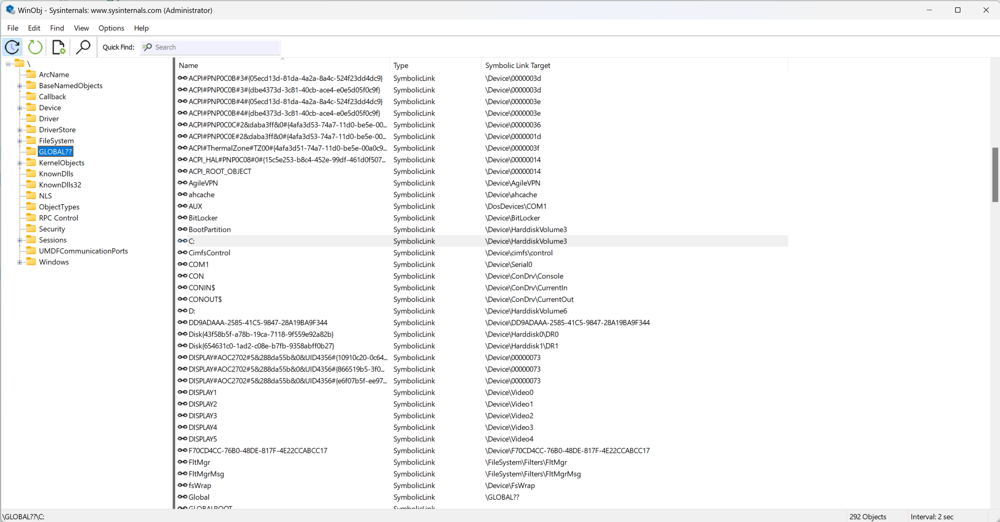
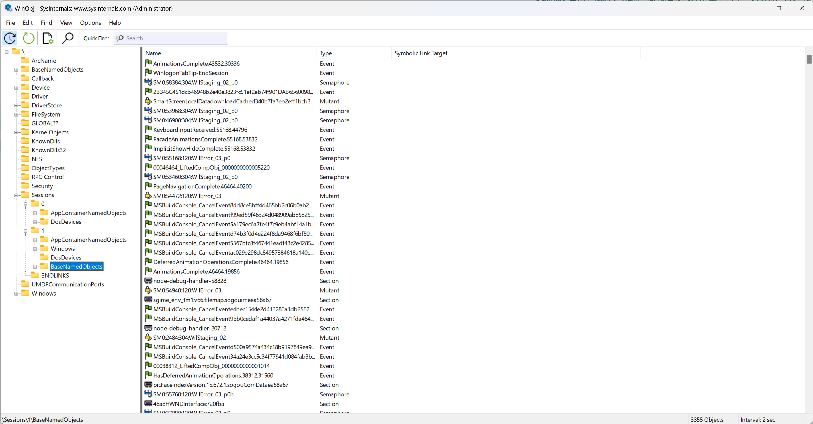
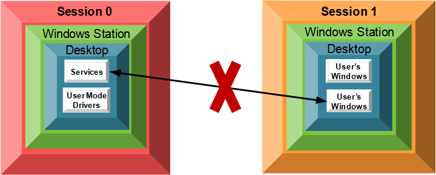
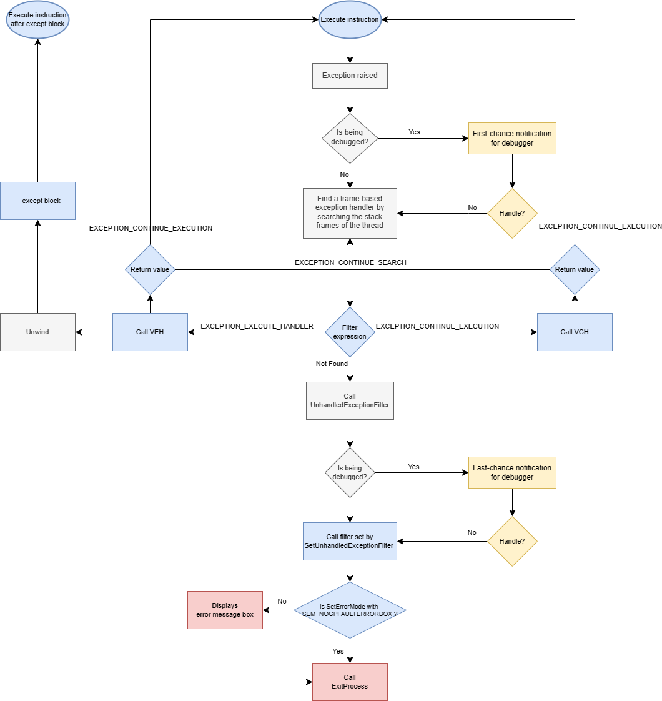
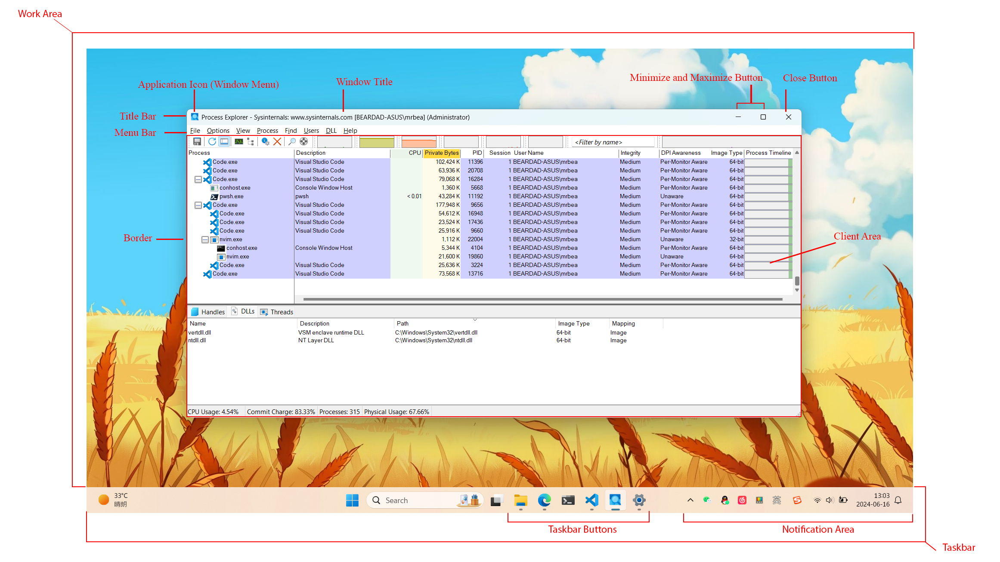
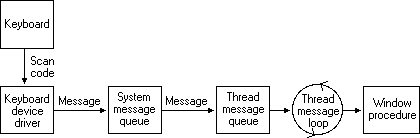
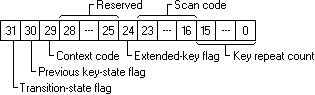

# Win32

- [Win32](#win32)
  - [资源访问](#资源访问)
    - [对象](#对象)
    - [句柄表](#句柄表)
    - [命名空间](#命名空间)
    - [访问控制](#访问控制)
      - [隔离性](#隔离性)
      - [访问控制模型](#访问控制模型)
      - [强制可信控制](#强制可信控制)
      - [用户访问控制](#用户访问控制)
  - [进程系统](#进程系统)
    - [进程管理](#进程管理)
      - [进程创建](#进程创建)
      - [进程继承](#进程继承)
      - [进程终止](#进程终止)
      - [作业](#作业)
    - [线程管理](#线程管理)
      - [线程创建](#线程创建)
      - [线程终止](#线程终止)
      - [线程调度](#线程调度)
        - [上下文切换](#上下文切换)
        - [基本优先级](#基本优先级)
        - [动态优先级](#动态优先级)
        - [服务质量](#服务质量)
        - [CPU 亲和性](#cpu-亲和性)
        - [同步阻塞](#同步阻塞)
    - [模块管理](#模块管理)
      - [模块构建](#模块构建)
      - [生命周期](#生命周期)
      - [搜索路径](#搜索路径)
      - [应用部署](#应用部署)
    - [虚拟内存](#虚拟内存)
    - [异常处理](#异常处理)
  - [IO 系统](#io-系统)
    - [注册表](#注册表)
    - [文件系统](#文件系统)
      - [磁盘](#磁盘)
      - [目录结构](#目录结构)
      - [文件](#文件)
      - [路径](#路径)
      - [读写](#读写)
    - [IPC 机制](#ipc-机制)
      - [套接字](#套接字)
      - [管道](#管道)
      - [数据拷贝](#数据拷贝)
      - [共享内存](#共享内存)
      - [总结](#总结)
    - [异步 IO](#异步-io)
  - [窗口系统](#窗口系统)
    - [桌面环境](#桌面环境)
    - [应用窗口](#应用窗口)
      - [创建窗口](#创建窗口)
      - [窗口类型](#窗口类型)
      - [非客户区样式](#非客户区样式)
      - [窗口名](#窗口名)
      - [位置与大小](#位置与大小)
      - [Z 轴顺序](#z-轴顺序)
      - [前台激活](#前台激活)
      - [最大化与最小化](#最大化与最小化)
      - [显示或隐藏](#显示或隐藏)
      - [启用或禁用](#启用或禁用)
      - [透明背景](#透明背景)
      - [窗口属性](#窗口属性)
    - [窗口消息](#窗口消息)
      - [消息队列](#消息队列)
      - [窗口过程](#窗口过程)
      - [窗口挂钩](#窗口挂钩)
      - [键盘输入](#键盘输入)
      - [鼠标输入](#鼠标输入)
      - [输入法编辑](#输入法编辑)
    - [窗口渲染](#窗口渲染)
      - [DWM](#dwm)
      - [GDI](#gdi)
    - [窗口杂项](#窗口杂项)
      - [系统窗口](#系统窗口)
      - [多显示器](#多显示器)
      - [DPI](#dpi)
      - [Color](#color)
  - [其他](#其他)
    - [头文件宏](#头文件宏)
    - [字符集](#字符集)

## 资源访问

### 对象

程序本质可看做对资源的访问和计算，Windows 系统将资源抽象成对象

- [Kernel Object](https://learn.microsoft.com/en-us/windows/win32/sysinfo/kernel-objects)

  - 负责计算和 IO 资源的访问，如 Process, Thread, Mutex, FileMapping, File 等
  - 一个内核对象可以创建多个句柄，只要创建的进程具有对象名字和访问权限
  - 内核对象在最后一个句柄关闭后才会销毁，进程终止时会自动关闭进程持有的内核对象句柄

- [User Object](https://learn.microsoft.com/en-us/windows/win32/sysinfo/user-objects)

  - 负责窗口资源的访问，如 Window, Menu, Hook, Icon, Cursor 等
  - 一个用户对象只能创建一个句柄，但句柄是公开的，只要进程属于同一 Desktop 且具有句柄值和访问权限就能访问
  - 用户对象在调用相应销毁函数后立即被销毁，进程终止时会自动销毁进程创建的用户对象，特别的，Window, Hook, Window Position, DDE conversation 在创建线程终止时就被销毁

- [GDI Object](https://learn.microsoft.com/en-us/windows/win32/sysinfo/gdi-objects)
  - 负责图形资源的访问，如 Bitmap, Brush, Font, DC 等
  - 一个 GDI 用户只能创建一个句柄，且仅能在创建进程内部访问
  - GDI 对象在调用相应销毁函数后立即被销毁，进程终止时会自动销毁进程创建的用户对象

其中，内核对象作为最主要的资源对象，系统为其提供许多机制来加强管理

### 句柄表

每个进程维护一张句柄表用于访问内核对象，内核对象句柄仅在进程内有效

- 索引：`HANDLE`
  - -1、0 保留作为无效句柄
  - 1、2、3 保留用作标准输入输出
- 内核对象指针
  - 名字
  - 引用计数
  - 安全描述符
  - 其他...
- 访问掩码：该句柄的访问权限掩码
- 属性标志：如 Protect, Inherit 等

> - `GetHandleInformation`
> - `SetHandleInformation`
> - `CompareObjectHandles`
> - `DuplicateHandle`
> - `CloseHandle`

### 命名空间

大多数内核对象都可以通过名字访问，所有对象都实际存在于底层 NT 命名空间内，但不同类型的对象名字处于不同的子命名空间内。可以使用 [WinObj](https://learn.microsoft.com/en-us/sysinternals/downloads/winobj) 查看详细内容。

- 文件相关的内核对象
  - 文件路径名均位于 `\GLOBAL??`
  - 其内包含
    - `C:` 链接到 `\Device\HarddiskVolume3`
    - `GLOBALROOT` 链接到 `\`



- 其它内核对象

  - 不同会话中创建的对象默认位于不同命名空间
    - 服务会话（session 0）默认位于 `\BaseNamedObjects`
    - 终端会话（如 session 1）默认位于 `\Sessions\1\BaseNamedObjects`
  - 这些命名空间内都存在两个符号链接
    - `Global` 链接到 `\BaseNamedObjects`，用于跨会话共享
    - `Local` 链接到 `\Session\1\BaseNamedObjects`，用于不跨会话共享



### 访问控制

#### 隔离性

> 参考 [Window Stations and Desktops](https://learn.microsoft.com/en-us/windows/win32/winstation/window-stations-and-desktops)



- Session：包含单个用户登录会话产生的所有进程和内核对象

  - Session 0 由系统创建专门用于运行服务 (Services)
  - 不同会话的部分内核对象的默认命名空间不同

- Window Station：包含一个剪切板、一张原子表和若干 desktop 组成

  - WinSta0 由系统创建，唯一能与用户终端设备交互的 Window Station
  - 同一 Window Station 内仅允许一个 Desktop 访问用户终端设备

- Desktop：包含若干 windows, menus, hooks 等用户对象

  - Winlogon 用于用户登录和 UAC 授权
  - Default 用于用户应用程序
  - ScreenSaver 用于屏保
  - windows, menu, hooks 等用户对象仅能在同一 Desktop 内部访问

#### 访问控制模型

> 参考
>
> - [Access Tokens](https://learn.microsoft.com/en-us/windows/win32/secauthz/access-tokens)
> - [Security Descriptors](https://learn.microsoft.com/en-us/windows/win32/secauthz/security-descriptors)
> - [Access Control Lists](https://learn.microsoft.com/en-us/windows/win32/secauthz/access-control-lists)
> - [Access Control Entries](https://learn.microsoft.com/en-us/windows/win32/secauthz/access-control-entries)
> - [Access Rights and Access Masks](https://learn.microsoft.com/en-us/windows/win32/secauthz/access-rights-and-access-masks)
> - [Security Identifiers](https://learn.microsoft.com/en-us/windows/win32/secauthz/security-identifiers)
> - [Privileges](https://learn.microsoft.com/en-us/windows/win32/secauthz/privileges)
> - [Client Impersonation](https://learn.microsoft.com/en-us/windows/win32/secauthz/client-impersonation)

- 访问令牌 (Access Token)

  - user SID
  - group SIDs
  - logon SID
  - privileges LUIDs
  - owner SID
  - primary group SID
  - integrity SIDs
  - default DACL
  - restricting SIDs
  - whether impersonation
  - others...

- 安全描述符 (Security Descriptor)

  - owner SID
  - primary group SID
  - DACL
  - SACL
  - others...

- 访问控制列表 (Access Control Lists)

  - 访问控制表项 (Access Control Entries)
    - trustee SID
    - type flag
    - inherit flags
    - access mask
      - Generic Access Rights：被映射到 Object-specific Access Right
      - SACL Access Right：访问对象 SACL 的权限
      - Standard Access Rights：用于控制对对象本身的操作
        - `DELETE`
        - `READ_CONTROL`
        - `SYNCHRONIZE`
        - `WRITE_DAC`
        - `WRITE_OWNER`
      - Object-specific Access Right：针对不同类型对象的特殊操作的权限


- 安全对象的访问控制流程
  1. 若没有 DACL，则允许所有访问
  2. 若存在 DACL，则使用第一个匹配的 ACE 访问控制，若没有匹配的 ACE 则拒绝所有访问
  3. 根据 SACL 是否记录该访问尝试

#### 强制可信控制

> 参考
>
> - [Mandatory Integrity Control](https://learn.microsoft.com/en-us/windows/win32/secauthz/mandatory-integrity-control)
> - [Windows Integrity Mechanism Design](<https://learn.microsoft.com/en-us/previous-versions/dotnet/articles/bb625963(v=msdn.10)>)
> - [Allow UIAccess](https://learn.microsoft.com/en-us/previous-versions/windows/it-pro/windows-10/security/threat-protection/security-policy-settings/user-account-control-allow-uiaccess-applications-to-prompt-for-elevation-without-using-the-secure-desktop)

- 可信级别（Integrity Level）

  - system: 通常为系统服务
  - high: 通常为管理员权限进程
  - medium: 通常为标准用户权限进程
  - low: 通常显式设置了 exe 文件的 security descriptors 或进程的 access token
  - untrust: 同上

- access token 中的 integrity SIDs 表示可信级别

- security descriptors 中的 SACL 中存储可信级别和强制策略

- ACM: 可信级别校验发生在 DACL 校验之前，默认拒绝较低可信级别的写入访问

- Privileges: 某些系统特权仅允许高可信级别进程运行

- UIPI：限制低可信级别对高可信级别的访问机制
  - 验证窗口句柄
  - 发送窗口消息（API 调用返回成功，消息被静默丢弃）
  - Hooks
  - DLL 注入
  - 除非应用程序具有 UIAccess 标志且满足以下条件，则允许对高可信级别进程驱动 UI 自动化
    - 程序具有可信的数字签名
    - 程序安装在 `%ProgramFiles%` 或 `%WinDir%` (某些标准用户可写的子目录除外) 目录下

#### 用户访问控制

用户访问控制 (UAC) 让标准用户不用重新登录就能使用管理员权限

- Administrator Broker Model：使用 `ShellExecute` 创建管理员权限的新进程
- Operating System Service Model：使用 IPC 与 Service 通信
- Elevated Task Model：使用 Task Scheduler 服务运行应用程序

## 进程系统

- 操作系统提供了“进程”与“线程”的概念，简化了程序对系统中“计算资源”的使用，如 CPU 和内存等。

- 进程是系统进行内存资源分配的基本单位，一个进程具有唯一的进程标识符、优先级类、虚拟地址空间、异常处理程序、内核对象句柄、安全上下文、环境变量、命令行参数等，并且至少有一个执行线程。

- 线程是系统进行 CPU 资源分配的基本单位，同一进程中所有线程共享虚拟地址空间等进程资源，此外每个线程负责维护自己的唯一的线程标识符、线程优先级、线程本地存储、线程上下文等。

### 进程管理

> 参考 [Processes and Threads](https://learn.microsoft.com/en-us/windows/win32/procthread/processes-and-threads)

#### 进程创建

1. `CreateProcess`

   - 对于 GUI 程序，可控制子进程第一次调用 `CreateWindow` 和 `ShowWindow` 的默认参数，如位置、大小、nCmdShow 等
   - 对于 CUI 程序，可控制子进程的控制台窗口的句柄、位置、大小等

2. C Run-Time library (CRT) 入口函数，负责初始化全局变量等，然后调用用户程序入口函数

3. 用户程序入口函数

   - `main`/`wmain` for **SUBSYSTEM:CONSOLE**, 默认继承父进程控制台窗口或自动创建新控制台窗口
   - `WinMain`/`wWinMain` for **SUBSYSTEM:WINDOWS**

   ```cpp
   int main(int argc, char* argv[], char* env[]);

   int APIENTRY WinMain(HINSTANCE hInst, HINSTANCE hPrevInstance, PSTR lpCmdLine, int nShowCmd);
   ```

- EXE 搜索路径（仅当指定无路径的文件名时）

1. 进程 exe 文件所在目录
2. 进程当前目录
3. 32 位 Windows 系统目录（`C:\Windows\System32`）
4. 16 位 Windows 系统目录（`C:\Windows\System`）
5. Windows 系统目录（`C:\Windows`）
6. 环境变量 PATH

> - `CreateProcess`
> - `OpenProcess`
> - `GetProcessId`
> - `GetCurrentProcess`：伪句柄，仅进程内有效
> - `GetCurrentProcessId`
> - `EnumProcesses`
> - `GetCommandLine`
> - `CommandLineToArgv`
> - `GetEnvironmentStrings`：格式为 `Var0=Value0\0Var1=Value1\0\0`
> - `FreeEnvironmentStrings`
> - `ExpandEnvironmentStrings`：扩展替换变量如 `%USERPROFILE%`
> - `GetEnvironmentVariable`
> - `SetEnvironmentVariable`
> - `GetCurrentDirectory`
> - `SetCurrentDirectory`

#### 进程继承

- 子进程**可以**继承父进程如下属性

  - 环境变量
  - 当前目录
  - 控制台
  - 内核对象句柄（句柄标志 `bInheritHandle` 且创建进程参数 `bInheritHandles` 都设置为 `true`）
  - 错误模式
  - 进程 CPU 亲和性（`dwCreationFlags` 设置 `INHERIT_PARENT_AFFINITY`）
  - 作业

- 子进程**不可**继承父进程如下属性

  - 用户对象和 GDI 对象的句柄
  - 伪句柄
  - 虚拟地址空间
  - 优先级类

> - `SetHandleInformation`
> - `UpdateProcThreadAttribute`

#### 进程终止

- 进程终止原因

  - `ExitProcess`

    - 进程中最后一个线程终止（默认 CRT 实现主线程退出时终止进程）
    - 用户模式中发生的硬件异常或软件异常未被捕获处理时
    - 调用 `ExitWindowsEx` 时
      - [用户注销或关机时](https://learn.microsoft.com/en-us/windows/win32/shutdown/shutting-down)
      - 内核模式中发生的硬件异常或软件异常未被捕获时（蓝屏）

  - `TerminateProcess`

- 进程终止结果

  1. 终止进程内所有线程，并释放线程资源
  2. 主线程退出前，卸载所有动态模块
  3. 释放其他进程资源，如关闭内核对象句柄
  4. 设置进程退出码
  5. 触发进程对象

- C++ 静态生命周期的变量
  - 仅能保证同一编译单元中的构造和析构顺序，且析构顺序与构造顺序相反
  - 构造
    1. `static`（模块加载）
    2. `thread_local`（线程加载）
    3. in-block `static`/`thread_local`（首次调用函数）
  - 析构
    1. `thread_load`（线程退出）
    2. in-block `thread_local`（线程退出）
    3. `std::atexit` 保证在注册时就已初始化的任何 `static` 销毁之前调用
    4. `static`（模块卸载）
    5. in-block `static`（模块卸载）
  - **注意：无法保证变量的析构函数一定会被调用**

> - `ExitProcess`
> - `TerminateProcess`
> - `GetExitCodeProcess`
> - `SetProcessShutdownParameters`：设置关机时终止优先级

#### 作业

作业用来管理一组进程，进程关联作业后不可再取消

- 控制子进程的作业继承
  - `JOB_OBJECT_LIMIT_BREAKAWAY_OK`
  - `JOB_OBJECT_LIMIT_SILENT_BREAKAWAY_OK`
- 限制资源访问
  - `JOBOBJECT_BASIC_LIMIT_INFORMATION`
  - `JOBOBJECT_BASIC_UI_RESTRICTIONS`
  - `JOBOBJECT_CPU_RATE_CONTROL_INFORMATION`
  - `JOBOBJECT_EXTENDED_LIMIT_INFORMATION`
  - `JOBOBJECT_NOTIFICATION_LIMIT_INFORMATION`
- 监视进程状态
  - `JOBOBJECT_ASSOCIATE_COMPLETION_PORT`
- 资源使用情况
  - `JOBOBJECT_BASIC_ACCOUNTING_INFORMATION`
  - `JOBOBJECT_BASIC_AND_IO_ACCOUNTING_INFORMATION`
- 作业对象销毁时终止作业内所有进程
  - `JOB_OBJECT_LIMIT_KILL_ON_JOB_CLOSE`

> - `CreateJobObject`
> - `OpenJobObject`
> - `SetInfomationJobObject`
> - `QueryInfomationJobObject`
> - `AssignProcessToJobObject`
> - `TerminateJobOnject`
> - `IsProcessInJob`

### 线程管理

> 参考 [Processes and Threads](https://learn.microsoft.com/en-us/windows/win32/procthread/processes-and-threads)

#### 线程创建

- **若线程函数需要访问 CRT，则应该使用 `_beginthreadex` 而非 `CreateThread` 来保证线程安全**
- 线程栈最大默认 1M，可通过控制编译时链接器参数或运行时 `CreateThread` 参数来改变，大小向上取整 1M

> - `CreateThread`：安全属性、栈大小、暂停状态
> - `CreateRemoteThread`：在其他进程中创建线程
> - `OpenThread`
> - `GetThreadId`
> - `GetCurrentThread`：伪句柄，仅进程内有效，使用 `DuplicateHandle` 转换为真句柄
> - `GetCurrentThreadId`

#### 线程终止

- 线程终止原因

  - `ExitThread`
    - 线程函数返回
  - `ExitProcess`
  - `TerminateThread`
  - `TerminateProcess`

- 线程终止结果
  - 释放线程拥有的资源，如 TLS (Thread Local Storage), windows, menus, hooks
  - 设置线程退出码
  - 触发线程对象
  - 如果线程是进程里唯一的线程，则终止进程

> - `ExitThread`
> - `TerminateThread`
> - `GetExitCodeThread`

#### 线程调度

##### 上下文切换

- 上下文切换原因
  - 时间片到期，大概 20 ms
  - 主动放弃剩余时间片
  - 被高优先级线程抢占
  - 进入同步等待状态或暂停状态

> - `SuspendThread`
> - `ResumeThread`
> - `Sleep`
> - `SwitchToThread`：相对 `Sleep(0)`，允许切换低优先级线程
> - `GetThreadTimes`
> - `GetProcessTimes`

##### 基本优先级

|                               | IDLE_PRIORITY_CLASS | BELOW_NORMAL_PRIORITY_CLASS | NORMAL_PRIORITY_CLASS | ABOVE_NORMAL_PRIORITY_CLASS | HIGH_PRIORITY_CLASS | REALTIME_PRIORITY_CLASS |
| ----------------------------- | ------------------- | --------------------------- | --------------------- | --------------------------- | ------------------- | ----------------------- |
| THREAD_PRIORITY_IDLE          | 1                   | 1                           | 1                     | 1                           | 1                   | 16                      |
| THREAD_PRIORITY_LOWEST        | 2                   | 4                           | 6                     | 8                           | 11                  | 22                      |
| THREAD_PRIORITY_BELOW_NORMAL  | 3                   | 5                           | 7                     | 9                           | 12                  | 23                      |
| THREAD_PRIORITY_NORMAL        | 4                   | 6                           | 8                     | 10                          | 13                  | 24                      |
| THREAD_PRIORITY_ABOVE_NORMAL  | 5                   | 7                           | 9                     | 11                          | 14                  | 25                      |
| THREAD_PRIORITY_HIGHEST       | 6                   | 8                           | 10                    | 12                          | 15                  | 26                      |
| THREAD_PRIORITY_TIME_CRITICAL | 15                  | 15                          | 15                    | 15                          | 15                  | 31                      |

- 通过设置进程优先级和线程优先级，系统确认线程使用的基本优先级
- 基本优先级 0 保留给 zero-page thread，它负责将 free page 置零
- 注意 `REALTIME_PRIORITY_CLASS` 优先级会中断系统线程，比如键鼠输入、磁盘冲刷等

> - `GetPriorityClass`
> - `SetPriorityClass`
> - `GetThreadPriority`
> - `SetThreadPriority`

##### 动态优先级

- 动态优先级用来最终确认线程的执行优先级
- 系统在以下情况会动态提升基本优先级 0 - 15 的线程
  - `NORMAL_PRIORITY_CLASS` 优先级的进程成为前台进程时，提升其优先级大于或等于任何后台进程
  - 当窗口接受到用户输入时，提升窗口所属的线程的优先级
  - 当线程同步等待的条件被满足时，提升该线程的优先级
  - 优先级反转：高优先级线程等待低优先级线程的资源，而中优先级线程一直抢占低优先级线程，导致高优先级线程被中优先级线程阻塞。系统会自动检测这种情况，并动态提升低优先级线程至所有等待它的线程中的最大优先级
  - 当低优先级线程长时间处于饥饿状态，提升该线程的优先级
- 动态提升之后，动态优先级每个时间片降低 1 级，且绝不低于基本优先级

> - `GetProcessPriorityBoost`
> - `SetProcessPriorityBoost`
> - `GetThreadPriorityBoost`
> - `SetThreadPriorityBoost`

##### 服务质量

服务质量 (Quality of Service) 会影响线程运行的处理器核心和功率，具体见 [QoS](https://learn.microsoft.com/en-us/windows/win32/procthread/quality-of-service)

##### CPU 亲和性

> 参考
>
> - [Processor Groups](https://learn.microsoft.com/en-us/windows/win32/procthread/processor-groups)
> - [CPU Sets](https://learn.microsoft.com/en-us/windows/win32/procthread/cpu-sets)

利用 CPU 亲和性可以限制进程或线程运行在制定的 CPU 上

- 操作系统可包含多个物理处理器 (physical processor)
- 物理处理器可包含多个核心 (core)
- 核心可包含多个逻辑处理器 (logical processor)
- 每 64 个逻辑处理器为一个处理器组 (processor group)
- Windows 11 之后线程可以跨多个处理器组，默认优先在主组中运行

##### 同步阻塞

- 为什么需要同步？
  - 保护共享数据被同时读写
  - 等待某个事件发生
- 用户模式
  - [联锁变量](https://learn.microsoft.com/en-us/windows/win32/sync/interlocked-variable-access)
  - [关键段](https://learn.microsoft.com/en-us/windows/win32/sync/critical-section-objects)
  - [读写锁](https://learn.microsoft.com/en-us/windows/win32/sync/slim-reader-writer--srw--locks)
  - [条件变量](https://learn.microsoft.com/en-us/windows/win32/sync/condition-variables)
  - [屏障](https://learn.microsoft.com/en-us/windows/win32/sync/synchronization-barriers)
- 内核模式
  - [互斥量](https://learn.microsoft.com/en-us/windows/win32/sync/mutex-objects)：等于 0 时为触发状态，等于 TID 时为非触发状态
  - [信号量](https://learn.microsoft.com/en-us/windows/win32/sync/semaphore-objects)：大于 0 时为触发状态，等于 0 时为非触发状态
  - [事件](https://learn.microsoft.com/en-us/windows/win32/sync/event-objects)
  - [计时器](https://learn.microsoft.com/en-us/windows/win32/sync/waitable-timer-objects)
  - 进程
  - 线程
  - ...

> - `WaitForSingleObjectEx`
> - `WaitForMultipleObjectsEx`
> - `MsgWaitForMultipleObjectsEx`
> - `SignalObjectAndWait`

### 模块管理

> 参考 [Dynamic-Link Libraries](https://learn.microsoft.com/en-us/windows/win32/dlls/dynamic-link-libraries)

#### 模块构建

```cpp
// mydll.h
#pragma once

#ifdef MYDLL_EXPORT
#define MYDLL_API __declspec(dllexport) // dll 实现文件中使用
#else
#define MYDLL_API __declspec(dllimport) // 用户文件中使用
#endif

#ifdef __cplusplus
extern "C" { // 使用默认调用约定，且禁用名字篡改
#endif

MYDLL_API int my_func1(LPCWSTR lpszMsg);

MYDLL_API int __stdcall my_func2(LPCWSTR lpszMsg); // 使用 __stdcall 调用约定和名字篡改

#ifdef __cplusplus
} // extern "C"
#endif
```

#### 生命周期

1. 动态链接：
   - 加载时，即创建进程时，此时仅保证 Kernel32.dll 已被加载
   - 运行时，即调用 `LoadLibrary` 时，注意提前卸载模块可能导致某些地方仍在使用模块内的函数
2. 内存映射
3. 符号解析
4. 调用 CRT 动态库入口，负责构造和析构全局变量等
5. 调用 DllMain

   ```cpp
   // 进程内所有 DllMain 的执行都需要获取同一个互斥锁（进程唯一）
   // 所以谨慎在 DllMain 中调用 LoadLibrary, FreeLibrary, CreateThread, ExitThread 等函数
   BOOL WINAPI DllMain(HINSTANCE hinstDLL, DWORD fdwReason, LPVOID lpvReserved) {
     switch (fdwReason) {
       case DLL_PROCESS_ATTACH:
         // 首次加载时，根据加载方式的不同：
         // - 加载时动态链接：在主线程执行，lpvReserved 为 non-NULL，返回 FALSE 表示发生错误而终止进程
         // - 运行时动态链接：在调用 LoadLibrary 的线程执行，lpvReserved 为 NULL，返回 FALSE 表示 LoadLibrary 返回 FALSE
         break;
       case DLL_PROCESS_DETACH:
         // 模块卸载时，根据卸载方式的不同：
         // - 进程退出：在调用了 ExitProcess 的线程中执行，lpvReserved 为 non-NULL
         // - 手动卸载：在调用了 FreeLibrary 的线程中执行，lpvReserved 为 NULL
         // - 注意，调用了 TerminateThread 或 TerminateProcess 不会调用 DllMain
         break;
       case DLL_THREAD_ATTACH:
         // - 创建新线程时，在运行其线程函数前执行
         // - 不会在 DLL_PROCESS_ATTACH 的线程执行
         // - 不会在加载时已经存在的线程中执行
         // - 若线程调用了 DisableThreadLibraryCalls 则不会执行
         break;
       case DLL_THREAD_DETACH:
         // - 线程终止时，在运行其线程函数返回后执行
         // - 可能没有对应的 DLL_THREAD_ATTACH，因为加载时线程已存在
         // - 若线程调用了 DisableThreadLibraryCalls 则不会执行
         // - 注意，调用了 TerminateThread 或 TerminateProcess 不会调用 DllMain
         break;
     }
     return TRUE;
   }
   ```

> - `LoadLibrary`
> - `LoadLibraryEx`：可设置修改标准搜索路径、仅加载资源数据，通常对同一 dll 不能与 `LoadLibrary` 混用
> - `GetProcAddress`
> - `FreeLibrary`
> - `FreeLibraryAndExitThread`
> - `EXTERN_C IMAGE_DOS_HEADER __ImageBase;`：由链接器创建的变量，位于该模块的基地址
> - `EnumProcessModules`
> - `GetModuleHandle`：不递增引用计数
> - `GetModuleHandleEx`：默认递增引用计数
> - `GetModuleBaseName`
> - `GetModuleFileName`
> - `GetWindowModuleFileName`
> - `QueryFullProcessImageName`：用来获取其它进程的 exe 文件路径更加高效且准确

#### 搜索路径

DLL 标准搜索路径：（当指定相对路径和无路径文件名），更详细 DLL 搜索路径见 [Dll search order](https://learn.microsoft.com/en-us/windows/win32/dlls/dynamic-link-library-search-order)

1. DLL Redirection (`app.exe.local`)
2. API sets (`api-*`/`ext-*`)
3. SxS manifest redirection
4. Loaded-module list
5. Known DLLs (`HKEY_LOCAL_MACHINE\SYSTEM\CurrentControlSet\Control\Session Manager\KnownDLLs`)
6. The package dependency graph of the process
7. 进程 exe 所在目录
8. 系统目录（`C:\Windows\System32`）
9. 16 位兼容系统目录（`C:\Windows\System`）
10. Windows 目录（`C:\Windows`）
11. 进程当前目录
12. 环境变量 PATH

#### 应用部署

> 关于 Windows 运行时环境和打包部署建议见 [Deployment](https://learn.microsoft.com/en-us/cpp/windows/deployment-in-visual-cpp?view=msvc-170)

- 部署方案

  - 集中部署：利用微软提供的部署工具将依赖的 dll 下载并安装到系统目录且随系统升级，详细教程见 [Redistributing Visual C++ Files](https://learn.microsoft.com/en-us/cpp/windows/redistributing-visual-cpp-files)
  - 本地部署：将依赖的 dll 放到应用程序目录，在搜索系统目录之前会先搜索应用程序目录
  - 静态链接：将依赖用 `/MT` 链接参数静态链接到 exe 或 dll，可能导致同时使用多个不同版本的库

- [C++ 依赖库](https://learn.microsoft.com/en-us/cpp/c-runtime-library/crt-library-features)
  - `ucrtbase.dll`
    - C 标准库，Windows 10 之后系统自带
    - 其中还包括一些转发 [API Sets](https://learn.microsoft.com/en-us/windows/win32/apiindex/windows-apisets)
    - 位于 `C:\Program Files (x86)\Windows Kits\10\Redist\10.0.22000.0\ucrt\DLLs\`
  - `libcmt.lib`/`msvcrt.lib`
    - 初始化 CRT 的库，只能静态链接，两个 lib 分别用于 `/MT` 和 `/MD`
  - `vcruntime<version>.dll`
    - C++ 运行时库，包含异常处理、调试支持、运行检测等功能
    - `vcruntime140.dll` 是基础库，`vcruntime140_1.dll` 是扩展库，后者保证与前者的 ABI 兼容
    - 位于 64 和 32 位系统目录
  - `msvcp<version>.dll`
    - C++ 标准库，包含 STL 等
    - `<version>` 同上
    - 位于 64 和 32 位系统目录

### 虚拟内存

> 参考 [Memory Management](https://learn.microsoft.com/en-us/windows/win32/memory/memory-management)

- 虚拟地址空间

| 分区          | x86                     | x64                                       |
| ------------- | ----------------------- | ----------------------------------------- |
| 空指针赋值区  | 0x00000000 - 0x0000FFFF | 0x00000000'00000000 - 0x00000000'0000FFFF |
| 用户模式分区  | 0x00010000-0x7FFEFFFF   | 0x00000000'00010000 - 0x000007FF'FFFEFFFF |
| 64KB 禁入分区 | 0x7FFF0000 - 0x7FFFFFFF | 0x000007FF'FFFF0000 - 0x000007FF'FFFFFFFF |
| 内核模式分区  | 0x80000000 - 0xFFFFFFFF | 0x00000800'00000000 - 0xFFFFFFFF'FFFFFFFF |

- 页面：CPU 进行虚拟地址翻译的粒度，故系统进行内存管理和分配的粒度必须是其整数倍，x86/x64 页面大小为 4K，Windows 用户内存分配粒度为 64K

- 页面状态

  - `MEM_FREE`：该地址尚未被分配，无法访问
  - `MEM_RESERVE`：该地址已被分配，但还未调拨存储器，无法访问
  - `MEM_COMMIT`：该地址已被分配，且已调拨存储器 (storage)，第一次访问时系统会为其准备物理内存页面和对应数据

- 页面类型

  - `MEM_PRIVATE`:
    - 后备存储器为页交换文件 (paging file)
    - 第一次访问时无需从页交换文件中加载页面，直接申请物理内存页面并置零
  - `MEM_IMAGE`:
    - 后备存储器为映像文件，如 exe 或 dll，
    - 映像文件为 PE 格式，内部有多个不同的段，加载不同的段时会使用不同的页面保护属性
  - `MEM_MAPPED`:
    - 后备存储器可以为页交换文件（如共享内存）或其它磁盘文件（如文件映射）

- 页面保护

  - `PAGE_NOACCESS`
  - `PAGE_READONLY`
  - `PAGE_READWRITE`
  - `PAGE_WRITECOPY`
  - `PAGE_EXECUTE`
  - `PAGE_EXECUTE_READ`
  - `PAGE_EXECUTE_READWRITE`
  - `PAGE_EXECUTE_WRITECOPY`
  - `PAGE_GUARD`：设置一次性内存访问异常处理

- 地址访问

  1. CPU 中的内存管理单元（MMU）负责根据页表基址寄存器（PTBR）存储的页表基址从翻译后备缓冲器（TLB）获取虚拟地址对应的页表表项（PTE）从而翻译为物理地址

  2. 操作系统为每个进程维护一个多级页表，最后一级页表表项记录虚拟地址对应的物理地址，其它级页表表项记录下一级页表基地址，通常只有一级页表常驻内存

  3. 根据页表索引到页面的物理地址后，有以下两种情况
     - 对应页面已经在内存中，说明该页面在此之前已经被本进程或其它进程访问过了
     - 对应页面没有在内存中，说明该页面可能是第一次访问，或之前被冲刷到后备存储器了
       1. 触发缺页异常，控制流转到操作系统异常处理程序
       2. 利用文件系统驱动，将对应的页面从其后备存储器中加载到内存
       3. 当内存中无空闲页面时，根据某种缓存驱逐策略来选择使用页面，若为脏页则先将其冲刷到其后备存储器再使用

- 工作集 (Working Set)

  - 每个进程维护一个工作集，管理驻留在内存中的页面
  - 最小工作集大小默认 50 个页面
  - 最大工作集大小默认 345 个页面

- 内存池 (Memory Pool)
  - 内核使用的内存分为两种
  - paged pool: 可交换出物理内存。单处理器系统有 3 个，多处理器系统有 5 个
  - nonpaged pool: 驻留在物理内存中

> - `GetSystemInfo`：CPU 硬件信息
> - `GetPerformanceInfo`：系统运行时性能信息
> - `GlobalMemoryStatusEx`：系统内存使用情况
> - `GetProcessMemoryInfo`：进程内存使用情况
> - `VirtualQuery`
> - `VirtualAlloc`：控制内存页面状态，申请[大页内存](https://learn.microsoft.com/en-us/windows/win32/memory/large-page-support)
> - `VirtualFree`
> - `VirtualProtect`
> - `CreateFile`
> - `CreateFileMapping`
> - `MapViewOfFile`
> - `HeapCreate`
> - `HeapDestroy`
> - `HeapAlloc`
> - `HeapFree`
> - `HeapReAlloc`
> - `GetProcessHeap`：每个进程有一个默认的线程安全的堆
> - `GetProcessHeaps`
> - `GetProcessWorkingSetSize`
> - `SetProcessWorkingSetSize`

### 异常处理

> 参考 [Error Handling](https://learn.microsoft.com/en-us/windows/win32/debug/error-handling)、[Structured Exception Handling](https://learn.microsoft.com/en-us/windows/win32/debug/structured-exception-handling)、[Windows Error Reporting](https://learn.microsoft.com/en-us/windows/win32/wer/windows-error-reporting)

- 返回码：几乎所有系统 API 的调用都可能会失败，通常返回特殊的值表示调用失败

  - `BOOL`：返回 `FALSE` 表示失败
  - `HANDLE`：返回 `NULL` 或 `INVALID_HANDLE_VALUE`（特别注意）
  - `LPVOID`：返回 `NULL` 表示失败
  - `HRESULT`：使用 `SUCCEEDED(hr)` 或 `FAILED(hr)` 来检测成功或失败

- 错误码：当系统 API 调用失败时（少数是在调用成功时）设置一个线程独立的[**错误码**](https://learn.microsoft.com/en-us/windows/win32/debug/system-error-codes)来表示失败（或成功）的原因

```cpp
std::string GetLastErrorAsString() {
    std::string message;

    DWORD errorMessageID = ::GetLastError();
    if(errorMessageID == 0) {
        return message;
    }

    LPSTR messageBuffer = nullptr;
    size_t size = FormatMessageA(
        FORMAT_MESSAGE_ALLOCATE_BUFFER | FORMAT_MESSAGE_FROM_SYSTEM | FORMAT_MESSAGE_IGNORE_INSERTS,
        NULL, errorMessageID, MAKELANGID(LANG_NEUTRAL, SUBLANG_DEFAULT), (LPSTR)&messageBuffer, 0,
        NULL);

    if (size) {
      message = std::string(messageBuffer, size);
      LocalFree(messageBuffer);
    }

    return message;
}
```

- 错误模式：当进程发生严重错误时，系统默认会显示错误对话框，对话框会挂起进程（同步执行）

  - `SEM_FAILCRITICALERRORS`，不显示对话框转而将错误发送给进程，通常应该设置改标志
  - `SEM_NOALIGNMENTFAULTEXCEPT`，在支持的平台上自动修复内存对齐错误
  - `SEM_NOGPFAULTERRORBOX`，不显示 WER 对话框
  - `SEM_NOOPENFILEERRORBOX`，不显示当 `OpenFile` 传入 `OF_PROMPT` 标志且对应文件不存在时的对话框

- 结构化异常处理 (SEH)：使用 SEH 后编译器禁止在 `__try` 中构造 C++ 对象，**因为 SEH 的栈展开不会调用析构函数**

```cpp
/*
 * Termination-Handler Syntax
*/
__try {
    // 可以使用 __leave 提前离开 __try 块且避免非正常离开和性能处罚
} __finally {
    // 只要控制流离开 __try 块就会执行 __finally 块，包括栈展开，除非因线程终止而离开 __try 块
}

/*
 * Exception-Handler Syntax
*/
__try {
    // 当发生底层的硬件或软件错误时会触发异常，也可以调用 RaiseException 手动触发
}
// 过滤表达式结果可以是以下值之一：
// EXCEPTION_CONTINUE_EXECUTION 表示继续执行发生异常的指令，注意可能导致死循环
// EXCEPTION_EXECUTE_HANDLER 表示执行后续 __except 块
// EXCEPTION_CONTINUE_SEARCH 表示搜索外部 __except 块
__except (filter-expression) {
    // 当搜索到能够处理异常的 __except 块时，先进行栈展开 (unwind) 直到 __excpet 块所在栈帧，然后继续执行 __except 块
}
```

- 向量化异常处理 (VEH)

  - 在异常触发后且在首次通知调试器后调用
  - 返回 `EXCEPTION_CONTINUE_EXECUTION` 表示继续执行发生异常的指令，跳过后续 VEH
  - 返回 `EXCEPTION_CONTINUE_SEARCH` 表示执行后续 VEH，然后开始搜索 SEH

- 向量化继续处理 (VCH)

  - 在继续执行发生异常的指令之前调用
  - 返回 `EXCEPTION_CONTINUE_EXECUTION` 表示继续执行发生异常的指令，跳过后续 VCH
  - 返回 `EXCEPTION_CONTINUE_SEARCH` 表示执行后续 VCH，然后从异常指令开始重新搜索 SEH

- 未处理异常

  - `UnhandledExceptionFilter` 作为最外部的全局 SEH 的过滤表达式
  - 其内部会调用 `SetUnhandledExceptionFilter` 设置的过滤函数
  - C++ 程序默认设置了未处理异常过滤函数，用来过滤 C++ 异常

- Window 错误报告 (WER)
  1. Dumps: 需要设置 `HKEY_LOCAL_MACHINE\Software\Microsoft\Windows\Windows Error Reporting\LocalDumps`
  2. Recovery: 需要调用 `RegisterApplicationRecoveryCallback`
  3. MessageBox: 需要设置 `HKEY_LOCAL_MACHINE\Software\Microsoft\Windows\Windows Error Reporting\DontShowUI` 为 0，且 `GetErrorMode` 标志没有 `SEM_NOGPFAULTERRORBOX`
  4. Restart: 需要调用`RegisterApplicationRestart`



> - `GetLastError`
> - `SetLastError`
> - `FormatMessage`
> - `GetErrorMode`
> - `SetErrorMode`
> - `GetThreadErrorMode`
> - `SetThreadErrorMode`
> - `_controlfp_s`：默认系统关闭所有浮点异常，因此计算结果可以是 NAN 或 INFINITY 而不是异常。
> - `_clearfp`：必须在浮点异常处理块中调用该函数来获取并清除浮点异常标志
> - `RaiseException`
> - `GetExceptionCode`：仅可在过滤表达式和 `__except` 块中调用
> - `GetExceptionInformation`：仅可在过滤表达式中调用，因为执行 `__except` 块时异常栈帧已被销毁
> - `AbnormalTermination`：仅可在 `__finally` 块中调用
> - `AddVectoredExceptionHandler`
> - `RemoveVectoredExceptionHandler`
> - `AddVectoredContinueHandler`
> - `RemoveVectoredContinueHandler`
> - `UnhandledExceptionFilter`
> - `SetUnhandledExceptionFilter`
> - `RegisterApplicationRecoveryCallback`
> - `RegisterApplicationRestart`

## IO 系统

操作系统提供了“内核对象”的机制，简化了程序对系统中“IO 资源”的使用，如设备、文件、网络、IPC 等。

### 注册表

注册表是 Windows 用来存储配置的层次结构数据库(B-Tree)，支持事务。

- Key: Subkey 和 Value 的集合

  - Name: 不可包含 `\`，忽略大小写

- Value: 包含数据的记录

  - Name: 可以包含 `\`，忽略大小写
  - Type
  - Data

- Computer

  - `HKEY_LOCAL_MACHINE`：系统全局配置
    - `Software`：软件配置，32 位程序访问该 Key 会被重定向到 `WOW6432Node`
      - `CLASS`：文件扩展名配置
    - `WOW6432Node`：具体见 [Registry Keys Affected by WOW64](https://learn.microsoft.com/en-us/windows/win32/winprog64/shared-registry-keys)
  - `HKEY_CURRENT_USER`：当前用户配置
    - `Software`：软件配置，不会重定向 32 位程序
      - `CLASS`：文件扩展名配置
    - `Environment`：用户环境变量
  - `HKEY_CLASSES_ROOT`：包含 `HKEY_CURRENT_USER\Software\Classes` 和 `HKEY_LOCAL_MACHINE\Software\Classes` 合并后的视图
  - `HKEY_USERS`：所有用户配置实际所在，`HKEY_CURRENT_USER` 重定向到某子项

> - `RegEnumKeyEx`
> - `RegQueryInfoKey`
> - `RegGetKeySecurity`
> - `RegNotifyChangeKeyValue`
> - `RegOpenKeyExW`
> - `RegOpenCurrentUser`：打开当前模拟用户的 `HKEY_CURRENT_USER`
> - `RegOpenUserClassesRoot`：打开当前模拟用户的 `HKEY_CLASSES_ROOT` 视图，注意需要模拟用户配置已被加载（比如用户登录），使用 `LoadUserProfile` 手动加载
> - `RegCreateKeyEx`
> - `RegDeleteKey`
> - `RegCloseKey`
> - `RegFlushKey`
> - `RegQueryValueEx`
> - `RegQueryMultipleValues`
> - `RegSetValueEx`
> - `RegDeleteValue`
> - `RegSaveKeyEx`：将注册表条目保存到文件，注意这不同于 `.reg` 文件（用 `regedit.exe` 来导入）
> - `RegLoadKey`：不覆盖已存在的 key，可以用 `RegUnLoadKey` 还原
> - `RegReplaceKey`：覆盖已存在的 key
> - `RegRestoreKey`

### 文件系统

> 参考 [File Management](https://learn.microsoft.com/en-us/windows/win32/fileio/file-management)

NTFS 支持事务

#### 磁盘

| 特性         | MBR 分区表                           | GPT 分区表      |
| ------------ | ------------------------------------ | --------------- |
| 适用固件     | BIOS                                 | UEFI            |
| 分区大小     | 最大支持近 2TB                       | 最大支持近 18EB |
| 主分区       | 最多只能有 3 个主分区与 1 个扩展分区 | 全部是主分区    |
| 引导加载器   | 在 MBR 头部以及主分区头部            | 在 ESP 中       |
| 分区表健壮性 | 无校验、 无备份                      | 有校验、有备份  |


> - `FindFirstVolume`
> - `FindNextVolume`
> - `FindVolumeClose`
> - `GetVolumeInformation`
> - `GetDiskFreeSpaceEx`
> - `IDiskQuotaControl`
> - `IEnumDiskQuotaUsers`

#### 目录结构

- C:\
  - Windows `%SystemRoot%`：Window 系统目录
    - System：16 位兼容系统目录
    - System32：**64 位**系统目录
    - SystemWOW64：**32 位**系统目录，(**W**indows 32-bit **o**n **W**indows **64**-bit)
  - Program Files `%ProgramFiles%`：64 位应用程序安装目录（所有用户）
  - Program Files (x86) `%ProgramFiles(x86)%`：32 位应用程序安装目录（所有用户）
  - Program Data `%ProgramData%`：应用程序数据（所有用户）
  - Users
    - username `%USERPROFILE%`
      - AppData
        - Local `%LOCALAPPDATA%`：应用程序状态数据（当前用户）
          - Programs：应用程序安装目录（当前用户）
          - Temp `%TEMP%`：应用程序缓存数据（当前用户（
        - Roaming `%APPDATA%`：应用程序配置数据（当前用户）

#### 文件

- 文件：一个文件由若干个文件流组成，文件流包含了文件的元数据和数据，引用文件流 `file.txt:strm:$DATA`，其中 `$DATA` 为流类型（可忽略），可能需要添加路径 `./` 以防止文件名被解析为盘符

  - 唯一对象标识
  - 安全描述符
  - 重解析点
  - 文件名和属性
    - 文件名
    - 日期时间（创建、访问、修改）
    - 文件大小（使用、分配）
    - 只读
    - 隐藏
    - 压缩
    - 加密
    - 可被备份
    - 可被索引
    - ...
  - 文件数据
  - ...

- 链接

  - 硬链接
    - 即目录项，每个硬链接指向单独的文件流记录“文件名和属性”
    - 不可跨文件系统
  - _软连接 (Junctions)_
    - 利用重解析点，仅可指向目录
    - 可跨本地文件系统，不可跨网络文件系统
  - 符号链接
    - 利用重解析点
    - 可跨网络文件系统

> - `FindFirstFile`
> - `FindNextFile`
> - `FindFirstStream`
> - `FindNextStream`
> - `FindClose`
> - `GetFileInformationByHandle`
> - `SetFileInformationByHandle`
> - `GetFileAttributes`
> - `SetFileAttributes`
> - `GetFileType`
> - `GetBinaryType`
> - `GetFileTime`
> - `SetFileTime`
> - `GetFileSize`
> - `CreateFile`
> - `DeleteFile`：直到最后一个文件句柄被关闭才真正删除文件，而在此之前文件就无法被打开了
> - `CopyFile`
> - `CopyFileExA`：可以获取拷贝进度
> - `MoveFile`：目标路径不能已存在
> - `MoveFileEx`：可以获取移动进度
> - `ReplaceFile`：目标路径必须已存在，仅覆盖数据文件流和少量属性
> - `CreateDirectory`
> - `RemoveDirectory`
> - `ReadDirectoryChangesW`
> - `CreateHardLink`
> - `CreateSymbolicLink`

#### 路径

- 文件名

  - 不能包含特殊字符：`<` `>` `:` `"` `/` `\` `|` `?` `*` `NUL` 控制字符等
  - 不能使用保留名称：CON, PRN, AUX, NUL, COM0, LPT0 等，即使如 NUL.txt 带扩展名也不行
  - 不能以 `.` 或 `SPC` 结尾
  - 默认忽略大小写

- 路径名

  - 路径是以 `\` 分隔组件名（卷、目录、文件）的字符串

  - 相对路径：如 `file.txt` `.\file.txt` `..\file.txt` `\file.txt` `C:file.txt`

    - 会根据当前卷和当前目录，或指定卷的当前目录扩展成完全限定路径
    - 限制最大长度为 MAX_PATH (260)，包含末尾 `NUL`
    - 可以使用 `.` `..` `/`

  - 完全限定路径：如 `C:\file.txt`

    - 限制最大长度为 MAX_PATH (260)，包含末尾 `NUL`
    - 可以使用 `.` `..` `/`

  - Win32 文件命名空间：如 `\\?\C:\file.txt`

    - 限制最大长度大概为 32767，包含末尾 `NUL`，但单个文件名不能超过 255
    - 不能使用 `.` `..` `/`，且必须为完全限定路径

  - Win32 设备命名空间：如 `\\.\PhysicalDrive0`

    - 直接指定 NT 命名空间中的 `GLOBAL??` 里的设备对象

> - `GetLongPathName`
> - `GetShortPathName`
> - `GetFullPathName`
> - `GetTempPath2`：返回路径长度最大 MAX_PATH+1，不会校验路径是否已存在
> - `GetTempFileName`：自动或手动创建唯一文件名 `<prefix><uuuu>.TMP`

#### 读写

- 以下标志会影响缓存行为

  - `FILE_FLAG_RANDOM_ACCESS`
  - `FILE_FLAG_SEQUENTIAL_SCAN`
  - `FILE_FLAG_NO_BUFFERING`
  - `FILE_FLAG_WRITE_THROUGH`
  - `FILE_ATTRIBUTE_TEMPORARY`

- 创建文件对象时，会包含一个数据文件流的偏移量，称为文件指针，每次调用读写接口都会自动更新指针位置。

> - `ReadFile`
> - `ReadFileEx`
> - `WriteFile`
> - `WriteFileEx`
> - `FlushFileBuffers`
> - `SetFilePointer`
> - `SetEndOfFile`

### IPC 机制

> 参考 [Interprocess communications](https://learn.microsoft.com/en-us/windows/win32/ipc/interprocess-communications)

#### 套接字

- Server

  1. `WSAStartup`
  2. `WSASocket`
  3. `bind`
  4. `listen` (tcp only)
  5. `AcceptEx` (tcp only)
  6. `WSASend`/`WSASendTo`/`WSARecv`/`WSARecvFrom`
  7. `LPFN_DISCONNECTEX` (tcp only)
  8. `closesocket`
  9. `WSACleanup`

- Client

  1. `WSAStartup`
  2. `WSASocket`
  3. `GetAddrInfoEx`
  4. `LPFN_CONNECTEX` (implicit `bind`, tcp only)
  5. `FreeAddrInfoEx`
  6. `WSASend`/`WSASendTo`/`WSARecv`/`WSARecvFrom`
  7. `LPFN_DISCONNECTEX` (tcp only)
  8. `WSARecv`
  9. `closesocket`
  10. `WSACleanup`

> 通过 `WSAIoctl` 可以获取不同的底层 service provider 提供特定的 API

#### 管道

- 匿名管道：
  - 单向通讯
  - 创建后只能通过子进程继承的方式获取 handle
  - 见示例 [Creating a Child Process with Redirected Input and Output](https://learn.microsoft.com/en-us/windows/win32/procthread/creating-a-child-process-with-redirected-input-and-output)

> - `CreatePipe`
> - `GetStdHandle`
> - `SetStdHandle`

- 命名管道：
  - 支持单向和双向
  - 创建后可通过管道名字的方式获取 handle，如 `\\.\pipe\PipeName`
  - 仅当服务端存在空闲的命名管道实例，客户端才能打开它
  - 见示例 [Named Pipe Server](https://learn.microsoft.com/en-us/windows/win32/ipc/named-pipe-server-using-overlapped-i-o) 和 [Named Pipe Client](https://learn.microsoft.com/en-us/windows/win32/ipc/named-pipe-client)

> - `CreateNamedPipe`：服务端创建命名管道
> - `ConnectNamedPipe`：服务端等待连接，客户端可能在此之前就打开管道了，比如在 `CreateNamedPipe` 或 `DisconnectNamedPipe` 之后
> - `DisconnectNamedPipe`：服务端关闭连接，使客户端句柄失效（客户端仍需要调用 CloseHandle），同时丢弃缓冲区中的数据
> - `CreateFile`：客户端连接服务端命名管道
> - `WaitNamedPipe`：客户端等待服务端空闲管道

#### 数据拷贝

> 参考 [Why can't I PostMessage the WM_COPYDATA message](https://devblogs.microsoft.com/oldnewthing/20110916-00/?p=9623)

```cpp
auto data = COPYDATASTRUCT {
  .dwData = data_type,
  .cbData = data_size,
  .lpData = data_buf,
};

// 系统需要确定何时释放缓冲区，所以 WM_COPYDATA 只能使用同步发送消息，如 SendMessage, SendMessageTimeout 等
SendMessage(target_hwnd, WM_COPYDATA, hwnd, &data);
```

#### 共享内存

> 参考 [Creating Named Shared Memory](https://learn.microsoft.com/en-us/windows/win32/memory/creating-named-shared-memory)
>
> - `CreateFileMapping`
> - `OpenFileMapping`
> - `MapViewOfFile`
> - `UnmapViewOfFile`

#### 总结

- 套接字

  - 每个连接需要单独的 2 对读写缓冲区，缓冲可以被复用
  - 完善的缓冲区管理和连接管理，支持流传输
  - 服务端监听网络端口需要设置防火墙规则
  - **适用场景：跨机器的网络通讯**

- 双向命名管道（Windows 10 之后支持 [UNIX Domain Socket](https://devblogs.microsoft.com/commandline/af_unix-comes-to-windows/) 可以代替命名管道）

  - 每个连接需要单独的 1 对读写缓冲区，缓冲可以被复用
  - 有缓冲区管理，但需要自己完善连接管理（特别是断开连接会丢弃缓冲区数据），支持流传输
  - **适用场景：本机的进程间通讯**

- 数据拷贝

  - 每次发送数据都需要分配缓冲区，且只能同步发送
  - 有缓冲区管理，没有连接管理，不支持流传输
  - **适用场景：UI 同步逻辑通讯**

- 共享内存
  - 可以直接在共享内存中**构造**消息对象，单次通讯可省去一次拷贝（构造期间需要加锁，通常来说构造数据比拷贝更慢）
  - 可以直接在共享内存中**访问并处理**消息对象，单次通讯可省去一次拷贝（处理期间需要加锁，通常来说处理数据比拷贝更慢）
  - 没有缓冲区管理，没有连接管理，没有流传输
  - **适用场景：传输 Raw Data（数据量大且处理快）**

### 异步 IO

> 参考
>
> - [Synchronization and Overlapped Input and Output](https://learn.microsoft.com/en-us/windows/win32/sync/synchronization-and-overlapped-input-and-output)
> - [Asynchronous Procedure Calls](https://learn.microsoft.com/en-us/windows/win32/sync/asynchronous-procedure-calls)
> - [I/O Completion Ports](https://learn.microsoft.com/en-us/windows/win32/fileio/i-o-completion-ports)

Windows 支持三种异步 IO 机制：

- Overlapped IO：利用可同步对象
- APC：利用 APC 任务队列
- IOCP：利用 IOCP 消息队列

其中前两者可以使用同一个多路复用接口 `MsgWaitForMultipleObjectsEx` 一起监听，而 IOCP 则不行。

- 使用流程

  1. 创建 IOCP `CreateIoCompletionPort` (iocp only)
  2. **创建 HANDLE `CreateFile` 使用 `FILE_FLAG_OVERLAPPED` 标志**
  3. 关联 HANDLE `CreateIoCompletionPort` (iocp only)
  4. **调用异步 IO 接口**
  5. **等待 IO 事件完成** `GetQueuedCompletionStatus`/`WaitForMultipleObjectsEx`
  6. **IO 事件完成，唤醒等待线程**
     - Overlapped IO
       - 唤醒等待对应 Event 对象的线程
     - APC
       - 唤醒 Alertable 状态的线程并执行对应回调函数
     - IOCP
       - FIFO 顺序通知等待线程
       - IOCP 设置有最大并发数，超过后阻塞后续等待线程
       - 当线程处于其他阻塞状态时（如 `SuspendThread` 或 `WaitForMultipleObjectsEx`），系统会通知其他线程，这时如果阻塞线程被唤醒，则 IOCP 关联线程会超过最大并发数

- Overlapped-IO/IOCP 支持的异步 IO 有：

  - `ReadFile`
  - `WriteFile`
  - `AcceptEx`
  - `LPFN_CONNECTEX`
  - `LPFN_DISCONNECTEX`
  - `WSASend`
  - `WSASendTo`
  - `WSASendMsg`
  - `WSARecv`
  - `WSARecvFrom`
  - `LPFN_WSARECVMSG`
  - `ConnectNamedPipe`
  - `TransactNamedPipe`
  - `WaitCommEvent`
  - `LockFileEx`
  - `DeviceIoControl`
  - `ReadDirectoryChangesW`
  - `PostQueuedCompletionStatus` (iocp only)

- APC 支持的异步 IO 有：

  - `ReadFileEx`
  - `WriteFileEx`
  - `SetWaitableTimer`
  - `SetWaitableTimerEx`
  - `QueueUserAPC`

- 取消异步 IO

  - `CancelIo`
  - `CancelIoEx`

- 线程池
  - `BindIoCompletionCallback`
  - 详细内容见 [Thread Pool API](https://learn.microsoft.com/en-us/windows/win32/procthread/thread-pool-api)

## 窗口系统

### 桌面环境

> 参考
>
> - [Window Stations and Desktops](https://learn.microsoft.com/en-us/windows/win32/winstation/window-stations-and-desktops)
> - [The Windows 7 Desktop](https://learn.microsoft.com/en-us/windows/win32/uxguide/winenv-desktop)
> - [Windows and Messages](https://learn.microsoft.com/en-us/windows/win32/winmsg/windowing)




- Desktop Window
  - Taskbar
    - Start Button
    - Taskbar Buttons
      - Icon and Label
      - Overlay Icon
      - Progress Bar
      - Jump List
      - Thumbnail Toolbar
    - Notification Area
      - Icon
      - Tooltip (Hover)
      - Popup Window (Left click)
      - Primary Window (Left double-click)
      - Context Menu (Right-click)
  - Application Window
    
    - Non-Client Area
      - Title Bar
        - Application Icon
        - Window Menu
        - Window Title
        - Minimize and Maximize Button
        - Close Button
      - Menu Bar
      - Border
      - Scroll Bar
    - Client Area

### 应用窗口

#### 创建窗口

```cpp
HWND CreateWindowExW(
  [in]           DWORD     dwExStyle,   // 扩展样式，控制窗口状态和行为
  [in, optional] LPCWSTR   lpClassName, // 窗口类，用于控制窗口状态和行为，通常在多个窗口间共享
  [in, optional] LPCWSTR   lpWindowName,// 窗口名，用于描述应用，通常显示在窗口标题栏和任务栏按钮上
  [in]           DWORD     dwStyle,     // 基础样式，控制窗口状态和行为
  [in]           int       X,           // 窗口左上角位置
  [in]           int       Y,
  [in]           int       nWidth,      // 窗口大小
  [in]           int       nHeight,
  [in, optional] HWND      hWndParent,  // 指定父窗口 (for child window) 或 Owner 窗口 (for top-level window)
  [in, optional] HMENU     hMenu,       // 指定子窗口 ID (for child window) 或 Menu 句柄 (for top-level window)
  [in, optional] HINSTANCE hInstance,   // 指定窗口关联的模块，用于搜索窗口类
  [in, optional] LPVOID    lpParam      // 窗口自定义数据，通常将窗口封装成 class 并在这里传递 this 指针
);
```

> - `RegisterClassEx`：返回 Atom 可以通过宏 MAKEINTATOM 转换当窗口类名来用
> - `UnregisterClassEx`
> - `CreateWindowEx`
> - `IsWindow`：检测 HWND 是否有效
> - `DestroyWindow`
> - `EndTask`：先尝试发送 `WM_CLOSE`，若失败则可以选择强制关闭窗口

MVVM 作为现代流行的 UI 设计模式，引入了数据驱动的概念，即 UI 是状态的纯函数，只要状态数据相同，呈现的 UI 也一定相同，通过更改数据来更新 UI

#### 窗口类型

- Top-level Window

  - 条件：
    - `dwStyle` 包含 `WS_OVERLAPPED` 或 `WS_POPUP`
  - 特点：
    - 作为 Desktop Window 的子窗口
    - 若无 Owner 则默认显示 Taskbar Button
      - `WS_EX_APPWINDOW` 强制显示 Taskbar Button
      - `WS_EX_TOOLWINDOW` 强制不显示 Taskbar Button

> - `EnumWindows`
> - `EnumThreadWindows`
> - `FindWindow`：根据 Window name 和 Class name 查找窗口

- Owned Window

  - 条件：
    - Top-level Window
    - `pWndParent` 为 owner 窗口的 `HWND`（owner 也必须是 Top-level Window）
  - 特点：
    - 总是在 owner 窗口上方
    - 当 owner 窗口最小化时隐藏，当 owner 窗口恢复时显示
    - 跟随 owner 窗口一起销毁

> - `GetLastActivePopup`
> - `ShowOwnedPopups`
> - `GetWindow`：可以获取 Owner 窗口

- Child Window

  - 条件：
    - `dwStyle` 包含 `WS_CHILD`
    - `hWndParent` 为父窗口的 `HWND` （不能为 `NULL`）
    - `hMenu` 为自定义子窗口 ID
  - 特点：
    - 总是在父窗口上方
    - 跟随父窗口一同显示/隐藏、移动、销毁
    - 超出父窗口 client area 部分将被裁剪
    - 禁用状态的子窗口的消息直接发送给父窗口

> - `WS_CLIPCHILDREN`：从该父窗口的绘制区域裁剪掉其子窗口区域，防止覆盖子窗口
> - `WS_CLIPSIBLINGS`：从该子窗口的绘制区域裁剪掉其兄弟窗口区域，防止覆盖兄弟窗口
> - `IsChild`
> - `GetParent`
> - `SetParent`
> - `GetAncestor`
> - `EnumChildWindows`
> - `FindWindowEx`
> - `ChildWindowFromPoint`：检测坐标属于哪个子窗口
> - `ChildWindowFromPointEx`：可以跳过某些状态的子窗口
> - `RealChildWindowFromPoint`：仅检测直系子窗口

- Message-only Window
  - 条件
    - Child Window
    - `hWndParent` 为 `HWND_MESSAGE`
  - 特点
    - 仅用于接受并处理消息，不会显示

#### 非客户区样式

- `WS_CAPTION`：title bar and unsizing border
- `WS_SYSMENU`：application icon, window menu and close button (requrie `WS_CAPTION`)
- `WS_MINIMIZEBOX`：minimize button
- `WS_MAXIMIZEBOX`：maximize and restore button
- `WS_BORDER`：unsizing border
- `WS_THICKFRAME`：sizing border
- `WS_VSCROLL`：vertical scroll bar
- `WS_HSCROLL`：horizontal scroll bar
- Overlapped
  - `WS_OVERLAPPED`：title bar and unsizing border
  - `WS_OVERLAPPEDWINDOW` = `WS_OVERLAPPED | WS_CAPTION | WS_SYSMENU | WS_MINIMIZEBOX | WS_MAXIMIZEBOX | WS_THICKFRAME`
- Popup
  - `WS_POPUP`：only client area
  - `WS_POPUPWINDOW | WS_CAPTION` = `WS_POPUP | WS_BORDER | WS_SYSMENU | WS_CAPTION`
- Child
  - `WS_CHILD`：only client area (cannot have a menu bar, cannot be used with the `WS_POPUP`)

> - `GetTitleBarInfo`
> - `GetWindowLongPtr`
> - `SetWindowLongPtr`

```cpp
typedef struct tagWNDCLASSEXW {
  UINT      cbSize;         // 该结构体大小
  UINT      style;          // 控制一些绘制行为
  WNDPROC   lpfnWndProc;    // 窗口处理函数
  int       cbClsExtra;     // 通常为 0
  int       cbWndExtra;     // 通常为 0
  HINSTANCE hInstance;      // 该窗口类关联的模块
  HICON     hIcon;          // 图标，会显示在 start, taskbar, title bar, system tray 等
  HCURSOR   hCursor;        // 鼠标
  HBRUSH    hbrBackground;  // 窗口背景颜色
  LPCWSTR   lpszMenuName;   // 菜单资源名，通常使用 MAKEINTRESOURCE
  LPCWSTR   lpszClassName;  // 窗口名
  HICON     hIconSm;        // 小图标，若为空则自动从原图标创建
} WNDCLASSEXW, *PWNDCLASSEXW, *NPWNDCLASSEXW, *LPWNDCLASSEXW;
```

- 创建窗口时会提供窗口类名和模块句柄，用来搜索对应的窗口类
  1. local class
  2. global class: `style` 设置 `CS_GLOBALCLASS`
  3. system class: 第一次调用窗口函数时创建

> - `RegisterClassEx`
> - `UnregisterClass`
> - `GetClassName`
> - `GetClassInfoEx`
> - `GetClassLongPtr`
> - `SetClassLongPtr`

#### 窗口名

窗口名通常会显示在窗口的 title bar 和 taskbar button 里，搜索窗口时通常也会用到窗口名

- `GetWindowTextLength`：对于其他进程中的 Child Window 无效
- `GetWindowText`：对于其他进程中的 Child Window 无效
- `SetWindowText`：对于其他进程中的 Child Window 无效
- `WM_GETTEXTLENGTH`
- `WM_GETTEXT`
- `WM_SETTEXT`
- `InternalGetWindowText`：直接读取结构体获取，而非上面的接口通过窗口消息，且保证返回 Unidoe String

#### 位置与大小

Top-level Window 默认使用屏幕坐标系，Child Window 默认使用客户区坐标系


- `WS_CAPTION`：可以让用户拖动窗口改变位置
- `WS_THICKFRAME`：可以让用户拖动边框改变大小
- `CW_USEDEFAULT`：创建窗口时初始位置和大小，仅对 Overlapped Window 有效，默认位置基于屏幕左上角偏移
- `GetWindowInfo`
- `GetWindowRect`：若窗口已经显示过一次，则返回大小包含边缘阴影（Windows 10 之后窗口周围存在看不见的 margin 和 padding，正常大小只有下左右三边存在，最大化窗口上下左右四边都存在）
- `GetClientRect`
- `WindowFromPoint`
- `ChildWindowFromPoint`
- `ChildWindowFromPointEx`
- `RealChildWindowFromPoint`
- `ClientToScreen`
- `ScreenToClient`
- `MapWindowPoints`
- `AdjustWindowRect`：根据 client-area 大小和 style 计算窗口大小
- `AdjustWindowRectEx`
- `CalculatePopupWindowPosition`：计算弹窗位置，不超出屏幕或 work area
- `MoveWindow`：改变窗口位置和大小，并控制窗口绘制
- `SetWindowPos`：（可以异步）改变窗口位置和大小、Z-Order、显示状态等
- `SetWindowPlacement`：设置正常、最小化、最大化状态的位置与大小，还有显示状态
- `BeginDeferWindowPos`
- `DeferWindowPos`：同时更改多个窗口位置大小、Z-Order、显示状态等
- `EndDeferWindowPos`
- `WM_ENTERSIZEMOVE`：当点击标题栏（移动位置）、边框（改变大小）或 `WM_SYSCOMMAND` 处理 `SC_MOVE` 或 `SC_SIZE` 时
- `WM_EXITSIZEMOVE`：结束以上操作时
- `WM_WINDOWPOSCHANGING`：当位置、大小、Z-Order、显示/隐藏将要改变时，对包含 `WS_OVERLAPPED` 和 `WS_THICKFRAME` 样式的窗口额外发送 `WM_GETMINMAXINFO` 消息
- `WM_WINDOWPOSCHANGED`：当位置、大小、Z-Order、显示/隐藏将要改变时，若位置或/和大小改变则额外发送 `WM_MOVE` 或/和 `WM_SIZE`

#### Z 轴顺序

- `WS_EX_TOPMOST`：可将 Z 轴视作 Normal 和 Topmost 两段，Topmost 窗口始终保持在 Normal 窗口和 taskbar 上面
- `GetWindow`：可以根据 Z-order 获取子窗口
- `GetNextWindow`
- `GetTopWindow`
- `BringWindowToTop`
- `SetWindowPos`：（可以异步）改变窗口位置和大小、Z-Order、显示状态等
- `CascadeWindows`
- `BeginDeferWindowPos`
- `DeferWindowPos`：同时更改多个窗口位置大小、Z-Order、显示状态等
- `EndDeferWindowPos`

#### 前台激活

前台窗口 (Foreground Window) 或激活窗口 (Active Window) 指用户当前正在使用的 Top-level 窗口，即键盘焦点位于该窗口或其子窗口（通常称为 Focused Window），前台激活窗口通常位于 (normal or topmost) Z 轴顶部。将窗口设置为前台窗口需要调用者满足一些[必要条件](https://learn.microsoft.com/en-us/windows/win32/api/winuser/nf-winuser-setforegroundwindow#remarks)。

> 因为[历史原因](https://devblogs.microsoft.com/oldnewthing/20081006-00/?p=20643)导致出现了 foregound 和 active 两个术语。

- `GetLastActivePopup`
- `GetActiveWindow`：获取前台激活窗口（仅限当前线程）
- `SetActiveWindow`：设置前台激活窗口（仅限当前线程）
- `GetGUIThreadInfo`：可以获取前台激活窗口（可以指定其他进程）
- `GetForegroundWindow`
- `SetForegroundWindow`
- `AllowSetForegroundWindow`：在下次用户输入或下次某进程调用 `AllowSetForegroundWindow` 时失效
- `LockSetForegroundWindow`：短暂时间后自动解锁
- `WM_ACTIVATEAPP`：当焦点切换到不同的应用程序时，发送给涉及的两个应用的所有窗口
- `WM_ACTIVE`：当窗口聚焦或失焦时发送

激活窗口必须是 Top-level 窗口，焦点窗口 (Focused Window) 是激活窗口本身或其子窗口

- `GetFocus`
- `SetFocus`
- `WM_KILLFOCUS`
- `WM_SETFOCUS`

#### 最大化与最小化

- `WS_MANIMIZEBOX`：为用户提供最大化按钮
- `WS_MINIMIZEBOX`：为用户提供最小化按钮
- `WS_MAXIMIZE`：创建窗口时设置初始最大化
- `WS_MINIMIZE`：创建窗口时设置初始最小化
- `IsZoomed`：窗口是否最大化
- `IsIconic`：窗口是否最小化
- `CloseWindow`：最小化窗口
- `OpenIcon`：从最小化恢复窗口
- `ShowWindow`：最小化、最大化、恢复、显示、隐藏、默认状态、控制是否前台激活
- `ShowWindowAsync`：异步 ShowWindow
- `SetWindowPlacement`：设置正常、最小化、最大化状态的位置与大小，还有显示状态
- `GetWindowPlacement`

#### 显示或隐藏

若当前进程在被创建时指定了 `STARTUPINFO.wShowWindow` 且 `STARTUPINFO.dwFlag` 包含 `STARTF_USESHOWWINDOW`，则进程第一次调用 `ShowWindow` 的参数被忽略，而强制使用父进程指定的参数。

- `WS_VISIBLE`：创建窗口后自动调用 `ShowWindow(SW_SHOW)`，对于 Overlapped Window 若 `x` 设置为 `CW_USEDEFAULT` 则 `y` 也需要设置为 `CW_USEDEFAULT` 才有效
- `IsWindowVisible`
- `ShowWindow`：最小化、最大化、恢复、显示、隐藏、默认状态、控制是否前台激活
- `ShowWindowAsync`：异步 ShowWindow
- `AnimateWindow`：显示隐藏时展示动画（仅 client area）
- `ShowOwnedPopups`
- `WM_SHOWWINDOW`

#### 启用或禁用

禁用子窗口导致子窗口的消息被父窗口接收处理，禁用前台激活窗口导致键盘失焦且不会转移到其他窗口

- `WS_DISABLED`：创建窗口时设置初始禁用状态
- `IsWindowEnabled`
- `EnableWindow`
- `WM_ENABLE`：`EnableWindow` 返回前发送该消息

#### 透明背景

- `WS_EX_LAYERED`：窗口支持透明度从而可以实现半透明效果和非矩形窗口，若 Alpha 通道为 0 则透过鼠标事件
- `WS_EX_TRANSPARENT`：透过所有鼠标事件
- `SetLayeredWindowAttributes`：通过图层混合的方式确认最终的窗口像素 Alpha 通道
- `UpdateLayeredWindow`：直接绘制包含 Alpha 通道的像素纹理

在调用 `SetLayeredWindowAttributes` 或 `UpdateLayeredWindow` 之前窗口不会被绘制，调用 `SetLayeredWindowAttributes` 设置属性将导致 `UpdateLayeredWindow` 失效，除非清除设置的属性

#### 窗口属性

除了窗口用户数据（`CreateWindowEx` 最后一个参数，可通过 `GetWindowLongPtr` 和 `GetWindowLongPtr` 读写），还可以使用窗口属性为窗口附加额外的数据。

- `EnumProps`
- `EnumPropsEx`
- `GetProp`
- `SetProp`
- `RemoveProp`：通常在 `WM_DESTROY` 消息处理中调用

### 窗口消息

#### 消息队列

当线程第一次调用窗口系统相关函数时，会创建一个消息队列用来接收消息。该线程创建的窗口的消息都被发送到该线程的消息队列中。

```cpp
MSG msg{};
while (true) {
    auto res = GetMessage(&msg, NULL, 0, 0); // 同步阻塞读取消息队列
    if (res == -1) { // Error
        break;
    }
    if (res == 0) { // WM_QUIT
        break;
    }
    TranslateMessage(&msg); // 将键盘按键消息翻译生成字符消息，放入消息队列
    DispatchMessage(&msg); // 将消息分派到对应的窗口处理函数
}
```

- 消息可能由系统发送、其他窗口发送、默认处理函数或其他 API 函数创建发送
- `GetMessage`：同步阻塞读取消息，可设置消息过滤（无法过滤 `WM_QUIT`）
- `PeekMessage`：同步非阻塞读取消息，可设置消息过滤（无法过滤 `WM_QUIT`），可选择是否从队列中删除消息（无法删除 `WM_PAINT` 除非更新区域为空）
- `GetMessageTime`：获取上次 `GetMessage` 的时间，通常用于计算消息处理间隔时间
- `SendMessage`：同步发送消息，`GetMessage` 和 `PeekMessage` 内部直接调用 `DispatchMessage` 来处理该消息，即同步发送消息可以“插队”
- `SendMessageTimeout`
- `SendNotifyMessage`：目标窗口同线程则同步发送，不同线程则异步发送消息
- `InSendMessageEx`
- `ReplyMessage`：使消息的同步发送者即刻返回，不用继续等待
- `PostMessage`：异步发送消息，发送到消息队列（无法插队）
- `PostThreadMessage`：异步发送消息，指定线程而非指定窗口（该消息的 `hwnd` 为 `NULL`）
- `PostQuitMessage`：异步发送 `WM_QUIT`，该消息无法被忽略
- `ChangeWindowMessageFilter`：允许低可信级别发送指定到指定进程（不推荐）
- `ChangeWindowMessageFilterEx`：允许低可信级别发送指定到指定窗口
- `AttachThreadInput`：与指定线程共享键鼠输入状态
- `IsGUIThread`

#### 窗口过程

窗口过程(Window Procdure)或称窗口处理函数，由窗口类提供。
注意在处理消息时先查看对应的文档，因为不同消息的参数和返回值的意义不同。

```cpp
LRESULT CALLBACK MainWndProc(
    HWND hwnd,        // 窗口句柄
    UINT uMsg,        // 消息 ID
    WPARAM wParam,    // 消息特定参数 1
    LPARAM lParam)    // 消息特定参数 2
{
    switch (uMsg) {
        case WM_CREATE:
            // client area 创建完成时
            // lParam 指向结构包含窗口创建信息
            // 返回 0 表示正常，返回 -1 导致 CreateWindowEx 返回 NULL
            return 0;

        case WM_PAINT:
            // 当窗口更新区域不为空时（如窗口被遮挡或暴露），或窗口消息队列无其他消息时，或调用 UpdateWindow（仅当更新区域不为空时有效） 或 RedrawWindow（仅当设置 RDW_INTERNALPAINT 时有效）
            return 0;

        case WM_CLOSE:
            // 窗口关闭请求，如点击右上角关闭按钮、任务栏关闭按钮、Alt-F4 快捷键、消息发送等
            // 通常在此调用 DestroyWindow
            return 0;

        case WM_DESTROY:
            // 窗口已被销毁，此时子窗口还未销毁
            // 通常在此调用 PostQuitMessage
            return 0;

        case WM_QUIT:
            // 通常无法接收到此消息，因为该消息导致 GetMeesage 返回 0 从而退出消息循环
            return 0;

        default:
            return DefWindowProc(hwnd, uMsg, wParam, lParam);
    }
}
```

| 范围             | 描述                                                                    |
| ---------------- | ----------------------------------------------------------------------- |
| 0 ~ WM_USER-1    | 系统保留                                                                |
| WM_USER ~ 0x7FFF | 在窗口类内部使用的自定义消息                                            |
| WM_APP ~ 0xBFFF  | 应用程序内部使用的自定义消息                                            |
| 0xC000 ~ 0xFFFF  | 非以上两者的自定义消息，调用 `RegisterWindowMessage` 返回以保证系统唯一 |
| 0xFFFF ~         | 系统保留                                                                |

> - `DefWindowProc`：系统默认窗口处理函数
> - `CallWindowProc`：调用窗口处理函数，会将消息转为 Unicode 或 ANSI
> - `GetWindowLongPtr`：可以用来获取指定窗口的窗口处理函数
> - `SetWindowLongPtr`：可以用来设置指定窗口的窗口处理函数，新的处理函数可以通过 `CallWindowProc` 调用旧的处理函数，以实现基类扩展
> - `GetClassLongPtr`
> - `SetClassLongPtr`：也可以设置窗口类的窗口处理函数，这样会影响到所有使用该类的窗口
> - `GetWindowThreadProcessId`
> - `IsHungAppWindow`
> - `IsWindowUnicode`

#### 窗口挂钩

- hook 分为局部（仅作用于目标线程的消息队列）和全局（作用于 desktop 内消息队列）
- hook 会在目标处理特定消息的时候被调用，可能在消息入队后、`GetMessage`后、处理前、处理后
- 若目标位于其他线程，则系统会先为目标所在进程加载包含 hook 的 dll
  - 32 位进程无法为 64 位进程注入 dll，反之亦然
  - 虽然异构的 dll 无法注入，但异构的 hook 仍然有效，原理是在被注入目标处理消息时，系统将消息同步转发给注入进程，注入进程将调用 hook 函数处理消息，然后再由系统返回到被注入目标。如果注入进程没有消息循环，则可能导致异构的被注入目标卡死。
- hook 会在线程终止时被销毁，hook 被销毁时不会自动卸载被注入目标因 hook 而加载的 dll

> - `SetWindowsHookEx`
> - `UnhookWindowsHookEx`
> - `CallNextHookEx`
> - `CallMsgFilter`

#### 键盘输入

> 参考：
>
> - [Keyboard Input Overview](https://learn.microsoft.com/en-us/windows/win32/inputdev/about-keyboard-input)
> - [About Keyboard Accelerators](https://learn.microsoft.com/en-us/windows/win32/menurc/about-keyboard-accelerators)

1. 当按下和抬起键盘按键时，键盘会发送扫描码 (scan code) 到 CPU
2. 键盘驱动程序接受扫描码，并将其转换成设备无关的虚拟键码 (virtual key code)
3. 封装成窗口消息发送到系统消息队列
4. 系统再将消息分派到焦点 (focus) 窗口或激活 (active) 窗口



- `WM_KEYDOWN`
- `WM_KEYUP`
- `WM_SYSKEYDOWN`
- `WM_SYSKEYUP`

系统仅在以下情况发送 `WM_SYSKEY*` 而非 `WM_KEY*` 消息

- 按下或抬起 F10
- ALT 键处于按下状态
- 没有焦点窗口，转而发送给激活窗口



```cpp
case WM_KEYDOWN:
case WM_KEYUP:
case WM_SYSKEYDOWN:
case WM_SYSKEYUP:
{
    WORD vkCode = LOWORD(wParam);                                 // virtual-key code

    WORD keyFlags = HIWORD(lParam);

    WORD scanCode = LOBYTE(keyFlags);                             // scan code
    BOOL isExtendedKey = (keyFlags & KF_EXTENDED) == KF_EXTENDED; // extended-key flag, 1 if scancode has 0xE0 prefix

    if (isExtendedKey)
        scanCode = MAKEWORD(scanCode, 0xE0);

    BOOL wasKeyDown = (keyFlags & KF_REPEAT) == KF_REPEAT;        // previous key-state flag, 1 on autorepeat
    WORD repeatCount = LOWORD(lParam);                            // repeat count, > 0 if several keydown messages was combined into one message

    BOOL isKeyReleased = (keyFlags & KF_UP) == KF_UP;             // transition-state flag, 1 on keyup

}
break;
```

- `WM_CHAR`：Unicode 窗口过程为 UTF-16 编码，可以包含一对或两对，ANSI 窗口过程为 ANSI Page Code
- `WM_UNICHA`：UTF-32 编码，通常由应用发送
- `WM_SYSCHAR`：ALT 键为按下状态时按下的字符键

`TranslateMessage` 函数处理按键消息，并根据系统键盘布局，会额外生成字符消息放到消息队列

- `MapVirtualKey`：转换 virtual-key code 为 scan code 或 character，或转换 scan code 为 virtual-key code
- `VkKeyScanEx`：转换 character 为 virtual-key code 和 shift state
- `ToUnicode`：转换 virtual-key code 和键盘状态为 character

获取或影响键盘状态

- `GetKeyState`：获取当前消息生成时的按键状态
- `GetAsyncKeyState`：获取处理当前消息时的硬件级按键状态
- `GetKeyNameText`：获取按键名称
- `SendInput`：模拟用户输入，该函数不会重置按键状态，所以调用之前的按键状态会影响该函数产生的消息
- `BlockInput`：阻止非模拟用户输入事件发送到应用程序

快捷键 (Shorcut) 指在应用内部使用的按键组合，可以执行应用功能，该功能通常在 menu 中提供

```cpp
MSG msg{};
while (true) {
    auto res = GetMessage(&msg, NULL, 0, 0); // 同步阻塞读取消息队列
    if (res == -1) { // Error
        break;
    }
    if (res == 0) { // WM_QUIT
        break;
    }
    if (!TranslateAccelerator(hwndMain, haccel, &msg)) {
        TranslateMessage(&msg); // 将键盘按键消息翻译生成字符消息，放入消息队列
        DispatchMessage(&msg); // 将消息分派到对应的窗口处理函数
    }
}
```

- `TranslateAccelerator`：根据设置的快捷键表，将 `WM_KEYDOWN` 和 `WM_SYSKEYDOWN` 翻译成 `WM_COMMAND` 或 `WM_SYSCOMMAND`
- `LoadAccelerators`
- `CreateAcceleratorTable`
- `DestroyAcceleratorTable`
- `WM_COMMAND`：可能由菜单命令、子控件通知消息、快捷键发送
- `WM_SYSCOMMAND`：可能由窗口菜单命令、触发窗口菜单命令的快捷键发送
- `WM_APPCOMMAND`：`DefWindowProc` 会处理 `WM_XBUTTONUP` 和 `WM_NCXBUTTONUP`，和键盘上的多媒体按键，并生成该消息，若消息未被处理则冒泡到父窗口。

热键 (Hotkey) 指全局响应的按键组合，当用户按下指定热键时窗口会收到 `WM_HOTKEY` 消息，即使窗口不是焦点窗口或激活窗口。

- `RegisterHotKey`
- `UnregisterHotKey`
- `WM_HOTKEY`

#### 鼠标输入

> 参考 [Mouse Input Overview](https://learn.microsoft.com/en-us/windows/win32/inputdev/about-mouse-input)

- 用户移动鼠标 (Mouse) 时屏幕上显示的表示光标 (Cursor) 的位图也会跟着移动，光标位图的其中一个像素用于定位，称为 hot spot
- 默认仅 hot spot 下面的窗口会接收鼠标输入事件，即使该窗口不是激活窗口
- 前台窗口可以使用 `SetCapture` 捕获所有区域的鼠标事件，直到调用 `RealseCapture` 或用户点击了另一个线程的窗口

| Message            | Meaning                                                     |
| ------------------ | ----------------------------------------------------------- |
| `WM_NCHITTEST`     | 点击测试，用于确认鼠标位于 Client area 还是 Non-client area |
| `WM_LBUTTONDOWN`   | 主键单击按下                                                |
| `WM_LBUTTONDBLCLK` | 主键双击按下                                                |
| `WM_LBUTTONUP`     | 主键抬起                                                    |
| `WM_RBUTTONDOWN`   | 辅键单击按下                                                |
| `WM_RBUTTONDBLCLK` | 辅键双击按下                                                |
| `WM_RBUTTONUP`     | 辅键抬起                                                    |
| `WM_MBUTTONDOWN`   | 中键单机按下                                                |
| `WM_MBUTTONDBLCLK` | 中键双击按下                                                |
| `WM_MBUTTONUP`     | 中键抬起                                                    |
| `WM_XBUTTONDOWN`   | 四/五键单机按下                                             |
| `WM_XBUTTONDBLCLK` | 四/五键双击按下                                             |
| `WM_XBUTTONUP`     | 四/五键抬起                                                 |
| `WM_MOUSEWHEEL`    | 滚轮滚动                                                    |
| `WM_MOUSEMOVE`     | 鼠标移动                                                    |
| `WM_MOUSEHOVER`    | 鼠标悬停                                                    |
| `WM_MOUSELEAVE`    | 鼠标离开客户区                                              |

- 在所有鼠标事件发送前，会前发送 `WM_NCHITTEST` 进行点击测试判断鼠标事件发生在客户区还是非客户区，根据返回值不同发送不同消息，主要分为 `WM_*` 和 `WM_NC*` 两种
- 调用 `TrackMouseEvent` 可以跟踪额外鼠标事件 `WM_MOUSEHOVER` 和 `WM_MOUSELEAVE`，当后者触发时则跟踪失效，需要重新调用函数才能继续跟踪
- 双击事件需要设置窗口类样式 `CS_DBLCLKS`
- 双击事件顺序
  1. `WM_LBUTTONDOWN`
  2. `WM_LBUTTONUP`
  3. `WM_LBUTTONDBLCLK`
  4. `WM_LBUTTONUP`
- Mouse Sonar：提示用户光标位置
  - `SPI_GETMOUSESONAR`
  - `SPI_SETMOUSESONAR`
- Mouse Vanish：隐藏光标
  - `SPI_GETMOUSEVANISH`
  - `SPI_SETMOUSEVANISH`

#### 输入法编辑

> 参考 [Input Method Manager](https://learn.microsoft.com/en-us/windows/win32/intl/input-method-manager)

- 输入法编辑器 (IME) 作为 DLL 加载到应用程序，应用程序利用输入法管理器 (IMM) 接口与 IME 交互

- 系统为每个线程分配一个输入上下文用于维护输入法状态，默认线程中所有窗口共享一个输入上下文

- 默认输入控件会创建 IME 窗口

  - 状态窗口：指示 IME 已打开，并能设置转换模式
  - 组合窗口：显示输入字符和转换后的字符
  - 候选窗口：显示转换字符的候选列表

> - `ImmGetContext`
> - `ImmReleaseContext`
> - `ImmCreateContext`
> - `ImmAssociateContext`
> - `ImmGetCompositionString`
> - `ImmSetCompositionString`：组合字符存储状态包括属性、分句信息、输入字符、文本输入光标位置
> - `ImmGetCandidateListCount`
> - `ImmGetCandidateList`
> - `WM_IME_SETCONTEXT`：窗口被激活并显示 IME 窗口
> - `WM_IME_NOTIFY`：IME 窗口状态发生改变
> - `WM_IME_COMPOSITION`：组合字符状态发生改变
> - `WM_IME_CHAR`：组合字符转换完成，默认将该消息转换为 `WM_CHAR`

### 窗口渲染

#### DWM

> 参考
>
> - [DWM Overviews](https://learn.microsoft.com/en-us/windows/win32/dwm/desktop-window-manager-overviews)
> - [Win32 Window Custom Title Bar (Caption)](https://kubyshkin.name/posts/win32-window-custom-title-bar-caption/)

Desktop Window Manager 负责绘制所有 client area 之外的图形区域，比如窗口标题栏、边框圆角和阴影、缩略图、半透明背景合成等。

Non-client area 的标题栏占据了重要位置，如何能在标题栏上绘制 UI 并保留原本的标题栏功能呢？

1. 在 `WM_CREATE` 中使用 `SWP_FRAMECHANGED` 参数调用 `SetWindowPos` 以保证生成 `WM_NCCALCSIZE` 消息
2. 处理 `WM_NCCALCSIZE` 以扩展 client area 大小。注意左右下边界有 margin 和 padding，上边界仅在窗口最大化时有 margin 和 padding
3. 绘制标题栏，注意处理 `WM_ACTIVE` 消息并重绘标题栏
4. 处理标题栏鼠标输入

- `DwmGetWindowAttribute`
- `DwmSetWindowAttribute`
- `DwmGetColorizationColor`
- `DwmRegisterThumbnail`
- `DwmSetIconicThumbnail`
- `DwmUpdateThumbnailProperties`
- `DwmQueryThumbnailSourceSize`
- `DwmUnregisterThumbnail`
- `DwmExtendFrameIntoClientArea`
- `DwmDefWindowProc`
- `WM_DWMCOLORIZATIONCOLORCHANGED`

#### GDI

### 窗口杂项

#### 系统窗口

- `GetDesktopWindow`
- `GetShellWindow`
- `SystemParametersInfo`
- `GetSystemMetrics`

#### 多显示器

#### DPI

[DPI and device-independent pixels](https://learn.microsoft.com/en-us/windows/win32/learnwin32/dpi-and-device-independent-pixels)

DPI Awareness:

- Unaware: 按照系统 DPI 缩放比例，自动将绘制后的窗口缩放，可能会导致模糊
- System Aware
- Per-Monitor Aware

DIP:

- GDI 绘制不支持缩放，但是字体渲染支持缩放
- Direct2D 绘制和 DirectWrite 字体渲染均支持缩放
- 注意：窗口和鼠标信息通常为物理像素，而非自动缩放的逻辑像素

#### Color

D2D Color 用浮点数表示 RGBA，但实现上有三种表示方式：

- `DXGI_FORMAT_B8G8R8A8_UNORM`
- `DXGI_FORMAT_R8G8B8A8_UNORM`
- `DXGI_FORMAT_A8_UNORM`

Alpha mode:

- `D2D1_ALPHA_MODE_IGNORE`：忽略 alpha 可提高性能
- `D2D1_ALPHA_MODE_STRAIGHT`：RGB 通道值乘以 A
- `D2D1_ALPHA_MODE_PREMULTIPLIED`" RGB 通道值已经是乘以 A 后的值了

## 其他

### 头文件宏

- Windows SDK 最低支持版本
  - `_WIN32_WINNT` 指定大版本
  - `NTDDI_VERSION` 指定更细化的版本，需要同时指定 `_WIN32_WINNT`
- 减小头文件内容以加速编译
  - `WIN32_LEAN_AND_MEAN`
  - `NOCOMM`

### 字符集

> 参考
>
> - [Character Sets](https://learn.microsoft.com/en-us/windows/win32/intl/character-sets)
> - [Code Page Identifiers](https://learn.microsoft.com/en-us/windows/win32/intl/code-page-identifiers)
> - [Unicode in the Windows API](https://learn.microsoft.com/en-us/windows/win32/intl/unicode-in-the-windows-api)

Windows 系统主要存在三类字符集：

- Unicode
  - `W` 版本的 API 函数
  - `W` 版本窗口类的消息
  - 使用 UTF-16 编码
- ANSI
  - `A` 结尾的 API 函数
  - `A` 版本窗口类的消息
  - 不同的语系地区使用不同的字符集和编码
    - 单字节字符集，如 `OEM United States`、`IBM EBCDIC International`
    - 多字节字符集，如 `Chinese Simplified (GB2312)`、`utf-8`
- OEM
  - 终端输入输出
  - FAT32 文件系统非扩展文件名

系统底层使用 Unicode (UTF-16)，当使用 ANSI 与系统交互时，系统会尝试自动转换字符集。

> - `GetACP`
> - `GetOEMCP`
> - `GetCPInfoEx`
> - `MultiByteToWideChar`
> - `WideCharToMultiByte`
